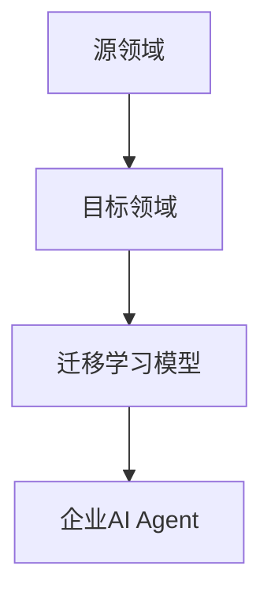
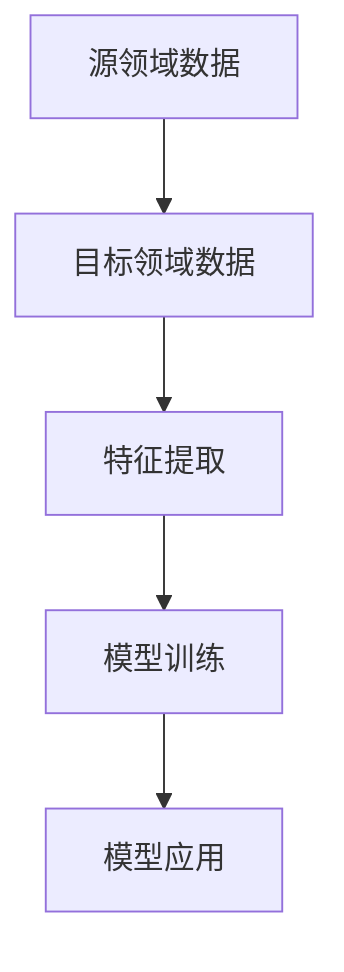
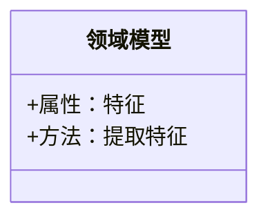
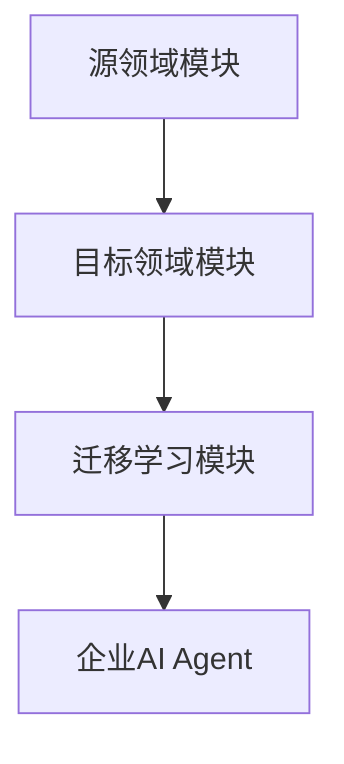
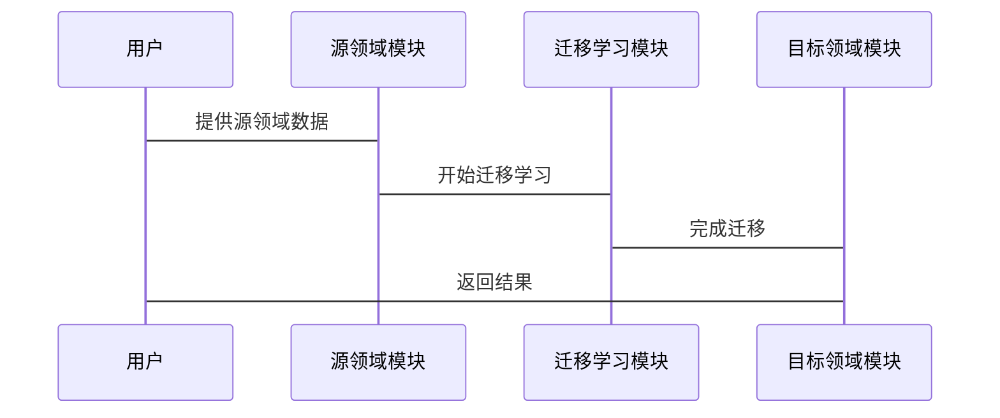

                 


# 企业AI Agent的迁移学习应用：跨领域知识迁移

> 关键词：企业AI Agent，迁移学习，跨领域知识，迁移学习算法，系统架构

> 摘要：本文详细探讨了企业AI Agent在迁移学习中的应用，特别是在跨领域知识迁移方面。通过分析迁移学习的核心概念、算法原理、系统架构以及实际案例，展示了如何将一个领域的知识有效地应用到另一个领域，从而提升企业的智能化水平。

---

## 第一部分: 企业AI Agent的迁移学习应用概述

### 第1章: 迁移学习的背景与概念

#### 1.1 迁移学习的背景
##### 1.1.1 人工智能与企业AI Agent的演进
人工智能（AI）技术的快速发展为企业带来了智能化转型的机会。企业AI Agent（智能体）作为实现这一转型的核心技术之一，负责处理复杂的业务逻辑和跨部门协作。然而，AI Agent的应用往往受限于单一领域，难以在跨领域场景中发挥作用，这就需要迁移学习技术的支持。

##### 1.1.2 迁移学习的定义与特点
迁移学习是一种机器学习技术，通过将从一个领域学到的知识应用到另一个领域，以提高目标领域的学习效率和性能。其特点包括：
- **领域适配性**：能够适应不同领域之间的差异。
- **知识复用性**：能够在不同任务之间复用已有的知识。
- **数据高效性**：在目标领域数据有限的情况下仍能有效学习。

##### 1.1.3 企业AI Agent的核心需求
企业AI Agent需要处理的任务通常涉及多个业务领域，例如客户服务、供应链管理、财务分析等。迁移学习能够帮助AI Agent在这些领域之间高效地迁移知识，提升其跨领域处理能力。

#### 1.2 问题背景与描述
##### 1.2.1 企业AI Agent面临的挑战
企业AI Agent在实际应用中面临以下挑战：
- 数据孤岛：不同业务领域的数据分散，难以统一管理和利用。
- 领域差异：不同领域的问题具有不同的特征和解决方法，导致模型难以直接迁移。
- 效率问题：在目标领域数据不足的情况下，传统机器学习方法表现不佳。

##### 1.2.2 跨领域知识迁移的必要性
企业通常希望AI Agent能够跨领域处理问题，例如将客户服务中的自然语言处理技术应用到供应链管理中。迁移学习能够有效解决这一需求，通过共享不同领域的知识，降低开发成本，提高效率。

##### 1.2.3 迁移学习在企业中的应用场景
- **客户服务与供应链管理**：将客户行为分析技术应用于供应链优化。
- **财务分析与人力资源管理**：将风险评估模型从财务领域迁移到人力资源领域。

#### 1.3 问题解决与边界
##### 1.3.1 迁移学习的解决方案
通过迁移学习技术，企业可以将一个领域的知识迁移到另一个领域，提升AI Agent的跨领域处理能力。

##### 1.3.2 问题的边界与外延
- **边界**：迁移学习适用于具有部分相似性的领域，对完全不相关的领域效果有限。
- **外延**：迁移学习不仅适用于企业内部，还可以应用于不同企业的合作场景。

##### 1.3.3 核心概念与要素组成
- **源领域**：提供知识的领域。
- **目标领域**：需要应用知识的领域。
- **特征空间**：描述领域特征的向量空间。
- **迁移策略**：如何将知识从源领域迁移到目标领域。

---

### 第2章: 核心概念与联系

#### 2.1 迁移学习的原理
##### 2.1.1 参数化方法
参数化方法通过共享参数的方式实现知识迁移，例如使用共享神经网络层。

##### 2.1.2 非参数化方法
非参数化方法通过构建领域适配器，逐步调整模型参数。

##### 2.1.3 对比学习与自适应策略
对比学习通过对比源领域和目标领域的特征，找到可迁移的部分。

#### 2.2 核心概念对比表
| 概念         | 参数化方法       | 非参数化方法       |
|--------------|------------------|--------------------|
| 实现方式     | 共享参数         | 构建适配器         |
| 适用场景     | 数据量大         | 数据量小           |

#### 2.3 ER实体关系图


---

### 第3章: 算法原理与实现

#### 3.1 迁移学习算法流程


#### 3.2 参数化方法实现
```python
import torch
class M迁移学习模型(torch.nn.Module):
    def __init__(self):
        super(M迁移学习模型, self).__init__()
        self共享层 = torch.nn.Linear(输入特征, 隐藏层大小)
        self目标层 = torch.nn.Linear(隐藏层大小, 输出特征)
    def forward(self, x):
        x = self共享层(x)
        x = self目标层(x)
        return x
```

#### 3.3 数学公式
源领域和目标领域的损失函数：
$$ L_{源} = \frac{1}{n} \sum_{i=1}^{n} (y_i - f(x_i))^2 $$
$$ L_{目标} = \frac{1}{m} \sum_{j=1}^{m} (y'_j - f(x'_j))^2 $$
迁移学习的目标是同时最小化$L_{源}$和$L_{目标}$。

---

## 第四部分: 系统分析与架构设计

### 第4章: 系统分析与架构设计方案

#### 4.1 系统功能设计
- **领域模型**：使用mermaid类图展示领域模型。


#### 4.2 系统架构设计
- **系统架构图**：


#### 4.3 系统接口设计
- **接口描述**：API接口用于接收输入数据，调用迁移学习模型进行处理。

#### 4.4 系统交互设计
- **交互序列图**：


---

## 第五部分: 项目实战

### 第5章: 项目实战

#### 5.1 环境安装
- 安装必要的Python库：
  ```bash
  pip install torch
  pip install mermaid
  ```

#### 5.2 核心实现
- 迁移学习模型代码：
  ```python
  import torch
  def 迁移学习算法(源数据, 目标数据):
      模型 = M迁移学习模型()
      损失函数 = torch.nn.MSELoss()
      优化器 = torch.optim.Adam(模型.parameters())
      for epoch in range(100):
          输出 = 模型(源数据)
          损失 = 损失函数(输出, 目标数据)
          优化器.zero_grad()
          损失.backward()
          优化器.step()
      return 模型
  ```

#### 5.3 案例分析
- 案例：将客户服务中的情感分析模型迁移到供应链管理中进行风险评估。

---

## 第六部分: 最佳实践、小结、注意事项和拓展阅读

### 第6章: 最佳实践与总结

#### 6.1 最佳实践
- **数据预处理**：确保源领域和目标领域的数据质量。
- **领域适配器设计**：根据具体需求设计合适的适配器。

#### 6.2 小结
本文详细介绍了企业AI Agent的迁移学习应用，从背景到实现，再到系统架构和项目实战，为读者提供了全面的视角。

#### 6.3 注意事项
- 确保源领域和目标领域之间存在一定的相似性。
- 在实际应用中，需要根据具体场景调整迁移学习策略。

#### 6.4 拓展阅读
- 进一步研究领域自适应和对比学习的最新进展。
- 探索迁移学习在多领域协同中的应用。

---

通过以上内容，您可以深入了解企业AI Agent的迁移学习应用，掌握其核心概念和实际应用方法，为企业的智能化转型提供有力支持。

