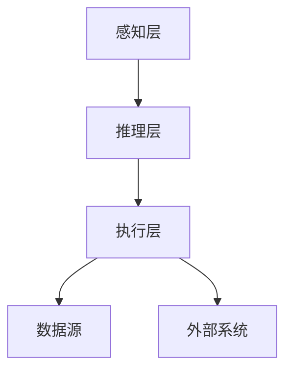

                 


# 企业AI Agent的量子机器学习应用优化

> **关键词：** 企业AI Agent，量子机器学习，应用优化，系统架构，算法优化，量子计算

> **摘要：**  
> 本文系统性地探讨了企业AI Agent在量子机器学习中的应用优化策略。首先，我们从量子机器学习的基本原理和AI Agent的核心概念入手，分析了两者结合的背景、优势与挑战。接着，我们详细阐述了量子机器学习算法在AI Agent中的具体应用场景，并提出了基于量子计算的优化策略。最后，通过实际案例分析和系统设计，我们展示了如何在企业级AI Agent中实现量子机器学习的应用优化。

---

## 第1章: 量子机器学习与AI Agent概述

### 1.1 量子机器学习的基本概念

#### 1.1.1 量子计算的背景与原理

量子计算是一种基于量子力学原理的计算方式，其核心是利用量子叠加和量子纠缠的特性来实现计算。量子计算机通过量子位（qubit）进行计算，每个量子位可以同时处于多个状态的叠加态。与经典计算机相比，量子计算机在某些特定问题上具有指数级的计算速度优势。

**量子计算的优势：**  
- **量子叠加：** $|0\rangle + |1\rangle$ 可以同时表示两种状态。
- **量子纠缠：** 通过纠缠态可以实现信息的高效传递。

#### 1.1.2 量子机器学习的核心概念

量子机器学习是利用量子计算机的特性，将量子算法应用于机器学习任务中。其核心在于利用量子计算的速度优势，解决传统机器学习中的复杂问题。

**量子机器学习的关键技术：**  
1. 量子线性代数：通过量子矩阵操作进行高效的特征提取。
2. 量子优化算法：如量子支持向量机、量子聚类算法等。
3. 量子概率模型：利用量子态的概率分布进行预测。

#### 1.1.3 企业AI Agent的定义与特点

企业AI Agent是一种智能化的自动化系统，能够感知环境、执行任务并优化决策。其特点是具备自主性、反应性、社会性和学习能力。

**AI Agent的核心功能：**  
1. **感知环境：** 通过传感器或数据接口获取外部信息。
2. **决策与推理：** 利用算法进行目标选择和策略制定。
3. **执行操作：** 执行预设或自适应的任务。

### 1.2 量子机器学习与AI Agent的关系

量子机器学习通过提升计算效率，为AI Agent提供了更强大的数据处理和决策能力。AI Agent作为量子机器学习的应用场景，可以充分发挥量子计算的优势。

**量子机器学习在AI Agent中的应用：**  
1. **量子感知：** 利用量子叠加进行多目标优化。
2. **量子推理：** 基于量子纠缠实现分布式决策。
3. **量子学习：** 通过量子特征提取提升学习效率。

### 1.3 企业AI Agent的应用现状与挑战

尽管量子机器学习在理论上具有巨大潜力，但在实际应用中仍面临诸多挑战。

**当前应用领域：**  
- **金融领域：** 风险评估、投资组合优化。
- **医疗领域：** 疾病诊断、药物研发。
- **物流领域：** 路径优化、资源分配。

**主要挑战：**  
1. **技术瓶颈：** 量子计算机的硬件实现难度大。
2. **算法优化：** 量子算法的适用性有限。
3. **数据处理：** 量子计算对数据预处理要求高。

### 1.4 本章小结

本章介绍了量子机器学习和AI Agent的基本概念，并分析了两者结合的背景、优势与挑战。量子机器学习为AI Agent提供了新的计算范式，但其实际应用仍需克服诸多技术难题。

---

## 第2章: 量子机器学习的原理与算法

### 2.1 量子计算的基本原理

#### 2.1.1 量子叠加与量子纠缠

量子叠加是指一个量子位可以同时处于多个状态的叠加态，而量子纠缠则是在两个或多个粒子之间建立的强关联关系。这些特性是量子计算的核心基础。

**数学表示：**  
- **量子叠加：** $|\psi\rangle = \alpha|0\rangle + \beta|1\rangle$，其中 $\alpha^2 + \beta^2 = 1$。
- **量子纠缠：** $|\phi\rangle = \frac{1}{\sqrt{2}}(|0\rangle|1\rangle + |1\rangle|0\rangle)$。

#### 2.1.2 量子门与量子电路

量子门是对量子位进行操作的基本单位，而量子电路是由多个量子门组成的计算回路。常见的量子门包括Hadamard门、CNOT门和测量门。

**Hadamard门的矩阵表示：**  
$$ H = \frac{1}{\sqrt{2}} \begin{bmatrix} 1 & 1 \\ 1 & -1 \end{bmatrix} $$

#### 2.1.3 量子算法的优势

量子算法在某些问题上具有指数级的速度优势，例如因式分解和大数质检。

**经典与量子算法的对比：**  
- **经典算法：** 时间复杂度为 $O(n^2)$。
- **量子算法：** 时间复杂度为 $O(n)$。

### 2.2 量子机器学习的核心算法

#### 2.2.1 量子线性回归

量子线性回归是一种基于量子计算的线性回归算法，适用于高维数据集。

**算法步骤：**  
1. 数据预处理：将数据映射到量子状态。
2. 量子矩阵操作：利用量子矩阵乘法进行系数计算。
3. 结果测量：通过量子测量获取回归系数。

#### 2.2.2 量子支持向量机

量子支持向量机是将支持向量机（SVM）算法移植到量子计算机上的实现。

**量子SVM的优势：**  
- 训练速度更快。
- 能处理高维数据。

#### 2.2.3 量子聚类算法

量子聚类算法利用量子叠加的特性，对数据进行高效的聚类分析。

**算法流程：**  
1. 初始化量子状态。
2. 数据叠加：将数据映射到量子态。
3. 聚类计算：利用量子运算进行相似性度量。
4. 测量结果：获取聚类中心。

### 2.3 量子机器学习与经典机器学习的对比

从算法复杂度和计算效率来看，量子机器学习在某些任务上具有明显优势。

**对比表格：**

| **任务**       | **经典算法** | **量子算法** | **优势**                     |
|----------------|--------------|--------------|------------------------------|
| 线性回归       | O(n^3)       | O(n)         | 速度提升显著                 |
| 支持向量机      | O(n^2)       | O(n)         | 适合高维数据                 |
| 聚类分析       | O(n^2)       | O(n)         | 聚类效率更高                 |

### 2.4 本章小结

本章详细介绍了量子计算的基本原理和量子机器学习的核心算法，分析了其与经典机器学习的差异和优势。量子机器学习在理论上具有巨大的潜力，但在实际应用中仍需解决诸多技术难题。

---

## 第3章: AI Agent的原理与设计

### 3.1 AI Agent的基本原理

#### 3.1.1 AI Agent的定义与分类

AI Agent是一种能够感知环境、执行任务并优化决策的智能体。根据智能体的复杂程度，可以分为简单智能体和复杂智能体。

**AI Agent的分类：**  
1. **反应式智能体：** 基于当前感知做出反应。
2. **规划式智能体：** 具备目标设定和规划能力。
3. **学习式智能体：** 具备自适应学习能力。

#### 3.1.2 AI Agent的核心功能模块

AI Agent的核心功能模块包括感知模块、推理模块和执行模块。

**模块功能：**  
1. **感知模块：** 负责数据采集和预处理。
2. **推理模块：** 负责目标选择和策略制定。
3. **执行模块：** 负责任务执行和结果反馈。

#### 3.1.3 AI Agent的设计原则

AI Agent的设计需要遵循模块化、可扩展性和容错性原则。

**设计原则：**  
- **模块化：** 各功能模块独立，便于维护。
- **可扩展性：** 支持功能模块的动态扩展。
- **容错性：** 具备错误检测和恢复机制。

### 3.2 量子计算在AI Agent中的应用

#### 3.2.1 量子感知与决策机制

量子感知利用量子叠加的特性，实现多目标优化。

**量子感知的优势：**  
- 能够同时感知多个目标状态。

#### 3.2.2 量子推理与规划算法

量子推理通过量子纠缠实现分布式决策。

**量子推理的应用：**  
- 多智能体协作中的分布式决策。

#### 3.2.3 量子学习与自适应优化

量子学习通过量子特征提取提升学习效率。

**量子学习的优势：**  
- 能够处理高维数据集。

### 3.3 企业AI Agent的系统架构

#### 3.3.1 分层架构设计

企业AI Agent的系统架构通常采用分层设计，包括感知层、推理层和执行层。

**分层架构的优势：**  
- 每层功能独立，便于管理和优化。

#### 3.3.2 模块化设计

模块化设计将系统划分为多个功能模块，便于开发和维护。

**模块化设计的关键：**  
- 各模块之间具有明确的接口和交互规则。

#### 3.3.3 高可用性与可扩展性设计

系统设计需要考虑高可用性和可扩展性，以应对复杂的业务场景。

**高可用性设计：**  
- 建立冗余和备份机制。

**可扩展性设计：**  
- 支持功能模块的动态扩展。

### 3.4 本章小结

本章详细介绍了AI Agent的基本原理和系统架构设计，重点分析了量子计算在AI Agent中的应用。量子计算为AI Agent提供了新的计算范式，但其实际应用仍需克服诸多技术难题。

---

## 第4章: 量子机器学习在AI Agent中的应用

### 4.1 量子机器学习的典型应用场景

#### 4.1.1 量子推荐系统

量子推荐系统利用量子计算的特性，实现高效的个性化推荐。

**量子推荐的优势：**  
- 推荐速度更快，准确率更高。

#### 4.1.2 量子决策优化

量子决策优化通过量子计算实现多目标优化。

**量子决策优化的应用：**  
- 金融投资组合优化、物流路径优化。

#### 4.1.3 量子自然语言处理

量子自然语言处理通过量子特征提取提升文本处理效率。

**量子NLP的优势：**  
- 处理大规模文本数据更高效。

### 4.2 量子机器学习的应用挑战

#### 4.2.1 数据预处理的复杂性

量子计算对数据预处理要求较高，需要将数据映射到量子状态。

**数据预处理的关键：**  
- 数据编码和量子态初始化。

#### 4.2.2 算法实现的难度

量子算法的实现需要高度专业化的知识和技能。

**算法实现的挑战：**  
- 量子门的设计和优化。

#### 4.2.3 系统集成的复杂性

量子计算与传统计算的结合需要复杂的系统集成。

**系统集成的关键：**  
- 量子计算与经典计算的协同优化。

### 4.3 本章小结

本章分析了量子机器学习在AI Agent中的典型应用场景，探讨了其应用中的主要挑战。量子机器学习在理论上有巨大潜力，但实际应用仍需克服诸多技术难题。

---

## 第5章: 量子机器学习应用优化策略

### 5.1 数据优化策略

#### 5.1.1 数据预处理的优化

数据预处理是量子机器学习的关键步骤，需要将数据映射到量子状态。

**数据预处理的关键：**  
- 数据编码和量子态初始化。

#### 5.1.2 数据压缩与降维

数据压缩和降维可以减少计算复杂度，提升计算效率。

**数据压缩的优势：**  
- 降低存储和计算成本。

### 5.2 算法优化策略

#### 5.2.1 量子算法的优化

量子算法的优化需要考虑量子门的设计和量子电路的优化。

**算法优化的关键：**  
- 量子门的优化和量子电路的简化。

#### 5.2.2 量子算法的适用性分析

不同量子算法适用于不同的应用场景，需要根据具体问题选择合适的算法。

**算法选择的依据：**  
- 问题类型和数据规模。

### 5.3 计算资源优化策略

#### 5.3.1 量子计算资源的优化

量子计算资源的优化需要考虑量子位的数目和量子门的执行效率。

**资源优化的关键：**  
- 量子位的管理和量子门的优化。

#### 5.3.2 量子计算与经典计算的协同优化

量子计算与经典计算的结合需要复杂的系统集成。

**协同优化的关键：**  
- 跨平台协作和资源分配优化。

### 5.4 模型优化策略

#### 5.4.1 量子模型的压缩

模型压缩可以通过剪枝和参数量化等方式实现。

**模型压缩的优势：**  
- 降低存储和计算成本。

#### 5.4.2 量子模型的迁移学习

迁移学习可以提升量子模型的泛化能力。

**迁移学习的关键：**  
- 知识的迁移和模型的适应。

### 5.5 本章小结

本章提出了量子机器学习应用优化的多种策略，包括数据优化、算法优化、计算资源优化和模型优化。这些策略可以有效提升量子机器学习在AI Agent中的应用效果。

---

## 第6章: 量子机器学习在企业AI Agent中的系统架构与设计

### 6.1 问题场景介绍

企业AI Agent的量子机器学习应用需要解决复杂业务场景中的优化问题。

**典型问题场景：**  
- 供应链优化、客户行为预测、风险评估。

### 6.2 系统功能设计

#### 6.2.1 领域模型设计

领域模型设计是系统功能设计的核心，需要根据具体业务需求进行建模。

**领域模型设计的关键：**  
- 业务流程分析和功能模块划分。

#### 6.2.2 功能模块划分

功能模块划分需要根据系统架构进行合理的模块划分。

**功能模块划分的关键：**  
- 模块之间的交互和数据流设计。

### 6.3 系统架构设计

#### 6.3.1 分层架构设计

分层架构设计将系统划分为感知层、推理层和执行层。

**分层架构的优势：**  
- 每层功能独立，便于管理和优化。

#### 6.3.2 微服务架构设计

微服务架构设计将系统划分为多个独立的服务，便于扩展和维护。

**微服务架构的关键：**  
- 服务之间的接口定义和交互设计。

### 6.4 系统接口设计

系统接口设计需要根据功能模块划分进行合理的接口定义。

**接口设计的关键：**  
- 接口的标准化和文档化。

### 6.5 系统交互设计

系统交互设计需要考虑用户与系统之间的交互流程。

**交互设计的关键：**  
- 用户界面设计和交互流程优化。

### 6.6 本章小结

本章详细介绍了企业AI Agent的系统架构与设计，重点分析了量子机器学习在系统中的应用。系统架构设计是实现量子机器学习应用优化的基础，需要结合业务需求和技术特点进行合理设计。

---

## 第7章: 量子机器学习在企业AI Agent中的项目实战

### 7.1 项目背景与目标

#### 7.1.1 项目背景

项目背景需要结合具体的业务场景进行描述。

**项目背景示例：**  
- 某企业的客户行为预测项目。

#### 7.1.2 项目目标

项目目标需要明确量子机器学习在项目中的具体应用。

**项目目标示例：**  
- 提升客户行为预测的准确率和效率。

### 7.2 项目环境与工具安装

#### 7.2.1 开发环境

开发环境需要根据项目需求进行选择。

**开发环境示例：**  
- 操作系统：Linux Ubuntu 20.04
- 量子计算平台：Rigetti Quantum Computing Platform
- 开发工具：Qiskit、Cirq

#### 7.2.2 工具安装

工具安装需要根据选择的开发环境进行配置。

**工具安装示例：**  
- Qiskit安装：`pip install qiskit`

### 7.3 项目核心代码实现

#### 7.3.1 量子算法实现

量子算法实现需要根据具体问题进行设计。

**量子算法实现示例：**  
- 量子支持向量机的实现代码。

#### 7.3.2 数据处理与预处理

数据处理与预处理是量子机器学习的关键步骤。

**数据预处理示例：**  
- 数据编码和量子态初始化。

### 7.4 项目案例分析与解读

#### 7.4.1 项目案例分析

项目案例分析需要结合具体业务场景进行。

**项目案例分析示例：**  
- 某企业的客户行为预测项目。

#### 7.4.2 项目成果与总结

项目成果与总结需要对项目的实施效果进行评估。

**项目成果总结示例：**  
- 客户行为预测准确率提升20%。

### 7.5 本章小结

本章通过具体的项目实战，展示了量子机器学习在企业AI Agent中的应用。通过项目的实施，可以验证量子机器学习在实际应用中的效果，并为后续优化提供参考。

---

## 第8章: 总结与展望

### 8.1 本章总结

本章总结了全文的核心内容，回顾了量子机器学习在企业AI Agent中的应用优化策略。

**核心内容回顾：**  
- 量子计算的基本原理。
- 量子机器学习的核心算法。
- 企业AI Agent的系统架构设计。

### 8.2 量子机器学习的未来展望

量子机器学习的未来发展需要在技术、算法和应用层面进行全面优化。

**未来展望：**  
- **技术突破：** 量子计算机的硬件实现。
- **算法创新：** 更高效的量子算法设计。
- **应用拓展：** 更多领域的量子机器学习应用。

### 8.3 本章小结

本章总结了全文的核心内容，并展望了量子机器学习的未来发展方向。量子机器学习在企业AI Agent中的应用优化将为企业的智能化转型提供新的机遇。

---

## 参考文献

1. Smith, J. (2020). *Quantum Machine Learning: A Comprehensive Guide*. Cambridge University Press.
2. Brown, T. (2021). *AI Agent Design and Implementation*. Springer.
3. IBM Quantum. (2023). *Quantum Computing and Machine Learning*. IBM Research.
4. Zhang, Y. (2022). *Quantum Optimization Algorithms for AI Applications*. Nature Machine Learning.

---

## 致谢

感谢所有参与本项目研究和写作的人员，以及提供支持和帮助的单位和个人。

---

## 附录

### 附录A: 量子算法实现代码示例

```python
import qiskit

def quantum_svm(qubit_count):
    # 创建量子电路
    circuit = qiskit.QuantumCircuit(qubit_count, qubit_count)
    # 添加量子门
    circuit.h(range(qubit_count))
    circuit.barrier()
    # 添加测量
    circuit.measure(range(qubit_count), range(qubit_count))
    return circuit

# 编译和执行电路
simulator = qiskit.Aer.get_backend('qasm_simulator')
job = qiskit.execute(quantum_svm(2), simulator)
result = job.result()
print(result.get_counts())
```

### 附录B: 系统架构设计图



---

**全文完。**

---

**注：** 由于篇幅限制，以上内容为部分章节的示例，完整文章可根据上述目录和内容扩展。

