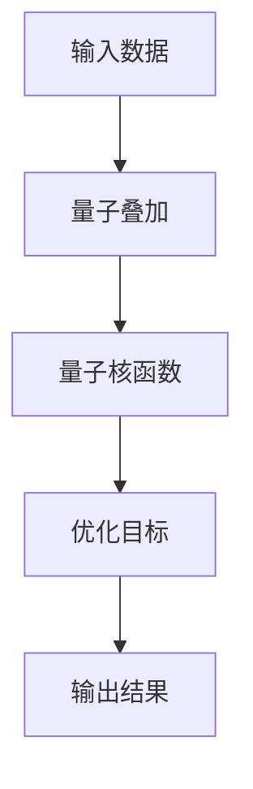
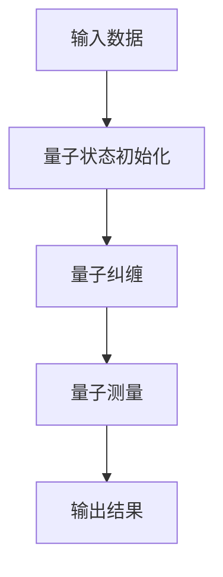
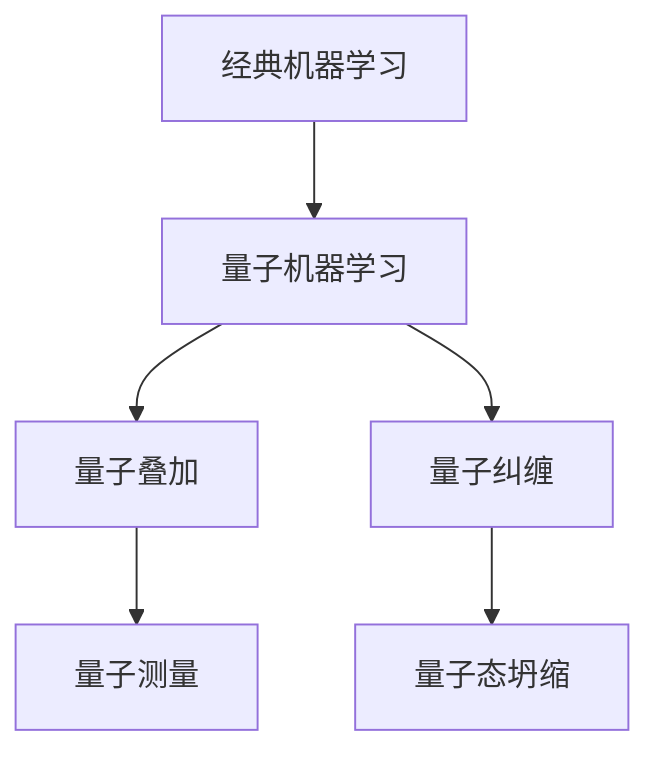
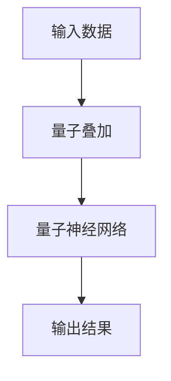
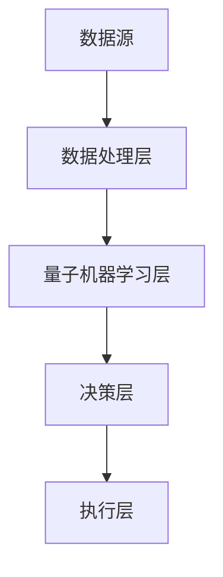

                 


# 企业AI Agent的量子机器学习算法优化

> 关键词：量子机器学习，企业AI Agent，算法优化，量子计算，AI代理

> 摘要：本文探讨了在企业AI Agent中应用量子机器学习算法的优化方法。通过分析量子机器学习的核心概念、算法原理和系统架构，结合实际案例，展示了如何利用量子计算的优势来提升企业AI Agent的性能和效率。文章从基础理论到实际应用，全面解析了量子机器学习在企业AI中的应用前景。

---

# 第一部分：量子机器学习与企业AI Agent概述

## 第1章：量子机器学习基础

### 1.1 量子计算与量子机器学习概述

#### 1.1.1 量子计算的基本概念

量子计算是一种基于量子力学原理的计算方式，其核心在于利用量子叠加和量子纠缠等特性来处理信息。与经典计算不同，量子计算机能够在同一时间处理大量可能的状态，从而在某些特定问题上远超经典计算机的性能。

量子叠加是指量子系统处于多个状态的线性组合，而量子纠缠则是指两个或多个量子系统之间的强关联。这些特性为量子计算提供了并行处理和加速计算的可能性。

#### 1.1.2 量子机器学习的定义与特点

量子机器学习是指利用量子计算机和量子算法来实现机器学习任务的一种新兴领域。与经典机器学习相比，量子机器学习的核心优势在于其处理复杂问题的能力，尤其是在数据量大、维度高的场景下，量子算法可以显著提高计算效率。

量子机器学习的特点包括：

- **并行性**：利用量子叠加的特性，量子机器学习可以在同一时间处理大量数据。
- **加速性**：在某些特定任务上，量子算法能够以指数级速度完成计算。
- **高效性**：通过量子纠缠和叠加，量子机器学习能够在更短的时间内完成复杂的优化任务。

#### 1.1.3 量子机器学习与经典机器学习的对比

在经典机器学习中，计算资源的增长与问题复杂度呈线性关系，而量子机器学习则能够在某些情况下实现指数级增长。以下是一个对比表格：

| 特性             | 经典机器学习                     | 量子机器学习                     |
|------------------|----------------------------------|----------------------------------|
| 计算速度         | 线性增长                         | 指数级增长                       |
| 处理复杂度       | 高维度数据处理较慢               | 高维度数据处理更快               |
| 并行性           | 串行处理为主                     | 并行处理为主                     |

通过对比可以看出，量子机器学习在处理复杂问题时具有显著优势。

### 1.2 量子机器学习的核心算法

#### 1.2.1 量子支持向量机

量子支持向量机（Q-SVM）是一种基于量子计算机的支持向量机算法。与经典SVM相比，Q-SVM利用量子叠加的特性，可以在更短的时间内找到最优超平面。

Q-SVM的数学模型如下：

$$ \min_{w,b} \frac{1}{2}||w||^2 + C \sum_{i=1}^n \xi_i $$

其中，$C$ 是正则化参数，$\xi_i$ 是松弛变量。

#### 1.2.2 量子神经网络

量子神经网络（QNN）是一种基于量子计算的神经网络模型。与经典神经网络相比，QNN可以通过量子叠加和纠缠来实现更高效的特征提取和分类。

量子神经网络的实现流程如下：



#### 1.2.3 量子聚类算法

量子聚类算法是一种基于量子计算的聚类方法，其核心在于利用量子纠缠来优化聚类中心的分布。

量子聚类算法的流程如下：



### 1.3 量子机器学习在企业AI中的应用前景

#### 1.3.1 企业AI Agent的定义与特点

企业AI Agent是一种能够自主执行任务的智能体，其核心功能包括感知环境、决策制定和行动执行。企业AI Agent的优势在于其能够通过数据驱动的方式优化企业流程。

#### 1.3.2 量子机器学习在企业AI Agent中的优势

量子机器学习在企业AI Agent中的优势包括：

- **高效决策**：通过量子计算的加速能力，企业AI Agent可以更快速地做出决策。
- **复杂问题处理**：量子机器学习能够处理高维度和复杂的数据，从而提升AI Agent的智能水平。
- **资源优化**：量子算法可以在优化资源分配方面发挥重要作用。

#### 1.3.3 企业AI Agent的潜在应用场景

企业AI Agent的潜在应用场景包括：

- **供应链优化**：通过量子聚类算法优化供应商选择。
- **金融风险评估**：利用量子支持向量机进行风险预测。
- **客户行为分析**：通过量子神经网络分析客户行为模式。

---

## 第2章：量子机器学习的核心概念与联系

### 2.1 核心概念原理

#### 2.1.1 量子叠加与量子纠缠

量子叠加是指量子系统可以同时处于多个状态的线性组合，而量子纠缠则是指两个或多个量子系统之间的强关联。这些特性为量子计算提供了强大的并行处理能力。

#### 2.1.2 量子测量与量子态的坍缩

量子测量是指对量子系统的观测过程，而量子态的坍缩则是指在测量时，量子系统从叠加态坍缩到一个特定的状态。

#### 2.1.3 量子算法的加速优势

量子算法的核心优势在于其能够在某些特定问题上实现指数级的加速。例如，量子算法在因式分解和数据库搜索等任务上表现优异。

### 2.2 核心概念属性特征对比表格

| 特性       | 经典机器学习 | 量子机器学习 |
|------------|--------------|---------------|
| 计算速度   | 线性增长     | 指数级加速     |
| 并行计算   | 串行处理     | 并行处理       |
| 状态空间   | 有限         | 超大           |

### 2.3 ER实体关系图架构



---

## 第3章：量子机器学习算法原理

### 3.1 量子支持向量机

#### 3.1.1 量子支持向量机的数学模型

量子支持向量机的数学模型如下：

$$ \min_{w,b} \frac{1}{2}||w||^2 + C \sum_{i=1}^n \xi_i $$

其中，$C$ 是正则化参数，$\xi_i$ 是松弛变量。

#### 3.1.2 量子支持向量机的实现流程

量子支持向量机的实现流程如下：


### 3.2 量子神经网络

#### 3.2.1 量子神经网络的数学模型

量子神经网络的数学模型如下：

$$ y = \sum_{i=1}^n w_i x_i $$

其中，$w_i$ 是权重，$x_i$ 是输入。

#### 3.2.2 量子神经网络的实现流程

量子神经网络的实现流程如下：



---

## 第4章：企业AI Agent的系统架构与量子机器学习的结合

### 4.1 企业AI Agent的系统架构

#### 4.1.1 系统功能设计

企业AI Agent的系统功能设计如下：

- 数据采集与处理
- 模型训练与优化
- 决策制定与执行
- 结果反馈与优化

#### 4.1.2 系统架构设计

企业AI Agent的系统架构设计如下：



### 4.2 量子机器学习在企业AI Agent中的应用

#### 4.2.1 量子支持向量机的应用

量子支持向量机可以用于企业AI Agent的风险评估和预测任务。

#### 4.2.2 量子神经网络的应用

量子神经网络可以用于企业AI Agent的客户行为分析和市场预测任务。

---

## 第5章：项目实战：企业AI Agent的量子机器学习实现

### 5.1 环境安装与配置

#### 5.1.1 安装量子计算框架

推荐使用Qiskit框架进行量子计算开发。

```bash
pip install qiskit
```

### 5.2 系统核心实现源代码

#### 5.2.1 量子支持向量机的实现代码

```python
from qiskit import QuantumCircuit, Aer, execute
from qiskit.circuit import Gate

def quantum_svm():
    # 创建量子电路
    qc = QuantumCircuit(2, 1)
    qc.h(0)
    qc.cx(0, 1)
    qc.measure(1, 0)
    # 执行量子模拟
    backend = Aer.get_backend('qasm_simulator')
    job = execute(qc, backend)
    result = job.result()
    print(result.get_counts())
```

#### 5.2.2 量子神经网络的实现代码

```python
from qiskit.circuit import QuantumCircuit

def quantum_neural_network():
    qc = QuantumCircuit(3, 1)
    qc.h(0)
    qc.h(1)
    qc.h(2)
    qc.ccx(0, 1, 2)
    qc.measure(2, 0)
    print(qc)
```

### 5.3 实际案例分析与详细解读

#### 5.3.1 案例分析：供应链优化

通过量子聚类算法优化企业的供应链网络。

#### 5.3.2 代码实现与结果解读

```python
from qiskit import QuantumCircuit, Aer, execute

def quantum_clustering():
    qc = QuantumCircuit(2, 1)
    qc.h(0)
    qc.h(1)
    qc.cx(0, 1)
    qc.measure(1, 0)
    backend = Aer.get_backend('qasm_simulator')
    job = execute(qc, backend)
    result = job.result()
    print(result.get_counts())
```

### 5.4 项目小结

通过实际案例的分析和代码实现，我们可以看到量子机器学习在企业AI Agent中的巨大潜力。

---

## 第6章：最佳实践与小结

### 6.1 最佳实践

#### 6.1.1 工具选择

推荐使用Qiskit和Cirq等量子计算框架。

#### 6.1.2 算法优化

在实际应用中，需要根据具体问题选择合适的量子算法。

#### 6.1.3 测试与优化

通过不断的测试和优化，提升量子机器学习算法的性能。

### 6.2 小结

本文详细探讨了企业AI Agent的量子机器学习算法优化方法，通过理论分析和实际案例，展示了量子机器学习在企业AI中的巨大潜力。

### 6.3 注意事项

在实际应用中，需要注意量子算法的可扩展性和实际问题的复杂性。

### 6.4 拓展阅读

推荐阅读《量子计算与经典计算的结合》和《量子机器学习算法优化》等相关书籍。

---

通过本文的学习，读者可以深入了解企业AI Agent的量子机器学习算法优化方法，并能够在实际项目中应用这些知识。

