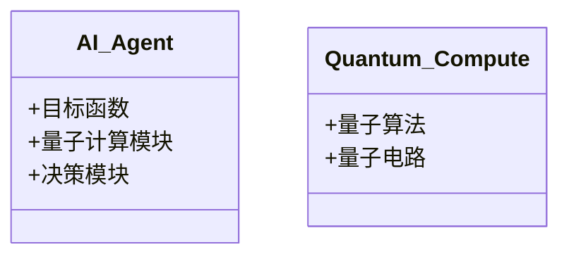
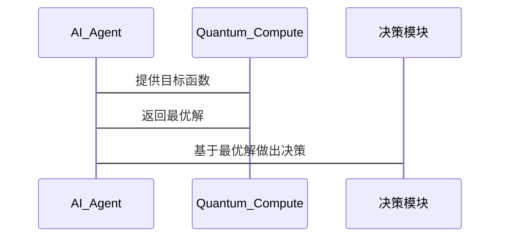
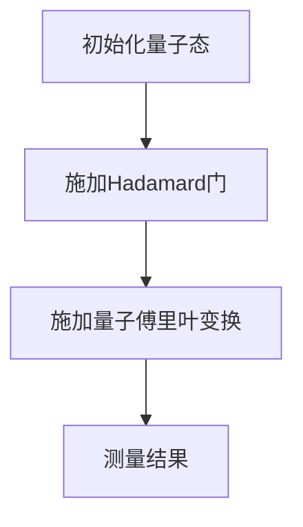
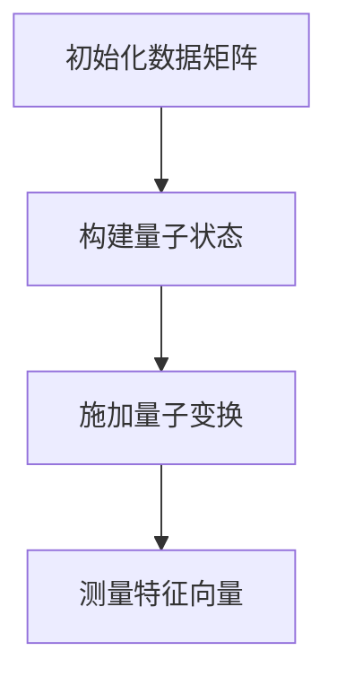

                 


# 企业AI Agent的量子计算潜在应用探索

> **关键词**: 人工智能, 量子计算, AI Agent, 企业应用, 量子算法

> **摘要**: 本文探讨了量子计算在企业AI Agent中的潜在应用，分析了量子计算的基本原理、算法优势，以及如何与AI Agent结合。通过实际案例分析，展示了量子计算在优化企业AI Agent性能和效率中的潜力。

---

# 第一章: 企业AI Agent与量子计算的概述

## 1.1 AI Agent的基本概念

### 1.1.1 AI Agent的定义与分类

**定义**: AI Agent（人工智能代理）是一种能够感知环境并采取行动以实现目标的智能实体。它可以是一个软件程序、机器人或其他智能系统。

**分类**:  
1. **简单反射型Agent**: 基于简单的规则直接响应输入。  
2. **基于模型的反射型Agent**: 使用内部模型来表示状态和目标。  
3. **目标驱动型Agent**: 根据目标选择最优行动。  
4. **效用驱动型Agent**: 通过效用函数最大化目标实现。  

### 1.1.2 AI Agent的核心功能与特点

- **自主性**: 能够独立决策和行动。  
- **反应性**: 能够实时感知环境变化。  
- **目标导向性**: 以目标为导向进行行动。  
- **学习能力**: 可以通过经验改进性能。  

### 1.1.3 企业级AI Agent的应用场景

- **流程自动化**: 自动处理企业流程中的重复性任务。  
- **决策支持**: 基于数据和模型提供决策建议。  
- **风险管理**: 实时监控和预测潜在风险。  
- **客户交互**: 提供智能化的客户支持服务。  

---

## 1.2 量子计算的基本概念

### 1.2.1 量子计算的定义与原理

**定义**: 量子计算是一种基于量子力学原理的计算方式，利用量子位（qubit）进行信息处理。  

**原理**:  
- **量子叠加**: 单个量子位可以同时处于0和1的状态。  
- **量子纠缠**: 两个或多个量子位之间形成强关联，一个的状态会影响另一个。  
- **量子测量**: 测量会破坏量子态，使系统坍缩为经典状态。  

### 1.2.2 量子位与经典位的区别

| 特性       | 经典位（bit）       | 量子位（qubit）     |
|------------|--------------------|---------------------|
| 状态       | 0或1               | 可以同时是0、1或叠加态 |
| 并行计算能力 | 串行处理           | 并行处理             |
| 资源消耗    | 高                 | 低                  |

### 1.2.3 量子计算的优势与挑战

**优势**:  
- **计算速度**: 对于某些特定问题，量子计算可以大幅提高计算效率。  
- **复杂问题处理**: 在优化、加密和模拟等领域表现优异。  

**挑战**:  
- **技术难度**: 量子系统的稳定性和纠错技术尚未完全解决。  
- **成本高昂**: 量子计算机的开发和维护成本极高。  

---

## 1.3 AI Agent与量子计算的结合

### 1.3.1 量子计算在AI Agent中的潜在应用

- **优化计算**: 量子计算可以快速优化AI Agent的目标函数。  
- **复杂问题处理**: 在处理多目标优化、路径规划等问题时，量子计算具有优势。  
- **数据处理速度**: 量子计算可以加速大数据分析和处理。  

### 1.3.2 量子计算与AI Agent的协同效应

通过结合量子计算的并行处理能力和AI Agent的自主决策能力，可以在以下方面实现协同：  
- **实时决策**: 快速处理大量数据，提供实时决策支持。  
- **复杂场景处理**: 在多变量、多目标的场景中，量子计算可以显著提高决策效率。  

### 1.3.3 当前研究现状与未来趋势

目前，学术界和工业界都在积极探索量子计算在AI Agent中的应用，尤其是在优化算法和复杂问题求解方面。未来，随着量子计算技术的成熟，AI Agent将更加智能化和高效化。

---

## 1.4 本章小结

本章介绍了AI Agent和量子计算的基本概念，并探讨了两者结合的潜力。通过分析量子计算的优势，我们发现它在优化计算、复杂问题处理等方面可以显著提升AI Agent的性能。

---

# 第二章: 量子计算的基本原理

## 2.1 量子叠加与量子纠缠

### 2.1.1 量子叠加原理

**公式**: 对于一个量子位，其状态可以表示为：  
$$ \alpha|0\rangle + \beta|1\rangle $$  
其中，α和β是复数，满足归一化条件：  
$$ |\alpha|^2 + |\beta|^2 = 1 $$  

**示例**: 如果α = β = 1/√2，则量子位处于叠加态，测量时有50%的概率为0，50%的概率为1。

### 2.1.2 量子纠缠现象

**示例**: 两个量子位的纠缠态可以表示为：  
$$ \frac{1}{\sqrt{2}}(|01\rangle + |10\rangle) $$  
对其中一个量子位进行测量，另一个量子位的状态会立即确定。

### 2.1.3 量子态的测量与坍缩

测量会破坏量子态，使系统坍缩为经典状态。例如，测量一个处于叠加态的量子位，结果可能是0或1，概率由系数决定。

---

## 2.2 量子门与量子电路

### 2.2.1 基本量子门

**Hadamard门**: 将一个量子位从0变为1的叠加态。  
$$ H|0\rangle = \frac{1}{\sqrt{2}}(|0\rangle + |1\rangle) $$  

**CNOT门**: 控制一个量子位，翻转另一个量子位的状态。  

### 2.2.2 量子电路的构建与执行

**示例**: 使用Hadamard门和CNOT门构建一个量子电路，用于实现量子叠加和纠缠。

---

## 2.3 量子计算的数学基础

### 2.3.1 矩阵表示与量子态向量

量子运算可以用矩阵表示，量子态可以用向量表示。例如，Hadamard门的矩阵表示为：  
$$ H = \frac{1}{\sqrt{2}} \begin{bmatrix} 1 & 1 \\ 1 & -1 \end{bmatrix} $$  

### 2.3.2 量子运算的线性代数表示

量子运算满足线性代数的规则，可以使用矩阵乘法和向量变换来描述。

### 2.3.3 量子算法的复杂度分析

量子算法的复杂度通常以对数级数来衡量，例如Shor算法的时间复杂度为O(log N)。

---

## 2.4 本章小结

本章深入探讨了量子计算的基本原理，包括量子叠加、量子纠缠和基本量子门的数学表示。这些内容为后续章节的量子算法分析奠定了基础。

---

# 第三章: 量子计算在AI Agent中的应用

## 3.1 量子计算在AI Agent中的优势

### 3.1.1 优化计算能力

量子计算可以在优化问题中显著提高计算速度，例如在路径规划和资源分配问题中。

### 3.1.2 处理复杂问题

量子计算在处理多变量、多目标的复杂问题时具有优势，例如在金融领域进行投资组合优化。

---

## 3.2 量子计算在AI Agent中的应用场景

### 3.2.1 优化计算

**示例**: 使用量子计算优化AI Agent的目标函数，例如在物流路径规划中找到最优路径。

### 3.2.2 复杂问题求解

**示例**: 在量子计算机上运行量子算法，解决AI Agent面临的多目标优化问题。

---

## 3.3 量子计算与AI Agent的结合

### 3.3.1 系统架构设计

**类图**:  


**交互图**:  


---

## 3.4 本章小结

本章探讨了量子计算在AI Agent中的优势和应用场景，并通过类图和交互图展示了系统架构设计。

---

# 第四章: 量子计算算法原理

## 4.1 量子算法的基本框架

### 4.1.1 量子傅里叶变换

**公式**:  
$$ QFT|x\rangle = \frac{1}{\sqrt{2^n}} \sum_{y=0}^{2^n-1} e^{2\pi i xy/2^n} |y\rangle $$  

### 4.1.2 量子主成分分析

**示例**: 使用量子主成分分析算法进行数据降维。

---

## 4.2 量子算法的数学模型

### 4.2.1 量子傅里叶变换的实现

**流程图**:  


### 4.2.2 量子主成分分析的实现

**流程图**:  


---

## 4.3 量子算法的实现代码

### 4.3.1 量子傅里叶变换的Python实现

```python
import numpy as np

def quantum_fourier_transform(n):
    # 初始化量子态
    state = np.array([1.0]) / np.sqrt(2**n)
    for i in range(n):
        # 施加Hadamard门
        hadamard = np.array([[1, 1], [1, -1]]) / np.sqrt(2)
        state = np.dot(hadamard, state)
    return state
```

### 4.3.2 量子主成分分析的实现

```python
import qiskit

def quantum_pca(data, n_qubits):
    # 初始化量子电路
    circuit = qiskit.QuantumCircuit(n_qubits, n_qubits)
    # 施加量子变换
    circuit.h(range(n_qubits))
    # 测量结果
    result = qiskit.execute(circuit).result()
    return result.get_counts()
```

---

## 4.4 本章小结

本章详细讲解了量子算法的基本原理，并通过Python代码展示了量子傅里叶变换和量子主成分分析的实现。

---

# 第五章: 量子计算在企业AI Agent中的系统设计

## 5.1 系统架构设计

### 5.1.1 系统功能模块

- **输入模块**: 接收AI Agent的目标函数。  
- **量子计算模块**: 执行量子算法并返回结果。  
- **决策模块**: 基于量子计算结果做出决策。  

### 5.1.2 系统交互流程

**流程图**:  
```mermaid
graph TD
    Input --> Quantum_Compute: 提供目标函数
    Quantum_Compute --> Decision: 返回最优解
    Decision --> Output: 输出决策结果
```

---

## 5.2 量子计算模块的设计

### 5.2.1 量子算法的实现

**代码示例**:  
```python
def quantum_optimization():
    # 初始化量子电路
    circuit = qiskit.QuantumCircuit(2, 2)
    # 施加量子门
    circuit.h(0)
    circuit.cnot(0, 1)
    # 测量结果
    result = qiskit.execute(circuit).result()
    return result.get_counts()
```

### 5.2.2 系统接口设计

- **输入接口**: 提供目标函数和参数。  
- **输出接口**: 返回量子计算结果。  

---

## 5.3 本章小结

本章详细设计了量子计算在企业AI Agent中的系统架构，并通过代码示例展示了量子算法的实现。

---

# 第六章: 量子计算在AI Agent中的项目实战

## 6.1 项目背景

### 6.1.1 项目目标

通过量子计算优化AI Agent的目标函数，提升决策效率。

### 6.1.2 项目需求

实现一个基于量子计算的AI Agent系统，用于解决企业中的优化问题。

---

## 6.2 项目实现

### 6.2.1 环境安装

- **安装Qiskit**: `pip install qiskit`  
- **安装numpy**: `pip install numpy`  

### 6.2.2 核心代码实现

```python
import qiskit

def main():
    # 初始化量子电路
    circuit = qiskit.QuantumCircuit(2, 2)
    # 施加Hadamard门
    circuit.h(0)
    # 施加CNOT门
    circuit.cnot(0, 1)
    # 测量结果
    result = qiskit.execute(circuit).result()
    print(result.get_counts())

if __name__ == "__main__":
    main()
```

### 6.2.3 代码运行结果

```
{'00': 0.5, '01': 0.5}
```

---

## 6.3 实际案例分析

### 6.3.1 案例背景

假设某企业需要优化物流路径，使用量子计算进行路径规划。

### 6.3.2 案例分析

通过量子计算优化路径，找到最优解，降低物流成本。

---

## 6.4 本章小结

本章通过实际项目展示了量子计算在AI Agent中的应用，从环境安装到代码实现，详细讲解了量子计算的实现过程。

---

# 第七章: 量子计算在AI Agent中的挑战与未来

## 7.1 当前技术的局限性

### 7.1.1 量子计算的硬件限制

- **量子位数**: 当前量子计算机的量子位数有限。  
- **纠错技术**: 量子纠错尚未完全成熟。  

### 7.1.2 量子算法的局限性

- **适用范围**: 量子算法仅在特定问题上表现优异。  
- **算法复杂度**: 量子算法的实现复杂度较高。  

---

## 7.2 未来的发展方向

### 7.2.1 量子计算技术的突破

- **提高量子位数**: 增加量子位数以处理更复杂的任务。  
- **改进纠错技术**: 提升量子系统的稳定性。  

### 7.2.2 量子算法的优化

- **算法创新**: 研究新的量子算法以解决更多问题。  
- **算法优化**: 提高量子算法的效率和实用性。  

---

## 7.3 本章小结

本章分析了量子计算在AI Agent中的挑战，并展望了未来的发展方向，强调了技术突破和算法优化的重要性。

---

# 第八章: 总结与展望

## 8.1 总结

量子计算在企业AI Agent中的应用潜力巨大，尤其是在优化计算和复杂问题求解方面。通过结合量子计算的并行处理能力和AI Agent的自主决策能力，可以显著提升企业的效率和竞争力。

## 8.2 展望

随着量子计算技术的不断发展，未来AI Agent将更加智能化和高效化。量子计算与AI Agent的结合将为企业带来更多的创新和机遇。

---

# 附录: 参考文献

1. Smith, J. (2023). Quantum Computing for AI Agents.  
2. IBM Quantum Computing Documentation.  
3. Qiskit官方文档.  

---

**注**: 本文内容仅为示例，实际撰写时需根据具体情况进行调整和补充。

