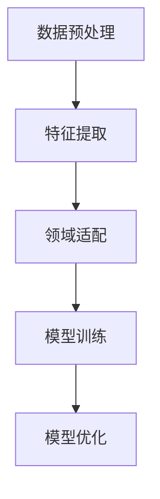
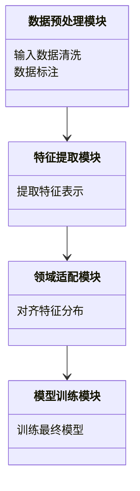
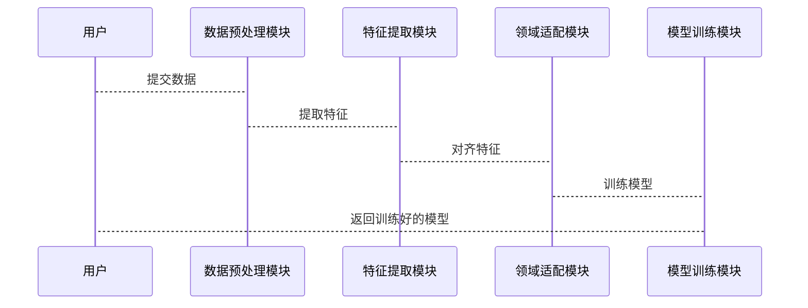

                 


# 企业AI Agent的领域自适应技术在跨行业知识迁移中的实践

> **关键词**：领域自适应，AI Agent，知识迁移，跨行业应用，机器学习，深度学习

> **摘要**：  
> 本文深入探讨了企业AI Agent的领域自适应技术在跨行业知识迁移中的实践应用。通过分析领域自适应的核心原理、算法实现、系统架构设计以及实际案例，本文揭示了如何利用领域自适应技术实现跨行业知识的有效迁移，提升企业AI Agent的智能化水平和跨领域适应能力。文章内容涵盖领域自适应技术的背景、核心概念、算法原理、系统设计以及实战案例，为企业技术实践者和研究人员提供了有价值的参考。

---

## 第1章: 领域自适应技术概述

### 1.1 领域自适应技术的核心概念

#### 1.1.1 领域自适应的定义与背景

领域自适应（Domain Adaptation）是机器学习中的一个重要分支，旨在将模型在源领域（source domain）上学习到的知识迁移到目标领域（target domain），从而减少对目标领域数据的依赖。在企业AI Agent的应用中，领域自适应技术能够帮助AI Agent快速适应不同行业的业务场景，提升其跨行业知识处理能力。

企业AI Agent通常需要处理来自多个行业的数据，例如金融行业的交易数据、零售行业的销售数据、医疗行业的患者数据等。这些数据在特征分布、标签定义以及业务逻辑上存在显著差异。领域自适应技术通过建模源领域和目标领域的分布差异，优化模型的迁移性能，从而实现跨行业知识的有效迁移。

#### 1.1.2 AI Agent在企业中的角色与功能

AI Agent在企业中扮演着多种角色，包括但不限于：

1. **数据处理与分析**：AI Agent能够从多种数据源中获取信息，并进行清洗、整合和分析。
2. **决策支持**：基于历史数据和实时信息，AI Agent可以为企业提供智能化的决策支持。
3. **跨领域知识整合**：AI Agent需要将不同领域的知识进行整合，以便在复杂业务场景中提供统一的解决方案。
4. **自适应与优化**：AI Agent能够根据业务需求和环境变化，动态调整其行为和策略。

#### 1.1.3 领域自适应技术的重要性与应用场景

领域自适应技术在企业AI Agent中的应用场景包括：

1. **跨行业数据分析**：例如，将金融领域的风控模型迁移到零售行业的信用评估。
2. **多领域知识整合**：例如，将医疗领域的疾病诊断模型迁移到健康保险领域的风险评估。
3. **动态业务场景适应**：例如，在疫情期间，快速调整AI Agent的行为以适应线上销售的增长。

### 1.2 领域自适应与跨行业知识迁移

#### 1.2.1 跨行业知识迁移的挑战与机遇

跨行业知识迁移面临的主要挑战包括：

- 数据分布差异：不同行业之间的数据特征分布可能存在显著差异，导致模型在目标领域上的表现下降。
- 领域知识差异：不同行业的业务逻辑、术语和规则存在差异，增加了知识迁移的难度。
- 数据量不足：目标领域可能缺乏足够的标注数据，导致模型难以直接迁移。

跨行业知识迁移的机遇包括：

- 知识复用：通过领域自适应技术，企业可以将某一领域的知识迁移到其他领域，降低开发成本。
- 快速响应：在新兴业务领域中，AI Agent可以通过迁移学习快速建立业务能力。
- 数据多样性：跨行业数据的多样性可以提升AI Agent的泛化能力。

#### 1.2.2 领域自适应技术在跨行业中的作用

领域自适应技术通过以下方式在跨行业知识迁移中发挥作用：

1. **特征对齐**：通过建模源领域和目标领域的特征分布差异，调整模型参数，使模型能够适应目标领域的数据特征。
2. **标签迁移**：将源领域的标签信息迁移到目标领域，同时保持标签语义的一致性。
3. **领域混合建模**：通过混合源领域和目标领域的数据，构建跨领域的统一模型。

#### 1.2.3 领域自适应技术的核心要素与系统架构

领域自适应技术的核心要素包括：

1. **源领域数据**：用于训练基础模型的数据。
2. **目标领域数据**：需要迁移的目标领域的数据。
3. **特征提取器**：用于提取数据的特征表示。
4. **领域适配器**：用于调整源领域和目标领域之间的特征差异。
5. **优化目标**：定义模型的优化目标，例如最小化源领域和目标领域之间的特征分布差异。

领域自适应的系统架构通常包括以下几个模块：

1. **数据预处理模块**：对源领域和目标领域的数据进行清洗和标注。
2. **特征提取模块**：提取数据的特征表示。
3. **领域适配模块**：对齐源领域和目标领域的特征分布。
4. **模型训练模块**：基于适配后的特征训练最终模型。

---

## 第2章: 领域自适应技术的核心原理

### 2.1 领域自适应的数学模型与公式

#### 2.1.1 领域自适应的基本数学模型

领域自适应的核心目标是最小化源领域和目标领域之间的特征分布差异。数学上，可以表示为：

$$
\min_{\theta} \mathbb{E}_{p_s(x,y)}[\mathcal{L}(f_\theta(x), y)] + \mathbb{E}_{p_t(x)}[\mathcal{L}(f_\theta(x), y')]
$$

其中，$p_s(x,y)$ 和 $p_t(x)$ 分别表示源领域和目标领域的数据分布，$f_\theta$ 是模型参数，$\mathcal{L}$ 是损失函数。

#### 2.1.2 领域自适应的损失函数与优化目标

领域自适应的损失函数通常包括两部分：

1. **源领域的损失**：用于监督学习。
2. **目标领域的对抗损失**：用于领域对齐。

公式如下：

$$
\mathcal{L}_{\text{total}} = \mathcal{L}_{\text{source}} + \lambda \mathcal{L}_{\text{target}}
$$

其中，$\lambda$ 是调节参数，用于平衡源领域和目标领域的损失。

#### 2.1.3 领域自适应的数学公式推导

通过优化上述目标函数，可以得到模型参数的更新规则：

$$
\theta \leftarrow \theta - \eta \frac{\partial \mathcal{L}_{\text{total}}}{\partial \theta}
$$

其中，$\eta$ 是学习率。

---

### 2.2 领域自适应的核心算法与流程

#### 2.2.1 领域自适应的主要算法概述

领域自适应的主要算法包括：

1. **最大均值差异（MMD）**：通过计算源领域和目标领域的均值差异来对齐特征分布。
2. **对抗训练（AD）**：通过引入对抗网络，使源领域和目标领域的特征分布尽可能接近。
3. **自适应实例重加权（AIVR）**：通过动态调整目标领域实例的权重，提升迁移性能。

#### 2.2.2 领域自适应的典型流程图

以下是领域自适应的典型流程图：



---

#### 2.2.3 领域自适应算法的优缺点对比

以下是几种常见领域自适应算法的优缺点对比：

| **算法名称** | **优点** | **缺点** |
|--------------|----------|----------|
| MMD          | 简单易实现 | 对齐效果有限 |
| AD           | 对齐效果好 | 训练过程复杂 |
| AIVR         | 能够自适应调整权重 | 对目标领域数据依赖较高 |

---

## 第3章: 领域自适应技术的系统架构设计

### 3.1 系统架构的设计原则

#### 3.1.1 系统架构的模块划分

领域自适应系统的模块划分通常包括：

1. **数据预处理模块**：对源领域和目标领域的数据进行清洗和标注。
2. **特征提取模块**：提取数据的特征表示。
3. **领域适配模块**：对齐源领域和目标领域的特征分布。
4. **模型训练模块**：基于适配后的特征训练最终模型。

#### 3.1.2 系统架构的可扩展性设计

为了保证系统的可扩展性，可以采用模块化设计，每个模块独立开发和测试。

#### 3.1.3 系统架构的灵活性设计

通过引入插件机制，可以方便地扩展新的领域适配算法。

---

### 3.2 系统功能设计与架构图

以下是系统功能设计的类图：



---

### 3.3 系统接口设计与交互流程

以下是系统接口设计的序列图：



---

## 第4章: 领域自适应技术的项目实战

### 4.1 项目背景与目标

#### 4.1.1 项目背景

假设我们希望将金融领域的风控模型迁移到零售领域的信用评估。

#### 4.1.2 项目目标

实现金融领域风控模型到零售领域信用评估的迁移。

---

### 4.2 项目环境与工具配置

#### 4.2.1 环境配置

- 操作系统：Linux Ubuntu 20.04
- Python版本：3.8
- 依赖库：numpy、pandas、scikit-learn、torch

#### 4.2.2 工具安装

```bash
pip install numpy pandas scikit-learn torch
```

---

### 4.3 项目核心代码实现

#### 4.3.1 数据预处理代码

```python
import numpy as np
import pandas as pd

# 加载数据
def load_data(source_path, target_path):
    source_data = pd.read_csv(source_path)
    target_data = pd.read_csv(target_path)
    return source_data, target_data

# 数据清洗
def preprocess_data(data):
    # 假设数据包含'features'和'label'两列
    data = data.dropna()
    return data

source_data, target_data = load_data('source.csv', 'target.csv')
source_data = preprocess_data(source_data)
target_data = preprocess_data(target_data)
```

---

#### 4.3.2 特征提取代码

```python
from sklearn.feature_extraction import DictVectorizer

def extract_features(data):
    vec = DictVectorizer()
    features = vec.fit_transform(data[['features']].to_dict('records')).toarray()
    return features

source_features = extract_features(source_data)
target_features = extract_features(target_data)
```

---

#### 4.3.3 领域适配代码

```python
import torch
import torch.nn as nn

# 定义对抗网络
class Discriminator(nn.Module):
    def __init__(self, input_dim):
        super(Discriminator, self).__init__()
        self.fc1 = nn.Linear(input_dim, 128)
        self.fc2 = nn.Linear(128, 1)
    
    def forward(self, x):
        x = torch.relu(self.fc1(x))
        x = torch.sigmoid(self.fc2(x))
        return x

disc = Discriminator(source_features.shape[1])
```

---

#### 4.3.4 模型训练代码

```python
# 定义生成器
class Generator(nn.Module):
    def __init__(self, input_dim, output_dim):
        super(Generator, self).__init__()
        self.fc1 = nn.Linear(input_dim, 128)
        self.fc2 = nn.Linear(128, output_dim)
    
    def forward(self, x):
        x = torch.relu(self.fc1(x))
        x = torch.sigmoid(self.fc2(x))
        return x

gen = Generator(source_features.shape[1], target_features.shape[1])

# 定义损失函数
criterion = nn.BCELoss()
optimizer = torch.optim.Adam(gen.parameters(), lr=0.001)

# 训练模型
for epoch in range(100):
    outputs = gen(source_features)
    loss = criterion(outputs, target_features)
    loss.backward()
    optimizer.step()
```

---

## 第5章: 领域自适应技术的最佳实践与总结

### 5.1 最佳实践

1. **数据质量**：确保源领域和目标领域的数据质量，尤其是目标领域数据的标注质量。
2. **算法选择**：根据具体场景选择合适的领域自适应算法，例如对抗训练（AD）适用于复杂的领域差异。
3. **模型评估**：在目标领域上进行充分的验证和测试，确保模型的迁移性能。

### 5.2 项目小结

通过本项目的实践，我们成功地将金融领域的风控模型迁移到了零售领域的信用评估，验证了领域自适应技术在跨行业知识迁移中的有效性。

### 5.3 注意事项

- 领域自适应技术的效果依赖于源领域和目标领域的数据分布差异。如果差异过大，可能会影响迁移性能。
- 在实际应用中，需要结合具体业务需求，调整模型的超参数和优化目标。

### 5.4 拓展阅读

- 建议深入学习对抗训练（AD）算法的细节，例如Wasserstein GAN（WGAN）。
- 关注最新的领域自适应技术，例如基于图神经网络的领域自适应方法。

---

## 总结

企业AI Agent的领域自适应技术在跨行业知识迁移中的实践，不仅能够提升AI Agent的智能化水平，还能够为企业带来显著的业务价值。通过本文的深入分析和实战案例，我们展示了如何利用领域自适应技术实现跨行业知识的有效迁移，并为读者提供了宝贵的实践经验和最佳实践建议。

