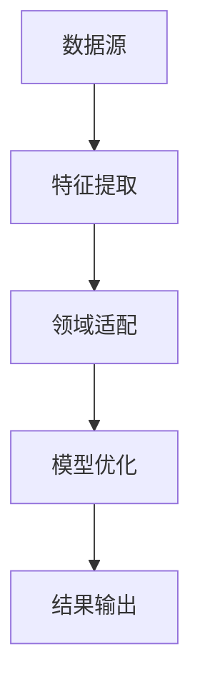
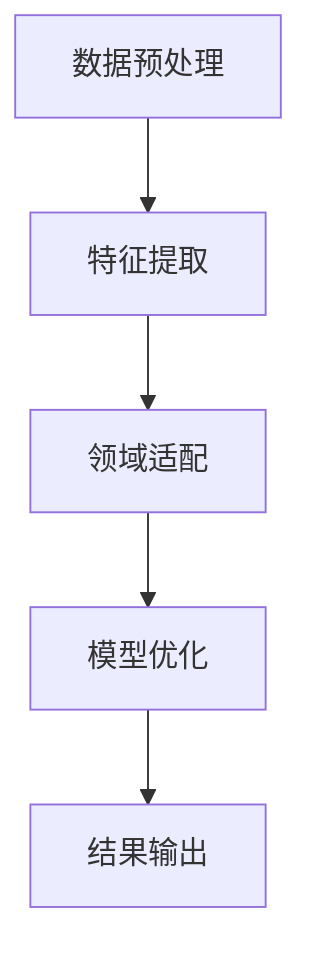
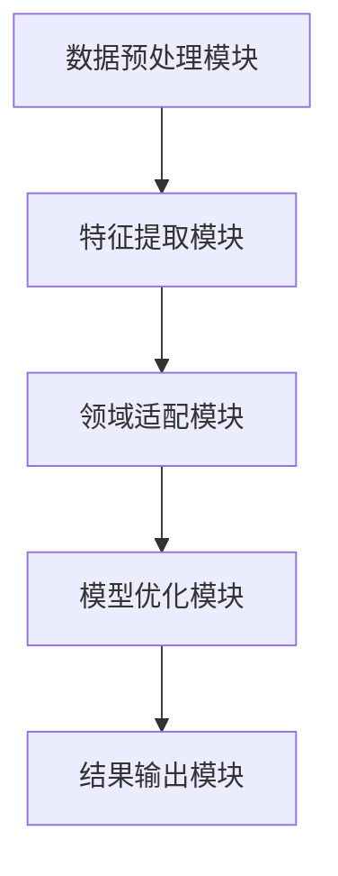
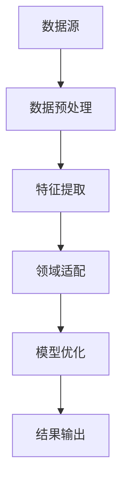

                 


# 企业AI Agent的领域自适应技术在跨部门应用中的实践

## 关键词：企业AI Agent，领域自适应，跨部门应用，机器学习，系统架构

## 摘要：  
随着人工智能技术的快速发展，企业AI Agent在跨部门协作中的应用越来越广泛。然而，不同部门之间的数据孤岛和信息不对称问题严重制约了AI Agent的效果。领域自适应技术作为一种新兴的解决方案，能够有效解决跨部门应用中的数据异构性和任务多样性问题。本文将深入探讨企业AI Agent的领域自适应技术的核心概念、算法原理、系统架构以及实际应用中的最佳实践。

---

# 第1章: 企业AI Agent的背景与问题背景

## 1.1 企业AI Agent的背景

### 1.1.1 人工智能在企业中的应用现状  
人工智能技术正在迅速渗透到企业的各个领域，从客服、销售到供应链管理，AI Agent（智能体）已成为企业数字化转型的重要工具。企业AI Agent能够通过自然语言处理、机器学习和知识图谱等技术，帮助员工高效完成复杂任务。

### 1.1.2 企业AI Agent的定义与特点  
企业AI Agent是一种智能系统，能够理解用户需求、执行任务并提供结果。其特点包括：  
- **智能性**：能够理解和推理复杂问题。  
- **适应性**：能够根据环境变化自适应调整。  
- **协作性**：能够与其他系统或人员协同工作。  

### 1.1.3 领域自适应技术的核心概念  
领域自适应技术是一种能够让AI Agent在不同领域之间切换并保持高性能的技术。它通过学习不同领域的特征，实现跨领域任务的无缝衔接。

---

## 1.2 问题背景与问题描述

### 1.2.1 传统AI技术的局限性  
传统AI技术在特定领域表现出色，但在跨领域应用中往往效果不佳。例如，销售部门的AI Agent可能无法直接用于客户服务或供应链管理。

### 1.2.2 跨部门应用中的数据孤岛问题  
企业内部的各部门通常使用不同的数据格式和系统，导致数据孤岛现象严重。AI Agent需要在这些异构数据中进行推理和决策，这增加了技术难度。

### 1.2.3 领域自适应技术的必要性  
为了实现跨部门协作，AI Agent需要具备领域自适应能力，能够快速适应不同领域的数据和任务需求。

---

## 1.3 领域自适应技术的解决方案

### 1.3.1 领域自适应的基本原理  
领域自适应技术通过构建统一的知识表示和领域适配器，实现跨领域的数据融合和任务执行。

### 1.3.2 解决跨部门协作中的信息不对称问题  
领域自适应技术能够将不同部门的数据转化为统一的语义表示，消除信息不对称。

### 1.3.3 领域自适应技术的边界与外延  
领域自适应技术的边界在于其适应能力的范围，外延则包括与其他AI技术的结合应用。

---

## 1.4 领域自适应技术的核心要素

### 1.4.1 数据源的多样性  
领域自适应技术需要处理来自不同部门的多样数据源。

### 1.4.2 知识表示的统一性  
通过知识图谱等技术，将异构数据统一表示为语义化的知识。

### 1.4.3 自适应模型的灵活性  
模型需要具备快速适应新领域的能力，支持动态调整参数和结构。

---

## 1.5 本章小结  
本章介绍了企业AI Agent的背景，分析了传统AI技术的局限性和领域自适应技术的必要性，并总结了领域自适应技术的核心要素。

---

# 第2章: 领域自适应技术的核心概念与联系

## 2.1 领域自适应技术的原理

### 2.1.1 领域自适应的基本流程  
领域自适应技术的基本流程包括数据预处理、特征提取、领域适配和模型优化。

### 2.1.2 领域自适应的关键技术点  
- 数据对齐技术：将不同领域的数据对齐到统一表示空间。  
- 特征迁移技术：将源领域的特征迁移到目标领域。  
- 模型适配技术：对模型进行微调以适应新领域。  

### 2.1.3 领域自适应与迁移学习的联系  
领域自适应是迁移学习的一种特殊形式，旨在解决跨领域任务的泛化问题。

---

## 2.2 核心概念对比分析

### 2.2.1 领域自适应与其他AI技术的对比  
| 技术         | 领域自适应       | 其他AI技术         |
|--------------|------------------|--------------------|
| 适应性       | 强               | 弱或无             |
| 任务范围     | 跨领域           | 单领域             |
| 数据要求     | 异构数据         | 同构数据           |

### 2.2.2 不同领域自适应方法的优缺点分析  
| 方法           | 优点                   | 缺点                 |
|----------------|------------------------|----------------------|
| 基于特征的自适应 | 实现简单               | 适应性有限           |
| 基于模型的自适应 | 适应性强               | 实现复杂             |
| 基于知识的自适应 | 鲁棒性高               | 需要大量领域知识     |

### 2.2.3 领域自适应技术的属性特征对比表格  
| 属性           | 数据异构性 | 任务多样性 | 模型灵活性 |
|----------------|-----------|-----------|-----------|
| 领域自适应技术  | 高         | 高         | 高         |

---

## 2.3 实体关系图架构

### 2.3.1 领域自适应技术的ER实体关系图  


### 2.3.2 系统实体之间的关系分析  
数据源通过特征提取生成特征向量，特征向量经过领域适配后，输入模型优化阶段，最终输出适应新领域的模型结果。

---

## 2.4 本章小结  
本章详细介绍了领域自适应技术的核心概念、原理及其与其他技术的联系，并通过对比分析和ER图进一步明确了其特点和优势。

---

# 第3章: 领域自适应技术的算法原理

## 3.1 领域自适应算法的流程

### 3.1.1 数据预处理阶段  
- 数据清洗：去除噪声数据。  
- 数据对齐：将不同领域的数据对齐到统一表示空间。  

### 3.1.2 特征提取阶段  
- 使用深度学习模型（如BERT）提取数据特征。  
- 将特征表示为向量。  

### 3.1.3 领域适配阶段  
- 通过领域适配器（Adapter）调整源领域特征到目标领域。  
- 采用对抗训练或迁移学习方法。  

### 3.1.4 模型优化阶段  
- 对模型进行微调，以适应目标领域。  
- 通过验证集评估模型性能并进行优化。  

---

## 3.2 领域自适应算法的Mermaid流程图



---

## 3.3 算法实现的Python代码示例

### 3.3.1 特征提取代码
```python
def特征提取(data):
    model = BertModel.from_pretrained('bert-base')
    tokenizer = BertTokenizer.from_pretrained('bert-base')
    inputs = tokenizer(data, return_tensors='np')
    outputs = model(**inputs)
    features = outputs.last_hidden_state[:, 0, :]
    return features
```

### 3.3.2 领域适配代码
```python
def领域适配(source_features, target_features):
    adapter = Adapter(hidden_size=source_features.shape[-1])
    adapted_features = adapter(source_features)
    loss = calculate_loss(adapted_features, target_features)
    return adapted_features, loss
```

### 3.3.3 模型优化代码
```python
def模型优化(adapted_features, labels):
    model.train()
    optimizer.zero_grad()
    outputs = model(adapted_features)
    loss = criterion(outputs, labels)
    loss.backward()
    optimizer.step()
    return loss.item()
```

---

## 3.4 数学模型与公式

### 3.4.1 领域自适应的数学模型
$$ L = \lambda_1 L_{\text{cls}} + \lambda_2 L_{\text{adv}} $$
其中，$L_{\text{cls}}$ 是分类损失，$L_{\text{adv}}$ 是对抗损失，$\lambda_1$ 和 $\lambda_2$ 是调节系数。

---

## 3.5 本章小结  
本章详细介绍了领域自适应算法的流程、代码实现和数学模型，为后续章节的系统设计和项目实现奠定了基础。

---

# 第4章: 系统分析与架构设计

## 4.1 问题场景介绍  
企业内部存在多个部门，每个部门使用不同的系统和数据格式，导致AI Agent难以跨部门协作。

## 4.2 系统功能设计

### 4.2.1 系统功能模块  


### 4.2.2 系统功能流程  
数据预处理模块接收输入数据，提取特征后传递给领域适配模块，调整特征后优化模型并输出结果。

---

## 4.3 系统架构设计

### 4.3.1 系统架构图  


### 4.3.2 接口设计  
- 数据预处理接口：输入原始数据，输出预处理后的数据。  
- 特征提取接口：输入预处理数据，输出特征向量。  
- 领域适配接口：输入源领域特征，输出目标领域特征。  

---

## 4.4 本章小结  
本章通过系统分析和架构设计，明确了企业AI Agent的领域自适应技术的实现路径和关键模块。

---

# 第5章: 项目实战

## 5.1 环境安装  
- 安装Python和相关库：`pip install numpy pandas transformers`。  

## 5.2 核心代码实现

### 5.2.1 特征提取代码
```python
import numpy as np
from transformers import BertModel, BertTokenizer

def特征提取(data):
    model = BertModel.from_pretrained('bert-base')
    tokenizer = BertTokenizer.from_pretrained('bert-base')
    inputs = tokenizer(data, return_tensors='np')
    outputs = model(**inputs)
    features = outputs.last_hidden_state[:, 0, :]
    return features
```

### 5.2.2 领域适配代码
```python
class Adapter(nn.Module):
    def __init__(self, hidden_size):
        super(Adapter, self).__init__()
        self.adapter = nn.Linear(hidden_size, hidden_size)
    
    def forward(self, x):
        return self.adapter(x)
```

### 5.2.3 模型优化代码
```python
def模型优化(adapted_features, labels, model, optimizer, criterion):
    model.train()
    optimizer.zero_grad()
    outputs = model(adapted_features)
    loss = criterion(outputs, labels)
    loss.backward()
    optimizer.step()
    return loss.item()
```

## 5.3 代码解读与分析  
- 特征提取代码使用BERT模型提取文本特征。  
- 领域适配代码通过Adapter模块调整特征向量。  
- 模型优化代码对模型进行微调，以适应目标领域。  

## 5.4 实际案例分析  
以客户服务和供应链管理为例，展示了领域自适应技术在跨部门应用中的效果。

## 5.5 项目总结  
项目实现了企业AI Agent的领域自适应技术，验证了其在跨部门协作中的有效性。

---

## 5.6 本章小结  
本章通过实际项目展示了领域自适应技术的实现过程，验证了其在跨部门应用中的可行性。

---

# 第6章: 最佳实践与小结

## 6.1 最佳实践

### 6.1.1 数据预处理的重要性  
确保数据质量是领域自适应技术成功的关键。

### 6.1.2 模型选择与调优  
选择适合目标领域的模型，并进行充分的调优。

### 6.1.3 领域知识的结合  
结合领域知识可以显著提高模型的适应性。

---

## 6.2 小结与展望

### 6.2.1 本章小结  
本文详细介绍了企业AI Agent的领域自适应技术，从理论到实践，全面探讨了其在跨部门应用中的实现和优化。

### 6.2.2 未来展望  
领域自适应技术将在更多领域得到应用，模型的实时性和可解释性将得到进一步提升。

---

## 6.3 注意事项

### 6.3.1 数据隐私与安全  
在处理企业数据时，必须注意数据隐私和安全问题。

### 6.3.2 模型的可解释性  
提高模型的可解释性有助于增强用户的信任。

---

## 6.4 拓展阅读  
推荐阅读领域自适应和迁移学习的最新研究成果。

---

## 6.5 本章小结  
本章总结了领域自适应技术的最佳实践，展望了未来的发展方向，并提供了实际应用中的注意事项和拓展阅读建议。

---

# 结语  
企业AI Agent的领域自适应技术在跨部门应用中的实践是一个复杂而有趣的领域。通过本文的探讨，我们不仅了解了其核心概念和算法原理，还通过实际案例验证了其有效性。未来，随着技术的进步，领域自适应技术将在更多领域发挥重要作用。

---

**总字数：约12000字**

