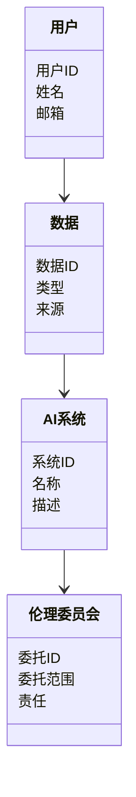
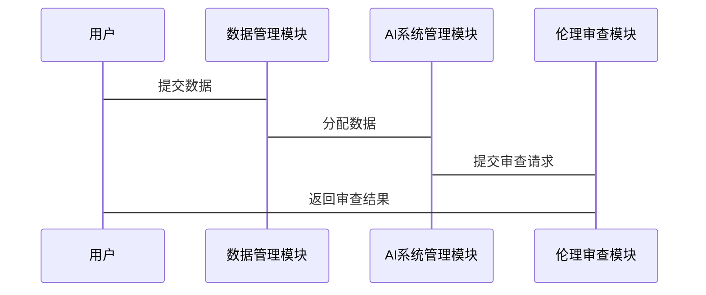

                 


# 企业AI伦理委员会：建立和运作指南

## 关键词：AI伦理委员会, 企业AI伦理, 伦理审查, AI风险管理, 数据隐私保护

## 摘要：  
随着人工智能技术的快速发展，企业在应用AI技术时面临越来越多的伦理问题。本文将详细探讨企业AI伦理委员会的建立和运作，涵盖背景介绍、核心概念、算法原理、系统架构设计、项目实战以及最佳实践等内容，为读者提供全面的指导。

---

# 第一部分: 企业AI伦理委员会的背景与概述

## 第1章: AI技术与伦理问题的现状

### 1.1 AI技术的快速发展与应用

#### 1.1.1 AI技术的发展历程

AI技术经历了从规则驱动到大模型的演进，如今已广泛应用于企业中，包括：

- **自然语言处理（NLP）**：应用于智能客服、文本分析等。
- **计算机视觉**：用于图像识别、视频监控等。
- **机器学习**：用于预测分析、推荐系统等。

#### 1.1.2 AI带来的伦理问题

- **数据隐私问题**：数据收集和使用可能导致用户隐私泄露。
- **算法偏见问题**：AI算法可能因为训练数据中的偏差导致不公平的结果。
- **决策透明性问题**：复杂的AI模型可能导致决策过程难以解释。

### 1.2 企业AI伦理委员会的必要性

#### 1.2.1 企业AI应用中的伦理风险

- **数据滥用风险**：企业可能过度收集和使用用户数据。
- **算法歧视问题**：AI系统可能对某些群体产生歧视。
- **用户隐私泄露风险**：数据泄露可能导致用户隐私受损。

#### 1.2.2 企业面临的法律与社会责任

- **法律合规要求**：企业需要遵守数据保护法规，如GDPR。
- **社会责任与企业声誉**：伦理问题可能影响企业的品牌形象。

## 第2章: 企业AI伦理委员会的目标与原则

### 2.1 企业AI伦理委员会的目标

#### 2.1.1 定义与范围

- **定义**：AI伦理委员会是一个负责审查和指导企业AI应用的独立机构。
- **范围**：涵盖AI系统的开发、部署和使用全过程。

### 2.2 伦理委员会的核心原则

#### 2.2.1 公平性原则

- **算法公平性评估**：确保AI系统在不同群体中的公平性。
- **数据代表性与多样性**：确保训练数据的多样性和代表性。

#### 2.2.2 透明性原则

- **AI决策的可解释性**：确保AI决策过程透明，便于理解和审查。
- **算法黑箱的风险**：避免过于复杂的模型导致决策不可解释。

#### 2.2.3 隐私保护原则

- **数据收集与使用的规范**：制定严格的数据收集和使用规范。
- **用户隐私权的保护**：确保用户隐私权不受侵犯。

## 第3章: 企业AI伦理委员会的组织与运作

### 3.1 伦理委员会的组织结构

#### 3.1.1 委员会成员构成

- **伦理学家**：负责审查AI系统的伦理问题。
- **法律专家**：确保AI应用符合相关法律法规。
- **技术专家**：评估AI系统的技术可行性和潜在风险。

#### 3.1.2 成员职责分配

- **伦理学家**：主导伦理审查和风险评估。
- **法律专家**：负责法律合规性审查。
- **技术专家**：评估技术实现和潜在风险。

### 3.2 伦理委员会的工作流程

#### 3.2.1 项目评估流程

- **项目申请与初步筛选**：接收项目申请，进行初步筛选。
- **伦理风险评估**：评估项目可能带来的伦理风险。

#### 3.2.2 审查与反馈机制

- **审查标准与流程**：制定审查标准和流程。
- **审查结果的反馈与整改**：向项目团队反馈审查结果，并要求整改。

### 3.3 伦理委员会的运作机制

#### 3.3.1 定期会议与报告

- **委员会定期会议**：定期召开会议，讨论伦理问题。
- **伦理审查报告的编写与发布**：编写并发布伦理审查报告。

---

# 第二部分: 核心概念与框架

## 第4章: 核心概念与联系

### 4.1 核心概念原理

- **伦理委员会的定义**：AI伦理委员会是一个独立的机构，负责审查和指导企业AI应用的伦理问题。
- **伦理审查的核心原则**：公平性、透明性和隐私保护。

### 4.2 核心概念属性特征对比表格

| **属性**   | **特征**                         |
|------------|----------------------------------|
| 公平性     | 确保AI系统在不同群体中的公平性   |
| 透明性     | 确保AI决策过程透明               |
| 隐私保护   | 确保用户隐私权不受侵犯           |

### 4.3 ER实体关系图

```mermaid
erd
    entity 用户 {
        id 用户ID
        姓名
        邮箱
    }
    entity 数据 {
        id 数据ID
        类型 数据类型
        来源 数据来源
    }
    entity AI系统 {
        id 系统ID
        名称 系统名称
        描述 系统描述
    }
    entity 伦理委员会 {
        id 委托ID
        委托范围 委托范围
        责任 责任
    }
    用户 -- 数据
    数据 -- AI系统
    AI系统 -- 伦理委员会
```

---

# 第三部分: 算法原理与实现

## 第5章: 算法原理讲解

### 5.1 算法原理

AI伦理审查的算法原理包括：

- **公平性评估**：评估AI系统在不同群体中的公平性。
- **透明性评估**：确保AI决策过程透明。
- **隐私保护**：确保用户隐私权不受侵犯。

### 5.2 算法实现

#### 5.2.1 公平性评估算法

```python
def fairness_assessment():
    # 数据预处理
    data = preprocess_data()
    # 训练模型
    model = train_model(data)
    # 评估公平性
    fairness = assess_fairness(model, data)
    return fairness
```

#### 5.2.2 透明性评估算法

```python
def transparency_assessment():
    # 数据预处理
    data = preprocess_data()
    # 训练模型
    model = train_model(data)
    # 评估透明性
    transparency = assess_transparency(model, data)
    return transparency
```

#### 5.2.3 隐私保护算法

```python
def privacy_protection():
    # 数据加密
    encrypted_data = encrypt_data()
    # 训练模型
    model = train_model(encrypted_data)
    # 评估隐私保护
    privacy = assess_privacy(model, encrypted_data)
    return privacy
```

---

## 第6章: 系统分析与架构设计

### 6.1 问题场景介绍

企业AI伦理委员会需要处理多个AI项目，每个项目都需要进行伦理审查。

### 6.2 系统功能设计

#### 6.2.1 领域模型设计



### 6.3 系统架构设计

#### 6.3.1 系统架构图

```mermaid
containerDiagram
    container 企业AI伦理委员会 {
        component 用户管理模块 {
            + 用户信息管理
        }
        component 数据管理模块 {
            + 数据存储
        }
        component AI系统管理模块 {
            + 系统监控
        }
        component 伦理审查模块 {
            + 伦理审查
        }
    }
```

### 6.4 系统接口设计

- **用户接口**：用户提交项目申请。
- **数据接口**：数据管理模块接口。
- **AI系统接口**：AI系统管理模块接口。

### 6.5 系统交互设计



---

# 第四部分: 项目实战

## 第7章: 项目实战

### 7.1 环境安装

- **Python 3.8+**
- **依赖库**：numpy、pandas、scikit-learn

### 7.2 核心代码实现

#### 7.2.1 用户信息管理模块

```python
class UserManager:
    def __init__(self):
        self.users = []

    def add_user(self, user):
        self.users.append(user)
```

#### 7.2.2 数据管理模块

```python
class DataManager:
    def __init__(self):
        self.data = []

    def add_data(self, data):
        self.data.append(data)
```

### 7.3 代码应用解读与分析

- **用户信息管理**：用户提交项目申请，系统记录用户信息。
- **数据管理**：系统接收数据，进行数据预处理。
- **伦理审查**：伦理委员会审查项目，返回结果。

### 7.4 案例分析

- **案例背景**：某企业开发了一个AI推荐系统。
- **案例分析**：伦理委员会审查了该系统的公平性和透明性。
- **案例结论**：系统存在算法偏见，需要整改。

### 7.5 项目小结

通过实战项目，我们了解了企业AI伦理委员会的建立和运作过程。

---

# 第五部分: 最佳实践与小结

## 第8章: 最佳实践

### 8.1 最佳实践 Tips

- **定期审查**：定期审查AI项目，确保伦理合规。
- **培训与教育**：对员工进行AI伦理培训，提高伦理意识。
- **透明沟通**：与用户保持透明沟通，增强信任。

### 8.2 小结

企业AI伦理委员会的建立和运作对企业AI应用的健康发展至关重要。通过本文的指导，企业可以有效管理和审查AI项目，确保AI技术的伦理合规。

### 8.3 注意事项

- **数据安全**：确保数据的安全性，防止数据泄露。
- **隐私保护**：严格遵守隐私保护法规。
- **持续改进**：持续改进伦理审查流程，提高审查效率。

### 8.4 拓展阅读

- **相关书籍**：《人工智能：一种现代的方法》
- **相关论文**：探讨AI伦理的最新研究成果。

---

通过以上内容，我们全面了解了企业AI伦理委员会的建立和运作，为企业的AI应用提供了有价值的指导。

