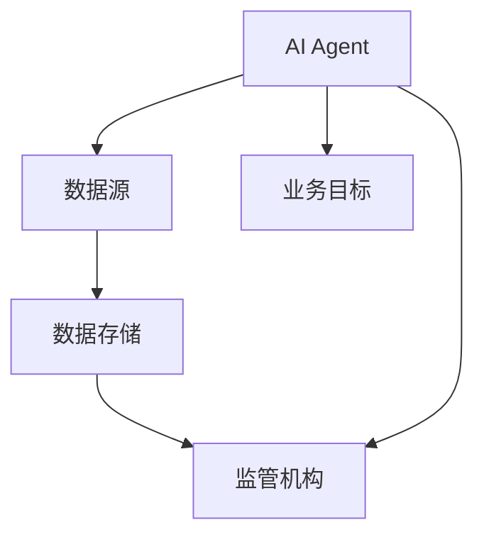
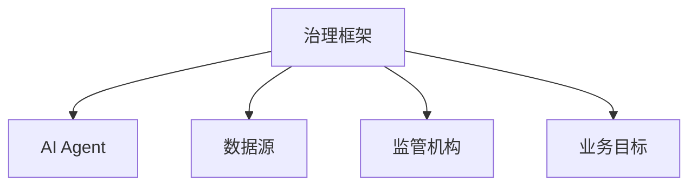
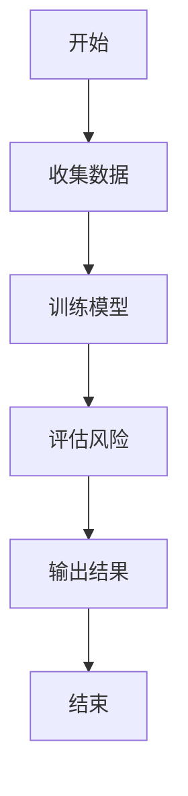
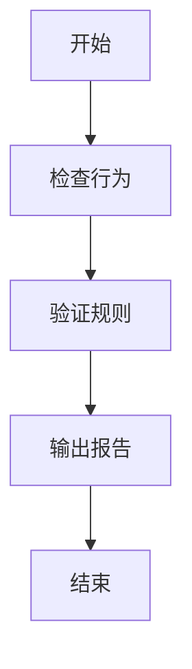
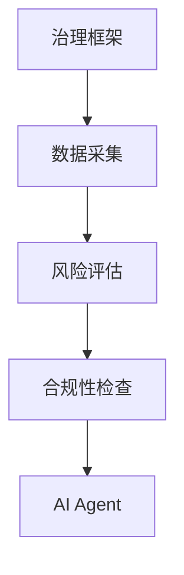
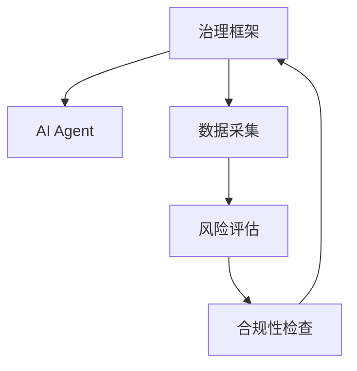

                 


# 企业AI治理框架：确保AI Agent的可控与合规

> **关键词**：企业AI治理，AI Agent，可控性，合规性，风险评估，算法原理

> **摘要**：随着AI技术在企业中的广泛应用，确保AI Agent的可控与合规变得至关重要。本文将详细介绍企业AI治理框架的核心概念、算法原理、系统架构设计以及项目实战，帮助企业在AI时代实现高效治理与合规管理。

---

# 第1章 企业AI治理框架的背景与问题背景

## 1.1 问题背景

### 1.1.1 AI技术在企业中的广泛应用
AI技术正在改变企业的运营方式，从自动化决策到客户交互，AI Agent的应用无处不在。然而，这种广泛应用也带来了新的挑战，如数据隐私、算法偏见和责任归属等问题。

### 1.1.2 AI Agent带来的机遇与挑战
- **机遇**：提高效率、优化决策、增强客户体验。
- **挑战**：失控风险、数据隐私、合规性问题。

### 1.1.3 企业AI治理的必要性
企业需要通过治理框架确保AI Agent的行为符合企业目标和法律法规。

## 1.2 问题描述

### 1.2.1 AI Agent失控的风险
AI Agent可能因为训练数据偏差或算法漏洞而做出不符合预期的行为。

### 1.2.2 数据隐私与合规性问题
企业需要遵守数据保护法规（如GDPR），确保AI Agent的使用符合法律要求。

### 1.2.3 企业内部治理框架的缺失
许多企业尚未建立有效的AI治理框架，导致AI Agent的使用缺乏规范和监督。

## 1.3 问题解决

### 1.3.1 建立AI治理框架的目标
- 确保AI Agent的行为可控。
- 保证AI Agent的使用合规。
- 最小化AI Agent带来的风险。

### 1.3.2 治理框架的核心要素
- **数据治理**：确保数据的准确性和合法性。
- **算法治理**：监控和评估算法的行为。
- **行为治理**：定义AI Agent的行为规范和边界。

### 1.3.3 治理框架的实施步骤
1. 识别关键风险点。
2. 设计治理策略。
3. 实施监控和评估。
4. 持续优化框架。

## 1.4 概念结构与核心要素

### 1.4.1 治理框架的边界与外延
- **边界**：明确AI Agent的职责范围。
- **外延**：扩展治理框架的应用场景。

### 1.4.2 核心概念的组成与关系
- **数据**：输入和输出的数据流。
- **算法**：AI Agent的核心逻辑。
- **行为**：AI Agent的实际操作。

### 1.4.3 概念结构对比表格

| 概念 | 描述 | 特性 |
|------|------|------|
| 数据 | 输入和输出的数据 | 准确性、合法性 |
| 算法 | AI Agent的核心逻辑 | 可解释性、可控制性 |
| 行为 | AI Agent的实际操作 | 可监控性、合规性 |

## 1.5 本章小结
本章介绍了企业AI治理框架的背景和必要性，明确了治理框架的核心要素和实施目标，为后续章节奠定了基础。

---

# 第2章 企业AI治理框架的核心概念与联系

## 2.1 核心概念原理

### 2.1.1 AI Agent的行为规范
AI Agent的行为必须符合企业的目标和法律法规。

### 2.1.2 治理框架的设计原则
- **可控制性**：确保AI Agent的行为可以被监督和调整。
- **可解释性**：AI Agent的决策过程必须透明。
- **合规性**：AI Agent的使用必须符合相关法规。

### 2.1.3 治理框架的实施方法
1. 设计治理策略。
2. 监控AI Agent的行为。
3. 根据反馈优化治理框架。

## 2.2 核心概念属性特征对比

### 2.2.1 治理框架的属性对比表格

| 属性 | 描述 | 特性 |
|------|------|------|
| 可控性 | 行为是否可以被监督和调整 | 强制性、实时性 |
| 可解释性 | 决策过程是否透明 | 明确性、可追溯性 |
| 合规性 | 是否符合法律法规 | 合法性、合规性 |

## 2.3 实体关系图（ER图）



## 2.4 架构设计图（Mermaid图）



## 2.5 本章小结
本章详细探讨了企业AI治理框架的核心概念及其联系，通过ER图和架构图展示了治理框架的实体关系和模块划分。

---

# 第3章 企业AI治理框架的算法原理

## 3.1 算法原理概述

### 3.1.1 AI Agent行为预测算法
通过历史数据预测AI Agent的未来行为。

### 3.1.2 风险评估算法
评估AI Agent行为可能带来的风险。

### 3.1.3 合规性检查算法
检查AI Agent的行为是否符合相关法规。

## 3.2 算法实现细节

### 3.2.1 风险评估算法的实现
1. 收集相关数据。
2. 训练风险评估模型。
3. 评估AI Agent的行为风险。

### 3.2.2 合规性检查算法的实现
1. 设定合规性规则。
2. 检查AI Agent的行为。
3. 输出合规性报告。

### 3.2.3 算法的数学模型与公式
风险评估模型：
$$ R = \sum_{i=1}^{n} w_i \cdot x_i $$
其中，$R$ 是风险值，$w_i$ 是权重，$x_i$ 是特征值。

## 3.3 算法流程图（Mermaid图）

### 3.3.1 风险评估算法流程图



### 3.3.2 合规性检查算法流程图



## 3.4 本章小结
本章详细介绍了企业AI治理框架中的算法原理，通过流程图和数学公式展示了风险评估和合规性检查的实现过程。

---

# 第4章 企业AI治理框架的系统分析与架构设计

## 4.1 问题场景

### 4.1.1 系统功能设计（领域模型）
- 数据采集模块：收集AI Agent的行为数据。
- 风险评估模块：评估AI Agent的行为风险。
- 合规性检查模块：检查AI Agent的行为是否合规。

### 4.1.2 系统架构设计（Mermaid图）



## 4.2 接口设计

### 4.2.1 数据采集接口
- 输入：AI Agent的行为数据。
- 输出：数据存储位置。

### 4.2.2 风险评估接口
- 输入：行为数据。
- 输出：风险评估结果。

### 4.2.3 合规性检查接口
- 输入：行为数据。
- 输出：合规性报告。

## 4.3 交互序列图（Mermaid图）



## 4.4 本章小结
本章通过系统分析和架构设计，展示了如何将治理框架应用于实际系统中，明确了模块划分和接口设计。

---

# 第5章 企业AI治理框架的项目实战

## 5.1 环境安装

### 5.1.1 安装Python
- 使用命令：`python --version` 检查Python版本。
- 安装必要的库：`pip install numpy pandas scikit-learn`

### 5.1.2 安装其他工具
- Mermaid图表工具：支持生成ER图和流程图。

## 5.2 核心代码实现

### 5.2.1 风险评估算法实现

```python
import numpy as np
from sklearn.linear_model import LinearRegression

def risk_assessment(data):
    model = LinearRegression()
    model.fit(data[['feature1', 'feature2']], data['target'])
    predicted_risk = model.predict(data[['feature1', 'feature2']])
    return predicted_risk
```

### 5.2.2 合规性检查算法实现

```python
def compliance_check(data, rules):
    compliant = True
    for rule in rules:
        if not rule.check(data):
            compliant = False
            break
    return compliant
```

## 5.3 代码解读与分析
- 风险评估算法使用线性回归模型，预测AI Agent的行为风险。
- 合规性检查算法通过规则检查AI Agent的行为是否合规。

## 5.4 案例分析
- 案例1：AI Agent的数据泄露风险。
- 案例2：AI Agent的算法偏见问题。

## 5.5 项目小结
本章通过实际项目案例，展示了如何将治理框架应用于实际系统中，明确了代码实现和案例分析。

---

# 第6章 最佳实践与总结

## 6.1 小结
- 治理框架的核心要素：数据治理、算法治理、行为治理。
- 实施步骤：设计框架、监控行为、优化框架。

## 6.2 注意事项
- 数据隐私保护。
- 算法的可解释性。
- 治理框架的持续优化。

## 6.3 拓展阅读
- 推荐书籍：《AI治理：理论与实践》。
- 推荐网站：GitHub上的AI治理框架开源项目。

## 6.4 本章小结
本章总结了企业AI治理框架的最佳实践，提供了小结和注意事项，帮助读者更好地理解和应用治理框架。

---

# 附录

## 附录A 术语表
- AI Agent：智能代理。
- 治理框架：管理AI Agent行为的框架。

## 附录B 参考文献
- [1] Smith, J. (2023). AI Governance Framework.

---

通过以上目录大纲，您可以开始撰写完整的文章内容，确保每个部分都详细展开，包含必要的技术细节和实例分析。

