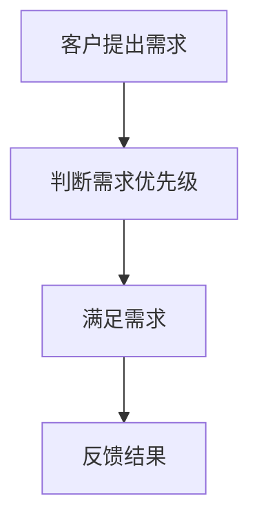
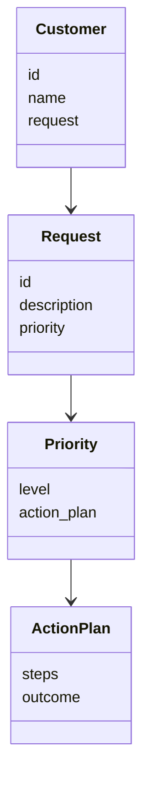

                 


# 企业AI需求分析：识别和评估AI Agent的应用机会

**关键词**：AI Agent、企业需求分析、AI应用机会、需求识别、AI系统设计、AI算法原理

**摘要**：  
本文将深入探讨企业AI需求分析的核心方法，重点聚焦于AI Agent的应用机会识别与评估。通过系统化的分析框架和实际案例，我们不仅将揭示AI Agent在企业中的潜力，还将提供一套从需求识别到系统设计的完整方法论，帮助企业在数字化转型中抓住AI技术的机遇。

---

# 第一部分: 企业AI需求分析基础

## 第1章: AI Agent与企业需求分析概述

### 1.1 AI Agent的基本概念

#### 1.1.1 AI Agent的定义与特点
AI Agent（人工智能代理）是指能够感知环境并采取行动以实现目标的智能实体。它具备以下核心特点：
- **自主性**：能够自主决策，无需外部干预。
- **反应性**：能实时感知环境并做出响应。
- **目标导向性**：所有行动都以实现特定目标为导向。
- **学习能力**：通过数据和经验不断优化自身行为。

#### 1.1.2 AI Agent与传统AI的区别
传统的AI技术（如机器学习、自然语言处理）更多是基于规则或数据的模式识别，而AI Agent则是一个动态的、目标导向的实体，能够主动与环境交互并完成任务。AI Agent的核心在于“智能体”的概念，强调与环境的动态交互。

#### 1.1.3 企业AI需求分析的背景与意义
在企业数字化转型的背景下，AI Agent的应用潜力巨大。通过AI Agent，企业可以实现自动化的需求识别、客户行为预测、流程优化等，从而提升效率、降低成本并增强竞争力。AI Agent的应用机会识别与评估是企业AI战略的核心环节。

---

## 第2章: AI Agent的核心概念与联系

### 2.1 AI Agent的核心原理

#### 2.1.1 基于规则的推理机制
AI Agent可以通过预定义的规则进行推理。例如，在企业需求分析中，可以设定规则来识别客户的需求优先级：
- 如果客户的需求属于高价值且未被满足，则优先处理。
- 使用Mermaid流程图展示基于规则的推理逻辑：



#### 2.1.2 基于学习的自适应算法
AI Agent也可以通过强化学习等算法不断优化自身行为。例如，使用Q-learning算法来优化需求识别的策略：
- **状态**：客户的需求描述。
- **动作**：优先处理或暂时搁置。
- **奖励**：处理后的客户满意度提升。

### 2.2 核心概念对比表

| **核心概念** | **传统AI**                     | **AI Agent**                  |
|--------------|--------------------------------|-------------------------------|
| **目标**     | 模式识别、分类、预测           | 动态交互、目标导向的行动     |
| **决策方式** | 基于规则或模型的预测           | 基于环境反馈的动态决策       |
| **自主性**   | 依赖外部指令                   | 自主决策并采取行动           |

---

### 2.3 ER实体关系图

使用Mermaid绘制AI Agent与企业系统的关系图：

```mermaid
erd
    customer -[1..n]--> request
    request -[1]--> priority
    priority -[1]--> action_plan
    action_plan -[1]--> outcome
```

---

# 第三部分: 算法原理讲解

## 第3章: AI Agent的算法实现

### 3.1 基于Q-learning的需求识别算法

#### 3.1.1 算法流程
Q-learning是一种强化学习算法，适用于动态环境下的决策问题。以下是其核心步骤：

1. **初始化**：定义状态空间、动作空间、奖励函数。
2. **环境感知**：获取当前状态。
3. **决策**：根据当前状态选择动作。
4. **执行**：执行动作并观察新状态。
5. **学习**：更新Q值表，记录状态-动作对的最优奖励。

#### 3.1.2 Q-learning的数学模型

状态-动作值更新公式：
$$ Q(s, a) = Q(s, a) + \alpha \cdot [r + \gamma \cdot \max_{a'} Q(s', a') - Q(s, a)] $$

其中：
- \( Q(s, a) \)：状态s下动作a的Q值。
- \( \alpha \)：学习率。
- \( r \)：奖励。
- \( \gamma \)：折扣因子。
- \( s' \)：新状态。

#### 3.1.3 Python实现

以下是基于Q-learning的需求识别算法的Python代码示例：

```python
class QAgent:
    def __init__(self, states, actions):
        self.states = states
        self.actions = actions
        self.q_table = { (s, a): 0 for s in states for a in actions }
    
    def choose_action(self, state, epsilon=0.1):
        if np.random.random() < epsilon:
            return np.random.choice(self.actions)
        else:
            max_q = max([self.q_table[(state, a)] for a in self.actions])
            actions_with_max_q = [a for a in self.actions if self.q_table[(state, a)] == max_q]
            return np.random.choice(actions_with_max_q)
    
    def learn(self, state, action, reward, next_state):
        current_q = self.q_table[(state, action)]
        max_next_q = max([self.q_table[(next_state, a)] for a in self.actions])
        new_q = current_q + 0.1 * (reward + 0.9 * max_next_q - current_q)
        self.q_table[(state, action)] = new_q
```

---

## 第4章: 系统分析与架构设计

### 4.1 系统功能设计

#### 4.1.1 领域模型
使用Mermaid类图展示领域模型：



#### 4.1.2 系统架构设计
使用Mermaid架构图展示系统架构：

```mermaid
containerDiagram
    container AI-Agent-System {
        component Q-Agent
        component State-Encoder
        component Action-Executor
        component Reward-Assessor
    }
    Q-Agent --> State-Encoder
    State-Encoder --> Reward-Assessor
    Reward-Assessor --> Action-Executor
    Action-Executor --> Q-Agent
```

---

## 第5章: 项目实战

### 5.1 环境安装与配置

#### 5.1.1 安装依赖
```bash
pip install numpy matplotlib
```

#### 5.1.2 环境配置
```bash
export PATH=/path/to/agent-system:$PATH
```

### 5.2 核心代码实现

#### 5.2.1 需求识别模块
```python
def analyze_request(customer_request):
    # 使用预训练的NLP模型进行需求解析
    model = load_model('request_classifier')
    priority = model.predict(customer_request)
    return priority
```

#### 5.2.2 优先级评估模块
```python
def evaluate_priority(priority_level):
    # 根据业务规则评估优先级
    if priority_level >= 8:
        return 'high'
    elif priority_level >= 5:
        return 'medium'
    else:
        return 'low'
```

---

## 第6章: 最佳实践与总结

### 6.1 小结
通过本文的系统分析与实战案例，我们展示了如何在企业中识别和评估AI Agent的应用机会。从需求识别到系统设计，AI Agent为企业提供了强大的工具，能够显著提升效率和竞争力。

### 6.2 注意事项
- 在实际应用中，需注意数据质量和模型的可解释性。
- 确保AI Agent的决策过程透明，便于后续优化。

### 6.3 拓展阅读
- 推荐阅读《强化学习入门》和《人工智能系统设计》。

---

# 结语

企业AI需求分析是一个复杂而 rewarding 的过程，而AI Agent作为核心工具，能够帮助企业识别和评估潜在的应用机会。通过本文的系统分析和实战案例，我们希望为读者提供一套完整的解决方案，助力企业在数字化转型中抓住AI的机遇。

