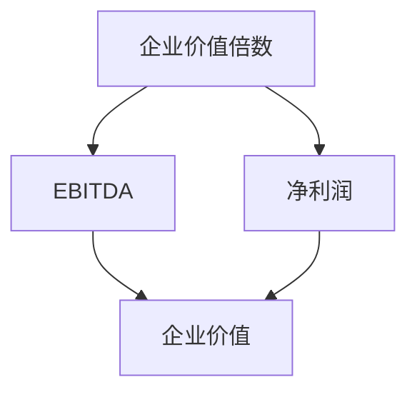
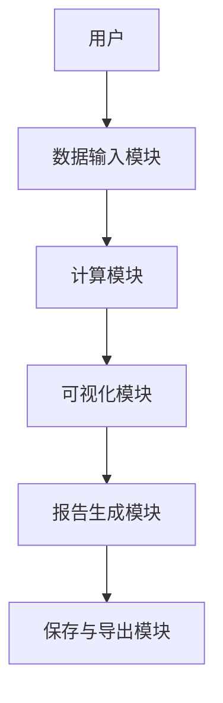
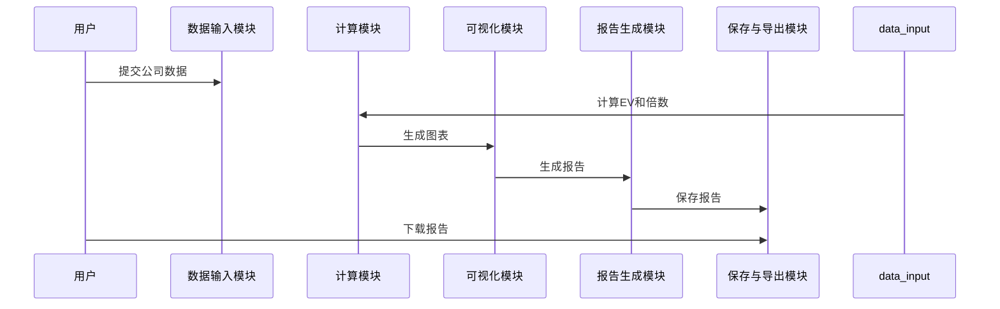

                 


# 企业价值倍数：全面考虑公司资本结构的估值

## 关键词：企业价值倍数，资本结构，估值模型，财务指标，投资分析，企业并购

## 摘要：企业价值倍数（EV）是评估公司价值的重要工具，通过分析公司资本结构优化企业估值，帮助投资者和管理层做出明智决策。本文详细探讨EV的定义、计算方法及其在不同场景中的应用，结合实际案例和系统设计，为读者提供全面的估值指南。

---

# 第一部分: 企业价值倍数概述

# 第1章: 企业价值倍数的核心概念

## 1.1 企业价值倍数的定义与背景

### 1.1.1 什么是企业价值倍数
企业价值倍数（EV）是衡量公司整体价值的重要指标，反映公司资产的市场价值。EV不仅考虑了股权价值，还包括债务和少数股东权益，提供更全面的估值视角。

### 1.1.2 企业价值倍数的重要性
EV帮助投资者评估公司的真实价值，尤其是在并购和融资决策中，EV提供了更为客观的估值基准，有助于避免仅依赖净利润等传统指标的局限性。

### 1.1.3 资本结构对估值的影响
资本结构（股权和债务比例）直接影响公司的资本成本和税后收益，进而影响EV。合理的资本结构能够优化企业价值，降低资本成本，提升股东回报。

## 1.2 企业价值倍数的计算方法

### 1.2.1 EV/EBITDA倍数
EV/EBITDA倍数是EV与息税折旧及摊销前利润的比率，常用作企业估值指标。计算公式为：
$$EV/EBITDA = \frac{EV}{EBITDA}$$
其中，EBITDA表示公司利润，不考虑利息、税项、折旧和摊销。

### 1.2.2 EV/净利润倍数
EV/净利润倍数是EV与公司净利润的比率，公式为：
$$EV/Net\ Profit = \frac{EV}{Net\ Profit}$$
该指标反映公司盈利能力对价值的影响。

### 1.2.3 EV/息税折旧及摊销前利润倍数
EV/EBIT倍数与EV/EBITDA类似，但计算更精确，考虑了利息、税项、折旧和摊销。

## 1.3 企业价值倍数的应用场景

### 1.3.1 企业并购中的应用
并购交易中，EV用于确定目标公司的整体价值，帮助买方评估收购价格是否合理。

### 1.3.2 股权投资中的应用
投资者通过EV指标评估公司的真实价值，识别被低估或高估的投资机会。

### 1.3.3 企业融资中的应用
企业融资时，EV帮助评估资本结构的合理性，优化债务和股权比例，降低资本成本。

---

# 第二部分: 核心概念与联系

# 第2章: 核心概念的原理与对比

## 2.1 核心概念的原理

### 2.1.1 EBITDA的定义与计算
EBITDA是公司利润的重要指标，计算公式为：
$$EBITDA = EBIT + Depreciation + Amortization$$
其中，EBIT是息税前利润，折旧和摊销是公司资产的折旧费用和无形资产的摊销费用。

### 2.1.2 净利润的定义与计算
净利润是公司税后利润，计算公式为：
$$Net\ Profit = Revenue - Expenses - Taxes$$
净利润反映了公司整体盈利能力。

### 2.1.3 EV的定义与计算
EV是公司整体价值，计算公式为：
$$EV = Market\ Cap + Debt - Cash\ and\ Cash\ Equivalents$$
EV考虑了公司的股权价值、债务和现金储备，提供更全面的估值。

## 2.2 核心概念的对比分析

### 2.2.1 EBITDA与净利润的对比
| 属性       | EBITDA                   | 净利润                 |
|------------|--------------------------|-----------------------|
| 定义       | 息税折旧及摊销前利润     | 税后利润             |
| 计算复杂性 | 较低，易于计算           | 较高，涉及更多因素    |
| 适用场景   | 企业估值和并购分析       | 利润分析和投资决策    |

### 2.2.2 EV与净利润的对比
| 属性       | EV                       | 净利润                 |
|------------|--------------------------|-----------------------|
| 定义       | 整体企业价值             | 税后利润             |
| 适用场景   | 企业估值和融资决策       | 利润分析和投资决策    |
| 计算复杂性 | 较高，涉及多因素计算      | 较低，计算较为直接     |

### 2.2.3 EV与EBITDA的对比
| 属性       | EV                       | EBITDA                |
|------------|--------------------------|-----------------------|
| 定义       | 整体企业价值             | 息税折旧及摊销前利润   |
| 计算复杂性 | 较高，涉及债务和现金流   | 较低，计算较为简单     |
| 适用场景   | 企业估值和资本结构分析   | 企业估值和并购分析    |

## 2.3 核心概念的ER实体关系图



---

# 第三部分: 算法原理讲解

# 第3章: 企业价值倍数的算法原理

## 3.1 EV的计算步骤

### 3.1.1 确定目标公司
选择一家公司作为分析对象，例如XYZ公司。

### 3.1.2 收集数据
获取XYZ公司的市场资本化、债务和现金储备数据。

### 3.1.3 计算EV
使用公式：
$$EV = Market\ Cap + Debt - Cash\ and\ Cash\ Equivalents$$

### 3.1.4 计算EBITDA
使用公式：
$$EBITDA = Revenue - Expenses - Depreciation - Amortization$$

### 3.1.5 计算EV/EBITDA倍数
使用公式：
$$EV/EBITDA = \frac{EV}{EBITDA}$$

## 3.2 用Python计算EV和EV/EBITDA倍数

```python
# 示例代码：计算XYZ公司的EV和EV/EBITDA倍数
company = "XYZ公司"
market_cap = 1000000000  # 市场资本化（美元）
debt = 500000000  # 债务（美元）
cash = 200000000  # 现金储备（美元）
revenue = 500000000  # 收入（美元）
expenses = 300000000  # 费用（美元）
depreciation = 50000000  # 折旧（美元）
amortization = 20000000  # 摊销（美元）

# 计算EV
ev = market_cap + debt - cash
print(f"{company}的EV为：${ev}")

# 计算EBITDA
ebitda = revenue - expenses - depreciation - amortization
print(f"{company}的EBITDA为：${ebitda}")

# 计算EV/EBITDA倍数
ev_ebitda = ev / ebitda
print(f"{company}的EV/EBITDA倍数为：{ev_ebitda}")
```

---

# 第四部分: 系统分析与架构设计方案

# 第4章: 系统分析与架构设计

## 4.1 问题场景介绍

### 4.1.1 系统目标
设计一个基于EV的企业价值分析系统，提供多种指标计算和可视化功能。

### 4.1.2 项目介绍
开发一个在线工具，帮助用户计算EV和相关倍数，分析公司资本结构和估值。

## 4.2 系统功能设计

### 4.2.1 功能模块
- 数据输入模块：允许用户输入公司数据
- 计算模块：计算EV、EBITDA、EV/EBITDA倍数
- 可视化模块：生成图表和报告
- 保存与导出模块：保存分析结果

### 4.2.2 系统架构设计



### 4.2.3 系统交互设计



---

# 第五部分: 项目实战

# 第5章: 项目实战

## 5.1 环境安装

### 5.1.1 安装Python
安装Python 3.x版本，确保环境配置正确。

### 5.1.2 安装必要的库
安装pandas、numpy、matplotlib等库：
```bash
pip install pandas numpy matplotlib
```

## 5.2 核心实现

### 5.2.1 数据输入模块
编写函数读取公司数据，例如从CSV文件读取数据。

### 5.2.2 计算模块
实现EV、EBITDA和EV/EBITDA倍数的计算。

### 5.2.3 可视化模块
生成柱状图或折线图，展示EV和相关倍数。

## 5.3 实际案例分析

### 5.3.1 案例介绍
以XYZ公司为例，分析其EV和资本结构。

### 5.3.2 数据分析
计算XYZ公司的EV、EBITDA和EV/EBITDA倍数，分析其估值是否合理。

## 5.4 代码实现

```python
import pandas as pd
import matplotlib.pyplot as plt

# 数据输入
data = pd.read_csv('company_data.csv')

# 计算EV和EV/EBITDA倍数
ev = data['Market Cap'] + data['Debt'] - data['Cash']
ebitda = data['Revenue'] - data['Expenses'] - data['Depreciation'] - data['Amortization']
ev_ebitda = ev / ebitda

# 可视化
plt.figure(figsize=(10,6))
plt.plot(data['Company'], ev_ebitda, 'b-', marker='o')
plt.title('EV/EBITDA倍数分析')
plt.xlabel('公司名称')
plt.ylabel('EV/EBITDA倍数')
plt.grid(True)
plt.show()
```

---

# 第六部分: 总结与扩展

# 第6章: 总结与扩展

## 6.1 本章总结
企业价值倍数是评估公司整体价值的重要工具，通过分析资本结构优化企业估值，帮助投资者和管理层做出明智决策。

## 6.2 最佳实践 tips
- 结合多种估值指标进行综合分析
- 定期更新财务数据和市场信息
- 考虑宏观经济和行业趋势的影响

## 6.3 注意事项
- 数据准确性至关重要
- 合理选择可比公司进行分析
- 考虑公司特定因素，如无形资产和研发能力

## 6.4 拓展阅读
- 《企业价值评估》
- 《资本结构与企业价值》
- 《财务报表分析与企业估值》

---

通过本文的详细讲解和实际案例分析，读者可以全面理解企业价值倍数的评估方法及其在资本结构优化中的应用。希望本文能为投资者和企业管理人员提供有价值的参考和指导。

