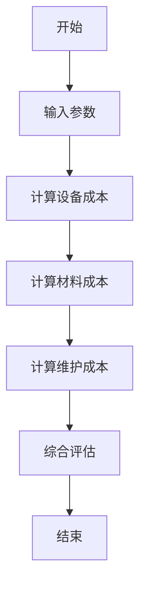
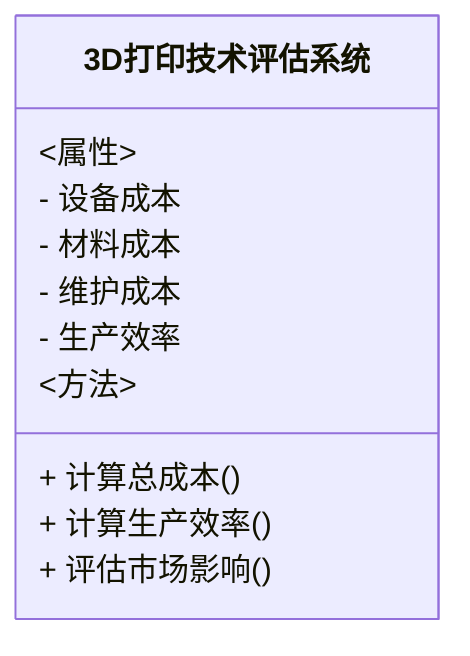
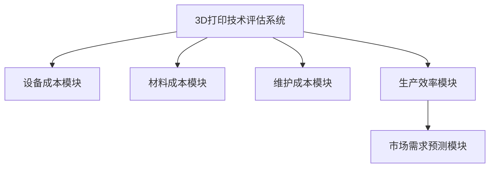
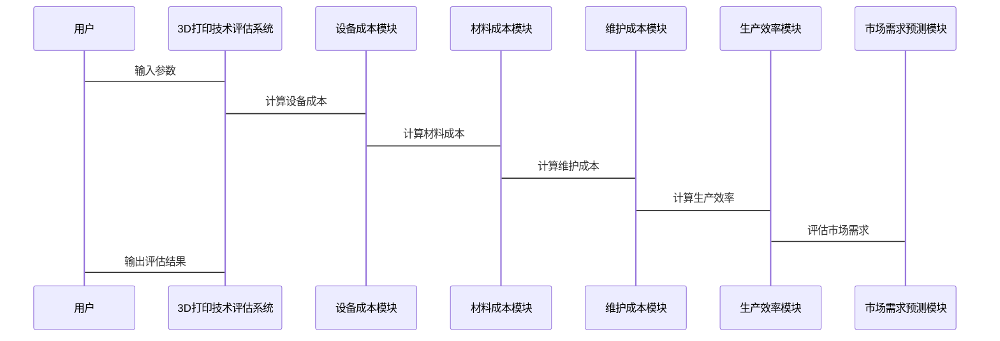

                 


# 《企业估值中的3D打印技术评估》

---

## 关键词：
企业估值、3D打印技术、技术评估、成本分析、市场影响

---

## 摘要：
3D打印技术作为一种革命性的制造技术，正在对企业估值产生深远影响。本文将详细探讨3D打印技术的核心概念、评估指标及其对企业发展和市场价值的具体影响。通过分析成本模型、效率模型和市场影响模型，结合实际案例，本文旨在为企业估值提供新的视角和方法。文章内容涵盖技术背景、算法原理、系统架构设计以及项目实战，为读者提供全面且深入的技术分析和实践指导。

---

# 目录

## 第一部分: 3D打印技术与企业估值的背景介绍

### 第1章: 3D打印技术与企业估值的背景
1.1 3D打印技术的基本概念
1.1.1 3D打印技术的定义
1.1.2 3D打印技术的核心要素
1.1.3 3D打印技术的演进历程

1.2 企业估值的基本概念
1.2.1 企业估值的定义
1.2.2 企业估值的主要方法
1.2.3 企业估值的核心要素

1.3 3D打印技术在企业估值中的应用背景
1.3.1 3D打印技术对企业生产效率的影响
1.3.2 3D打印技术对企业成本结构的改变
1.3.3 3D打印技术对企业创新能力和竞争力的提升

1.4 本章小结

---

## 第二部分: 3D打印技术的评估指标与核心概念

### 第2章: 3D打印技术的评估指标
2.1 3D打印技术的主要评估维度
2.1.1 打印速度与效率
2.1.2 材料利用率
2.1.3 设备成本与维护费用
2.1.4 产品质量与一致性

2.2 3D打印技术与传统制造方式的对比
2.2.1 成本对比分析
2.2.2 生产周期对比分析
2.2.3 资源利用率对比分析

2.3 3D打印技术对企业估值的具体影响
2.3.1 对企业盈利能力的影响
2.3.2 对企业资产价值的影响
2.3.3 对企业市场竞争力的影响

2.4 本章小结

---

## 第三部分: 3D打印技术评估的算法原理与数学模型

### 第3章: 3D打印技术评估的算法原理
3.1 3D打印技术的成本模型
3.1.1 成本构成分析
3.1.2 成本计算公式
$$ \text{总成本} = \text{设备成本} + \text{材料成本} + \text{维护成本} $$

3.2 3D打印技术的效率模型
3.2.1 生产效率计算公式
$$ \text{生产效率} = \frac{\text{打印件数量}}{\text{单位时间}} $$

3.3 3D打印技术的市场影响模型
3.3.1 市场需求预测公式
$$ \text{市场需求} = a \times \text{价格} + b \times \text{生产效率} $$

3.4 算法流程图（Mermaid）


---

## 第四部分: 系统分析与架构设计

### 第4章: 3D打印技术评估的系统架构
4.1 问题场景介绍
4.2 系统功能设计
4.2.1 领域模型（Mermaid类图）


4.3 系统架构设计（Mermaid架构图）


4.4 系统接口设计
4.5 系统交互流程（Mermaid序列图）


4.6 本章小结

---

## 第五部分: 项目实战与案例分析

### 第5章: 3D打印技术评估的项目实战
5.1 环境搭建
5.2 系统核心实现（Python源代码）
```python
# 示例代码：3D打印技术成本计算
class ThreeDPrintingCost:
    def __init__(self,设备成本, 材料成本, 维护成本):
        self.设备成本 = 设备成本
        self.材料成本 = 材料成本
        self.维护成本 = 维护成本

    def 计算总成本(self):
        return self.设备成本 + self.材料成本 + self.维护成本

# 示例代码：生产效率计算
class ProductionEfficiency:
    def __init__(self, 打印件数量, 单位时间):
        self.打印件数量 = 打印件数量
        self.单位时间 = 单位时间

    def 计算生产效率(self):
        return self.打印件数量 / self.单位时间
```

5.3 案例分析
5.4 项目总结

---

## 第六部分: 最佳实践与拓展阅读

### 第6章: 最佳实践与注意事项
6.1 实施3D打印技术评估的关键点
6.2 评估系统维护与优化建议
6.3 3D打印技术的未来发展趋势

### 第7章: 拓展阅读与参考资料
7.1 相关技术文献推荐
7.2 实际案例研究
7.3 未来研究方向

---

## 附录
附录A: 术语表
附录B: 工具与资源列表

---

## 参考文献
（此处列出相关书籍、论文和在线资源）

---

## 作者简介
（此处介绍作者的专业背景和相关著作）

---

通过以上目录结构，文章将从背景介绍、核心概念、算法原理、系统架构、项目实战到最佳实践，全面、系统地探讨企业估值中的3D打印技术评估问题，为读者提供深入的技术分析和实践指导。

