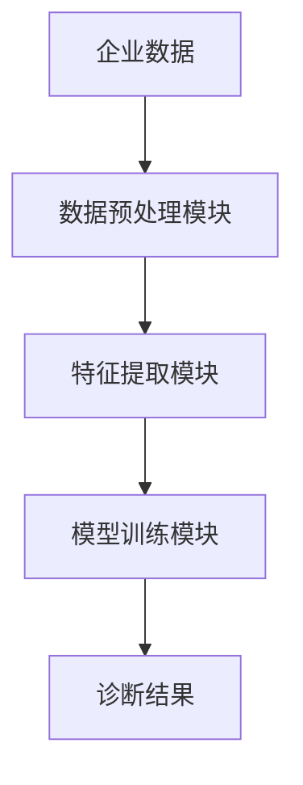
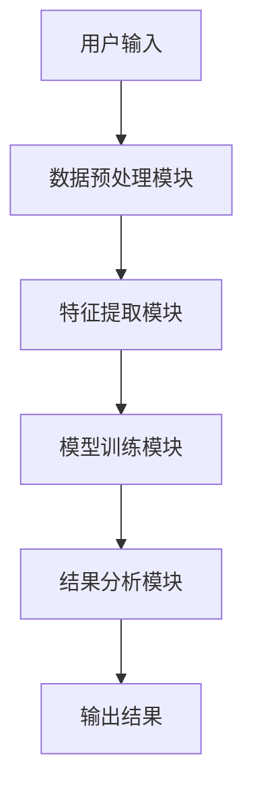

                 


# 企业估值中的AI辅助诊断系统评估

> **关键词**: 企业估值, AI辅助诊断系统, 算法原理, 系统架构, 数学模型

> **摘要**: 本文深入探讨了AI辅助诊断系统在企业估值中的应用，分析了系统的核心概念、算法原理、系统架构，并通过实际案例展示了系统的实现与应用。文章结合理论与实践，为企业估值提供了一种高效、智能的解决方案。

---

## 第1章: 企业估值与AI辅助诊断系统概述

### 1.1 企业估值的基本概念
企业估值是通过对企业的财务状况、市场地位、发展潜力等多个维度的分析，确定企业价值的过程。传统的企业估值方法依赖于财务报表分析、市场比较法和DCF模型等，但这些方法存在数据量大、计算复杂、主观性强等问题。

### 1.2 AI辅助诊断系统的定义与特点
AI辅助诊断系统是一种结合人工智能技术的自动化诊断工具，用于辅助企业估值的过程。其核心功能包括数据采集、特征提取、模型训练和结果分析。AI系统的优势在于高效性、准确性以及对非结构化数据的处理能力。

### 1.3 问题背景与目标
传统企业估值方法存在以下问题：
- 数据量大，人工处理效率低
- 模型依赖主观假设，结果可能存在偏差
- 非结构化数据（如文本、图像）难以有效利用

引入AI辅助诊断系统的目的是通过自动化和智能化的方法，提高企业估值的效率和准确性，减少人为错误，同时支持对非结构化数据的分析。

---

## 第2章: AI辅助诊断系统的原理与架构

### 2.1 系统核心概念
AI辅助诊断系统的核心概念包括：
- **数据源**：企业财务数据、市场数据、新闻数据等
- **特征提取**：从数据中提取关键特征，如财务指标、市场趋势等
- **模型训练**：基于特征训练机器学习模型，预测企业价值
- **结果分析**：对模型输出的结果进行解释和验证

### 2.2 核心概念对比分析
以下是几种常见算法的优缺点对比：

| 算法 | 优点 | 缺点 |
|------|------|------|
| 线性回归 | 简单易懂，计算速度快 | 无法处理非线性关系 |
| 随机森林 | 高准确性，鲁棒性强 | 计算复杂度高 |
| LSTM | 能够处理时间序列数据 | 对数据预处理要求高 |

### 2.3 系统实体关系图


---

## 第3章: 算法原理与实现

### 3.1 机器学习算法基础
#### 3.1.1 线性回归模型
线性回归是一种简单但有效的回归算法，适用于线性关系的预测。其数学模型如下：
$$ y = \beta_0 + \beta_1x + \epsilon $$
其中，$\beta_0$ 是截距，$\beta_1$ 是斜率，$\epsilon$ 是误差项。

#### 3.1.2 随机森林算法
随机森林是一种基于树的集成算法，通过组合多个决策树的结果来提高准确性和稳定性。其核心思想是“投票法”，即每个树独立预测，最终结果取多数投票。

### 3.2 深度学习算法的应用
#### 3.2.1 LSTM网络在时间序列分析中的应用
LSTM（长短期记忆网络）适用于处理时间序列数据，能够有效捕捉数据中的长期依赖关系。其核心结构包括输入门、遗忘门和输出门。

#### 3.2.2 BERT模型在文本分析中的应用
BERT（Bidirectional Encoder Representations from Transformers）是一种基于Transformer的预训练语言模型，广泛应用于文本分析任务，如情感分析和实体识别。

---

## 第4章: 系统分析与架构设计

### 4.1 系统功能设计
系统功能模块包括：
- 数据预处理模块
- 特征提取模块
- 模型训练模块
- 结果分析模块

### 4.2 系统架构设计


### 4.3 系统接口设计
系统接口包括：
- 数据输入接口：接收企业数据
- 模型调用接口：调用训练好的模型进行预测
- 结果输出接口：返回诊断结果

---

## 第5章: 项目实战

### 5.1 环境安装
安装Python环境并配置以下库：
```bash
pip install numpy pandas scikit-learn transformers
```

### 5.2 核心代码实现
以下是基于LSTM模型的企业估值代码示例：
```python
import numpy as np
import pandas as pd
from tensorflow.keras.models import Sequential
from tensorflow.keras.layers import LSTM, Dense

# 数据预处理
data = pd.read_csv('企业数据.csv')
features = data[[' revenue', 'net_income', 'market_value']]
labels = data['valuation']

# 模型训练
model = Sequential()
model.add(LSTM(64, input_shape=(None, 3)))
model.add(Dense(1))
model.compile(loss='mean_squared_error', optimizer='adam')

model.fit(features, labels, epochs=100, batch_size=32)
```

### 5.3 案例分析
以某企业为例，通过模型预测其估值，并与实际估值进行对比，验证模型的准确性。

### 5.4 项目小结
本项目通过AI技术实现了对企业估值的辅助诊断，验证了AI在企业估值中的应用潜力。

---

## 第6章: 最佳实践与总结

### 6.1 最佳实践
- 数据预处理是关键，需注意数据清洗和特征工程
- 选择合适的算法，避免过度复杂化
- 模型训练后需进行验证和调优

### 6.2 小结
本文通过理论与实践相结合的方式，详细介绍了AI辅助诊断系统在企业估值中的应用。从算法原理到系统架构，再到项目实现，为读者提供了一套完整的解决方案。

### 6.3 注意事项
- 数据隐私和安全问题需高度重视
- 模型的解释性需进一步提升
- 系统的可扩展性需在设计阶段充分考虑

### 6.4 拓展阅读
- 《Deep Learning》
- 《Python机器学习实战》
- 《企业估值与资本运作》

---

通过本文的分析与实践，读者可以深入理解AI辅助诊断系统在企业估值中的重要作用，并掌握其实现方法。

