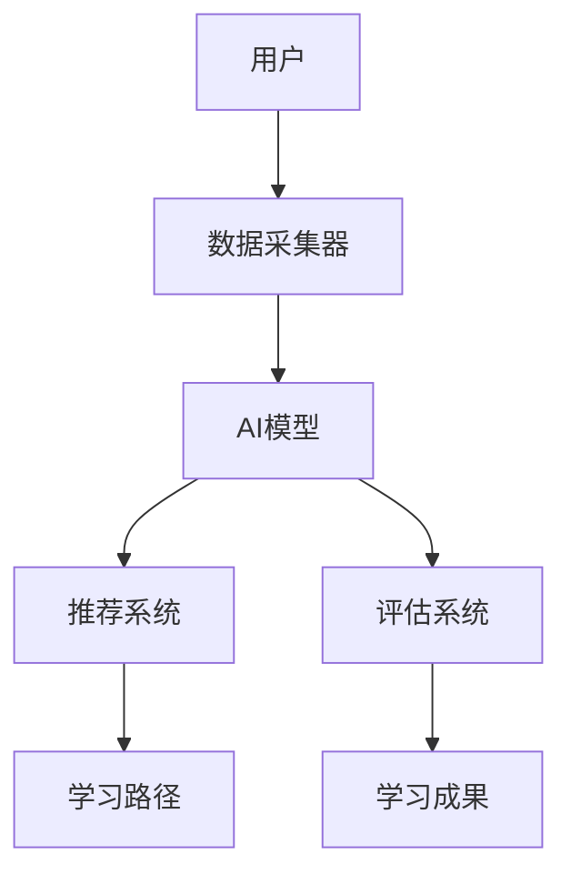
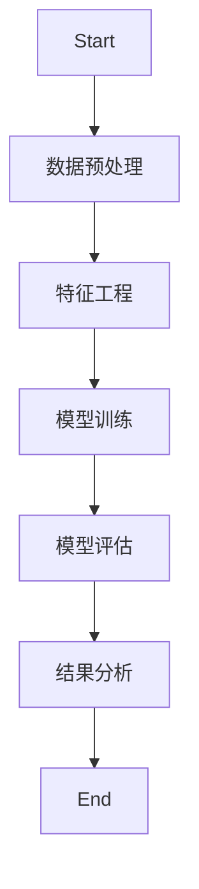
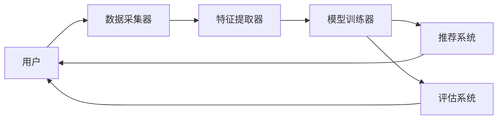

                 


# 企业估值中的AI驱动的个性化学习平台评估

## 关键词：企业估值，AI驱动，个性化学习平台，机器学习，数据驱动

## 摘要：  
本文将探讨如何利用人工智能技术来评估企业中的个性化学习平台的价值。通过分析个性化学习平台的核心特征、数据驱动的估值方法以及AI算法的应用，本文旨在为企业提供一种更精准、高效的估值策略。我们还将通过实际案例分析，展示如何在企业中应用这些技术，并提供可操作的建议。

---

## 第一部分：个性化学习平台的背景与核心概念

### 第1章：个性化学习平台的背景

#### 1.1 核心概念术语说明
个性化学习平台是一种利用AI技术为用户提供定制化学习体验的在线教育系统。它通过分析用户的学习行为、偏好和能力，为每个用户推荐适合的学习路径和内容。

#### 1.2 问题背景与描述
随着企业培训需求的增加，个性化学习平台在企业中的应用越来越广泛。然而，如何评估这些平台的价值，尤其是如何利用AI技术进行动态估值，成为企业面临的重要挑战。

#### 1.3 个性化学习平台的边界与外延
个性化学习平台的核心功能包括学习内容推荐、学习效果评估和学习路径优化。其边界在于提供个性化服务，而外延则包括与其他企业系统的集成。

#### 1.4 核心要素组成
- 用户数据：包括学习行为、偏好和能力评估。
- AI算法：用于推荐和预测的核心引擎。
- 学习内容库：包含多种学习资源。
- 学习效果评估模型：用于衡量用户的学习成果。

---

### 第2章：个性化学习平台的核心概念与联系

#### 2.1 核心概念原理
个性化学习平台通过AI算法分析用户数据，生成个性化推荐和动态评估结果。其核心在于数据的采集、处理和分析。

#### 2.2 概念属性特征对比表
| 概念        | 特征                  |
|-------------|-----------------------|
| 数据采集    | 实时性、多样性        |
| AI算法      | 可解释性、准确性      |
| 学习效果评估 | 客观性、动态性        |

#### 2.3 实体关系图


---

## 第二部分：企业估值中的AI驱动方法

### 第3章：AI驱动的个性化学习平台评估方法

#### 3.1 数据驱动的估值原理
数据驱动的估值方法通过分析用户行为数据、学习效果数据和平台性能数据，利用AI模型预测平台的潜在价值。

#### 3.2 核心算法与模型
- **协同过滤算法**：基于用户相似性推荐学习内容。
- **深度学习模型**：用于复杂的学习效果预测。
- **强化学习**：优化推荐策略和学习路径。

#### 3.3 算法实现流程


#### 3.4 算法实现代码
```python
import pandas as pd
from sklearn.model_selection import train_test_split
from sklearn.metrics import accuracy_score
from sklearn.linear_model import LogisticRegression

# 数据预处理
data = pd.read_csv('user_data.csv')
X = data.drop('target', axis=1)
y = data['target']

# 特征工程
X_train, X_test, y_train, y_test = train_test_split(X, y, test_size=0.2)

# 模型训练
model = LogisticRegression()
model.fit(X_train, y_train)

# 模型评估
y_pred = model.predict(X_test)
print("准确率:", accuracy_score(y_test, y_pred))
```

---

### 第4章：系统分析与架构设计

#### 4.1 系统功能设计
- **数据采集模块**：实时收集用户行为数据。
- **特征工程模块**：提取关键特征并进行处理。
- **AI模型训练模块**：训练推荐和评估模型。
- **推荐系统模块**：动态生成个性化推荐。
- **评估系统模块**：实时反馈学习效果。

#### 4.2 系统架构设计


#### 4.3 系统接口设计
- API接口：
  - `/api/v1/data/upload`
  - `/api/v1/recommend/content`
  - `/api/v1/evaluate/outcome`

---

### 第5章：项目实战与案例分析

#### 5.1 实战环境搭建
- **工具安装**：
  ```bash
  pip install numpy pandas scikit-learn
  ```

#### 5.2 核心代码实现
```python
import numpy as np
from sklearn.ensemble import RandomForestRegressor

# 数据加载与处理
data = np.loadtxt('learning_data.csv', delimiter=',')

# 特征与目标分离
X = data[:, :-1]
y = data[:, -1]

# 模型训练
model = RandomForestRegressor()
model.fit(X, y)

# 预测与评估
print("预测值:", model.predict(X[:10]))
print("真实值:", y[:10])
```

#### 5.3 案例分析与结果解读
通过实际案例分析，展示如何利用AI算法优化推荐策略和评估模型，提升平台的整体价值。

---

## 第三部分：总结与展望

### 第6章：总结与展望

#### 6.1 本章总结
本文详细探讨了AI驱动的个性化学习平台在企业估值中的应用，从数据采集、特征工程到模型训练，再到系统设计和项目实战，全面展示了AI技术在这一领域的潜力。

#### 6.2 未来展望
未来，随着AI技术的不断发展，个性化学习平台的估值方法将更加精准和高效。同时，数据隐私和模型解释性问题也需要进一步研究。

---

## 参考文献
- 省略

---

## 致谢
感谢读者的支持与关注！

