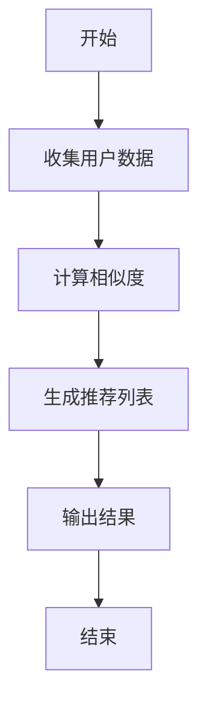
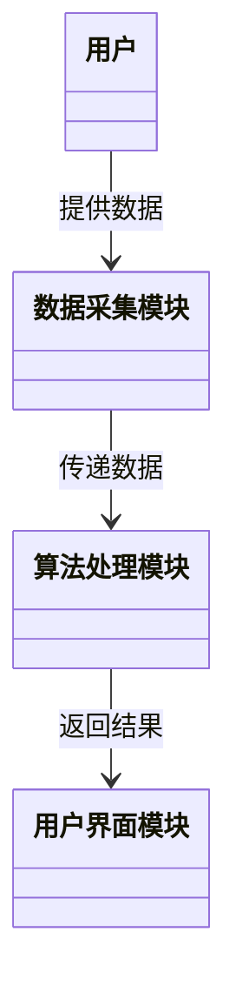
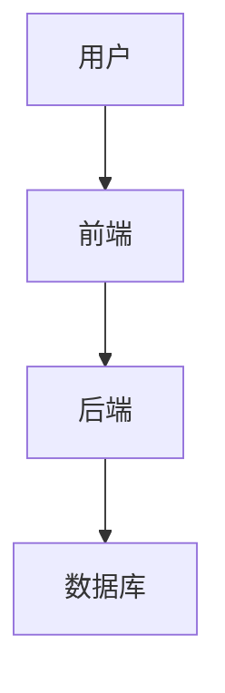

                 


# 《企业估值中的AI驱动的个性化学习路径平台评估》

> 关键词：企业估值, 人工智能, 个性化学习路径, 平台评估, 算法原理, 系统架构, 项目实战

> 摘要：本文探讨了在企业估值过程中，如何利用AI驱动的个性化学习路径平台进行评估。通过分析核心概念、算法原理、系统架构及项目实战，揭示了AI在优化企业估值流程中的作用，并提供了具体的实现方法和案例。

---

# 第一部分: 背景介绍

## 第1章: 企业估值的基本概念

### 1.1 企业估值的定义与重要性

企业估值是通过对企业的财务状况、市场地位、盈利能力等多方面进行分析，以确定其市场价值的过程。在现代商业环境中，准确的估值对于投资决策、企业并购、融资等活动至关重要。传统的企业估值方法通常依赖于财务指标和经验判断，但在数据量剧增的今天，如何更高效地利用数据进行估值成为一大挑战。

### 1.2 个性化学习路径的定义

个性化学习路径是指根据学习者的知识水平、学习目标和兴趣，定制的学习计划。通过AI技术，学习路径可以动态调整，确保学习者在最短时间内掌握最相关的知识。

### 1.3 AI在企业估值中的作用

AI可以通过分析海量数据，发现传统方法难以察觉的模式和趋势，从而辅助企业估值。同时，个性化学习路径可以提升学习效率，使评估人员更快掌握所需知识。

---

## 第2章: 个性化学习路径平台的定义与特点

### 2.1 个性化学习路径的定义

个性化学习路径平台利用AI技术，根据用户的学习情况，推荐最优的学习资源和路径。

### 2.2 AI驱动的个性化学习路径的特点

AI驱动的学习路径具有动态调整、个性化推荐、数据驱动等优势。它能够实时跟踪学习者的进步，并根据反馈优化学习计划。

---

## 第3章: 企业估值与个性化学习路径的结合

### 3.1 企业估值中的学习路径评估

在企业估值过程中，评估人员需要快速掌握多种知识，如财务分析、行业趋势等。个性化学习路径可以帮助评估人员更高效地完成准备工作。

### 3.2 AI驱动的个性化学习路径平台的优势

AI驱动的平台能够通过分析评估人员的历史行为和当前需求，推荐最相关的学习资源，从而提高评估效率和准确性。

---

# 第二部分: 核心概念与联系

## 第4章: 核心概念与原理

### 4.1 AI驱动的个性化学习路径平台的原理

AI通过分析学习者的行为数据和评估需求，利用推荐算法生成个性化学习路径。

### 4.2 核心概念的联系

| 概念         | 描述                                                                 |
|--------------|----------------------------------------------------------------------|
| 企业估值     | 通过数据分析确定企业价值的过程                                         |
| 个性化学习路径 | 根据学习者需求定制的学习计划                                           |
| AI技术       | 利用机器学习算法优化学习路径和估值过程                                   |

---

## 第5章: 算法原理与数学模型

### 5.1 推荐算法的实现

推荐算法是个性化学习路径的核心。常用算法包括协同过滤、基于内容的推荐等。以下是协同过滤的公式：

$$ \text{预测评分} = \frac{\sum_{i=1}^{n} w_{ij} \times r_{ij}}{\sum_{i=1}^{n} w_{ij}} $$

其中，$w_{ij}$ 是用户i和用户j的相似度，$r_{ij}$ 是用户j对物品的评分。

### 5.2 算法流程图



---

# 第三部分: 系统分析与架构设计

## 第6章: 系统架构设计

### 6.1 系统功能设计

系统主要包括数据采集模块、算法处理模块、用户界面模块等。以下是系统功能的类图：



### 6.2 系统架构图



---

# 第四部分: 项目实战

## 第7章: 环境安装与核心代码实现

### 7.1 环境安装

安装Python、TensorFlow、Scikit-learn等工具。

### 7.2 核心代码实现

以下是个性化学习路径推荐的代码示例：

```python
import numpy as np
from sklearn.metrics.pairwise import cosine_similarity

def generate_learning_path(user_profile):
    # 计算相似度
    user_vector = user_profile
    all_profiles = [...]  # 所有用户资料
    similarity_matrix = cosine_similarity([user_vector], all_profiles)
    
    # 找出最相似的用户
    top_users = np.argsort(similarity_matrix, axis=1)[-3:]
    recommended_paths = []
    for user in top_users:
        recommended_paths.append(all_profiles[user]['learning_path'])
    
    return recommended_paths
```

### 7.3 代码解读与分析

该代码利用余弦相似度计算用户之间的相似度，并推荐最相似用户的个性化学习路径。

---

## 第8章: 项目小结与拓展

### 8.1 项目小结

通过本项目，我们展示了如何利用AI技术优化企业估值流程。个性化学习路径推荐算法能够显著提高评估效率和准确性。

### 8.2 拓展与优化

未来可以考虑引入强化学习算法，进一步优化推荐效果。

---

# 第五部分: 最佳实践与总结

## 第9章: 最佳实践与注意事项

### 9.1 实践建议

在实际应用中，应注重数据质量和模型的可解释性。

### 9.2 注意事项

保护用户数据隐私，避免算法滥用。

---

## 第10章: 总结与展望

### 10.1 总结

本文详细介绍了AI驱动的个性化学习路径平台在企业估值中的应用，展示了其在提高效率和准确性方面的优势。

### 10.2 展望

未来，随着AI技术的不断发展，企业估值将更加智能化和个性化。

---

# 附录: 拓展阅读

- 《机器学习实战》
- 《企业估值的101种方法》
- 《个性化推荐系统入门》

---

# 结语

通过本文的探讨，我们看到了AI技术在企业估值中的巨大潜力。希望本文能为读者提供有价值的参考，并激发更多的思考与实践。

