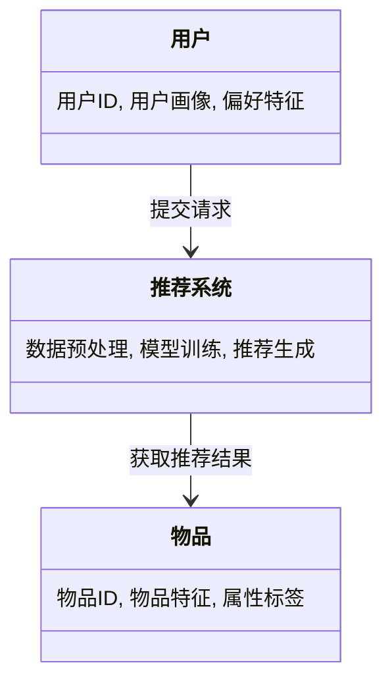
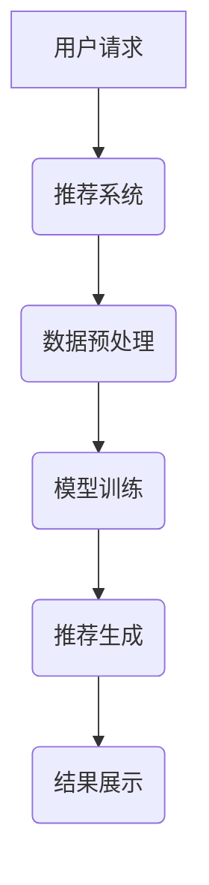
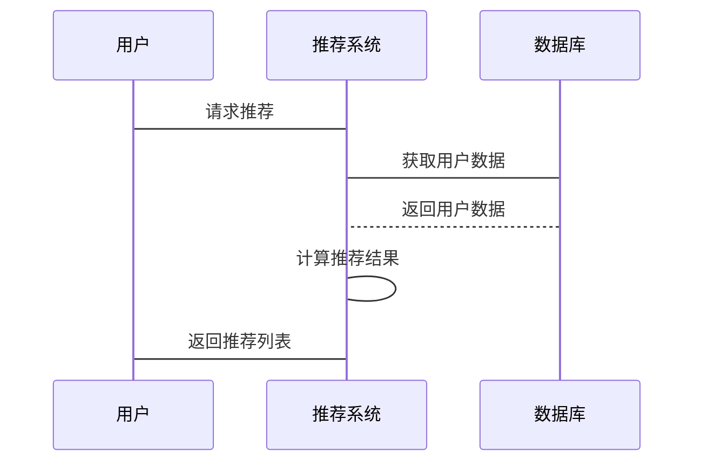

                 


# 企业估值中的AI驱动的个性化推荐系统评估

---

## 关键词：企业估值，AI推荐系统，个性化推荐，算法原理，系统架构

---

## 摘要：  
本文探讨了AI驱动的个性化推荐系统在企业估值中的应用，分析了推荐系统的原理、算法、系统架构以及实现细节，通过项目实战展示了如何利用推荐系统提升企业估值的准确性和效率。

---

## 第3章: 基于AI的推荐系统算法原理

### 3.1 协同过滤算法

#### 3.1.1 基于用户的协同过滤
- 用户-用户协同过滤：基于相似用户的购买或评分行为推荐。
- 计算用户相似度的方法：余弦相似度、皮尔逊相关系数。
- 示例公式：$$ sim(u_i, u_j) = \frac{\sum (r_{i,k} - \bar{r_i})(r_{j,k} - \bar{r_j})}{\sqrt{\sum (r_{i,k} - \bar{r_i})^2} \cdot \sqrt{\sum (r_{j,k} - \bar{r_j})^2}} $$

#### 3.1.2 基于物品的协同过滤
- 物品-物品协同过滤：基于相似物品的特征推荐。
- 示例公式：$$ sim(i_j, i_k) = \frac{\sum (r_{u,i_j} - \bar{r_{i_j}})(r_{u,i_k} - \bar{r_{i_k}})}{\sqrt{\sum (r_{u,i_j} - \bar{r_{i_j}})^2} \cdot \sqrt{\sum (r_{u,i_k} - \bar{r_{i_k}})^2}} $$

#### 3.1.3 混合协同过滤算法
- 结合用户和物品的特征进行推荐。
- 示例代码：```python
def hybrid_recommendation(user_id):
    # 获取用户偏好
    user_profile = get_user_profile(user_id)
    # 用户协同过滤推荐
    user_recs = user_based_recommender(user_id)
    # 物品协同过滤推荐
    item_recs = item_based_recommender(user_id)
    # 综合推荐
    hybrid_recs = combine(user_recs, item_recs)
    return hybrid_recs
```

### 3.2 基于内容的推荐算法

#### 3.2.1 基于文本挖掘的内容推荐
- 使用文本挖掘技术提取物品特征，如TF-IDF、Word2Vec。
- 示例公式：$$ score = \sum_{i=1}^{n} w_i \cdot v_i $$，其中$w_i$是权重，$v_i$是特征值。

#### 3.2.2 基于特征向量的内容推荐
- 将物品转换为特征向量，计算相似度。
- 示例代码：```python
def content_based_recommendation(user_id):
    # 提取物品特征向量
    item_features = get_item_features()
    # 计算用户偏好向量
    user_vector = get_user_vector(user_id)
    # 计算相似度
    similarities = cosine_similarity(user_vector, item_features)
    # 返回推荐结果
    return top_k(similarities)
```

#### 3.2.3 基于深度学习的内容推荐
- 使用神经网络模型（如DNN、CNN、RNN）提取高维特征。
- 示例代码：```python
model = Sequential()
model.add(Dense(64, activation='relu', input_dim=100))
model.add(Dense(1, activation='sigmoid'))
model.compile(optimizer='adam', loss='binary_crossentropy')
```

### 3.3 基于深度学习的推荐算法

#### 3.3.1 基于神经网络的推荐模型
- 使用多层感知机（MLP）进行推荐。
- 示例公式：$$ y = f(x) $$，其中$f$是MLP模型。

#### 3.3.2 基于注意力机制的推荐模型
- 使用自注意力机制捕捉用户行为序列中的重要特征。
- 示例公式：$$ \alpha_i = softmax(QK^T) $$，其中$Q$和$K$是查询和键向量。

#### 3.3.3 基于图神经网络的推荐模型
- 使用图嵌入技术（如GAT、GraphSAGE）建模用户和物品的交互关系。
- 示例代码：```python
def graph_based_recommendation(user_id):
    # 构建用户-物品交互图
    graph = build_interaction_graph()
    # 计算节点嵌入
    embeddings = graph_sage_encode(graph)
    # 预测推荐
    predictions = predict(embeddings[user_id])
    return predictions
```

### 3.4 本章小结

- 各种推荐算法的优缺点对比：
  | 算法类型          | 优点                     | 缺点                     |
  |-------------------|--------------------------|--------------------------|
  | 协同过滤          | 易实现，考虑用户行为       | 对冷启动问题敏感         |
  | 基于内容的推荐     | 解释性强，考虑物品特征     | 需要高质量特征           |
  | 深度学习推荐       | 高维特征提取能力强         | 黑箱问题，解释性差         |

- 基于AI的推荐算法发展趋势：
  - 深度学习模型逐渐取代传统协同过滤算法。
  - 结合多模态数据（如文本、图像）的推荐系统越来越受欢迎。
  - 实时推荐和动态更新能力的提升。

---

## 第4章: 个性化推荐系统的数学模型与公式

### 4.1 协同过滤算法的数学模型

#### 4.1.1 基于用户的协同过滤公式
- 计算用户$u_i$和$u_j$的相似度：
  $$ sim(u_i, u_j) = \frac{\sum_{k} (r_{u_i,k} - \bar{r_{u_i}})(r_{u_j,k} - \bar{r_{u_j}})}{\sqrt{\sum_{k} (r_{u_i,k} - \bar{r_{u_i}})^2} \cdot \sqrt{\sum_{k} (r_{u_j,k} - \bar{r_{u_j}})^2}} $$

#### 4.1.2 基于物品的协同过滤公式
- 计算物品$i_j$和$i_k$的相似度：
  $$ sim(i_j, i_k) = \frac{\sum_{u} (r_{u,i_j} - \bar{r_{i_j}})(r_{u,i_k} - \bar{r_{i_k}})}{\sqrt{\sum_{u} (r_{u,i_j} - \bar{r_{i_j}})^2} \cdot \sqrt{\sum_{u} (r_{u,i_k} - \bar{r_{i_k}})^2}} $$

### 4.2 基于内容的推荐算法公式

#### 4.2.1 基于文本相似度的推荐公式
- 计算文本的相似度：
  $$ score = \sum_{i=1}^{n} w_i \cdot v_i $$，其中$w_i$是文本特征的权重，$v_i$是特征值。

#### 4.2.2 基于特征向量的推荐公式
- 使用余弦相似度计算推荐得分：
  $$ sim(v_u, v_i) = \frac{v_u \cdot v_i}{\|v_u\| \|v_i\|} $$

#### 4.2.3 基于深度学习的推荐公式
- 使用神经网络模型预测评分：
  $$ y = f(x) $$，其中$f$是深度学习模型，$x$是输入特征。

### 4.3 基于深度学习的推荐模型公式

#### 4.3.1 基于神经网络的推荐公式
- 神经网络模型输出：
  $$ y = \sigma(Wx + b) $$，其中$\sigma$是激活函数，$W$是权重矩阵，$b$是偏置。

#### 4.3.2 基于注意力机制的推荐公式
- 注意力权重计算：
  $$ \alpha_i = softmax(QK^T) $$，其中$Q$是查询向量，$K$是键向量。

#### 4.3.3 基于图神经网络的推荐公式
- 图嵌入计算：
  $$ h_u = AGNN(x_u, A) $$，其中$AGNN$是图神经网络模型，$A$是交互矩阵。

### 4.4 本章小结

- 各种推荐算法的数学模型对比：
  - 协同过滤：基于统计相似度。
  - 基于内容的推荐：基于特征向量的相似度。
  - 基于深度学习的推荐：基于神经网络的非线性映射。

---

## 第5章: 系统分析与架构设计方案

### 5.1 问题场景介绍

- 企业估值系统需要整合多种数据源（财务数据、市场数据、用户行为数据）。
- 需要利用推荐系统提升估值的准确性和效率。

### 5.2 项目介绍

- 项目目标：构建一个基于AI的个性化推荐系统，辅助企业估值。
- 数据来源：财务报表、市场分析报告、用户行为数据。

### 5.3 系统功能设计

#### 5.3.1 领域模型（Mermaid类图）



#### 5.3.2 系统架构设计（Mermaid架构图）



#### 5.3.3 系统接口设计

- 输入接口：用户ID，用户画像。
- 输出接口：推荐列表，推荐评分。

#### 5.3.4 系统交互设计（Mermaid序列图）



### 5.4 本章小结

- 系统架构设计的关键点：
  - 数据预处理的重要性。
  - 模型训练的高效性。
  - 推荐生成的实时性。

---

## 第6章: 项目实战

### 6.1 环境安装

- 安装Python、TensorFlow、Keras、Pandas、NumPy。
- 示例代码：```bash
pip install numpy pandas tensorflow keras
```

### 6.2 系统核心实现源代码

#### 6.2.1 协同过滤算法实现

```python
def user_based_recommender(user_id):
    # 计算用户相似度
    similarity_matrix = compute_similarity()
    # 获取相似用户
    similar_users = get_top_k_users(user_id, k=5)
    # 聚合推荐
    recommendations = aggregate_ratings(similar_users)
    return recommendations
```

#### 6.2.2 基于深度学习的推荐实现

```python
model = Sequential()
model.add(Dense(64, activation='relu', input_dim=100))
model.add(Dense(1, activation='sigmoid'))
model.compile(optimizer='adam', loss='binary_crossentropy')
model.fit(X_train, y_train, epochs=10, batch_size=32)
```

### 6.3 代码应用解读与分析

- 数据预处理：清洗和归一化数据。
- 模型训练：选择合适的优化器和损失函数。
- 推荐生成：根据模型预测结果生成最终推荐列表。

### 6.4 实际案例分析

- 案例背景：某企业财务数据和市场数据。
- 案例实现：基于协同过滤算法生成推荐。
- 案例结果：推荐列表及其评分。

### 6.5 项目小结

- 项目实现的关键步骤：
  1. 数据预处理。
  2. 模型选择与训练。
  3. 推荐结果生成与展示。

---

## 第7章: 总结与展望

### 7.1 本章小结

- 个性化推荐系统在企业估值中的应用优势：
  - 提高估值的准确性和效率。
  - 考虑多维度数据，提供更全面的分析。

- 系统的优缺点：
  - 优点：个性化、实时性、准确性。
  - 缺点：冷启动问题、计算复杂度高。

### 7.2 最佳实践 tips

- 数据质量是推荐系统的核心。
- 模型选择要根据具体场景。
- 系统设计要注重可扩展性和可维护性。

### 7.3 未来展望

- 结合实时数据流的推荐系统。
- 基于知识图谱的推荐系统。
- 更加智能化和个性化的推荐算法。

---

## 参考文献

- 《推荐系统实践》
- 《深度学习推荐系统》
- 相关学术论文

---

## 致谢

感谢读者的耐心阅读，感谢技术团队的支持。

