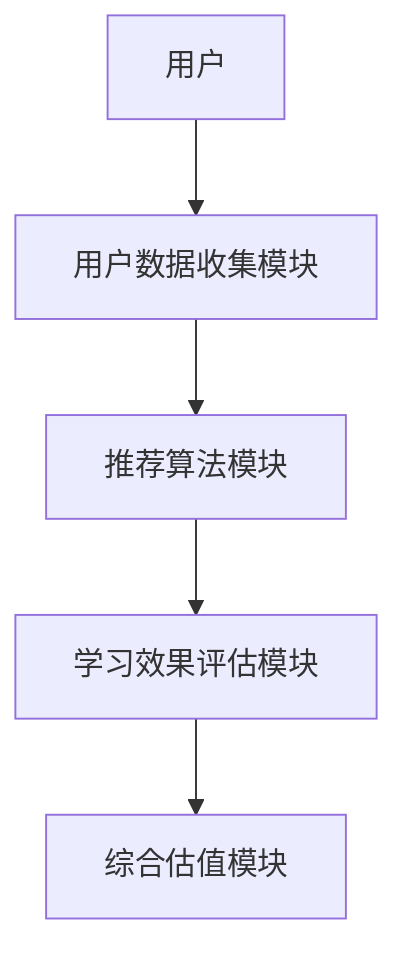

                 


好的，我明白您的需求。以下是我为您撰写的文章：

---

# 《企业估值中的AI驱动的个性化教育平台评估》

> **关键词**：企业估值、AI驱动、个性化教育、教育平台、算法原理、系统架构、项目实战  
>
> **摘要**：本文深入探讨了AI技术在个性化教育平台评估中的应用，结合企业估值的逻辑，分析了如何通过AI算法和系统架构设计实现精准评估。文章从背景、核心概念、算法原理、数学模型、系统架构、项目实战到小结，全面解析了AI驱动的个性化教育平台评估的核心内容，为读者提供了从理论到实践的完整指南。

---

## 第1章: 背景介绍与问题背景

### 1.1 问题背景

#### 1.1.1 传统企业估值的局限性
传统的企业估值方法依赖于财务指标（如收入、利润、现金流等）和市场分析，但这种方法难以全面捕捉个性化教育平台的独特价值。个性化教育平台的核心在于其用户数据和内容生成能力，而这些因素在传统估值中往往被忽视。

#### 1.1.2 个性化教育平台的独特性
个性化教育平台通过AI技术为用户提供定制化学习方案，这种模式不仅影响用户的学习效果，还可能改变企业的收入结构和成本模式。因此，评估这类平台需要考虑用户数据的价值、内容生成能力以及AI算法的优化潜力。

#### 1.1.3 AI技术在教育估值中的潜力
AI技术可以通过分析用户行为数据、学习效果和市场反馈，为个性化教育平台提供更精准的估值方法。例如，通过推荐算法优化课程匹配度，或通过深度学习模型预测用户流失率，从而帮助投资者更准确地评估平台的长期价值。

### 1.2 问题描述

个性化教育平台的估值需要解决以下关键问题：
1. 如何量化用户数据的价值？
2. 如何评估AI算法的优化潜力？
3. 如何将用户行为数据与财务指标结合，形成综合估值模型？

### 1.3 边界与外延

本文的研究范围限定在AI驱动的个性化教育平台，重点关注以下几个方面：
- 用户数据的收集与分析
- AI算法在课程推荐和学习效果评估中的应用
- 平台的长期价值预测

---

## 第2章: 核心概念与联系

### 2.1 核心概念原理

#### 2.1.1 个性化教育平台的特征分析
个性化教育平台的核心特征包括：
- **用户数据**：包括学习风格、学习进度、兴趣偏好等。
- **内容生成**：通过AI生成个性化课程内容。
- **交互反馈**：实时收集用户反馈以优化学习方案。

#### 2.1.2 AI驱动的教育评估模型
AI驱动的教育评估模型通过分析用户数据，生成个性化评估报告，帮助投资者评估平台的价值。

#### 2.1.3 企业估值的关键指标
个性化教育平台的估值指标包括：
- 用户留存率
- 课程完成率
- 付费用户转化率

### 2.2 核心概念对比表

以下对比表展示了个性化教育平台与传统教育平台在评估指标和AI技术应用上的差异：

| 比较维度         | 个性化教育平台               | 传统教育平台               |
|------------------|-------------------------------|-----------------------------|
| 评估指标         | 用户留存率、课程完成率、付费转化率 | 收入、利润、市场份额         |
| AI技术应用       | 推荐算法、深度学习模型         | 传统数据分析方法           |
| 优化目标         | 提高学习效果、降低用户流失率   | 降低成本、提高利润率         |

### 2.3 ER实体关系图

以下是一个简单的ER图，展示了个性化教育平台的核心实体关系：

```mermaid
erDiagram
    user {
        id
        name
        learning_style
        performance
    }
    course {
        id
        name
        difficulty_level
        content_type
    }
    platform {
        id
        name
        revenue
        user_count
    }
    user -> course : enrolls_in
    user -> platform : uses
    course -> platform : offered_on
```

---

## 第3章: 算法原理与实现

### 3.1 算法原理

#### 3.1.1 基于协同过滤的推荐算法

协同过滤是一种常用的推荐算法，其核心思想是通过分析用户行为数据，找到相似用户的偏好，从而推荐相关内容。

**算法步骤**：
1. 收集用户行为数据（如点击、收藏、购买）。
2. 计算用户之间的相似度（如余弦相似度）。
3. 根据相似用户的偏好，推荐相关内容。

**代码示例**：

```python
import numpy as np

# 用户行为数据矩阵
user_matrix = np.array([[4, 3, 2], [5, 1, 3], [2, 4, 5]])

# 计算余弦相似度
def cosine_similarity(matrix):
    row_sums = np.sqrt(matrix.sum(axis=1))
    return np.dot(matrix, matrix.T) / row_sums / row_sums.T

similarity_matrix = cosine_similarity(user_matrix)
print(similarity_matrix)
```

#### 3.1.2 基于深度学习的模型训练

深度学习模型（如神经网络）可以通过学习用户行为数据，生成更精准的推荐结果。

**模型结构**：
- 输入层：用户行为数据。
- 隐藏层：提取特征。
- 输出层：推荐结果。

**代码示例**：

```python
import tensorflow as tf

# 构建模型
model = tf.keras.Sequential([
    tf.keras.layers.Dense(64, activation='relu'),
    tf.keras.layers.Dense(1, activation='sigmoid')
])

# 编译模型
model.compile(optimizer='adam', loss='binary_crossentropy', metrics=['accuracy'])
```

#### 3.1.3 混合推荐算法

混合推荐算法结合了协同过滤和深度学习的优势，通常可以提高推荐的准确性和多样性。

---

## 第4章: 数学模型与公式

### 4.1 用户行为分析模型

用户行为分析模型可以通过以下公式计算用户活跃度：

$$活跃度 = \frac{\text{用户在平台上的总操作数}}{\text{平台总用户数}}$$

### 4.2 课程推荐模型

基于协同过滤的推荐模型可以通过以下公式计算相似度：

$$\text{相似度} = \frac{\sum_{i=1}^{n} x_i y_i}{\sqrt{\sum_{i=1}^{n} x_i^2} \cdot \sqrt{\sum_{i=1}^{n} y_i^2}}$$

---

## 第5章: 系统分析与架构设计

### 5.1 系统功能设计

个性化教育平台的系统功能模块包括：
- 用户数据收集模块
- 课程推荐模块
- 学习效果评估模块

### 5.2 系统架构设计

以下是一个简单的系统架构图：



### 5.3 系统接口设计

系统接口设计包括：
- 用户数据接口：用于收集用户行为数据。
- 课程推荐接口：用于返回推荐结果。
- 估值接口：用于返回平台综合估值。

---

## 第6章: 项目实战与案例分析

### 6.1 环境配置

需要安装以下工具：
- Python
- TensorFlow
- Pandas
- Matplotlib

### 6.2 核心代码实现

以下是一个简单的推荐算法实现：

```python
import pandas as pd
from sklearn.metrics.pairwise import cosine_similarity

# 数据加载
data = pd.DataFrame({
    'user': [1, 2, 3],
    'course': [1, 2, 3],
    'rating': [4, 3, 5]
})

# 计算相似度
similarity_matrix = cosine_similarity(data['rating'].values.reshape(-1, 1))

print(similarity_matrix)
```

### 6.3 案例分析

以某个性化教育平台为例，分析其估值过程：

1. 收集用户行为数据。
2. 通过推荐算法生成个性化课程方案。
3. 评估学习效果，调整估值模型。

---

## 第7章: 最佳实践与小结

### 7.1 最佳实践

- 数据质量是关键：确保用户数据的完整性和准确性。
- 模型优化：定期更新模型参数，提高推荐精准度。
- 交叉验证：通过A/B测试验证模型效果。

### 7.2 小结

本文详细探讨了AI技术在个性化教育平台评估中的应用，从背景、核心概念、算法原理到系统架构和项目实战，为读者提供了全面的解析。通过AI技术，我们可以更精准地评估个性化教育平台的价值，为投资者提供科学的决策依据。

### 7.3 注意事项

- 数据隐私保护：在收集和使用用户数据时，需遵守相关法律法规。
- 模型解释性：确保模型的可解释性，避免“黑箱”问题。

### 7.4 拓展阅读

- 《Deep Learning for recommender systems》
- 《Personalized education and AI technology》

---

希望这篇文章能够为您提供有价值的参考！如果需要进一步调整或补充，请随时告诉我。

