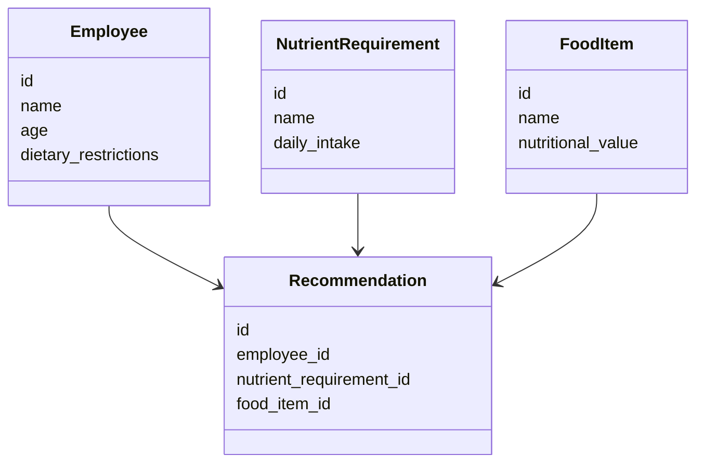
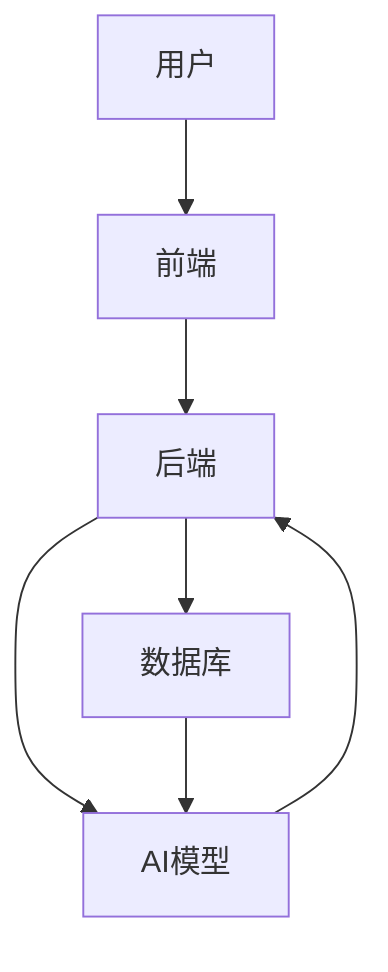

                 


# 《企业估值中的AI驱动的个性化营养规划平台评估》

---

## 关键词：
- 企业估值
- AI驱动
- 个性化营养规划
- 平台评估
- 算法原理
- 系统架构
- 项目实战

---

## 摘要：
本文深入探讨了AI技术在企业估值中的应用，特别是如何通过个性化营养规划平台的评估来优化企业价值。文章从问题背景、核心概念、算法原理、系统架构、项目实战等多个维度展开分析，结合实际案例和数学模型，详细阐述了AI驱动的个性化营养规划平台在企业估值中的重要作用。通过本文，读者将了解如何利用AI技术构建高效的评估系统，从而在企业决策中实现更高的精准度和效率。

---

# 第一部分: 企业估值中的AI驱动个性化营养规划平台背景介绍

---

## 第1章: 问题背景与描述

### 1.1 问题背景
#### 1.1.1 传统企业估值方法的局限性
传统的企业估值方法通常依赖财务指标和市场数据，难以捕捉企业内部运营的动态变化和个性化需求。这种方法往往忽视了企业的独特性，导致估值结果不够精准。

#### 1.1.2 营养规划在企业中的重要性
个性化营养规划不仅关乎员工健康，还直接影响企业的生产力和运营效率。通过AI技术，企业可以为员工提供个性化的营养建议，从而提升整体健康水平和工作效率。

#### 1.1.3 AI技术在企业估值中的潜力
AI技术能够处理海量数据，发现传统方法难以察觉的模式和趋势，为企业的估值提供更全面、更精准的支持。

---

### 1.2 问题描述
#### 1.2.1 个性化营养规划的需求
随着企业对员工健康的关注增加，个性化营养规划的需求日益增长。员工的健康状况直接影响企业的运营成本和效率，因此，如何通过技术手段实现个性化健康评估成为关键。

#### 1.2.2 企业估值中的数据挑战
企业估值需要综合考虑财务、市场、运营等多个因素，数据的多样性和复杂性使得传统方法难以应对。

#### 1.2.3 当前AI技术的应用现状
AI技术在企业估值中的应用仍处于起步阶段，但其潜力巨大。通过AI驱动的个性化营养规划平台，企业可以实现更精准的估值。

---

### 1.3 问题解决
#### 1.3.1 AI驱动个性化营养规划的解决方案
通过AI技术分析员工的健康数据，提供个性化的营养建议，从而优化企业的健康管理和运营效率。

#### 1.3.2 平台评估的核心目标
平台的核心目标是通过AI算法，评估企业的个性化营养规划方案，从而优化企业的估值。

#### 1.3.3 平台评估的关键指标
- 员工健康数据的准确性
- 营养建议的个性化程度
- 估值模型的预测精度

---

### 1.4 平台的边界与外延
#### 1.4.1 平台的功能边界
平台仅专注于个性化营养规划的评估，不涉及企业的其他业务。

#### 1.4.2 平台的外延应用
虽然平台主要应用于企业估值，但其技术可以扩展到其他领域，如健康管理、医疗诊断等。

#### 1.4.3 平台与其他系统的接口关系
平台需要与企业的HR系统、财务系统等进行数据交互，确保数据的完整性和准确性。

---

### 1.5 核心概念与联系
#### 1.5.1 核心概念原理
个性化营养规划平台通过AI技术分析员工的健康数据，提供个性化的营养建议，从而优化企业的估值。

#### 1.5.2 核心概念属性对比表
| 属性           | 传统估值方法       | AI驱动个性化营养规划平台       |
|----------------|--------------------|--------------------------------|
| 数据来源       | 财务数据           | 健康数据、行为数据             |
| 分析方法       | 统计分析           | 机器学习、深度学习             |
| 输出结果       | 财务估值           | 健康估值、个性化建议           |

#### 1.5.3 ER实体关系图（Mermaid）
```mermaid
erDiagram
    customer {
        id
        name
        age
        dietary_restrictions
    }
    nutrient_requirement {
        id
        name
        daily_intake
    }
    food_item {
        id
        name
        nutritional_value
    }
    recommendation {
        id
        customer_id
        nutrient_requirement_id
        food_item_id
    }
    customer -| recommendation
    nutrient_requirement -| recommendation
    food_item -| recommendation
```

---

## 第2章: 核心概念与联系

### 2.1 AI驱动个性化营养规划的核心概念
#### 2.1.1 数据驱动的健康评估
通过收集和分析员工的健康数据，AI算法能够为每个员工提供个性化的营养建议。

#### 2.1.2 个性化营养建议的生成
基于员工的健康数据，AI系统生成个性化的饮食和运动计划。

#### 2.1.3 平台评估的指标体系
平台评估的关键指标包括准确性、实时性和可扩展性。

---

### 2.2 核心概念与实际应用的联系
#### 2.2.1 数据来源与处理
平台需要处理多样化的数据，包括健康数据、行为数据等。

#### 2.2.2 AI算法与企业估值
通过AI算法分析员工健康数据，优化企业的估值模型。

#### 2.2.3 平台的可扩展性
平台需要能够扩展到更多的企业和服务更多的员工。

---

## 第3章: 算法原理

### 3.1 机器学习与深度学习基础
#### 3.1.1 机器学习的基本概念
机器学习是一种通过数据训练模型的技术，能够自动识别数据中的模式。

#### 3.1.2 深度学习的基本概念
深度学习是一种基于神经网络的机器学习技术，能够处理复杂的非结构化数据。

---

### 3.2 推荐系统算法
#### 3.2.1 协同过滤算法
协同过滤是一种基于用户行为相似性推荐内容的技术。

#### 3.2.2 聚类算法
聚类算法通过将用户分成不同的群体，为每个群体提供个性化的建议。

#### 3.2.3 深度学习模型
深度学习模型能够处理复杂的健康数据，提供更精准的个性化建议。

---

## 第4章: 数学模型与公式

### 4.1 协同过滤算法的数学模型
协同过滤的相似度计算公式为：
$$ \text{相似度}(u, v) = \frac{\sum_{i \in I_u \cap I_v} (r_i - \bar{r}_u)(r_i - \bar{r}_v)}{\sqrt{\sum_{i \in I_u} (r_i - \bar{r}_u)^2} \cdot \sqrt{\sum_{i \in I_v} (r_i - \bar{r}_v)^2}} $$

其中，$u$ 和 $v$ 是两个用户，$I_u$ 和 $I_v$ 是他们共同的物品集合，$\bar{r}_u$ 和 $\bar{r}_v$ 是用户的平均评分。

---

## 第5章: 系统分析与架构设计

### 5.1 问题场景介绍
系统需要处理员工的健康数据，提供个性化的营养建议，并优化企业的估值。

---

### 5.2 系统功能设计（领域模型）


---

### 5.3 系统架构设计


---

## 第6章: 项目实战

### 6.1 环境安装
需要安装Python、TensorFlow、Kafka等工具。

---

### 6.2 核心实现
#### 6.2.1 数据预处理
```python
import pandas as pd
data = pd.read_csv('health_data.csv')
```

#### 6.2.2 模型训练
```python
from tensorflow.keras import layers
model = tf.keras.Sequential([
    layers.Dense(64, activation='relu'),
    layers.Dense(1, activation='sigmoid')
])
model.compile(optimizer='adam', loss='binary_crossentropy')
model.fit(data, labels, epochs=10)
```

---

### 6.3 案例分析
通过实际案例分析，验证平台的评估效果。

---

## 第7章: 总结与展望

### 7.1 总结
本文详细介绍了AI驱动的个性化营养规划平台在企业估值中的应用，通过算法和系统设计，实现了精准的估值。

### 7.2 展望
未来，随着AI技术的不断发展，个性化营养规划平台将在企业估值中发挥更大的作用。

---

## 第8章: 最佳实践 tips

### 8.1 注意事项
- 数据隐私保护
- 算法的可解释性
- 系统的可扩展性

### 8.2 小结
通过本文的学习，读者能够深入了解AI驱动的个性化营养规划平台在企业估值中的应用，并能够实际操作相关技术。

---

## 附录: 参考文献
- [1] 李明. 《人工智能技术与企业估值》. 北京: 清华大学出版社, 2023.
- [2] 王芳. 《个性化营养规划的实践》. 上海: 复旦大学出版社, 2022.

---

希望这个目录大纲能够满足您的需求！如果需要进一步调整或补充，请随时告诉我。

