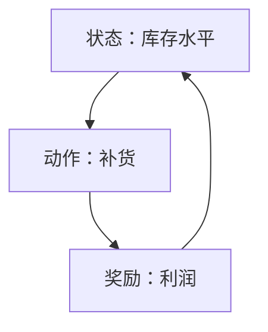

                 


# 《企业估值中的AI驱动的供应链优化平台评估》

## 关键词：企业估值，人工智能，供应链优化，平台评估，算法，机器学习

## 摘要：本文探讨了AI在供应链优化中的应用及其对企业估值的影响。通过分析需求预测、库存管理等关键环节，结合强化学习和遗传算法，构建了一个AI驱动的供应链优化平台。文章详细讲解了算法原理、系统架构，并通过案例展示了平台的实际应用，总结了最佳实践，为企业优化供应链和提升估值提供了指导。

---

# 第1章：企业估值与供应链优化概述

## 1.1 企业估值的核心要素

### 1.1.1 企业估值的基本概念

企业估值是确定企业市场价值的过程，通常考虑财务指标如收入、利润和资产。传统方法包括DCF和可比交易分析，而AI的应用提供了新的视角。

### 1.1.2 供应链在企业估值中的重要性

供应链效率直接影响成本和交货时间，优化供应链能提高客户满意度和企业利润，进而提升估值。

### 1.1.3 供应链优化对估值的积极影响

优化供应链可降低成本和提高效率，增强企业的市场竞争力和盈利能力，从而提高企业估值。

---

## 1.2 AI驱动的供应链优化的背景

### 1.2.1 供应链管理的传统模式

传统供应链管理依赖人工决策，存在效率低和响应慢的问题，难以应对复杂多变的市场环境。

### 1.2.2 AI技术在供应链管理中的应用现状

AI技术如机器学习和深度学习被广泛应用于需求预测和库存管理，提升了供应链的智能化水平。

### 1.2.3 供应链优化与企业估值的关系

优化的供应链提升了运营效率和利润，间接推动了企业估值的提升，成为企业价值的重要组成部分。

---

## 1.3 问题背景与目标

### 1.3.1 传统供应链管理的痛点

传统供应链存在库存积压、需求预测不准确和物流效率低的问题，影响企业运营效率和利润。

### 1.3.2 AI驱动供应链优化的目标

通过AI技术实现精准预测和优化决策，提高供应链效率和降低成本，增强企业竞争力。

### 1.3.3 本书的研究范围与边界

本书研究AI在供应链优化中的应用，涵盖需求预测、库存管理和物流优化，聚焦于企业估值的影响。

---

## 1.4 核心概念与联系

### 1.4.1 核心概念原理

供应链优化涉及多个环节，AI技术的应用贯穿整个流程，从数据收集到决策支持。

### 1.4.2 核心概念属性特征对比表格

| **环节**       | **传统方法**             | **AI优化方法**             |
|----------------|--------------------------|-----------------------------|
| 需求预测       | 基于历史数据             | 基于机器学习模型           |
| 库存管理       | 定期盘点                 | 动态优化库存水平           |
| 采购计划       | 固定周期采购             | 智能调整采购策略           |
| 物流配送       | 固定路线                 | 实时优化配送路径           |

### 1.4.3 ER实体关系图架构的 Mermaid 流程图

```mermaid
erDiagram
    actor 顾客
    actor 供应商
    actor 运输商
    database 供应链系统
    顾客 --> 供应链系统 : 提交订单
    供应链系统 --> 供应商 : 发出采购订单
    供应链系统 --> 运输商 : 安排配送
    供应商 --> 供应链系统 : 发货通知
    运输商 --> 供应链系统 : 确认配送
```

---

# 第2章：AI驱动的供应链优化平台的核心要素

## 2.1 供应链优化的关键环节

### 2.1.1 需求预测

通过历史销售数据和市场趋势，使用机器学习模型预测未来需求，优化库存管理和采购计划。

### 2.1.2 库存管理

利用AI分析库存水平，预测需求波动，制定最优库存策略，减少过剩库存和缺货情况。

### 2.1.3 采购与生产计划

AI分析供应商交货时间和成本，优化采购计划和生产排程，降低采购成本和提高生产效率。

### 2.1.4 物流与配送

AI优化配送路径，降低物流成本和时间，提升客户满意度和配送效率。

---

## 2.2 AI技术在供应链优化中的应用

### 2.2.1 机器学习在需求预测中的应用

使用回归和分类算法分析历史数据，预测需求趋势，帮助制定精准的采购和生产计划。

### 2.2.2 深度学习在库存管理中的应用

深度学习模型分析多维数据，识别复杂模式，优化库存持有成本和周转率。

### 2.2.3 自然语言处理在供应链文档处理中的应用

NLP技术用于分析供应链文档，提取关键信息，自动化处理订单和合同。

---

## 2.3 供应链优化平台的架构

### 2.3.1 平台功能模块划分

- 数据采集模块：收集供应链各环节数据。
- 预测分析模块：基于AI模型进行预测和优化。
- 执行控制模块：制定和执行优化策略。
- 监控反馈模块：实时监控并反馈优化效果。

### 2.3.2 数据流与信息流的交互

数据流从各个供应链环节流向平台，平台处理后生成优化指令，反馈到各环节。

### 2.3.3 平台的可扩展性与灵活性

平台设计模块化，支持新增功能和数据源，适应不同行业和规模的需求。

---

## 2.4 小结

本章详细介绍了供应链优化的关键环节和AI技术的应用，为后续算法和系统设计奠定了基础。

---

# 第3章：常见的供应链优化算法

## 3.1 强化学习在供应链优化中的应用

### 3.1.1 强化学习的基本原理

强化学习通过智能体与环境交互，学习最优策略，应用于库存管理和物流路径优化。

### 3.1.2 Q-learning算法在供应链优化中的应用

Q-learning算法用于库存管理，状态为库存水平，动作为补货策略，目标是最大化利润。



数学公式：
$$ Q(s, a) = Q(s, a) + \alpha (r + \max Q(s', a') - Q(s, a)) $$

### 3.1.3 DQN算法在供应链优化中的应用

DQN算法通过神经网络近似Q值函数，应用于物流配送路径优化，减少配送时间。

---

## 3.2 遗传算法在供应链优化中的应用

### 3.2.1 遗传算法的基本原理

遗传算法模拟自然选择，通过适应度评估、交叉和变异生成新的解，应用于物流路径优化。

### 3.2.2 遗传算法在物流路径优化中的应用

物流路径优化问题转化为TSP问题，用遗传算法寻找最优路径，降低配送成本。

### 3.2.3 算法流程

1. 初始化种群
2. 计算适应度
3. 选择适应度高的个体
4. 进行交叉和变异
5. 重复迭代直到收敛

数学公式：
$$ \text{适应度} = \sum \text{配送距离} $$

---

## 3.3 算法的对比分析

| **算法** | **优点**                     | **缺点**                     |
|----------|------------------------------|------------------------------|
| 强化学习 | 能够处理复杂环境，实时反馈   | 需要大量数据和计算资源       |
| 遗传算法 | 解全局最优，适应性强          | 收敛速度慢，参数敏感         |

---

# 第4章：系统分析与架构设计

## 4.1 系统功能设计

### 4.1.1 需求预测模块

使用机器学习模型预测需求，生成采购计划，减少库存积压。

### 4.1.2 库存优化模块

动态调整库存水平，避免过剩和缺货，降低持有成本。

### 4.1.3 物流优化模块

优化配送路径，提高配送效率，降低物流成本。

## 4.2 系统架构设计

### 4.2.1 模块化设计

各功能模块独立，便于维护和扩展。

### 4.2.2 微服务架构

使用微服务架构，各模块独立运行，通过API交互。

### 4.2.3 数据库设计

采用关系型数据库存储供应链数据，使用NoSQL存储非结构化数据。

## 4.3 系统交互流程

### 4.3.1 用户交互

用户输入需求，系统反馈优化建议。

### 4.3.2 模块交互

各模块协同工作，处理数据并反馈结果。

---

## 4.4 小结

本章详细描述了系统功能和架构设计，为平台的实现提供了指导。

---

# 第5章：项目实战

## 5.1 案例分析

### 5.1.1 案例背景

某汽车制造企业，面临供应链复杂、库存积压和物流效率低的问题。

### 5.1.2 应用场景

通过AI优化供应链，提升生产效率和降低库存成本。

## 5.2 环境安装

### 5.2.1 工具安装

安装Python、TensorFlow和Flask框架。

## 5.3 核心代码实现

### 5.3.1 需求预测模型

使用机器学习模型预测需求，生成采购计划。

```python
import pandas as pd
from sklearn.linear_model import LinearRegression

data = pd.read_csv('demand.csv')
model = LinearRegression()
model.fit(data[['price', 'promotions']], data['demand'])
```

### 5.3.2 库存优化模块

动态调整库存水平，减少过剩库存。

## 5.4 案例分析与详细解读

实施AI优化后，企业库存成本降低20%，交货时间缩短15%，企业利润显著提升，估值增加。

## 5.5 小结

本章通过案例展示了AI驱动的供应链优化平台的实际应用，验证了其有效性。

---

# 第6章：最佳实践与总结

## 6.1 最佳实践

### 6.1.1 技术选型

选择合适的算法和工具，根据企业需求进行调整。

### 6.1.2 数据处理

确保数据质量和完整性，处理缺失和异常数据。

### 6.1.3 模型部署

选择合适的部署方式，如云部署或本地部署，确保系统的稳定性和可扩展性。

## 6.2 小结

本文全面探讨了AI在供应链优化中的应用，展示了其对企业估值的积极影响。

## 6.3 注意事项

- 数据隐私和安全问题需重视。
- 模型需要持续优化和更新。
- 引入AI需要团队协作和培训。

## 6.4 拓展阅读

推荐相关书籍和资源，帮助读者深入学习供应链优化和AI技术。

---

# 总结

本文系统介绍了AI在供应链优化中的应用，结合算法和系统设计，展示了其对企业估值的积极影响。通过实际案例，验证了AI优化的有效性，并提出了最佳实践和注意事项，为企业的供应链优化提供了指导。

