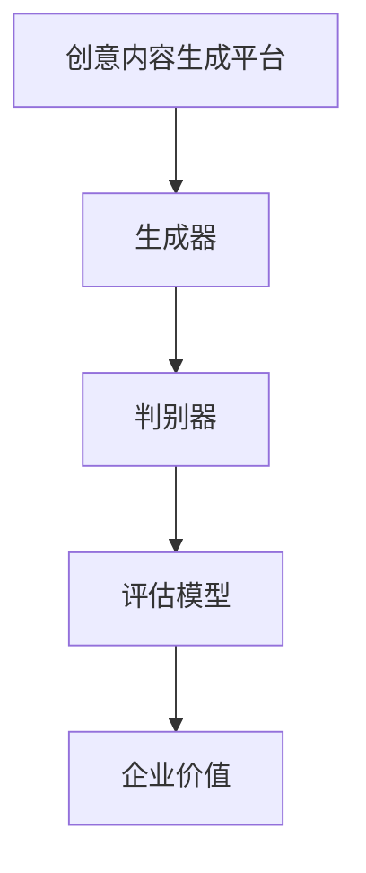
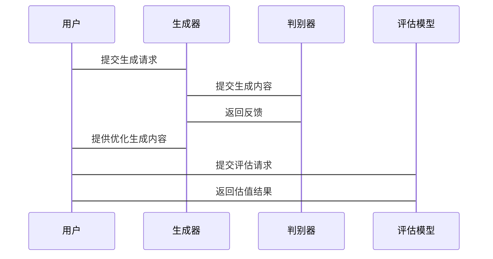

                 


# 企业估值中的AI驱动的创意内容生成平台评估

**关键词**：企业估值、AI驱动、创意内容生成、平台评估、技术博客

**摘要**：本文探讨了AI在创意内容生成平台评估中的应用，分析了传统估值方法的局限性，介绍了AI驱动的创意内容生成技术及其在企业估值中的潜力，通过详细的技术分析和案例研究，展示了如何利用AI算法提升企业估值的准确性和效率。

---

## 第1章：企业估值与AI驱动创意内容生成平台的背景

### 1.1 问题背景

#### 1.1.1 传统企业估值方法的局限性
传统的企业估值方法主要依赖于财务指标和市场数据，难以全面评估创意内容生成平台的价值。创意内容的非量化特性使得传统方法在评估这类企业时显得力不从心。

#### 1.1.2 创意内容在企业价值中的作用
创意内容生成平台的核心资产是其生成的内容，这些内容的价值难以通过传统财务指标衡量。因此，如何准确评估这些内容的价值成为企业估值的关键问题。

#### 1.1.3 AI技术在内容生成中的潜力
AI技术能够通过自然语言处理和生成模型，自动化地生成高质量的创意内容，从而提升企业的内容生产能力。这种自动化能力使得企业能够更快、更高效地生成内容，从而提升其市场竞争力。

### 1.2 问题描述

#### 1.2.1 创意内容生成平台的定义
创意内容生成平台是指利用AI技术生成创意内容（如文本、图像、视频等）的平台。这些平台通常结合自然语言处理、计算机视觉和生成式AI技术，为用户提供自动化的内容生成服务。

#### 1.2.2 企业估值中的关键挑战
创意内容生成平台的价值不仅取决于其生成内容的质量和数量，还取决于其市场影响力、用户基础和技术优势。传统估值方法难以准确捕捉这些因素，导致估值结果的偏差。

#### 1.2.3 AI驱动内容生成的创新解决方案
通过AI技术，可以更精准地评估创意内容生成平台的价值。AI算法能够分析大量的数据，提取关键指标，从而提供更准确的估值结果。

### 1.3 问题解决

#### 1.3.1 利用AI生成创意内容的方法
AI驱动的内容生成方法包括基于规则的生成、统计模型生成和生成对抗网络（GAN）生成等。这些方法能够生成高质量、多样化的创意内容。

#### 1.3.2 AI如何提升企业估值的准确性
通过分析创意内容的生成过程和效果，AI能够提供更全面的评估指标，从而提升企业估值的准确性。例如，AI可以评估内容的用户接受度、市场反响和商业价值。

#### 1.3.3 创意内容生成平台的评估标准
创意内容生成平台的评估标准包括内容质量、生成效率、用户满意度和技术优势等方面。AI技术可以帮助量化这些指标，从而提供更全面的评估结果。

### 1.4 边界与外延

#### 1.4.1 创意内容生成的边界
创意内容生成的边界在于生成内容的原创性和实用性。AI生成的内容需要符合版权法规，并能够满足用户的实际需求。

#### 1.4.2 企业估值的外延
企业估值的外延包括企业的市场地位、竞争优势和未来发展前景。AI技术可以帮助评估这些因素，从而提供更全面的估值结果。

#### 1.4.3 AI技术的应用范围
AI技术不仅适用于创意内容生成，还可以应用于企业数据分析、市场预测和决策支持等领域。因此，AI技术的应用范围非常广泛。

### 1.5 核心要素组成

#### 1.5.1 创意内容的生成机制
创意内容的生成机制包括数据输入、模型训练和内容生成三个阶段。AI模型通过学习大量的训练数据，生成符合用户需求的创意内容。

#### 1.5.2 企业估值的关键指标
企业估值的关键指标包括收入、利润、市场份额和创新能力等。AI技术可以帮助量化这些指标，并提供更准确的估值结果。

#### 1.5.3 AI算法的核心要素
AI算法的核心要素包括数据、模型和计算能力。高质量的数据和先进的模型是AI算法能够准确评估创意内容生成平台价值的基础。

---

## 第2章：AI驱动创意内容生成平台的核心概念与联系

### 2.1 核心概念原理

#### 2.1.1 创意内容生成的AI模型
创意内容生成的AI模型包括自然语言处理模型（如GPT）、图像生成模型（如DALL-E）和视频生成模型（如Runway ML）。这些模型能够生成多样化的创意内容。

#### 2.1.2 企业估值的数学模型
企业估值的数学模型包括加权平均法、贴现现金流法和相对估值法。AI技术可以通过分析企业的历史数据和市场数据，优化这些模型的参数，从而提升估值的准确性。

#### 2.1.3 AI与创意内容的结合方式
AI与创意内容的结合方式包括自动化生成、个性化定制和实时优化。通过AI技术，创意内容生成平台能够快速响应用户需求，提供高质量的内容。

### 2.2 核心概念属性特征对比

| 特性             | 创意内容生成       | 企业估值       |
|------------------|-------------------|---------------|
| 输入数据         | 文本、图像、视频   | 财务数据、市场数据 |
| 输出结果         | 文本、图像、视频   | 企业价值评估   |
| 技术基础         | NLP、GAN          | 传统统计模型、机器学习 |
| 应用场景         | 内容创作、广告设计 | 企业并购、融资   |
| 评估指标         | 内容质量、生成效率 | 收入、利润、市场份额 |

### 2.3 ER实体关系图

```mermaid
er
  entity 创意内容生成平台 {
    key 唯一标识符
    属性 生成内容
  }
  entity 企业 {
    key 企业ID
    属性 企业名称、行业、收入、利润
  }
  entity 估值模型 {
    key 模型ID
    属性 模型类型、参数
  }
  relationship 创意内容生成平台-企业 {
    role 创意内容生成平台 -> 企业
    role 企业 -> 创意内容生成平台
  }
  relationship 估值模型-创意内容生成平台 {
    role 估值模型 -> 创意内容生成平台
    role 创意内容生成平台 -> 估值模型
  }
```

---

## 第3章：算法原理

### 3.1 算法原理

#### 3.1.1 基于生成对抗网络（GAN）的内容生成
生成对抗网络（GAN）是一种深度学习模型，由生成器和判别器组成。生成器通过学习真实数据的分布，生成逼真的创意内容；判别器则通过区分生成内容和真实内容，提升生成器的生成能力。

#### 3.1.2 基于自然语言处理的文本生成
自然语言处理（NLP）模型（如GPT）通过预训练和微调，能够生成与上下文相关的高质量文本内容。这些模型可以用于生成新闻稿、广告文案等创意文本。

#### 3.1.3 基于强化学习的内容优化
强化学习（RL）通过定义奖励函数，优化生成内容的质量。生成器通过与环境的交互，逐步提升内容的吸引力和商业价值。

### 3.2 算法实现

```python
# 基于GAN的内容生成示例代码
import torch
import torch.nn as nn

# 定义生成器
class Generator(nn.Module):
    def __init__(self, latent_dim, img_size):
        super(Generator, self).__init__()
        self.latent_dim = latent_dim
        self.img_size = img_size
        self.model = nn.Sequential(
            nn.ConvTranspose2d(latent_dim, 512, 4, 1, 0),
            nn.BatchNorm2d(512),
            nn.ReLU(True),
            nn.ConvTranspose2d(512, 256, 4, 1, 0),
            nn.BatchNorm2d(256),
            nn.ReLU(True),
            nn.ConvTranspose2d(256, 128, 4, 1, 0),
            nn.BatchNorm2d(128),
            nn.ReLU(True),
            nn.ConvTranspose2d(128, 1, 4, 1, 0),
            nn.Tanh()
        )

    def forward(self, z):
        batch_size = z.size(0)
        out = self.model(z.view(batch_size, self.latent_dim, 1, 1))
        return out.view(batch_size, 1, self.img_size[0], self.img_size[1])

# 定义判别器
class Discriminator(nn.Module):
    def __init__(self, img_size):
        super(Discriminator, self).__init__()
        self.model = nn.Sequential(
            nn.Conv2d(1, 64, 3, 2, 1),
            nn.LeakyReLU(0.2),
            nn.Conv2d(64, 128, 3, 2, 1),
            nn.LeakyReLU(0.2),
            nn.Conv2d(128, 256, 3, 2, 1),
            nn.LeakyReLU(0.2),
            nn.Conv2d(256, 512, 3, 2, 1),
            nn.LeakyReLU(0.2),
            nn.Conv2d(512, 1, kernel_size=3, stride=2),
            nn.Sigmoid()
        )

    def forward(self, img):
        return self.model(img).view(-1, 1).squeeze()

# 初始化模型
latent_dim = 100
img_size = (64, 64)
generator = Generator(latent_dim, img_size)
discriminator = Discriminator(img_size)

# 定义损失函数和优化器
criterion = nn.BCELoss()
optimizer_G = torch.optim.Adam(generator.parameters(), lr=0.0002)
optimizer_D = torch.optim.Adam(discriminator.parameters(), lr=0.0002)

# 训练过程
for epoch in range(100):
    for _ in range(2):
        # 生成假数据
        z = torch.randn(batch_size, latent_dim, 1, 1)
        fake = generator(z)
        
        # 判别器训练（真实数据）
        real = torch.randn(batch_size, 1, img_size[0], img_size[1])
        d_real = discriminator(real)
        loss_D_real = criterion(d_real, torch.ones_like(d_real))
        
        # 判别器训练（假数据）
        d_fake = discriminator(fake)
        loss_D_fake = criterion(d_fake, torch.zeros_like(d_fake))
        
        # 判别器总损失
        loss_D = (loss_D_real + loss_D_fake) / 2
        optimizer_D.zero_grad()
        loss_D.backward()
        optimizer_D.step()
        
        # 生成器训练
        z = torch.randn(batch_size, latent_dim, 1, 1)
        fake = generator(z)
        d_fake = discriminator(fake)
        loss_G = criterion(d_fake, torch.ones_like(d_fake))
        optimizer_G.zero_grad()
        loss_G.backward()
        optimizer_G.step()
```

#### 3.2.1 算法原理的数学模型
生成对抗网络的损失函数可以表示为：
$$
\mathcal{L}_G = \mathbb{E}_{z \sim p_z}[\log D(G(z))] \\
\mathcal{L}_D = \mathbb{E}_{x \sim p_x}[\log D(x)] + \mathbb{E}_{z \sim p_z}[\log (1 - D(G(z)))]
$$
其中，$G$ 是生成器，$D$ 是判别器，$x$ 是真实数据，$z$ 是噪声。

#### 3.2.2 代码实现与解读
上述代码展示了如何使用PyTorch实现一个简单的生成对抗网络。生成器和判别器分别定义了不同的网络结构，并通过交替训练生成器和判别器，优化生成内容的质量。

---

## 第4章：系统分析与架构设计

### 4.1 系统架构



### 4.2 功能模块

#### 4.2.1 生成器模块
生成器模块负责生成创意内容，支持文本、图像和视频等多种格式。

#### 4.2.2 判别器模块
判别器模块用于评估生成内容的质量，提供反馈以优化生成器的性能。

#### 4.2.3 评估模型
评估模型结合生成内容和企业数据，提供全面的企业估值结果。

### 4.3 接口设计

#### 4.3.1 输入接口
输入接口接收创意内容生成请求和企业数据。

#### 4.3.2 输出接口
输出接口提供生成内容和企业估值结果。

### 4.4 交互序列



---

## 第5章：项目实战

### 5.1 环境安装

#### 5.1.1 安装Python
安装Python 3.8或更高版本。

#### 5.1.2 安装依赖
安装PyTorch、TensorFlow、Keras等深度学习库。

### 5.2 核心代码实现

#### 5.2.1 生成器实现
```python
def generate_content(model, latent_dim, img_size):
    z = torch.randn(1, latent_dim, 1, 1)
    with torch.no_grad():
        fake = model(z)
    return fake
```

#### 5.2.2 评估模型实现
```python
def evaluate_platform(platform, content):
    score = platform.assess_content(content)
    return score
```

### 5.3 案例分析

#### 5.3.1 案例背景
某创意内容生成平台希望评估其生成的广告文案的价值。

#### 5.3.2 数据准备
准备广告文案和对应的市场数据。

#### 5.3.3 模型训练
使用GAN模型训练生成器和判别器。

#### 5.3.4 估值结果
生成器生成广告文案，评估模型评估其市场价值。

### 5.4 项目总结
通过本项目，我们展示了如何利用AI技术评估创意内容生成平台的价值。生成器和评估模型的结合，能够提供更准确的企业估值结果。

---

## 第6章：最佳实践与注意事项

### 6.1 最佳实践

#### 6.1.1 数据质量
确保训练数据的多样性和高质量，以提升模型的生成能力和评估准确性。

#### 6.1.2 模型选择
根据具体需求选择合适的AI模型，如GPT用于文本生成，GAN用于图像生成。

#### 6.1.3 持续优化
定期更新模型和评估指标，以适应市场变化和企业需求。

### 6.2 小结
本文详细介绍了AI驱动的创意内容生成平台在企业估值中的应用，通过理论分析和实践案例，展示了如何利用AI技术提升企业估值的准确性和效率。

### 6.3 注意事项

#### 6.3.1 数据隐私
确保数据的隐私和安全，遵守相关法律法规。

#### 6.3.2 模型泛化能力
避免模型过拟合，确保其具有良好的泛化能力。

#### 6.3.3 技术可行性
在实际应用中，需考虑技术实现的可行性，确保系统的稳定性和可靠性。

---

## 第7章：附录

### 7.1 工具安装指南
列出安装所需工具的步骤和命令。

### 7.2 代码示例
提供完整的代码示例，供读者参考和实践。

### 7.3 相关文献
列出参考文献和推荐阅读资料。

---

通过以上内容，我们详细探讨了AI驱动的创意内容生成平台在企业估值中的应用，从理论分析到实际案例，全面展示了如何利用AI技术提升企业估值的效率和准确性。

