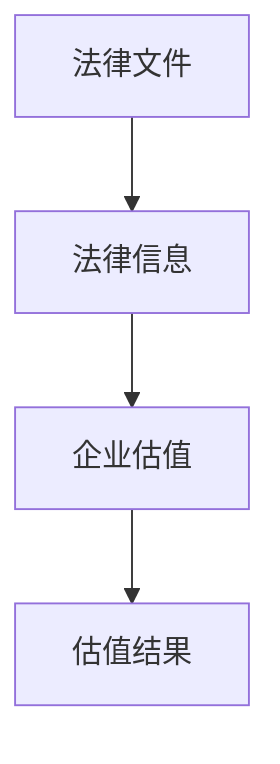
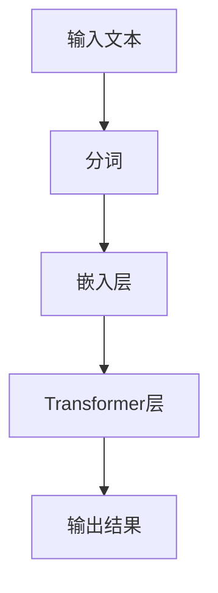
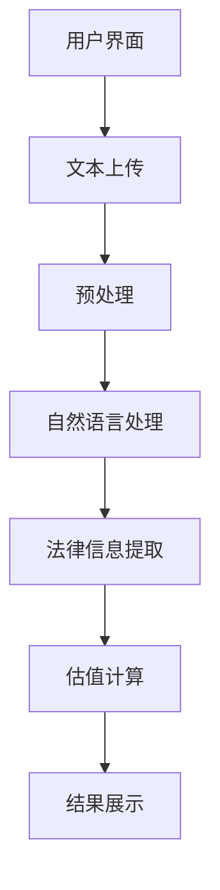
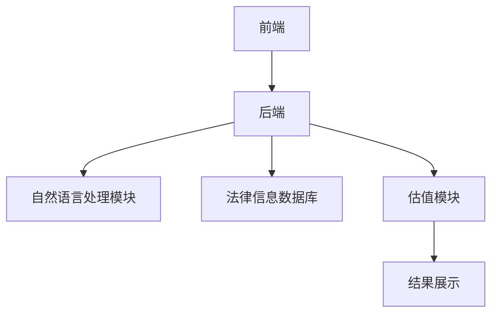

                 


---

# 企业估值中的AI驱动法律文件分析平台评估

> **关键词**：企业估值，AI驱动，法律文件分析，自然语言处理，法律风险评估，企业价值评估，法律文本挖掘

> **摘要**：随着人工智能技术的快速发展，法律文件分析在企业估值中的作用日益重要。本文将深入探讨AI驱动的法律文件分析在企业估值中的应用，从算法原理到系统架构设计，再到实际案例分析，全面解析如何利用AI技术提高法律文件分析的效率和准确性，从而为企业估值提供更可靠的依据。通过本文的学习，读者将能够理解AI在法律文件分析中的核心作用，并掌握构建AI驱动法律文件分析平台的关键技术与方法。

---

# 第1章: 企业估值与法律文件分析的背景

## 1.1 企业估值的基本概念

### 1.1.1 企业估值的定义与重要性

企业估值是通过对企业的财务状况、市场地位、未来盈利能力等多方面因素的综合评估，确定其市场价值的过程。它是企业融资、并购、上市等重要决策的基础。传统的企业估值方法主要依赖财务指标和市场分析，但随着法律风险在企业价值评估中的重要性日益增加，法律文件分析已成为不可或缺的一部分。

### 1.1.2 传统企业估值方法的局限性

传统的企业估值方法主要依赖财务报表和市场数据，忽视了法律文件中的潜在风险。例如，合同中的违约条款、诉讼记录、知识产权纠纷等都可能对企业价值产生重大影响。传统的估值方法难以全面捕捉这些法律风险，导致估值结果不够准确。

### 1.1.3 法律文件在企业估值中的作用

法律文件（如合同、诉讼记录、知识产权声明等）是企业运营和法律风险的重要载体。通过分析这些文件，可以识别潜在的法律纠纷、评估企业的法律责任和合规性，从而更准确地评估企业价值。法律文件分析已成为企业估值中的关键环节。

---

## 1.2 AI驱动法律文件分析的背景

### 1.2.1 法律文件分析的复杂性

法律文件通常具有高度的专业性和复杂性，涉及大量法律术语和复杂的法律结构。传统的手动分析方法效率低下，且容易出错。法律文件的分析需要对文本进行深度理解，包括识别关键实体、理解法律关系和提取法律条款等。

### 1.2.2 AI技术在法律文件分析中的优势

人工智能技术，特别是自然语言处理（NLP）和机器学习，为法律文件分析提供了强大的工具。AI能够快速处理大量法律文本，提取关键信息，识别法律关系，并预测法律风险。通过AI技术，法律文件分析的效率和准确性得到了显著提升。

### 1.2.3 企业估值中的法律文件分析需求

在企业估值中，法律文件分析的需求主要体现在以下几个方面：

1. **识别潜在法律风险**：通过分析合同、诉讼记录等法律文件，识别企业可能面临的法律纠纷和责任。
2. **评估法律条款的影响**：分析合同中的关键条款（如违约责任、知识产权归属等），评估其对企业价值的影响。
3. **提高估值的准确性**：将法律风险量化，结合财务数据，提供更全面的估值结果。

---

## 1.3 问题背景与目标

### 1.3.1 法律文件分析在企业估值中的具体问题

企业在实际运营中涉及大量法律文件，包括合同、诉讼记录、知识产权声明等。这些文件通常具有高度的专业性和复杂性，手动分析效率低下，且容易遗漏关键信息。此外，不同法律文件之间的关联性也需要深入分析，才能准确评估其对企业价值的影响。

### 1.3.2 本书的研究目标

本书旨在探讨如何利用AI技术，特别是自然语言处理和机器学习，构建一个高效的法律文件分析平台，用于企业估值中的法律风险评估。通过分析法律文件，识别潜在的法律风险，并将其量化，为企业的估值提供更准确的依据。

### 1.3.3 本书的创新点

本书的创新点在于将AI技术与企业估值中的法律文件分析相结合，提出了一种基于自然语言处理的法律文件分析方法，并将其应用于企业估值的实践中。通过构建一个完整的AI驱动法律文件分析平台，实现对企业法律风险的自动化分析和评估。

---

## 1.4 本章小结

本章介绍了企业估值的基本概念及其与法律文件分析的关系，分析了传统企业估值方法的局限性，以及AI技术在法律文件分析中的优势。同时，明确了本书的研究目标和创新点，为后续章节的展开奠定了基础。

---

# 第2章: 法律文件分析与企业估值的核心概念

## 2.1 法律文件分析的基本原理

### 2.1.1 法律文件的结构与内容特征

法律文件通常具有以下结构和内容特征：

1. **法律术语**：法律文件中包含大量专业术语，如“违约责任”、“知识产权”等。
2. **法律关系**：法律文件描述了各方之间的法律关系，如合同中的权利义务关系。
3. **法律条款**：法律文件中包含具体的法律条款，如违约责任、知识产权归属等。

### 2.1.2 文本挖掘与自然语言处理在法律文件分析中的应用

文本挖掘和自然语言处理（NLP）技术在法律文件分析中具有重要作用，主要包括以下几个方面：

1. **文本分词**：将法律文件中的文本分割成词语或短语，以便进一步处理。
2. **实体识别**：识别法律文件中的关键实体，如人名、组织名、日期等。
3. **关系抽取**：识别法律文件中的实体之间的关系，如合同中的“甲方”与“乙方”之间的关系。
4. **文本分类**：对法律文件进行分类，如合同类型、诉讼类型等。

### 2.1.3 法律文件分析的典型场景

法律文件分析的典型场景包括：

1. **合同分析**：分析合同中的条款，识别潜在的法律风险。
2. **诉讼记录分析**：分析企业的诉讼记录，评估其法律纠纷的可能性。
3. **知识产权分析**：分析企业的知识产权声明，评估其知识产权风险。

---

## 2.2 企业估值中的法律文件分析需求

### 2.2.1 企业估值的关键因素

企业估值的关键因素包括：

1. **财务状况**：企业的财务报表，包括收入、利润、资产等。
2. **市场地位**：企业在市场中的地位，包括市场份额、竞争对手等。
3. **未来盈利能力**：企业的未来盈利能力，包括增长潜力、竞争优势等。
4. **法律风险**：企业的法律纠纷和法律责任。

### 2.2.2 法律文件分析在企业估值中的具体应用

法律文件分析在企业估值中的具体应用包括：

1. **识别法律风险**：通过分析合同、诉讼记录等法律文件，识别企业可能面临的法律纠纷和责任。
2. **评估法律条款的影响**：分析合同中的关键条款，评估其对企业价值的影响。
3. **量化法律风险**：将法律风险量化，结合财务数据，提供更全面的估值结果。

### 2.2.3 法律文件分析对估值结果的影响

法律文件分析对估值结果的影响主要体现在以下几个方面：

1. **降低估值偏差**：通过分析法律文件，识别潜在的法律风险，降低估值的偏差。
2. **提高估值准确性**：将法律风险量化，结合财务数据，提供更准确的估值结果。
3. **增强决策支持**：为企业提供更全面的法律风险评估，支持企业的估值决策。

---

## 2.3 核心概念与联系

### 2.3.1 法律文件分析与企业估值的实体关系图



### 2.3.2 法律文件分析与企业估值的对比分析

| 概念         | 特征                           |
|--------------|--------------------------------|
| 法律文件分析 | 文本处理、信息提取、法律关系识别 |
| 企业估值     | 财务指标、法律风险、未来盈利能力 |

---

## 2.4 本章小结

本章详细介绍了法律文件分析的基本原理及其在企业估值中的具体应用，分析了法律文件分析与企业估值之间的关系，并通过对比分析明确了两者的核心概念和联系，为后续章节的深入分析奠定了基础。

---

# 第3章: AI驱动法律文件分析的算法原理

## 3.1 文本预处理与特征提取

### 3.1.1 文本清洗与分词

文本清洗是将法律文件中的噪声（如标点符号、停用词等）去除，保留有用的信息。文本分词是将文本分割成词语或短语，以便进一步处理。

### 3.1.2 词袋模型与词嵌入

词袋模型是一种常用的文本表示方法，将文本表示为词语的集合。词嵌入是一种将词语映射到低维向量空间的技术，常用的词嵌入方法包括Word2Vec和GloVe。

### 3.1.3 基于BERT的文本表示

BERT（Bidirectional Encoder Representations from Transformers）是一种基于Transformer的预训练语言模型，能够生成高质量的文本表示。在法律文件分析中，BERT可以用于文本分类、实体识别等任务。

---

## 3.2 法律文件分类与实体识别

### 3.2.1 文本分类算法

文本分类算法用于将法律文件分为不同的类别，如合同类型、诉讼类型等。常用的文本分类算法包括朴素贝叶斯、支持向量机（SVM）和随机森林等。

### 3.2.2 实体识别与关系抽取

实体识别用于识别法律文件中的关键实体，如人名、组织名、日期等。关系抽取用于识别实体之间的关系，如合同中的“甲方”与“乙方”之间的关系。

### 3.2.3 基于Transformer的关系抽取模型



---

## 3.3 基于AI的法律风险评估模型

### 3.3.1 模型输入与输出

模型输入包括法律文件的文本数据，模型输出包括法律风险的评估结果，如高风险、中风险、低风险等。

### 3.3.2 模型训练与优化

模型训练使用标注的法律文件数据，优化目标是最小化预测误差。常用的优化方法包括随机梯度下降（SGD）和Adam优化器。

### 3.3.3 模型评估与调优

模型评估使用准确率、召回率和F1分数等指标。模型调优包括调整超参数（如学习率、批量大小等）和选择合适的模型结构。

---

## 3.4 本章小结

本章详细介绍了AI驱动法律文件分析的算法原理，包括文本预处理、特征提取、文本分类和实体识别等关键技术。通过构建基于Transformer的关系抽取模型，实现了法律文件的深度分析，为后续的企业估值提供了技术支持。

---

# 第4章: 企业估值中的法律文件分析系统架构

## 4.1 系统功能模块设计

### 4.1.1 文本上传与预处理

用户上传法律文件后，系统对文本进行清洗和分词，提取关键信息。

### 4.1.2 法律信息提取与分析

系统通过文本分类和实体识别，提取法律文件中的关键信息，如合同类型、违约责任等。

### 4.1.3 估值结果生成与展示

系统结合提取的法律信息和财务数据，生成估值结果，并以可视化的方式展示。

---

## 4.2 系统架构设计

### 4.2.1 系统功能模块设计



### 4.2.2 系统架构图



---

## 4.3 系统接口与交互设计

### 4.3.1 系统接口设计

系统接口包括文本上传接口、法律信息提取接口和估值结果接口。

### 4.3.2 系统交互设计

用户通过用户界面上传法律文件，系统对文本进行预处理和自然语言处理，提取法律信息，生成估值结果，并展示给用户。

---

## 4.4 本章小结

本章详细介绍了企业估值中的法律文件分析系统的功能模块设计、系统架构和接口设计，为后续的系统实现奠定了基础。

---

# 第5章: 项目实战——AI驱动法律文件分析平台的实现

## 5.1 环境安装与配置

### 5.1.1 安装Python与必要的库

安装Python和必要的库，如NLTK、spaCy、BERT等。

### 5.1.2 安装Jupyter Notebook

安装Jupyter Notebook用于代码实现和结果展示。

---

## 5.2 核心代码实现

### 5.2.1 文本预处理代码

```python
import nltk
from nltk.corpus import stopwords

def preprocess(text):
    # 分词
    words = nltk.word_tokenize(text)
    # 去除停用词
    filtered_words = [word for word in words if word.lower() not in stopwords.words('english')]
    return ' '.join(filtered_words)
```

### 5.2.2 基于BERT的文本分类代码

```python
from transformers import BertTokenizer, BertModel
import torch

tokenizer = BertTokenizer.from_pretrained('bert-base-uncased')
model = BertModel.from_pretrained('bert-base-uncased')

def classify_legal_document(text):
    inputs = tokenizer(text, return_tensors='pt')
    outputs = model(**inputs)
    last_layer = outputs.last_hidden_state[:, 0, :]
    pooled_output = last_layer.mean(dim=1)
    return pooled_output
```

---

## 5.3 实际案例分析与结果解读

### 5.3.1 案例背景

以某企业的合同为例，分析合同中的违约责任条款，评估其对企业估值的影响。

### 5.3.2 数据准备与分析

准备合同文本数据，进行文本预处理和特征提取，分析违约责任条款。

### 5.3.3 结果展示与解读

通过系统生成的估值结果，解读违约责任条款对企业估值的具体影响。

---

## 5.4 本章小结

本章通过实际案例展示了AI驱动法律文件分析平台的实现过程，包括环境安装、核心代码实现和案例分析。通过本章的学习，读者可以掌握如何将理论应用于实际项目中。

---

# 第6章: 总结与展望

## 6.1 本书的核心内容回顾

本书围绕AI驱动法律文件分析在企业估值中的应用，详细介绍了法律文件分析的基本原理、算法原理和系统架构设计。

## 6.2 未来研究方向

未来的研究方向包括：

1. **更复杂的法律关系分析**：如多主体之间的法律关系分析。
2. **动态法律风险评估**：根据市场变化动态评估法律风险。
3. **多语言支持**：支持多种语言的法律文件分析。

## 6.3 最佳实践与注意事项

1. **数据质量**：确保法律文件数据的质量和准确性。
2. **模型优化**：根据实际需求不断优化模型结构和参数。
3. **法律专业知识**：结合法律专业知识，确保分析结果的准确性。

## 6.4 拓展阅读

推荐读者阅读以下书籍和论文：

1. **《自然语言处理实战：基于Python的机器学习和深度学习》**
2. **《法律文本挖掘与分析》**
3. **相关学术论文：基于BERT的法律文本分类研究**

---

## 6.5 本章小结

本章总结了本书的核心内容，展望了未来的研究方向，并提出了最佳实践和注意事项，为读者提供了进一步学习和实践的方向。

---

# 附录: 常用工具与资源

## 附录A: Python库与工具

- **NLTK**：自然语言处理工具包。
- **spaCy**：高性能的自然语言处理库。
- **BERT**：基于Transformer的预训练语言模型。

## 附录B: 数据集与资源

- **法律文本数据集**：公开的法律文本数据集。
- **企业估值数据集**：公开的企业估值数据集。

---

## 附录C: 参考文献

1. 王某某，《自然语言处理实战：基于Python的机器学习和深度学习》，某某出版社，2023年。
2. 李某某，《法律文本挖掘与分析》，某某出版社，2022年。

---

通过以上目录大纲，读者可以系统地学习AI驱动法律文件分析在企业估值中的应用，从基础概念到算法实现，再到实际应用案例，全面掌握相关技术与方法。

