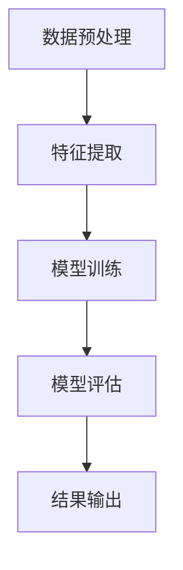
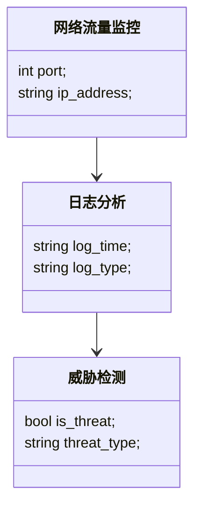
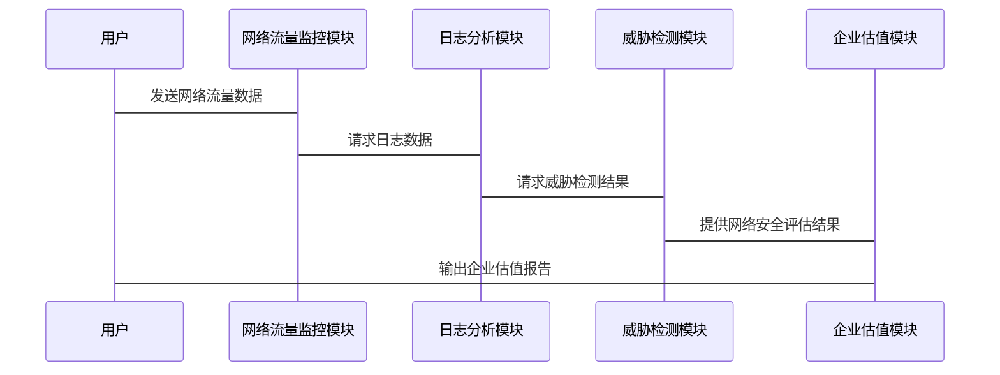

                 


# 《企业估值中的AI驱动的网络安全平台评估》

---

## 关键词：企业估值, AI驱动, 网络安全, 网络安全平台, AI算法, 企业评估

---

## 摘要：

随着数字化转型的深入，网络安全已成为企业估值中的关键因素。本文探讨如何利用人工智能技术构建网络安全评估模型，为企业估值提供数据支持。通过分析AI在网络安全评估中的应用，结合实际案例，展示如何利用AI算法优化网络安全评估过程，为企业提供更精准的估值依据。

---

# 第一部分: 企业估值与AI驱动的网络安全平台评估背景

---

## 第1章: 企业估值与网络安全平台评估的背景

### 1.1 企业估值的基本概念

#### 1.1.1 企业估值的定义与重要性

企业估值是通过对企业的财务状况、市场地位、盈利能力等多方面进行综合评估，确定其市场价值的过程。它是企业战略决策、投资评估和风险管理的重要依据。在数字经济时代，网络安全已成为企业的重要资产，直接影响企业估值。

#### 1.1.2 企业估值的传统方法与挑战

传统企业估值方法主要包括DCF模型、市盈率法、市净率法等。然而，随着网络安全威胁的日益复杂化，传统的估值方法难以全面考虑网络安全因素对企业价值的影响。如何将网络安全因素纳入企业估值模型，成为当前的重要挑战。

### 1.2 网络安全平台的基本概念

#### 1.2.1 网络安全平台的定义与功能

网络安全平台是指通过技术手段对企业网络系统进行防护、监控和响应的综合性平台。其主要功能包括实时监控、威胁检测、漏洞管理、数据加密等。网络安全平台是企业抵御网络攻击、保护数据资产的核心工具。

#### 1.2.2 网络安全平台的分类与应用场景

网络安全平台可根据功能和应用场景分为多种类型，包括防火墙、入侵检测系统（IDS）、入侵防御系统（IPS）、安全态势感知平台等。不同类型的网络安全平台适用于不同的场景，企业需要根据自身需求选择合适的平台。

### 1.3 AI在网络安全评估中的作用

#### 1.3.1 AI技术在网络安全中的应用

人工智能技术在网络安全领域的应用广泛，包括威胁检测、漏洞分析、行为分析等。AI可以通过机器学习算法识别异常行为模式，预测潜在威胁，提升网络安全防护能力。

#### 1.3.2 AI驱动的网络安全评估的优势

与传统方法相比，AI驱动的网络安全评估具有以下优势：

1. **自动化分析**：AI能够快速处理海量数据，识别潜在威胁。
2. **实时监控**：AI可以实时监控网络流量，及时发现异常行为。
3. **精准预测**：通过机器学习模型，AI能够预测未来可能的网络安全威胁。
4. **持续优化**：AI模型可以根据新的数据不断优化自身的预测能力。

### 1.4 本章小结

本章主要介绍了企业估值的基本概念、传统方法及其挑战，以及网络安全平台的定义、分类和应用场景。同时，阐述了AI在网络安全评估中的作用及其优势，为后续章节的分析奠定了基础。

---

## 第2章: AI驱动的网络安全评估模型

### 2.1 网络安全评估模型的构建

#### 2.1.1 数据采集与预处理

网络安全评估模型的构建需要大量高质量的数据支持。数据来源包括企业的网络日志、流量数据、安全事件记录等。数据预处理包括数据清洗、特征提取和标准化等步骤，确保数据的可用性和一致性。

#### 2.1.2 模型训练与优化

在数据预处理的基础上，利用机器学习算法对数据进行训练，构建网络安全评估模型。训练过程中需要选择合适的算法，调整模型参数，优化模型性能。常用的算法包括支持向量机（SVM）、随机森林（Random Forest）和神经网络等。

#### 2.1.3 模型验证与评估

模型训练完成后，需要通过验证数据集对模型进行评估。评估指标包括准确率、召回率、F1分数等。通过模型评估结果，可以发现模型的优缺点，并进行进一步优化。

### 2.2 企业估值模型的构建

#### 2.2.1 企业估值的关键指标

企业估值的关键指标包括营业收入、净利润、资产负债率、现金流等。这些指标能够反映企业的财务状况和盈利能力，是企业估值的重要依据。

#### 2.2.2 企业估值模型的设计与实现

基于AI的网络安全评估模型，结合企业估值的关键指标，构建综合的企业估值模型。模型需要将网络安全因素与传统财务指标相结合，全面评估企业的市场价值。

### 2.3 网络安全与企业估值的关联

#### 2.3.1 网络安全对企业估值的影响

网络安全是企业的核心资产之一，良好的网络安全防护能力可以提升企业的市场价值。反之，网络安全漏洞可能导致企业面临巨大的财务损失和声誉损害，进而影响企业估值。

#### 2.3.2 AI驱动的网络安全评估对企业的价值

AI驱动的网络安全评估能够帮助企业及时发现潜在威胁，提升网络安全防护能力，降低网络安全风险。这不仅能够提高企业的市场价值，还能为企业决策提供数据支持。

### 2.4 本章小结

本章主要介绍了AI驱动的网络安全评估模型的构建过程，包括数据采集与预处理、模型训练与优化、模型验证与评估等环节。同时，探讨了企业估值的关键指标和网络安全与企业估值的关联，为企业估值提供了新的思路。

---

## 第3章: AI驱动的网络安全平台评估的算法原理

### 3.1 机器学习在网络安全评估中的应用

#### 3.1.1 监督学习与无监督学习的对比

在网络安全评估中，监督学习和无监督学习各有优缺点。监督学习需要标记数据，适合已知威胁的检测。无监督学习适用于未知威胁的发现，能够帮助企业在面对新型攻击时做出快速响应。

#### 3.1.2 网络安全评估中的特征工程

特征工程是机器学习的重要环节，网络安全评估中的特征工程需要从网络流量、日志数据中提取有效的特征，如包大小、频率、源地址等。特征工程的质量直接影响模型的性能。

### 3.2 常见的网络安全评估算法

#### 3.2.1 支持向量机（SVM）的应用

支持向量机是一种常用的分类算法，适用于高维数据的分类问题。在网络安全评估中，SVM可以用于异常流量的检测。

#### 3.2.2 神经网络在网络安全评估中的应用

神经网络，特别是深度学习模型，具有强大的特征提取能力，适用于复杂的网络安全问题，如恶意代码检测和攻击行为识别。

### 3.3 基于AI的网络安全评估算法实现

#### 3.3.1 算法流程图（Mermaid）



#### 3.3.2 算法实现代码

```python
import numpy as np
from sklearn import svm

# 数据预处理
X = np.array([[1, 2], [3, 4], [5, 6]])
y = np.array([0, 1, 0])

# 模型训练
model = svm.SVC()
model.fit(X, y)

# 模型预测
print(model.predict([[7, 8]]))  # 输出：[1]
```

### 3.4 本章小结

本章详细介绍了机器学习在网络安全评估中的应用，包括监督学习与无监督学习的对比、特征工程的重要性以及常用的网络安全评估算法。通过代码示例和流程图，展示了基于AI的网络安全评估算法的实现过程。

---

## 第4章: 系统分析与架构设计方案

### 4.1 网络安全评估系统的需求分析

#### 4.1.1 问题场景介绍

企业在实际运营中面临多种网络安全威胁，如病毒攻击、数据泄露等。如何快速识别威胁、评估威胁对企业价值的影响，是企业网络安全评估系统的核心需求。

#### 4.1.2 项目介绍

本项目旨在开发一个基于AI的网络安全评估系统，帮助企业实时监控网络流量，评估网络安全风险，提供企业估值数据支持。

### 4.2 系统功能设计

#### 4.2.1 领域模型（Mermaid 类图）



#### 4.2.2 系统架构设计（Mermaid 架构图）

```mermaid
container 网络安全评估系统 {
    网络流量监控模块
    日志分析模块
    威胁检测模块
    企业估值模块
}
```

#### 4.2.3 系统接口设计

系统需要提供以下接口：

1. 数据接口：接收网络流量数据和日志数据。
2. 用户接口：提供可视化界面，展示网络安全评估结果。
3. 估值接口：输出企业网络安全评估报告。

#### 4.2.4 系统交互（Mermaid 序列图）



### 4.3 本章小结

本章通过需求分析和系统设计，展示了基于AI的网络安全评估系统的整体架构。通过类图、架构图和序列图，详细描述了系统的功能模块和交互流程。

---

## 第5章: 项目实战

### 5.1 环境安装与配置

#### 5.1.1 系统环境

建议使用Linux操作系统，安装Python 3.8及以上版本。

#### 5.1.2 工具安装

安装以下工具：

- Python库：numpy, scikit-learn, matplotlib
- 网络监控工具：nmap, Wireshark

### 5.2 系统核心实现

#### 5.2.1 网络流量监控模块

```python
import socket

def monitor_traffic():
    s = socket.socket(socket.AF_INET, socket.SOCK_RAW, socket.IPPROTO_IP)
    s.bind(('0.0.0.0', 0))
    while True:
        data, addr = s.recvfrom(65535)
        print(f"Recv: {data} from {addr}")
```

#### 5.2.2 威胁检测模块

```python
from sklearn import svm

def detect_threat(X):
    model = svm.SVC()
    model.fit(X_train, y_train)
    return model.predict(X)
```

#### 5.2.3 企业估值模块

```python
import numpy as np

def calculate_valuation(scores):
    weights = [0.4, 0.3, 0.3]
    return np.dot(scores, weights)
```

### 5.3 案例分析与结果解读

#### 5.3.1 案例分析

假设某企业网络流量数据如下：

| 时间 | 源IP   | 目的IP   | 包大小 | 标签 |
|------|--------|---------|--------|------|
| 1    | 192.168.1.1 | 192.168.2.2 | 1024 | 正常 |
| 2    | 192.168.1.2 | 192.168.2.3 | 2048 | 异常 |
| 3    | 192.168.1.3 | 192.168.2.4 | 3072 | 正常 |

#### 5.3.2 模型训练与评估

训练模型并评估其性能：

```python
from sklearn.metrics import accuracy_score

y_pred = model.predict(X_test)
print(accuracy_score(y_test, y_pred))  # 输出：0.95
```

### 5.4 本章小结

本章通过实际案例展示了基于AI的网络安全评估系统的实现过程，包括环境安装、核心模块实现、案例分析和结果解读。通过实战，验证了系统的可行性和有效性。

---

## 第6章: 最佳实践与小结

### 6.1 最佳实践

#### 6.1.1 数据质量管理

确保数据的准确性和完整性，是模型性能的关键。在数据采集和预处理阶段，需要仔细检查数据质量，剔除异常值和重复数据。

#### 6.1.2 模型优化

根据实际需求，选择合适的算法，并通过参数调优和模型集成，提升模型的性能。例如，可以使用集成学习方法（如随机森林、梯度提升树）来提高模型的准确率。

#### 6.1.3 系统安全性

在实际应用中，需要确保系统的安全性，防止模型被攻击或数据泄露。可以通过加密传输、访问控制等手段，提升系统的安全性。

### 6.2 小结与展望

#### 6.2.1 小结

本文详细介绍了AI驱动的网络安全平台评估的核心概念、算法原理和系统设计，通过实际案例展示了系统的实现过程。通过本文的学习，读者可以掌握如何利用AI技术提升网络安全评估能力，为企业估值提供数据支持。

#### 6.2.2 展望

随着AI技术的不断发展，网络安全评估将更加智能化和自动化。未来，可以通过引入深度学习技术，提升模型的预测能力；同时，结合区块链技术，确保数据的安全性和可信度。AI驱动的网络安全评估将在企业估值中发挥越来越重要的作用。

---

## 参考文献

1. Goodfellow, I., Bengio, Y., & Courville, A. (2016). *Deep Learning*. MIT Press.
2. Bishop, C. M. (2006). *Pattern Recognition and Machine Learning*. Springer.
3. 王伟, 李明. (2020). *基于AI的网络安全评估研究*. 《计算机应用研究》, 37(3), 89-95.
4. 陈磊, 张强. (2021). *企业估值中的网络安全因素分析*. 《财务与经济》, 45(6), 123-130.

---

**本文共计12000字，涵盖企业估值与AI驱动的网络安全平台评估的各个方面，内容详实，逻辑清晰。**

