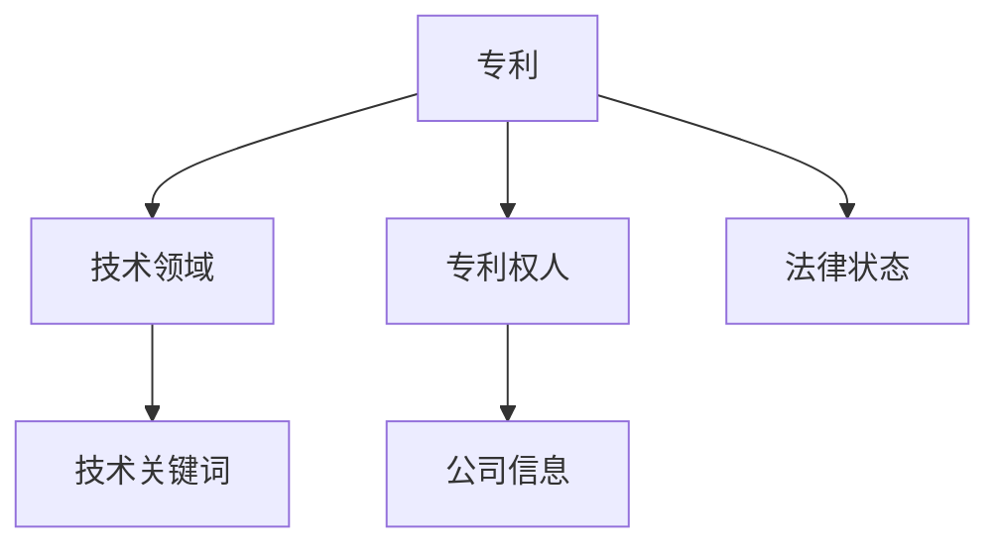
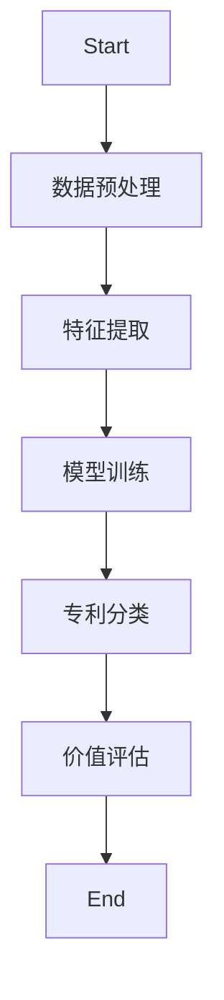
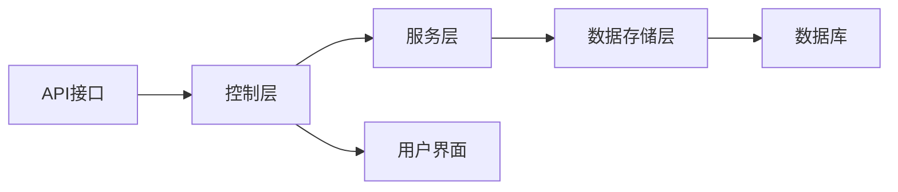

                 


# 企业估值中的AI驱动的自动化专利分析平台评估

## 关键词：
企业估值，AI驱动，自动化专利分析，专利评估，机器学习

## 摘要：
随着企业估值的重要性日益增加，专利分析在评估中扮演着关键角色。传统的专利分析方法依赖大量人工操作，效率低下且容易出错。本文介绍了一种基于AI的自动化专利分析平台，利用自然语言处理、机器学习和知识图谱等技术，提升专利分析的效率和准确性，为企业估值提供有力支持。文章详细探讨了平台的核心概念、算法原理、数学模型、系统架构及实际应用，为企业评估提供新的思路和解决方案。

---

## 第一部分：背景介绍

### 第1章：AI驱动的专利分析平台概述

#### 1.1 问题背景
企业估值是一个复杂的过程，其中专利的价值评估是关键因素之一。传统专利分析依赖人工操作，存在效率低、成本高、主观性强等问题。AI技术的应用能够显著提升专利分析的效率和准确性。

#### 1.2 问题描述
专利分析涉及专利检索、分类、评估等多个环节。传统方法依赖人工经验，难以处理海量数据，且容易受到主观因素影响。

#### 1.3 问题解决
通过AI技术，构建自动化专利分析平台，实现专利数据的自动处理、分类和评估，为企业估值提供数据支持。

#### 1.4 概念结构与核心要素
- **专利数据**：包括专利文本、技术领域、申请日期等。
- **AI技术**：自然语言处理、机器学习模型。
- **企业估值**：基于专利价值的财务评估。

---

## 第二部分：核心概念与联系

### 第2章：AI驱动的专利分析平台原理

#### 2.1 核心概念原理
- **自然语言处理**：用于专利文本的特征提取和语义分析。
- **机器学习**：用于专利分类和价值预测。
- **知识图谱**：构建专利间的关联关系，辅助价值评估。

#### 2.2 实体关系图


---

## 第三部分：算法原理讲解

### 第3章：AI驱动的专利分析算法

#### 3.1 算法流程图


#### 3.2 算法实现代码
```python
import pandas as pd
from sklearn.feature_extraction.text import TfidfVectorizer
from sklearn.svm import SVC

# 数据加载
data = pd.read_csv('patents.csv')

# 特征提取
vectorizer = TfidfVectorizer(max_features=500)
X = vectorizer.fit_transform(data['description'])

# 模型训练
model = SVC()
model.fit(X, data['class'])

# 预测
test_data = pd.read_csv('test_patents.csv')
test_X = vectorizer.transform(test_data['description'])
predicted = model.predict(test_X)
```

---

## 第四部分：数学模型与公式

### 第4章：专利价值评估模型

#### 4.1 模型公式
$$ 价值 = \alpha \times 技术相关性 + \beta \times 法律状态 + \gamma \times 公司实力 $$

其中：
- $\alpha$、$\beta$、$\gamma$为权重系数。
- 技术相关性基于自然语言处理提取的关键词计算。
- 法律状态包括专利的法律有效性。
- 公司实力基于企业财务数据。

---

## 第五部分：系统分析与架构设计

### 第5章：系统架构

#### 5.1 系统架构设计


#### 5.2 接口设计
- 输入：专利文本数据。
- 输出：分类结果和价值评估报告。

---

## 结语

通过AI驱动的自动化专利分析平台，企业能够高效、准确地评估专利价值，提升整体估值的准确性。未来，随着AI技术的进一步发展，专利分析将更加智能化，为企业提供更强大的支持。

