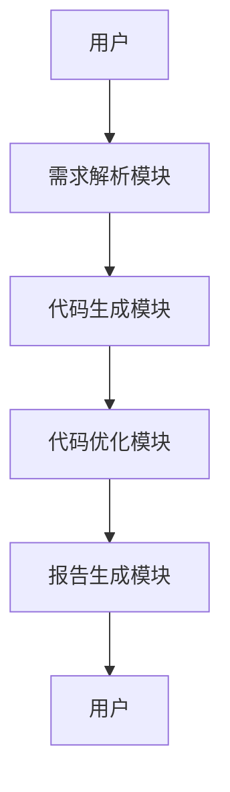

                 


# 企业估值中的AI驱动的自动化代码生成平台评估

> 关键词：企业估值、AI驱动、自动化代码生成平台、大模型技术、NLP、代码生成、自动化评估

> 摘要：本文将探讨AI驱动的自动化代码生成平台在企业估值中的应用与评估。通过分析代码生成技术的核心原理，结合自然语言处理和大模型技术，本文详细阐述了如何利用这些技术提升企业估值的效率与准确性。同时，本文还提供了系统的架构设计与实际项目案例，帮助读者理解AI驱动代码生成平台在企业估值中的实际应用与挑战。

---

# 第一部分: 企业估值与AI驱动代码生成平台的背景

## 第1章: 企业估值的基本概念

### 1.1 企业估值的定义与方法

企业估值是指对企业的整体价值进行评估的过程，通常用于投资决策、并购交易、融资等场景。常见的企业估值方法包括：

- **收益法**：基于企业的未来现金流折现。
- **市场法**：通过对比可比企业的市场价值进行评估。
- **资产法**：基于企业资产的账面价值进行评估。

传统的企业估值方法依赖大量人工计算和数据分析，耗时且容易出错。

### 1.2 传统企业估值的挑战

传统企业估值过程中存在以下主要挑战：

- 数据收集与处理复杂：需要整理企业财务数据、市场数据等多源数据。
- 计算繁琐：涉及复杂的财务模型构建与计算。
- 易出错：人工操作容易导致计算错误或模型假设偏差。

### 1.3 AI在企业估值中的潜力

AI技术，尤其是大模型技术，为解决上述挑战提供了新的可能性。AI可以通过自然语言处理技术快速提取企业相关信息，利用自动化代码生成技术快速构建估值模型，从而提高估值效率和准确性。

---

## 第2章: 自动化代码生成平台的定义与特点

### 2.1 自动化代码生成的定义

自动化代码生成是指通过算法自动生成符合特定需求的代码的过程。代码生成的核心是将需求转化为代码，减少人工编码的工作量。

### 2.2 自动化代码生成的核心技术

- **自然语言处理（NLP）**：将自然语言描述的需求转化为代码。
- **大模型技术**：利用预训练大模型生成高质量代码。
- **代码生成算法**：基于模型的生成算法，如Transformer架构。

### 2.3 自动化代码生成与企业估值的关系

在企业估值中，自动化代码生成可以用于快速构建财务模型、计算现金流折现等，显著提高估值效率。

---

## 第3章: AI驱动代码生成平台在企业估值中的应用

### 3.1 AI驱动代码生成的原理

AI驱动的代码生成基于大模型技术，通过以下步骤实现：

1. **需求输入**：用户提供企业估值的需求描述。
2. **需求解析**：NLP技术解析需求，提取关键信息。
3. **代码生成**：模型根据需求生成相应的代码。
4. **代码优化**：优化生成的代码，确保准确性。

### 3.2 代码生成在企业估值中的具体应用

- **财务模型构建**：自动生成企业估值所需的财务模型。
- **数据处理**：自动处理企业财务数据，减少人工操作。
- **报告生成**：自动生成估值报告。

### 3.3 AI驱动代码生成平台的优势与局限性

**优势**：
- 提高估值效率。
- 减少人工错误。
- 快速响应复杂需求。

**局限性**：
- 模型生成的代码可能需要人工校验。
- 对复杂需求的支持有限。

---

# 第二部分: AI驱动代码生成平台的核心原理

## 第4章: 自然语言处理与代码生成

### 4.1 自然语言处理技术

自然语言处理（NLP）技术是AI驱动代码生成的核心技术之一。通过NLP，模型可以理解用户的自然语言需求并生成相应的代码。

### 4.2 代码生成的算法原理

代码生成基于预训练大模型，通过以下步骤实现：

1. **模型训练**：利用大量代码数据训练模型。
2. **需求输入**：用户输入需求描述。
3. **生成代码**：模型根据需求生成代码。
4. **代码优化**：优化生成的代码，确保符合需求。

### 4.3 代码生成的数学模型

代码生成的数学模型基于Transformer架构，具体公式如下：

$$
\text{Output} = \text{Decoder}(X, \text{Mask})
$$

其中，$X$ 是输入序列，$\text{Mask}$ 是注意力掩码。

---

## 第5章: 代码生成平台的系统架构

### 5.1 系统架构设计

代码生成平台的系统架构包括以下几个模块：

- **需求解析模块**：解析用户的自然语言需求。
- **代码生成模块**：生成符合需求的代码。
- **代码优化模块**：优化生成的代码。
- **用户界面模块**：提供用户交互界面。

### 5.2 系统功能设计

- **需求输入**：用户输入企业估值的需求。
- **代码生成**：系统自动生成代码。
- **代码校验**：系统校验代码的正确性。
- **报告生成**：系统自动生成估值报告。

### 5.3 系统架构图



---

# 第三部分: 项目实战与应用

## 第6章: 环境搭建与代码实现

### 6.1 环境安装

- 安装Python：`python --version`
- 安装依赖库：`pip install transformers`

### 6.2 核心代码实现

```python
from transformers import AutoModelForCausalLM, AutoTokenizer

model_name = "codex"
tokenizer = AutoTokenizer.from_pretrained(model_name)
model = AutoModelForCausalLM.from_pretrained(model_name)

def generate_code(prompt):
    inputs = tokenizer(prompt, return_tensors="np")
    outputs = model.generate(inputs.input_ids, max_length=512)
    code = tokenizer.decode(outputs[0].tolist()[0])
    return code
```

### 6.3 代码应用解读

生成的代码可以用于企业估值中的财务模型构建，例如：

```python
import pandas as pd
import numpy as np

def calculate_wacc(revenue, cost, tax_rate):
    ebit = revenue - cost
    tax = ebit * tax_rate
    net_income = ebit - tax
    return net_income
```

### 6.4 实际案例分析

假设某企业年收入为1000万元，成本为600万元，税率为25%。代码生成如下：

```python
revenue = 10000000
cost = 6000000
tax_rate = 0.25

ebit = revenue - cost
tax = ebit * tax_rate
net_income = ebit - tax

print(f"Net Income: {net_income}")
```

### 6.5 项目小结

通过AI驱动的代码生成平台，企业可以快速构建财务模型，显著提高估值效率。

---

## 第7章: 总结与展望

### 7.1 总结

本文详细探讨了AI驱动的代码生成平台在企业估值中的应用，分析了其核心原理与系统架构，并通过实际案例展示了其优势与局限性。

### 7.2 展望

未来，随着大模型技术的不断进步，AI驱动的代码生成平台将在企业估值中发挥更大的作用，进一步提升估值效率与准确性。

---

## 第8章: 最佳实践与注意事项

### 8.1 最佳实践

- 在生成代码前，确保输入需求描述清晰准确。
- 对生成的代码进行人工校验，确保其正确性。
- 定期更新模型，以提高生成代码的质量。

### 8.2 注意事项

- 避免过度依赖生成代码，仍需结合人工分析。
- 注意数据隐私与安全问题。

---

## 第9章: 拓展阅读

- 推荐阅读《Large Language Models in Computer Vision》
- 推荐阅读《Code Generation with Pre-trained Language Models》

---

# 结语

通过本文的详细讲解，读者可以深入了解AI驱动的代码生成平台在企业估值中的应用与评估方法。希望本文能为相关领域的研究与实践提供有价值的参考。

