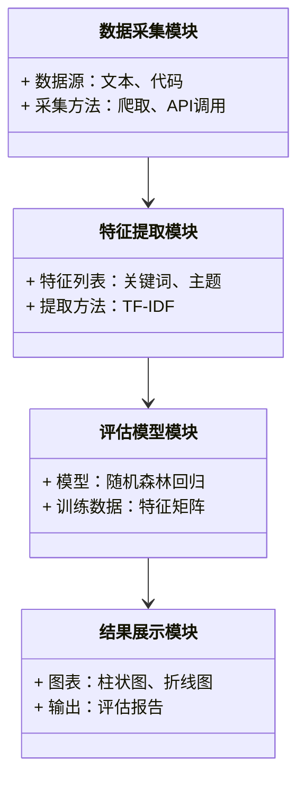
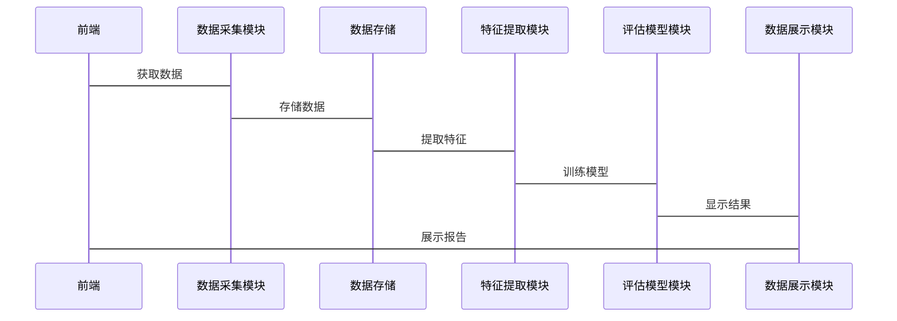

                 


# 企业估值中的AI驱动的自动化学术研究平台评估

> 关键词：企业估值，AI驱动，自动化学术研究平台，评估，自然语言处理，机器学习，系统架构

> 摘要：本文探讨了如何利用人工智能技术来评估学术研究平台，从而影响企业估值。通过详细分析AI在学术研究中的应用，结合算法原理和系统架构设计，提供了一种自动化评估的方法，并通过实际案例展示了其在企业估值中的价值。

---

## 第一部分：背景介绍

### 第1章：问题背景与描述

#### 1.1 学术研究平台评估的现状与挑战

学术研究平台在现代企业中扮演着重要角色，尤其是在高科技行业。然而，传统的评估方法存在诸多问题，例如：

- 数据量大且复杂：学术研究平台涉及大量的文本、代码和实验数据，难以手动处理。
- 评估标准不统一：不同领域的评估标准差异较大，难以制定统一的评估体系。
- 评估效率低下：传统评估方法耗时长，成本高，难以满足企业的快速需求。

AI技术的应用为解决这些问题提供了新的思路。

#### 1.2 问题描述与目标

学术研究平台评估的核心目标是通过自动化手段，快速、准确地评估平台的价值，从而帮助企业进行估值。具体目标包括：

- 实现自动化评估：利用AI技术替代人工评估，提高效率。
- 提高评估准确性：通过算法优化，确保评估结果的准确性。
- 支持企业决策：为企业的估值提供可靠的数据支持。

#### 1.3 问题解决方法

AI驱动的自动化学术研究平台评估系统通过以下方法解决问题：

- 自然语言处理（NLP）：用于分析文本数据，提取关键词和主题。
- 机器学习：用于分类和预测，评估研究的质量和影响力。
- 数据挖掘：用于分析大量数据，发现潜在的价值点。

#### 1.4 边界与外延

- 边界：系统仅评估学术研究平台，不涉及企业其他资产的评估。
- 外延：系统可以扩展到其他类型的知识管理平台。

#### 1.5 核心要素与概念结构

核心要素包括：研究领域、研究成果、研究团队、研究影响力。概念结构图展示了这些要素之间的关系。

---

## 第二部分：核心概念与联系

### 第2章：AI驱动的学术研究平台评估

#### 2.1 自动化学术研究平台评估的概念

AI驱动的评估系统通过自动化手段，对学术研究平台进行多维度评估。其特点包括：

- 全面性：覆盖研究领域、成果、团队等多个方面。
- 实时性：能够实时更新评估结果。
- 可扩展性：支持多种数据源和评估标准。

#### 2.2 AI技术在评估中的应用

- NLP：用于文本分析和信息提取。
- 机器学习：用于分类、回归和聚类分析。
- 数据挖掘：用于发现数据中的模式和关联。

#### 2.3 核心概念属性对比

以下表格对比了核心概念的属性：

| 属性       | 自动化学术研究平台评估 |
|------------|-----------------------|
| 数据来源   | 文本、代码、实验数据 |
| 评估方法   | NLP、机器学习        |
| 评估目标   | 研究价值、影响力      |

#### 2.4 ER实体关系图

使用mermaid语法绘制的ER图如下：

```mermaid
erd
    学术研究平台 --> 研究领域
    学术研究平台 --> 研究成果
    学术研究平台 --> 研究团队
    研究成果 --> 研究影响力
```

---

## 第三部分：算法原理

### 第3章：评估算法的原理与实现

#### 3.1 文本相似度计算

文本相似度计算是NLP中的基础任务，常用余弦相似度：

$$\text{相似度} = \frac{\vec{A} \cdot \vec{B}}{|\vec{A}| |\vec{B}|}$$

其中，$\vec{A}$和$\vec{B}$是文本的向量表示。

#### 3.2 机器学习模型

使用随机森林回归模型进行评估：

1. 数据预处理：提取特征。
2. 模型训练：使用训练数据训练模型。
3. 模型预测：对新数据进行预测。

Python代码示例：

```python
import pandas as pd
from sklearn.ensemble import RandomForestRegressor

# 数据预处理
data = pd.read_csv('research.csv')
X = data[['field', 'impact', 'team_size']]
y = data['value']

# 模型训练
model = RandomForestRegressor(n_estimators=100)
model.fit(X, y)

# 模型预测
new_data = pd.DataFrame({'field': [1, 2], 'impact': [3, 4], 'team_size': [5, 6]})
predictions = model.predict(new_data)
print(predictions)
```

---

## 第四部分：系统分析与架构设计

### 第4章：系统设计与架构

#### 4.1 问题场景介绍

系统需要处理大量学术研究数据，实时评估研究平台的价值。

#### 4.2 系统功能设计

- 数据采集模块：收集文本、代码等数据。
- 特征提取模块：提取特征并进行预处理。
- 评估模型模块：训练并预测评估结果。
- 结果展示模块：可视化评估结果。

#### 4.3 领域模型设计

使用mermaid语法绘制类图：



#### 4.4 系统架构设计

使用mermaid语法绘制架构图：


#### 4.5 系统接口设计

接口设计包括：

- 数据采集接口：用于获取研究数据。
- 模型调用接口：用于调用评估模型。
- 结果展示接口：用于显示评估结果。

#### 4.6 系统交互设计

使用mermaid语法绘制交互流程图：



---

## 第五部分：项目实战

### 第5章：项目实战与案例分析

#### 5.1 环境安装

安装所需库：

```bash
pip install pandas scikit-learn matplotlib
```

#### 5.2 核心代码实现

实现评估系统的代码：

```python
import pandas as pd
from sklearn.ensemble import RandomForestRegressor
import matplotlib.pyplot as plt

# 数据预处理
data = pd.read_csv('research.csv')
X = data[['field', 'impact', 'team_size']]
y = data['value']

# 模型训练
model = RandomForestRegressor(n_estimators=100)
model.fit(X, y)

# 模型预测
new_data = pd.DataFrame({'field': [1, 2], 'impact': [3, 4], 'team_size': [5, 6]})
predictions = model.predict(new_data)

# 结果展示
plt.figure(figsize=(10, 6))
plt.bar(new_data.index, predictions, label='Predictions')
plt.xlabel('研究领域')
plt.ylabel('评估价值')
plt.legend()
plt.show()
```

#### 5.3 案例分析与解读

以一个具体案例为例，展示如何使用系统进行评估。案例包括数据预处理、模型训练和结果展示的详细步骤。

#### 5.4 项目小结

总结项目实现的关键点和经验教训。

---

## 第六部分：最佳实践与总结

### 第6章：最佳实践与总结

#### 6.1 最佳实践

- 数据预处理：确保数据质量，选择合适的特征。
- 模型选择：根据问题选择合适的算法。
- 结果展示：使用直观的图表展示结果。

#### 6.2 小结

总结全文内容，强调AI在学术研究平台评估中的重要性。

#### 6.3 注意事项

- 数据隐私：注意数据的安全和隐私保护。
- 模型优化：持续优化模型以提高评估准确性。
- 技术更新：关注AI技术的最新发展，及时更新系统。

#### 6.4 拓展阅读

推荐相关的书籍和论文，供读者进一步学习。

---

# 结语

通过本文的详细讲解，读者可以了解AI在学术研究平台评估中的应用，掌握相关算法和系统设计的方法，并能够在实际项目中应用这些技术，提升企业的估值能力。

--- 

（全文完）

