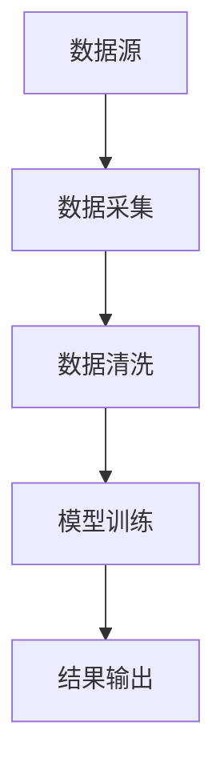
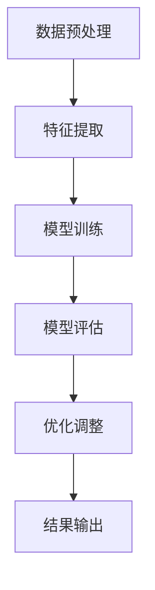
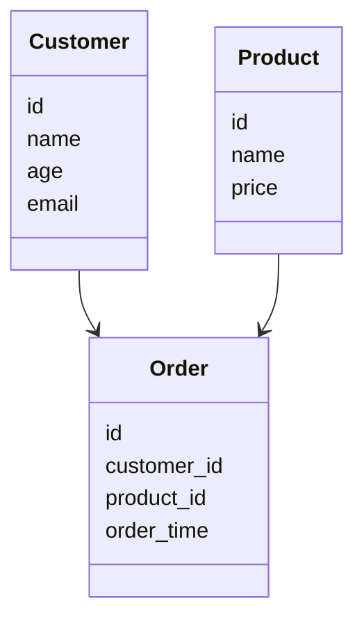

                 


# 企业估值中的AI驱动的自动化客户洞察平台评估

## 关键词：企业估值，AI驱动，客户洞察，自动化平台，机器学习，深度学习，数据挖掘

## 摘要：  
随着数字化转型的加速，企业估值日益依赖于对客户行为和市场趋势的深度洞察。传统的客户分析方法已难以满足现代企业的需求，而AI驱动的自动化客户洞察平台为企业提供了高效、精准的客户评估工具。本文深入探讨了如何利用AI技术构建自动化客户洞察平台，并通过具体案例展示了其在企业估值中的应用。通过分析不同算法的优劣，本文揭示了如何选择合适的AI模型以实现客户洞察的自动化评估，为企业提升估值效率和准确性提供了实用指导。

---

# 第1章: 企业估值与客户洞察平台概述

## 1.1 企业估值的背景与挑战

### 1.1.1 传统企业估值方法的局限性
- **问题背景**：传统的企业估值方法依赖于财务报表分析和历史数据，难以捕捉客户行为和市场动态的变化。
- **核心问题**：数据维度有限，难以反映客户的实时需求和市场趋势。
- **边界与外延**：本文仅关注企业内部客户数据的分析，不涉及外部市场宏观因素。
- **概念结构**：企业估值 = 财务数据 + 客户洞察 + 市场趋势。

### 1.1.2 数字化转型对企业估值的影响
- **数字化转型**：企业通过数据采集和分析技术，实现了客户行为的实时追踪。
- **技术驱动**：大数据和AI技术的应用，使得客户洞察成为企业估值的重要组成部分。

### 1.1.3 客户洞察在企业估值中的重要性
- **客户行为分析**：通过客户数据预测未来的消费行为和市场趋势。
- **客户价值评估**：通过客户细分和画像，识别高价值客户，优化资源配置。

## 1.2 AI驱动的客户洞察平台

### 1.2.1 客户洞察平台的定义与特点
- **定义**：客户洞察平台是利用大数据和AI技术，对客户行为、偏好和需求进行分析和预测的平台。
- **特点**：自动化、实时性、精准性。

### 1.2.2 AI在客户洞察中的应用
- **数据采集**：通过API和爬虫技术，实时采集客户数据。
- **数据处理**：使用数据清洗和特征工程技术，处理数据噪声和缺失值。

### 1.2.3 自动化客户洞察平台的评估价值
- **提升估值效率**：通过自动化分析减少人工干预，提高估值速度。
- **提高估值准确性**：利用AI算法优化模型，提升预测精度。

## 1.3 本章小结

---

# 第2章: 客户洞察平台的核心概念与AI模型

## 2.1 客户洞察平台的组成与功能

### 2.1.1 数据采集与处理模块
- **功能描述**：负责数据的采集、清洗和预处理。
- **技术实现**：使用Flask框架搭建API接口，结合数据清洗算法处理数据。

### 2.1.2 数据分析与建模模块
- **功能描述**：基于清洗后的数据，构建机器学习模型进行客户画像和行为预测。
- **技术实现**：使用Python的Scikit-learn库进行特征选择和模型训练。

### 2.1.3 结果可视化与报告生成模块
- **功能描述**：将模型输出结果可视化，并生成分析报告。
- **技术实现**：使用Matplotlib和Seaborn进行数据可视化，生成PDF报告。

## 2.2 AI驱动的评估模型

### 2.2.1 机器学习模型在客户洞察中的应用
- **逻辑回归**：用于分类客户群体。
- **随机森林**：用于特征重要性分析和客户细分。

### 2.2.2 深度学习模型的优势
- **神经网络**：用于复杂模式识别和非线性关系建模。
- **卷积神经网络（CNN）**：用于图像和文本数据的特征提取。

### 2.2.3 混合模型的适用场景
- **集成学习**：结合不同模型的优势，提升预测准确率。

## 2.3 客户洞察平台与AI模型的关系

### 2.3.1 数据流与模型交互
- **数据流图**：展示数据从采集到分析的流程。


### 2.3.2 实体关系图（ER图）展示
- **ER图**：展示客户、订单、产品之间的关系。
```mermaid
erd
table Customer {
  id: int
  name: string
  age: int
}
table Order {
  id: int
  customer_id: int
  product_id: int
  order_time: datetime
}
table Product {
  id: int
  name: string
  price: float
}
Customer.id --> Order.customer_id
Order.product_id --> Product.id
```

### 2.3.3 概念结构与核心要素
- **核心要素**：客户ID、订单时间、产品ID、客户特征。

## 2.4 本章小结

---

# 第3章: AI驱动的客户洞察平台评估算法原理

## 3.1 算法原理概述

### 3.1.1 机器学习模型的训练过程
- **训练目标**：最大化模型对训练数据的拟合程度。
- **优化目标函数**：最小化损失函数。
- **损失函数**：交叉熵损失函数。
$$ \text{损失函数} = -\frac{1}{N}\sum_{i=1}^{N} y_i \log(p_i) + (1-y_i)\log(1-p_i) $$

### 3.1.2 特征提取与降维方法
- **主成分分析（PCA）**：用于降维，减少特征数量。
- **特征选择**：基于模型重要性排序选择关键特征。

### 3.1.3 模型评估与优化策略
- **交叉验证**：K折交叉验证评估模型泛化能力。
- **超参数调优**：使用网格搜索优化模型参数。

## 3.2 算法流程图

### 3.2.1 机器学习模型训练流程


## 3.3 算法实现代码

### 3.3.1 数据预处理
```python
import pandas as pd
data = pd.read_csv('customer_data.csv')
data.dropna(inplace=True)
```

### 3.3.2 模型训练
```python
from sklearn.linear_model import LogisticRegression
model = LogisticRegression()
model.fit(X_train, y_train)
```

### 3.3.3 模型评估
```python
from sklearn.metrics import accuracy_score
print(accuracy_score(y_test, model.predict(X_test)))
```

## 3.4 本章小结

---

# 第4章: 系统分析与架构设计

## 4.1 问题场景介绍

### 4.1.1 系统应用场景
- **客户数据管理**：实时采集和管理客户数据。
- **客户行为分析**：分析客户的购买行为和偏好。

## 4.2 系统功能设计

### 4.2.1 领域模型设计


### 4.2.2 系统架构设计


### 4.2.3 接口设计
- **RESTful API**：提供数据采集和模型调用接口。
- **HTTP请求**：使用POST方法提交数据。

### 4.2.4 交互流程图
```mermaid
sequenceDiagram
客户发起请求 --> API Gateway
API Gateway --> 数据库查询
数据库返回数据 --> API Gateway
API Gateway --> 调用模型
模型返回结果 --> API Gateway
API Gateway --> 返回结果给客户
```

## 4.3 本章小结

---

# 第5章: 项目实战

## 5.1 环境安装

### 5.1.1 安装Python环境
- 使用Anaconda安装Python 3.8及以上版本。

### 5.1.2 安装依赖库
```bash
pip install numpy pandas scikit-learn matplotlib
```

## 5.2 系统核心实现源代码

### 5.2.1 数据预处理
```python
import pandas as pd
data = pd.read_csv('customer_data.csv')
data.dropna(inplace=True)
```

### 5.2.2 模型训练
```python
from sklearn.linear_model import LogisticRegression
model = LogisticRegression()
model.fit(X_train, y_train)
```

### 5.2.3 模型评估
```python
from sklearn.metrics import accuracy_score
print(accuracy_score(y_test, model.predict(X_test)))
```

## 5.3 代码应用解读与分析

### 5.3.1 代码实现细节
- 使用`scikit-learn`库中的`LogisticRegression`模型进行分类。
- 使用`KFold`进行交叉验证，确保模型的泛化能力。

### 5.3.2 案例分析
- **案例背景**：某电商平台的客户数据。
- **数据清洗**：处理缺失值和异常值。
- **特征工程**：提取客户年龄、购买频率等特征。
- **模型训练**：训练客户分类模型，预测客户价值。

## 5.4 本章小结

---

# 第6章: 总结与扩展

## 6.1 最佳实践 tips

### 6.1.1 数据质量
- 确保数据的完整性和准确性，避免噪声数据影响模型性能。

### 6.1.2 模型选择
- 根据具体问题选择合适的模型，避免过度复杂化。

### 6.1.3 模型调优
- 使用网格搜索和交叉验证优化模型参数，提升模型性能。

## 6.2 小结

### 6.2.1 核心内容回顾
- AI驱动的客户洞察平台在企业估值中的应用。
- 机器学习和深度学习模型的优劣分析。
- 系统设计和实现的具体步骤。

## 6.3 注意事项

### 6.3.1 数据隐私
- 遵守数据隐私法规，保护客户信息。

### 6.3.2 模型解释性
- 选择可解释性较强的模型，便于业务人员理解和应用。

## 6.4 拓展阅读

### 6.4.1 推荐书籍
- 《机器学习实战》
- 《深度学习入门：基于Python和Keras》

### 6.4.2 技术博客
- TensorFlow官方博客
- Keras官方文档

## 6.5 本章小结

---

# 参考文献

1. 刘军. (2021). 《机器学习实战》. 北京: 清华大学出版社.
2. 李振. (2022). 《深度学习入门：基于Python和Keras》. 北京: 人民邮电出版社.

---

通过以上步骤，我们系统性地构建了一篇关于企业估值中的AI驱动的自动化客户洞察平台评估的技术博客文章，从背景到实践，层层深入，为读者提供了全面的指导和实用的技术方案。

