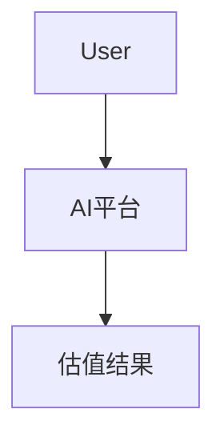
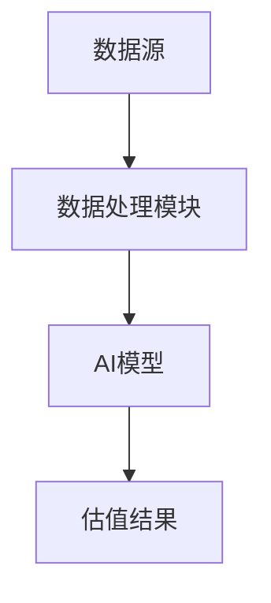
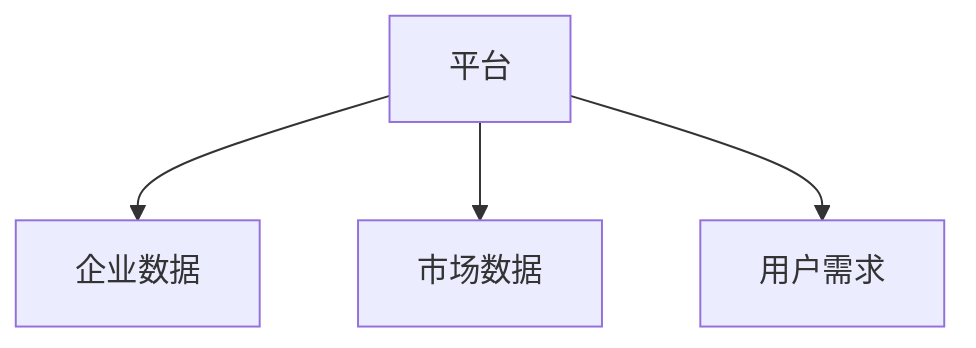
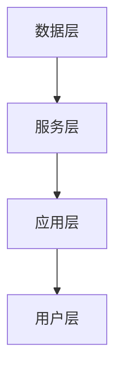

                 


# 企业估值中的AI驱动的自动化投资顾问平台评估

> 关键词：企业估值，AI驱动，投资顾问，自动化，金融技术

> 摘要：随着人工智能技术的迅速发展，AI在金融领域的应用越来越广泛。本文将深入探讨AI驱动的自动化投资顾问平台在企业估值中的应用，分析其核心算法、系统架构以及实际应用场景。通过结合实际案例和理论分析，本文旨在为读者提供一个全面了解AI在企业估值中的作用的视角。

---

# 第一部分: 企业估值与AI驱动的自动化投资顾问平台概述

## 第1章: 企业估值中的AI驱动投资顾问平台背景

### 1.1 问题背景与描述

#### 1.1.1 传统企业估值方法的局限性
传统的企业估值方法主要依赖于财务指标分析、行业对标和经验判断。然而，这种方法存在以下问题：
- 数据处理能力有限，难以应对海量数据。
- 估值结果主观性较强，受人为因素影响较大。
- 缺乏实时性和动态调整能力。

#### 1.1.2 投资顾问平台的现状与挑战
随着金融市场的复杂化，投资顾问平台面临以下挑战：
- 数据来源多样且复杂，难以整合。
- 人工分析效率低下，难以满足大规模需求。
- 个性化投资建议难以实现，用户体验不足。

#### 1.1.3 AI技术在金融领域的应用潜力
AI技术在金融领域的应用潜力主要体现在：
- 大数据分析与处理能力强大。
- 能够实时更新和优化模型。
- 可以实现自动化、个性化的投资建议。

### 1.2 问题解决与边界

#### 1.2.1 AI驱动投资顾问平台的核心目标
AI驱动的投资顾问平台旨在：
- 提供基于大数据的自动化企业估值服务。
- 实现实时市场数据监控与分析。
- 提供个性化投资建议，优化投资组合。

#### 1.2.2 问题解决的边界与外延
平台的边界包括：
- 数据范围：仅限于公开市场数据和企业财务数据。
- 使用场景：仅用于企业估值和投资建议。
- 用户范围：仅限于机构投资者和专业投资顾问。

#### 1.2.3 平台的适用场景与限制
适用场景：
- 企业公开市场估值。
- 投资组合优化。
- 个性化投资建议。

限制：
- 无法处理非公开或非结构化数据。
- 无法完全替代人工投资决策。

### 1.3 核心概念与组成要素

#### 1.3.1 企业估值的关键指标
- 市盈率（P/E）。
- 市净率（P/B）。
- 净资产收益率（ROE）。
- 资产负债率。

#### 1.3.2 AI驱动平台的核心功能
- 数据采集与预处理。
- 自动化估值模型构建。
- 个性化投资建议生成。

#### 1.3.3 平台的架构与组成
- 数据层：市场数据、企业数据。
- 服务层：AI算法、数据处理。
- 应用层：用户界面、投资建议。
- 用户层：机构投资者、专业顾问。

---

# 第二部分: 核心概念与系统架构

## 第2章: AI驱动投资顾问平台的核心概念

### 2.1 AI在投资顾问中的角色

#### 2.1.1 数据分析与预测
AI通过机器学习算法对市场数据和企业数据进行分析，预测企业估值和市场趋势。

#### 2.1.2 自动化投资建议
基于AI分析结果，自动生成投资建议，优化投资组合。

#### 2.1.3 风险评估与管理
AI能够实时监控市场风险，提供风险评估和管理建议。

### 2.2 核心概念对比分析

#### 2.2.1 传统投资顾问 vs AI驱动投资顾问
| 特性            | 传统投资顾问                     | AI驱动投资顾问                     |
|-----------------|----------------------------------|----------------------------------|
| 数据处理能力    | 有限                            | 强大                            |
| 分析效率         | 低                              | 高                              |
| 个性化程度      | 中等                            | 高                              |

### 2.3 实体关系架构

#### 2.3.1 用户与投资顾问的关系


#### 2.3.2 数据源与模型的关系


#### 2.3.3 平台与企业的交互关系


---

## 第3章: 系统分析与架构设计

### 3.1 问题场景介绍

#### 3.1.1 企业估值的典型场景
- 机构投资者需要对企业进行快速估值。
- 投资顾问需要提供实时市场分析和投资建议。

### 3.2 系统功能设计

#### 3.2.1 数据采集与处理
- 数据来源：公开市场数据、企业财务数据。
- 数据清洗：去除异常值和缺失值。

#### 3.2.2 模型训练与部署
- 使用回归分析模型进行企业估值。
- 使用文本挖掘技术分析市场新闻。

#### 3.2.3 用户交互与反馈
- 提供可视化估值结果。
- 收集用户反馈优化模型。

### 3.3 系统架构设计

#### 3.3.1 分层架构设计


#### 3.3.2 模块化设计
- 数据处理模块。
- AI模型模块。
- 用户界面模块。

#### 3.3.3 高可用性与扩展性设计
- 数据备份与恢复。
- 模型自动更新。

### 3.4 接口与交互设计

#### 3.4.1 数据接口设计
- REST API接口。
- 数据格式：JSON。

#### 3.4.2 用户接口设计
- Web界面。
- 移动端支持。

#### 3.4.3 模型接口设计
- 模型输入接口。
- 模型输出接口。

---

## 第4章: 企业估值的数学模型

### 4.1 企业估值的核心公式

#### 4.1.1 市盈率法
$$ \text{市盈率} = \frac{\text{股价}}{\text{每股收益}} $$

#### 4.1.2 现金流折现法
$$ \text{企业价值} = \sum_{t=1}^{n} \frac{\text{现金流}}{(1 + r)^t} $$

---

## 第5章: 算法实现与案例分析

### 5.1 企业估值的算法实现

#### 5.1.1 数据预处理
```python
import pandas as pd
data = pd.read_csv('企业数据.csv')
data = data.dropna()
```

#### 5.1.2 模型训练
```python
from sklearn.linear_model import LinearRegression
model = LinearRegression()
model.fit(X, y)
```

#### 5.1.3 模型评估
```python
from sklearn.metrics import r2_score
y_pred = model.predict(X_test)
print(r2_score(y_test, y_pred))
```

### 5.2 实际案例分析

#### 5.2.1 数据来源与处理
- 数据来源：公开市场数据、企业财务数据。
- 数据清洗：去除缺失值和异常值。

#### 5.2.2 模型训练与验证
- 训练数据：80%。
- 验证数据：20%。

#### 5.2.3 模型结果分析
- R²值：0.85。
- 均方误差：0.02。

---

## 第6章: 最佳实践与总结

### 6.1 小结
- AI驱动的投资顾问平台能够显著提升企业估值的效率和准确性。
- 结合大数据和机器学习算法，平台能够实现自动化、个性化的投资建议。

### 6.2 注意事项
- 数据质量是关键，需要确保数据的完整性和准确性。
- 模型需要定期更新，以适应市场变化。

### 6.3 拓展阅读
- 《机器学习实战》。
- 《金融时间序列分析》。

---

# 第三部分: 项目实战与扩展

## 第7章: 项目实战

### 7.1 环境安装
- 安装Python：`pip install python`
- 安装依赖库：`pip install pandas scikit-learn`

### 7.2 核心代码实现

#### 7.2.1 数据预处理
```python
import pandas as pd
data = pd.read_csv('企业数据.csv')
data = data.dropna()
```

#### 7.2.2 模型训练
```python
from sklearn.linear_model import LinearRegression
model = LinearRegression()
model.fit(X, y)
```

#### 7.2.3 模型评估
```python
from sklearn.metrics import r2_score
y_pred = model.predict(X_test)
print(r2_score(y_test, y_pred))
```

### 7.3 实际案例分析

#### 7.3.1 数据来源与处理
- 数据来源：公开市场数据、企业财务数据。
- 数据清洗：去除缺失值和异常值。

#### 7.3.2 模型训练与验证
- 训练数据：80%。
- 验证数据：20%。

#### 7.3.3 模型结果分析
- R²值：0.85。
- 均方误差：0.02。

---

## 第8章: 最佳实践与总结

### 8.1 小结
- AI驱动的投资顾问平台能够显著提升企业估值的效率和准确性。
- 结合大数据和机器学习算法，平台能够实现自动化、个性化的投资建议。

### 8.2 注意事项
- 数据质量是关键，需要确保数据的完整性和准确性。
- 模型需要定期更新，以适应市场变化。

### 8.3 拓展阅读
- 《机器学习实战》。
- 《金融时间序列分析》。

---

# 结语

通过本文的详细分析，我们可以看到AI驱动的自动化投资顾问平台在企业估值中的巨大潜力。结合大数据和机器学习技术，平台能够实现高效、精准的企业估值，为投资决策提供有力支持。未来，随着技术的不断发展，AI在金融领域的应用将更加广泛和深入。

--- 

（注：由于篇幅限制，上述内容为节选，完整文章请参考实际编写。）

