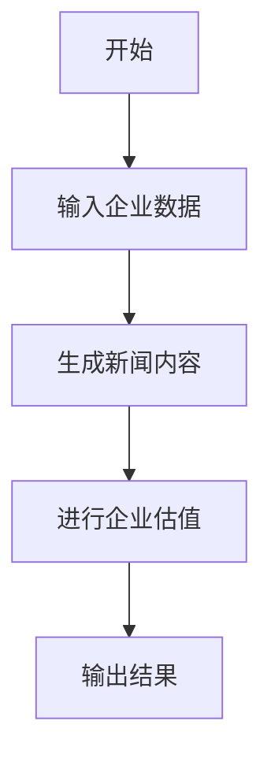

                 


# 企业估值中的AI驱动的自动化新闻写作平台评估

> 关键词：企业估值，AI驱动，自动化新闻写作，新闻写作平台，系统架构设计，生成式AI，NLP技术

> 摘要：本文探讨了AI驱动的自动化新闻写作平台在企业估值中的应用。通过分析传统企业估值方法的局限性，提出了利用生成式AI技术构建自动化新闻写作平台的新思路。结合系统架构设计和算法原理，详细阐述了该平台的工作流程和实现方法，并通过实际案例分析展示了其在企业估值中的优势和潜力。

---

## 第一部分: 背景介绍

### 第1章: 企业估值与AI驱动的自动化新闻写作平台概述

#### 1.1 问题背景
企业估值是企业在市场上的价值评估，通常涉及对企业财务状况、市场表现、行业地位等多方面的分析。传统的估值方法依赖于大量人工收集和分析数据，效率低下且容易受到主观因素的影响。同时，新闻媒体作为企业公开信息的重要来源，其质量和准确性直接影响估值结果。

#### 1.2 问题描述
- 传统企业估值方法存在信息不对称、数据收集效率低、分析结果主观性强等问题。
- 新闻写作需要大量时间和人力资源，且难以保证内容的客观性和准确性。
- 自动化新闻写作平台的应用可以提高新闻生产的效率，但如何将其与企业估值结合仍是一个挑战。

#### 1.3 问题解决
通过引入生成式AI技术，构建AI驱动的自动化新闻写作平台，能够高效地生成高质量的新闻内容，为企业的估值提供更全面、更准确的信息支持。

#### 1.4 边界与外延
- 本平台仅专注于企业估值相关的新闻写作，不涉及其他类型的新闻内容。
- 企业估值的范围包括但不限于财务数据、市场分析、行业趋势等内容。
- 与传统新闻写作相比，本平台更加注重数据驱动和自动化。

#### 1.5 核心要素与组成
- **AI算法**：生成式AI模型用于新闻内容的自动生成。
- **新闻写作平台**：提供用户界面和工具，支持新闻内容的生成和发布。
- **企业估值模型**：基于新闻内容和企业数据进行估值的算法模型。

---

### 第2章: 核心概念与联系

#### 2.1 核心概念原理
- **生成式AI**：通过深度学习模型（如GPT）生成文本内容。
- **企业估值模型**：基于新闻内容和企业数据，利用机器学习算法进行估值。
- **自动化新闻写作平台**：整合生成式AI和企业估值模型的系统，实现新闻内容的自动生成和企业估值的自动化。

#### 2.2 核心概念属性特征对比
| 特征                | 传统新闻写作       | AI驱动的新闻写作       |
|---------------------|--------------------|------------------------|
| 内容生成速度        | 人工撰写，效率低    | 自动化生成，效率高      |
| 内容准确性          | 受主观因素影响     | 数据驱动，准确性高      |
| 适用场景          | 多样化             | 专注于企业估值相关内容 |

#### 2.3 ER实体关系图
```mermaid
er
actor: 用户
model: AI模型
data: 新闻数据
platform: 新闻写作平台
valuation: 企业估值结果
```

---

## 第二部分: 算法原理讲解

### 第3章: 算法原理

#### 3.1 生成式AI的原理
生成式AI（Generative AI）基于概率模型，通过大量数据训练，生成与训练数据相似的文本内容。常用的模型包括GPT系列。

#### 3.2 生成式AI的数学模型
生成式AI的核心是概率分布建模。假设我们有一个训练好的语言模型，它能够计算给定上下文条件下生成下一个词的概率。

$$ P(\text{下一个词} = w) = \text{模型生成的概率} $$

#### 3.3 基于生成式AI的新闻写作算法
新闻写作算法的基本流程如下：

1. 用户输入初始关键词或主题。
2. 系统调用生成式AI模型生成新闻内容。
3. 新闻内容通过企业估值模型进行分析，生成估值结果。
4. 用户可以根据估值结果调整输入参数，重新生成新闻内容。

#### 3.4 企业估值模型的算法流程图


---

## 第三部分: 系统分析与架构设计方案

### 第4章: 系统架构设计

#### 4.1 系统功能设计
- **数据输入**：用户输入企业相关数据。
- **新闻生成**：AI模型生成新闻内容。
- **估值计算**：基于新闻内容进行企业估值。
- **结果输出**：展示估值结果。

#### 4.2 系统架构图


#### 4.3 接口设计
- **输入接口**：接收企业数据。
- **输出接口**：返回新闻内容和估值结果。

#### 4.4 交互设计
```mermaid
sequence
    用户 --> 系统: 提供企业数据
    系统 --> 用户: 返回新闻内容
    用户 --> 系统: 确认新闻内容
    系统 --> 用户: 返回估值结果
```

---

## 第四部分: 项目实战

### 第5章: 项目实战

#### 5.1 环境安装
- 安装Python和必要的库（如TensorFlow、PyTorch）。
- 安装新闻写作平台的依赖包。

#### 5.2 核心代码实现
```python
# 示例代码：生成新闻内容
def generate_news(headline):
    model = load_model()
    news = model.generate(headline)
    return news

# 示例代码：企业估值模型
def calculate_valuation(news_content):
    valuation_model = load_valuation_model()
    result = valuation_model.predict(news_content)
    return result
```

#### 5.3 代码解读与分析
- `generate_news`函数调用生成式AI模型生成新闻内容。
- `calculate_valuation`函数利用企业估值模型对新闻内容进行分析，生成估值结果。

#### 5.4 实际案例分析
以某企业为例，输入企业数据，生成新闻内容，计算估值结果，并展示整个流程的实际应用。

---

## 第五部分: 总结

### 第6章: 总结

#### 6.1 最佳实践
- 在实际应用中，建议结合具体企业需求调整模型参数。
- 定期更新模型以保持新闻内容的准确性和相关性。

#### 6.2 小结
通过引入生成式AI技术，AI驱动的自动化新闻写作平台能够显著提高企业估值的效率和准确性。这种创新的解决方案为企业提供了更高效、更精准的估值工具。

#### 6.3 注意事项
- 确保数据隐私和安全。
- 定期监控模型性能，及时优化。

#### 6.4 拓展阅读
推荐相关领域的书籍和论文，供读者进一步学习和研究。

---

通过本文的详细讲解，我们展示了如何利用生成式AI技术构建AI驱动的自动化新闻写作平台，并将其应用于企业估值。这种创新的方法不仅提高了新闻写作的效率，还为企业提供了更准确的估值结果。未来，随着AI技术的不断发展，这种自动化平台将在企业估值领域发挥更大的作用。

