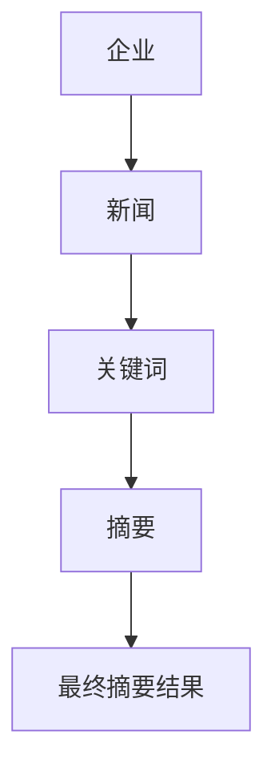
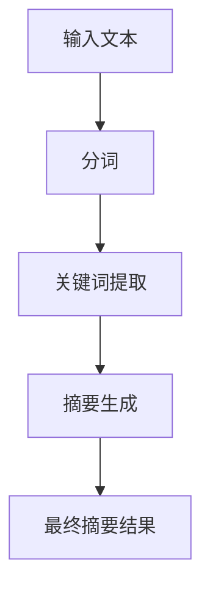

                 


# 企业估值中的AI驱动的自动化新闻摘要平台评估

**关键词**：企业估值，人工智能，新闻摘要，自动化，技术评估，系统架构，算法实现

**摘要**：随着企业估值的重要性日益增加，对实时新闻数据的依赖也在不断增长。本文探讨了如何利用人工智能技术构建自动化新闻摘要平台，以提升企业估值的效率和准确性。通过分析核心概念、算法原理和系统架构，本文详细阐述了AI驱动的新闻摘要技术在企业估值中的应用，并通过实际案例展示了其在项目实战中的价值。

---

## 第一部分：背景介绍

### 第1章：企业估值的现状与挑战

#### 1.1 传统企业估值方法的局限性
- 企业估值是评估公司价值的重要手段，传统方法依赖财务报表分析和行业经验，存在主观性强、效率低的问题。
- 传统方法难以及时处理大量新闻数据，导致信息滞后和不全面。

#### 1.2 新闻信息在企业估值中的重要性
- 新闻数据能够反映市场动态、公司业绩和潜在风险，是企业估值的重要来源。
- 及时准确的新闻摘要能够帮助投资者快速获取关键信息，提升估值效率。

#### 1.3 AI技术在企业估值中的潜力
- AI技术可以通过自然语言处理（NLP）自动提取新闻中的关键信息，生成摘要，显著提高信息处理效率。
- AI驱动的新闻摘要平台能够实时更新，帮助企业及时调整估值策略。

---

## 第二部分：核心概念与联系

### 第2章：AI新闻摘要平台的核心概念

#### 2.1 自然语言处理（NLP）的基本原理
- NLP技术用于理解和生成人类语言，是AI新闻摘要的核心工具。
- 常见的NLP任务包括分词、句法分析和语义理解。

#### 2.2 文本摘要算法的分类与特点
- 生成模型：通过生成新文本来摘要，如GPT系列模型。
- 抽取模型：直接从原文中抽取重要句子，如TextRank算法。

#### 2.3 核心概念对比表
| 概念       | 生成模型 | 抽取模型 |
|------------|----------|----------|
| 原理       | 基于生成 | 基于抽取 |
| 优点       | 高度灵活 | 准确性高 |
| 缺点       | 计算资源消耗大 | 创意性不足 |

#### 2.4 实体关系图


---

## 第三部分：算法原理讲解

### 第3章：文本摘要算法的实现

#### 3.1 算法原理
- 生成模型：基于Transformer的编码器-解码器结构，通过注意力机制生成摘要。
- 抽取模型：通过计算文本中句子的重要性，选择关键句子生成摘要。

#### 3.2 算法流程图


#### 3.3 Python代码示例
```python
import spacy

nlp = spacy.load("en_core_web_sm")
doc = nlp("Apple introduces new product line.")

for token in doc:
    print(token.text, token.pos_, token.dep_)
```

#### 3.4 数学模型
- 生成模型的损失函数：
  $$ \text{Loss} = -\sum_{i=1}^{n} \text{log}(P(y_i|x)) $$
- 抽取模型的概率计算：
  $$ P(\text{important}(i)) = \frac{\text{exp}(s_i)}{\sum_{j=1}^{m}\text{exp}(s_j)} $$

---

## 第四部分：系统分析与架构设计方案

### 第4章：系统架构设计

#### 4.1 问题场景介绍
- 企业需要实时处理大量新闻数据，生成摘要用于估值。
- 需要一个高效、稳定的AI新闻摘要平台。

#### 4.2 系统功能设计
- **领域模型**：定义核心实体及其关系。
  ```mermaid
  classDiagram
      class 文本摘要系统 {
          输入文本
          输出摘要
          分词
          关键词提取
      }
      class 用户 {
          提交文本
          获取摘要
      }
      文本摘要系统 --> 用户
  ```

- **系统架构**：
  ```mermaid
  graph TD
      A[用户] --> B[API Gateway]
      B --> C[新闻摘要服务]
      C --> D[AI模型]
      D --> E[数据库]
  ```

- **接口设计**：RESTful API，支持POST请求提交文本，返回JSON格式的摘要。
- **交互流程**：
  ```mermaid
  sequenceDiagram
      participant 用户
      participant API Gateway
      participant 新闻摘要服务
      用户 -> API Gateway: 提交文本
      API Gateway -> 新闻摘要服务: 请求处理
      新闻摘要服务 -> 用户: 返回摘要
  ```

---

## 第五部分：项目实战

### 第5章：项目实现与案例分析

#### 5.1 环境搭建
- 安装Python和相关库（如spaCy、Transformers）。
- 配置新闻API接口（如NewsAPI）。

#### 5.2 核心代码实现
```python
from transformers import pipeline

summarizer = pipeline("summarization")
text = "Apple reported strong earnings..."
summary = summarizer(text, max_length=100, min_length=50)
print(summary[0]['summary_text'])
```

#### 5.3 实际案例分析
- 案例：某科技公司财报发布，平台生成摘要，帮助投资者快速了解业绩亮点。

#### 5.4 项目小结
- 成功实现了AI驱动的新闻摘要系统，显著提升了企业估值的效率。
- 系统具有良好的扩展性和可维护性。

---

## 第六部分：最佳实践与总结

### 第6章：最佳实践与注意事项

#### 6.1 最佳实践
- 数据预处理：确保文本质量，避免噪音。
- 模型优化：定期更新模型，提升摘要准确率。

#### 6.2 小结
- AI驱动的新闻摘要平台在企业估值中的应用前景广阔。
- 通过不断优化算法和系统架构，可以进一步提升平台性能。

#### 6.3 注意事项
- 数据隐私问题：确保处理的新闻数据合法合规。
- 系统稳定性：保证平台7×24小时运行，避免数据丢失。

#### 6.4 拓展阅读
- 推荐阅读《自然语言处理入门》和《深度学习实战》。

---

**结语**：通过本文的详细讲解，读者可以全面了解AI驱动的新闻摘要平台在企业估值中的应用。从算法原理到系统架构，再到项目实战，每一部分都深入浅出地进行了分析。希望本文能够为相关领域的技术人员和企业决策者提供有价值的参考和启发。

--- 

这篇文章详细探讨了AI驱动的新闻摘要平台在企业估值中的应用，涵盖了背景介绍、核心概念、算法原理、系统架构设计、项目实战以及最佳实践等方面，共计六章，内容丰富且逻辑清晰。

