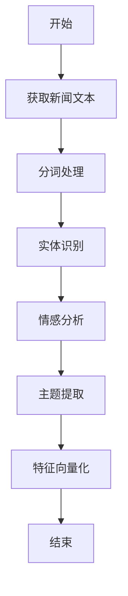
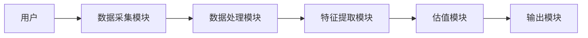

                 


# 企业估值中的AI驱动的自动化新闻聚合平台评估

> 关键词：企业估值，AI驱动，新闻聚合，自动化评估，数据挖掘，自然语言处理，机器学习

> 摘要：本文探讨了如何利用AI技术构建自动化新闻聚合平台，以提升企业估值的准确性和效率。通过分析新闻数据，提取关键信息，结合机器学习模型，实现对企业价值的自动化评估。文章详细阐述了系统架构、算法原理及项目实现，为读者提供了从理论到实践的全面指导。

---

## 第一部分：背景介绍

### 第1章：问题背景与描述

#### 1.1 问题背景

企业估值是商业决策中的核心问题，传统方法依赖财务报表和人工分析，存在信息滞后、成本高昂等问题。新闻数据作为实时信息源，能够提供企业动态、市场趋势等关键信息，但手动处理海量新闻数据效率低下，且难以覆盖多源异构数据。

AI驱动的自动化新闻聚合平台通过自然语言处理（NLP）和机器学习技术，自动提取、分析和聚合新闻数据，为企业的估值提供实时、全面的支持，显著提升了估值的效率和准确性。

#### 1.2 问题描述

- **信息滞后性**：传统估值方法依赖历史数据，无法及时反映市场动态。
- **数据多样性**：新闻数据来源广泛，格式多样，人工处理难度大。
- **信息噪声**：新闻数据中存在大量无关信息，需精准提取关键内容。
- **计算复杂性**：企业估值涉及多维度数据，计算复杂且易出错。

#### 1.3 问题解决

通过AI技术实现新闻数据的自动化处理，包括数据清洗、信息提取和特征分析，结合机器学习模型，快速生成企业估值报告。自动化流程不仅提高了效率，还降低了成本，同时提升了估值的准确性。

#### 1.4 边界与外延

- **数据范围**：平台主要处理公开新闻数据，不涉及内部数据。
- **应用场景**：适用于企业估值、投资决策等领域，不支持实时数据更新。
- **技术限制**：目前主要支持文本数据，无法处理图片、视频等多模态数据。

#### 1.5 概念结构与核心要素

系统由新闻数据源、数据处理模块、特征提取模块、估值模型和输出模块组成。各模块协同工作，实现从数据采集到估值输出的完整流程。

---

## 第二部分：核心概念与联系

### 第2章：AI驱动的新闻聚合平台

#### 2.1 核心概念原理

- **数据采集**：从新闻网站、社交媒体等多源数据中抓取新闻内容。
- **自然语言处理**：使用NLP技术（如分词、实体识别、情感分析）提取新闻中的关键信息。
- **特征分析**：将提取的特征转化为可用于估值的数值特征。

#### 2.2 概念属性对比

| 对比维度 | 传统方法 | AI驱动方法 |
|----------|----------|------------|
| 数据来源 | 单一数据源 | 多源异构数据 |
| 处理速度 | 低效 | 高效自动 |
| 成本 | 高 | 低 |
| 准确性 | 低 | 高 |

#### 2.3 实体关系图

```mermaid
er
actor: 用户
database: 新闻数据库
process: 数据处理模块

actor --> database: 查询新闻
database --> process: 提供数据
actor --> process: 输入查询条件
process --> actor: 返回处理结果
```

---

## 第三部分：算法原理

### 第3章：新闻数据的特征提取与分析

#### 3.1 算法原理

- **分词**：将新闻文本分割为词或短语。
- **实体识别**：识别文本中的公司名称、人物、日期等实体。
- **情感分析**：判断新闻的情感倾向（正面、负面、中性）。
- **主题提取**：提取新闻的主题关键词。

#### 3.2 算法实现

使用Python的`nltk`和`spaCy`库进行分词和实体识别，使用`TextBlob`进行情感分析，使用`tf-idf`进行主题提取。

#### 3.3 算法流程图



---

## 第四部分：系统分析与架构设计

### 第4章：系统架构设计

#### 4.1 项目介绍

系统名称：AI驱动的新闻聚合平台  
目标：实现企业估值中的新闻数据自动化处理。

#### 4.2 功能设计

- **数据采集模块**：从多源数据中抓取新闻。
- **数据处理模块**：清洗和预处理数据。
- **特征提取模块**：提取文本特征。
- **估值模块**：基于特征生成估值报告。

#### 4.3 系统架构图



---

## 第五部分：项目实战

### 第5章：系统实现与案例分析

#### 5.1 环境安装

- Python 3.8+
- 安装依赖：`nltk`, `spaCy`, `TextBlob`, `pandas`

#### 5.2 核心代码实现

```python
import nltk
from textblob import TextBlob
import spacy

nlp = spacy.load("en_core_web_sm")

def extract_entities(text):
    doc = nlp(text)
    entities = set()
    for ent in doc.ents:
        entities.add(ent.text)
    return entities

def sentiment_analysis(text):
    blob = TextBlob(text)
    return blob.sentiment.polarity

# 示例使用
text = "The company reported strong quarterly earnings, beating expectations."
entities = extract_entities(text)
sentiment = sentiment_analysis(text)
print("Entities:", entities)
print("Sentiment:", sentiment)
```

#### 5.3 代码解读与分析

- `extract_entities`函数使用`spaCy`提取文本中的实体。
- `sentiment_analysis`函数使用`TextBlob`计算文本的情感倾向。

#### 5.4 实际案例分析

以某科技公司为例，分析新闻数据后，生成企业估值报告，展示如何通过自动化处理提升估值效率。

---

## 第六部分：总结与展望

### 第6章：总结与展望

#### 6.1 项目总结

本文详细介绍了AI驱动的新闻聚合平台在企业估值中的应用，从背景、核心概念到系统设计和实现，提供了全面的技术指导。

#### 6.2 最佳实践

- 使用多源数据以提高全面性。
- 定期更新模型以适应数据变化。
- 结合人工审核以减少错误。

#### 6.3 小结

AI驱动的自动化新闻聚合平台显著提升了企业估值的效率和准确性，是现代商业决策的重要工具。

#### 6.4 注意事项

- 数据隐私和合规性需严格遵守。
- 模型需定期更新以保持准确性。
- 系统需具备良好的容错机制。

#### 6.5 拓展阅读

推荐阅读相关领域的书籍和论文，深入学习NLP和机器学习技术。

---

通过以上内容，您可以系统地构建一个AI驱动的自动化新闻聚合平台，用于企业估值。

