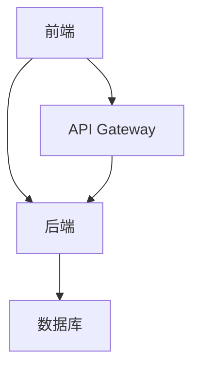

                 


# 企业估值中的AI驱动的自动化法律咨询平台评估

**关键词**：企业估值、AI驱动、法律咨询平台、自动化评估、技术实现

**摘要**：  
本文深入探讨了AI驱动的自动化法律咨询平台在企业估值中的应用与评估方法。通过分析法律咨询平台的核心功能、技术原理及系统架构，结合实际案例，展示了如何利用AI技术提升企业估值的准确性和效率。文章从问题背景、技术原理、系统设计到项目实战，全面解析了AI在法律咨询领域的潜力与挑战。

---

## 目录

### 第一部分：背景与概念

#### 第1章：问题背景与目标

##### 1.1 企业估值的基本概念
- 1.1.1 企业估值的定义与意义
- 1.1.2 传统企业估值方法的局限性
- 1.1.3 AI驱动的法律咨询平台在企业估值中的作用

##### 1.2 法律咨询平台的自动化需求
- 1.2.1 法律咨询平台的基本功能
- 1.2.2 自动化法律咨询的必要性
- 1.2.3 AI技术在法律咨询中的应用前景

#### 第2章：AI驱动法律咨询平台的核心要素

##### 2.1 法律文本分析的关键技术
- 2.1.1 自然语言处理（NLP）在法律文本中的应用
- 2.1.2 法律知识图谱的构建与管理
- 2.1.3 法律案例分析的AI模型

##### 2.2 自动化法律咨询的实现流程
- 2.2.1 用户需求分析与问题识别
- 2.2.2 法律文本匹配与检索
- 2.2.3 结果生成与解释

##### 2.3 平台评估的核心指标
- 2.3.1 精确度与召回率
- 2.3.2 响应时间与处理效率
- 2.3.3 用户满意度与反馈机制

---

### 第二部分：AI驱动法律咨询平台的技术原理与系统架构

#### 第3章：法律文本分析的算法原理

##### 3.1 基于深度学习的NLP模型
- 3.1.1 Transformer模型的基本原理
- 3.1.2 BERT模型在法律文本分析中的应用
- 3.1.3 法律文本分类与实体识别的实现

##### 3.2 法律知识图谱的构建与应用
- 3.2.1 知识图谱的构建流程
- 3.2.2 基于知识图谱的法律推理
- 3.2.3 知识图谱的动态更新机制

##### 3.3 法律案例分析的AI模型
- 3.3.1 基于案例的相似性度量
- 3.3.2 法律规则的自动生成与优化
- 3.3.3 案例分析的可解释性问题

#### 第4章：系统架构设计与实现

##### 4.1 系统功能设计
- 4.1.1 用户交互界面设计
- 4.1.2 后台处理逻辑
- 4.1.3 数据存储与管理

##### 4.2 系统架构图
- 4.2.1 前端架构设计
- 4.2.2 后端架构设计
- 4.2.3 数据库设计

##### 4.3 接口设计与交互流程
- 4.3.1 API接口定义
- 4.3.2 交互流程图
- 4.3.3 安全性设计

---

### 第三部分：项目实战与案例分析

#### 第5章：环境搭建与核心功能实现

##### 5.1 开发环境的安装与配置
- 5.1.1 Python环境的安装
- 5.1.2 NLP库的安装（如spaCy、BERT）
- 5.1.3 数据库的搭建

##### 5.2 核心功能的实现
- 5.2.1 法律文本分类的代码实现
- 5.2.2 知识图谱构建的代码实现
- 5.2.3 案例分析的代码实现

#### 第6章：案例分析与结果解读

##### 6.1 实际案例分析
- 6.1.1 案例背景介绍
- 6.1.2 系统输入与处理过程
- 6.1.3 处理结果与解读

##### 6.2 结果分析与优化
- 6.2.1 精确度与召回率的计算
- 6.2.2 系统性能的优化建议
- 6.2.3 用户反馈的处理与改进

---

### 第四部分：总结与展望

#### 第7章：总结与未来方向

##### 7.1 项目总结
- 7.1.1 项目实现的核心成果
- 7.1.2 系统的优缺点分析
- 7.1.3 项目实施的经验与教训

##### 7.2 未来发展方向
- 7.2.1 技术的进一步优化
- 7.2.2 应用领域的拓展
- 7.2.3 行业标准的制定与推广

---

### 附录

#### 附录A：核心代码与数学公式

##### 代码示例
```python
import spacy
nlp = spacy.load("en_core_web_sm")
doc = nlp("This is a sample legal text.")
for token in doc:
    print(token.text, token.pos_, token.dep_)
```

##### 数学公式
$$ P = \frac{1}{1 + e^{-x}} $$

---

#### 附录B：系统架构图与流程图

##### 系统架构图（Mermaid）


---

通过以上目录结构，本文系统地介绍了AI驱动的法律咨询平台在企业估值中的应用，从理论到实践，为读者提供了全面的技术解析和实际操作指导。

