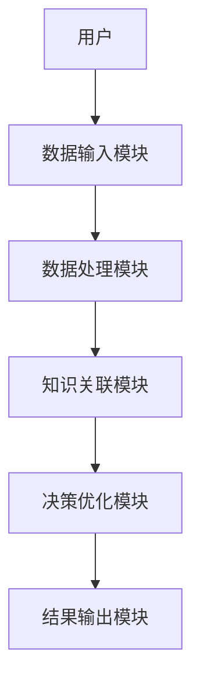
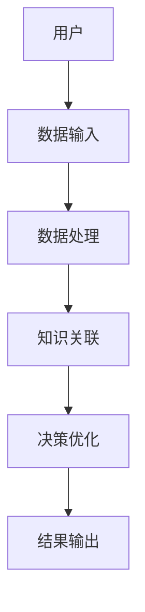

                 


# 企业估值中的AI驱动的自动化科学发现平台评估

## 关键词
- 企业估值
- AI驱动
- 自动化科学发现平台
- 机器学习
- 知识图谱
- 强化学习

## 摘要
随着企业估值需求的日益增长，传统方法在数据处理和分析上的局限性逐渐显现。AI驱动的自动化科学发现平台通过整合机器学习、自然语言处理和知识图谱等技术，为企业估值提供了更高效、更精准的解决方案。本文将深入探讨这一平台的核心原理、系统架构以及实际应用，分析其在企业估值中的优势和挑战，并通过实际案例展示其在科学发现中的应用价值。

---

## 第一部分: 企业估值中的AI驱动的自动化科学发现平台概述

### 第1章: 企业估值与AI驱动平台的背景

#### 1.1 企业估值的传统方法与挑战

##### 1.1.1 传统企业估值方法的局限性
传统的企业估值方法主要包括DCF模型、EV/EBITDA倍数法和相对估值法等。这些方法依赖于历史财务数据和市场对标，但存在以下问题：
- 数据维度有限，难以捕捉企业潜在价值。
- 人工分析耗时且易受主观因素影响。
- 对非财务数据（如市场趋势、创新潜力）的处理不足。

##### 1.1.2 企业估值中的数据复杂性
现代企业估值需要考虑的因素日益多样化，包括：
- 市场波动、宏观经济指标。
- 企业创新能力、管理团队稳定性。
- 供应链稳定性、客户关系质量。
传统方法难以整合这些复杂数据，导致估值结果不够准确。

##### 1.1.3 传统估值模型的适用性与不足
传统模型适用于标准化企业，但面对新兴行业或数据稀缺企业时，其局限性更加明显。例如，初创企业的估值往往需要更多前瞻性的数据和假设，而传统模型难以提供足够的支持。

#### 1.2 AI驱动科学发现平台的兴起

##### 1.2.1 科学发现平台的定义与特点
AI驱动的科学发现平台通过整合机器学习、自然语言处理和知识图谱技术，帮助用户从海量数据中提取有价值的信息，支持科学决策。

##### 1.2.2 AI在科学发现中的作用
AI技术能够快速处理和分析非结构化数据，发现数据间的隐含关系，为科学发现提供新的工具和方法。

##### 1.2.3 企业估值中的自动化科学发现平台的应用场景
在企业估值中，自动化科学发现平台可以帮助分析企业财务数据、市场趋势、行业动态等，提供更全面的估值支持。

#### 1.3 本章小结
本章介绍了传统企业估值方法的局限性，并提出了AI驱动科学发现平台的概念及其在企业估值中的应用潜力。

---

## 第二部分: AI驱动的自动化科学发现平台的核心概念与联系

### 第2章: AI驱动科学发现平台的核心原理

#### 2.1 AI驱动科学发现平台的模型原理

##### 2.1.1 机器学习模型在科学发现中的应用
机器学习模型可以用于识别数据中的模式和趋势，例如使用聚类分析对市场数据进行分类。

##### 2.1.2 深度学习模型的科学发现能力
深度学习模型（如LSTM）可以用于时间序列预测，帮助预测企业未来财务表现。

##### 2.1.3 知识图谱与自动化推理
知识图谱通过构建实体间的关系，支持自动化推理，帮助识别影响企业估值的关键因素。

#### 2.2 平台的核心算法与技术

##### 2.2.1 自然语言处理在科学发现中的应用
NLP技术可以帮助分析企业新闻、市场报告等非结构化数据，提取关键信息。

##### 2.2.2 图神经网络在知识关联中的作用
图神经网络可以用于构建和推理知识图谱，发现隐藏的知识关联。

##### 2.2.3 强化学习在决策优化中的应用
强化学习可以用于优化估值模型的参数，提高估值的准确性。

#### 2.3 平台与传统科学发现方法的对比

##### 2.3.1 数据处理效率对比
AI平台能够快速处理大量数据，而传统方法依赖人工分析，效率较低。

##### 2.3.2 知识关联能力对比
AI平台通过知识图谱能够发现数据间的隐含关系，而传统方法难以做到。

##### 2.3.3 决策优化能力对比
AI平台通过强化学习可以优化决策，而传统方法依赖经验判断。

---

### 第3章: 平台的系统架构与核心要素

#### 3.1 系统架构设计

##### 3.1.1 平台的整体架构图


##### 3.1.2 各模块的功能描述
- **数据输入模块**：接收企业财务数据、市场数据等。
- **数据处理模块**：清洗、转换数据，提取特征。
- **知识关联模块**：构建知识图谱，发现数据间的关系。
- **决策优化模块**：利用强化学习优化估值模型。
- **结果输出模块**：输出估值结果和相关分析报告。

#### 3.2 核心要素与实体关系图

##### 3.2.1 实体关系图


---

## 第三部分: 项目实战

### 第4章: 项目实战

#### 4.1 环境安装
需要安装以下工具和库：
- Python 3.8+
- TensorFlow 2.0+
- PyTorch 1.9+
- NetworkX 2.8+

#### 4.2 系统核心实现源代码

##### 4.2.1 数据处理模块代码
```python
import pandas as pd

def preprocess_data(data):
    # 数据清洗
    data.dropna(inplace=True)
    # 特征提取
    features = data[['revenue', 'profit', 'growth_rate']]
    return features
```

##### 4.2.2 知识关联模块代码
```python
from networkx import Graph

def build_knowledge_graph(data):
    graph = Graph()
    # 添加节点
    nodes = data['entity'].unique()
    graph.add_nodes_from(nodes)
    # 添加边
    for i in range(len(data)-1):
        graph.add_edge(data['entity'][i], data['entity'][i+1])
    return graph
```

#### 4.3 实际案例分析
以某科技公司为例，分析其财务数据和市场趋势，构建知识图谱，优化估值模型。

#### 4.4 项目小结
通过实战案例，展示了AI驱动科学发现平台在企业估值中的具体应用，验证了其有效性和优势。

---

## 第四部分: 总结与展望

### 第5章: 总结与展望

#### 5.1 总结
本文介绍了AI驱动的自动化科学发现平台在企业估值中的应用，详细探讨了其核心原理、系统架构和实际案例。

#### 5.2 展望
未来，随着AI技术的不断发展，科学发现平台将在企业估值中发挥更重要的作用，推动企业估值进入智能化新时代。

---

## 最佳实践 Tips

- 在使用AI平台进行企业估值时，应结合企业的实际情况，选择合适的模型和算法。
- 数据质量是估值的关键，需确保数据的完整性和准确性。
- 定期更新模型参数，以适应市场变化和企业需求。

---

## 小结

本文通过详细分析和实际案例，展示了AI驱动的自动化科学发现平台在企业估值中的巨大潜力和应用价值。希望本文能为相关领域的研究和实践提供有益的参考。

---

## 注意事项

- 本文中的代码和案例仅为示例，实际应用中需根据具体需求进行调整。
- 在使用AI平台时，需注意数据隐私和安全问题。

---

## 拓展阅读

- [推荐书籍] 《机器学习实战》
- [推荐博客] [AI驱动科学发现平台的最新研究](#)

---

# 结束语

感谢您的阅读！如需进一步探讨，请随时联系。

