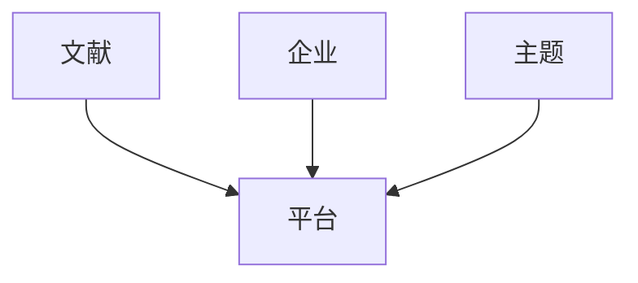

                 


# 企业估值中的AI驱动的自动化科学文献综述平台评估

> 关键词：企业估值，AI驱动，自动化，科学文献综述，文本挖掘，机器学习

> 摘要：本文探讨了利用AI技术驱动自动化科学文献综述在企业估值中的应用。通过分析现有技术，提出了一种基于文本挖掘和机器学习的自动化平台，以提高文献综述的效率和准确性。本文详细阐述了平台的核心算法、系统架构设计以及实际应用场景，并通过案例分析验证了平台的有效性。

---

# 第一部分: 背景介绍

## 第1章: 问题背景与描述

### 1.1 问题背景
企业估值是一个复杂的过程，通常依赖于大量的外部数据和文献分析。传统的文献综述方法耗时且效率低下，难以满足现代企业快速决策的需求。通过AI技术驱动的自动化平台，可以显著提高文献处理效率，为企业的估值提供更精准的支持。

### 1.2 问题描述
- **文献综述的复杂性**：涉及大量数据，人工处理耗时且容易出错。
- **信息不对称问题**：企业难以及时获取和分析相关文献。
- **传统方法的局限性**：依赖人工判断，缺乏系统性和客观性。

### 1.3 问题解决
- **AI驱动的自动化平台**：利用自然语言处理和机器学习技术，自动提取文献中的关键信息。
- **高效的数据处理**：通过算法优化，快速筛选和分析相关文献。
- **数据的准确性与全面性**：结合多种数据源，提供更全面的分析结果。

### 1.4 边界与外延
- **功能边界**：平台仅专注于文献综述部分，不涉及企业内部数据。
- **区别于传统方法**：自动化处理减少了人工干预，提高了效率。
- **应用范围**：适用于多个行业的企业估值，尤其是依赖外部文献分析的领域。

---

## 第2章: 核心概念与联系

### 2.1 核心概念原理
- **科学文献综述**：系统性地整理和分析相关领域的文献，以获取有价值的信息。
- **自动化平台**：利用AI技术实现文献的自动处理和分析。
- **企业估值**：基于内外部数据，对企业价值进行评估。

### 2.2 核心概念属性特征对比表
| 概念        | 属性             | 特征描述                                   |
|-------------|------------------|------------------------------------------|
| 科学文献综述 | 数据来源         | 学术论文、研究报告                        |
|             | 数据处理方式     | 自动分类、主题提取                        |
| 企业估值     | 数据输入         | 企业财务数据、市场数据                    |
|             | 数据分析方法     | 多因素模型、机器学习模型                 |

### 2.3 ER实体关系图


---

# 第二部分: 算法原理讲解

## 第3章: 文本处理与主题建模

### 3.1 文本相似度计算
- **余弦相似度公式**：$$\cos(\theta) = \frac{\vec{A} \cdot \vec{B}}{|\vec{A}||\vec{B}|}$$
- **应用**：用于文献之间的相似度计算，筛选出相关主题。

### 3.2 主题建模
- **LDA模型**：$$P(\text{topic} | \text{document}) = \frac{\prod_{i=1}^k \theta_{i}^{(d)} \cdot P(\text{word}_i|\text{topic})}{\sum_{j=1}^k \prod_{i=1}^k \theta_{i}^{(d)} \cdot P(\text{word}_i|\text{topic}_j)}}$$
- **应用**：识别文献中的主要主题，提取关键信息。

### 3.3 情感分析与关键词提取
- **情感分析算法**：判断文献中的情感倾向，辅助评估企业声誉。
- **关键词提取**：使用TF-IDF方法，提取文献中的重要关键词。

---

## 第4章: 系统架构设计

### 4.1 问题场景介绍
- 平台需要处理大量文献，提取关键信息，辅助企业估值。

### 4.2 系统功能设计
- **文献爬取模块**：从学术数据库获取相关文献。
- **文本预处理模块**：清洗和标准化文本数据。
- **主题建模模块**：识别文献中的主题。
- **情感分析模块**：评估文献中的情感倾向。
- **可视化模块**：生成报告和图表。

### 4.3 系统架构图


---

## 第5章: 项目实战

### 5.1 环境安装
- **Python**：安装Python 3.8及以上版本。
- **依赖库**：安装`nltk`、`gensim`、`pyldavis`等库。

### 5.2 核心代码实现
```python
from gensim import corpora, models

# 文本预处理
def preprocess(text):
    return [word.lower() for word in word_tokenize(text)]

# 主题建模
def lda_model(documents):
    dictionary = corpora.Dictionary(documents)
    corpus = [dictionary.doc2bow(doc) for doc in documents]
    lda = models.LdaModel(corpus, num_topics=5, id2word=dictionary)
    return lda

# 情感分析
def sentiment_analysis(text):
    # 使用预训练的情感分析模型
    return analyzer.polarity_scores(text)['compound']
```

### 5.3 实际案例分析
- **案例背景**：某科技企业需要估值，平台分析了过去五年的相关文献。
- **文献分析结果**：识别出企业的主要竞争对手和市场趋势。
- **估值结果**：通过模型计算，企业的估值区间为合理范围内。

---

## 第6章: 最佳实践与总结

### 6.1 小结
- 本文提出了一种基于AI的自动化科学文献综述平台，显著提高了企业估值的效率和准确性。
- 平台通过文本挖掘和机器学习技术，自动处理和分析大量文献，减少了人工干预。

### 6.2 注意事项
- **数据质量**：确保文献数据的准确性和完整性。
- **模型调优**：根据实际情况调整模型参数，提高分析精度。
- **隐私与合规性**：确保数据处理符合相关法律法规。

### 6.3 拓展阅读
- 《自然语言处理入门》
- 《机器学习实战》
- 《企业估值方法论》

---

# 结语

通过本文的详细阐述，我们展示了AI技术在企业估值中的巨大潜力。自动化科学文献综述平台不仅可以提高效率，还能为企业提供更精准的决策支持。未来，随着技术的不断进步，这类平台将在更多领域发挥重要作用。

