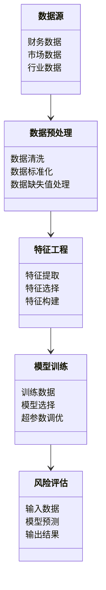
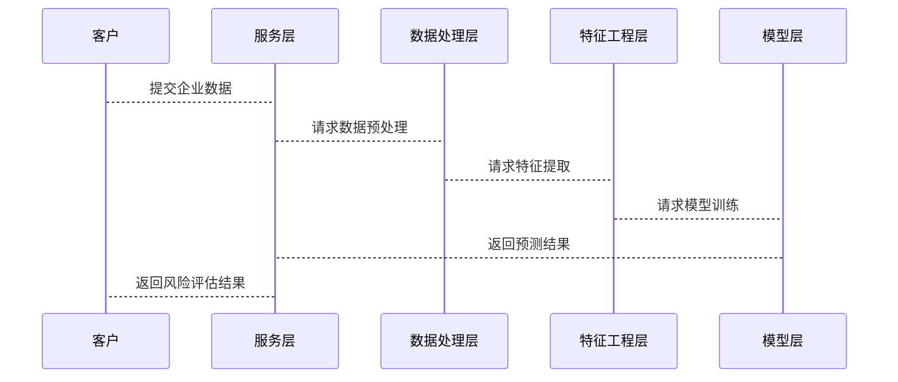

                 


# 《企业估值中的AI驱动的自动化风险评估平台评估》

## 关键词：
- 企业估值
- AI驱动
- 风险评估
- 自动化平台
- 机器学习
- 数据分析

## 摘要：
本文深入探讨了AI技术在企业估值中的应用，特别是如何利用自动化风险评估平台提升企业估值的准确性和效率。通过分析传统估值方法的局限性，结合现代AI算法，本文提出了一个基于机器学习的风险评估框架，详细阐述了从数据预处理到模型构建的全过程，并通过实际案例展示了该平台的应用效果。本文旨在为企业估值提供一种更高效、更准确的解决方案。

---

## 第一部分: 企业估值与AI驱动的自动化风险评估平台概述

### 第1章: 企业估值的基本概念与挑战

#### 1.1 企业估值的基本概念
企业估值是通过对企业的财务状况、市场表现、管理能力等多方面因素的综合分析，估算其市场价值的过程。传统的估值方法主要包括财务指标分析、市场法（如可比公司法）和折扣现金流模型（DCF模型）等。

##### 1.1.1 企业估值的定义与作用
企业估值是企业价值的量化过程，主要用于帮助企业制定战略决策、评估投资价值、确定融资价格等。准确的估值能够帮助投资者和管理层更好地理解企业的内在价值。

##### 1.1.2 企业估值的主要方法
- **财务指标分析**：通过分析企业的收入、利润、资产负债表等财务数据，评估企业的经营状况。
- **市场法**：基于市场上类似企业的交易价格，推断目标企业的价值。
- **DCF模型**：通过预测企业未来现金流，折现计算企业价值。

##### 1.1.3 企业估值中的关键因素
- **财务表现**：收入、利润、现金流等。
- **行业地位**：市场占有率、竞争格局。
- **管理团队**：团队的能力和稳定性。
- **宏观经济环境**：经济周期、政策变化等。

#### 1.2 传统企业估值方法的局限性
尽管传统估值方法在企业价值评估中发挥了重要作用，但其局限性日益显现。

##### 1.2.1 财务指标分析的局限性
- 数据的时滞性：财务数据通常基于过去的表现，无法完全反映未来的变化。
- 数据的片面性：单一的财务指标可能无法全面反映企业的经营状况。

##### 1.2.2 市场法与DCF模型的不足
- **市场法的依赖性**：依赖于市场上类似企业的数据，可能受到市场波动的影响。
- **DCF模型的假设性**：需要对未来的现金流进行预测，假设未来现金流的稳定性可能难以保证。

##### 1.2.3 传统估值方法的适用场景
传统方法适用于数据较为稳定、市场环境相对成熟的行业，但对于新兴行业或数据 scarce 的企业，其效果有限。

#### 1.3 风险评估在企业估值中的重要性
风险评估是企业估值的重要组成部分，用于识别和量化影响企业价值的不确定性因素。

##### 1.3.1 风险评估的基本概念
风险评估是通过分析可能影响企业价值的因素，评估这些因素对企业价值的影响程度。

##### 1.3.2 风险评估在企业估值中的作用
- **量化不确定性**：通过模型和数据分析，量化风险对价值的影响。
- **优化决策**：基于风险评估结果，优化投资、融资等决策。

##### 1.3.3 风险评估的常见方法
- **情景分析**：分析不同情景对企业价值的影响。
- **压力测试**：评估企业在极端情况下的表现。
- **蒙特卡洛模拟**：通过模拟不同变量的变化，评估企业价值的分布。

### 第2章: AI驱动的自动化风险评估平台的背景与意义

#### 2.1 AI技术在企业估值中的应用背景
随着AI技术的快速发展，企业估值领域的数据处理和分析方式也在发生深刻变化。

##### 2.1.1 AI技术的发展与企业估值的结合
AI技术（如机器学习、自然语言处理）能够处理大量非结构化数据，为风险评估提供更全面的视角。

##### 2.1.2 数据驱动决策的兴起
现代企业越来越依赖数据驱动的决策，AI技术能够帮助企业在海量数据中提取有价值的信息。

##### 2.1.3 自动化技术在企业估值中的潜力
自动化技术能够提高估值效率，减少人为误差，提升结果的准确性。

#### 2.2 自动化风险评估平台的核心优势
AI驱动的自动化风险评估平台通过整合多源数据，利用先进的算法模型，为企业估值提供更高效、更准确的解决方案。

##### 2.2.1 提高估值效率
自动化平台能够快速处理大量数据，显著缩短估值时间。

##### 2.2.2 增强风险预测能力
通过机器学习算法，平台能够识别传统方法难以捕捉的风险因素，提高风险预测的准确性。

##### 2.2.3 降低人为误差
自动化平台减少了人为干预，降低了因人为判断失误导致的误差。

#### 2.3 本章小结
本章介绍了AI技术在企业估值中的应用背景，重点阐述了自动化风险评估平台的核心优势，为后续的技术实现奠定了基础。

---

## 第二部分: AI驱动的自动化风险评估平台核心技术

### 第3章: AI驱动风险评估的核心算法与模型

#### 3.1 机器学习在风险评估中的应用
机器学习算法能够从海量数据中发现潜在的模式，帮助识别影响企业价值的关键因素。

##### 3.1.1 监督学习与无监督学习在风险评估中的应用
- **监督学习**：基于标注数据训练模型，预测企业价值。
- **无监督学习**：通过聚类分析，识别潜在的风险因素。

##### 3.1.2 神经网络模型在风险评估中的优势
神经网络模型能够处理非线性关系，适合复杂的风险评估场景。

##### 3.1.3 集成学习方法在风险评估中的应用
集成学习通过组合多个模型的结果，提高预测的准确性和稳定性。

#### 3.2 常见的风险评估算法
##### 3.2.1 随机森林算法
随机森林是一种基于决策树的集成算法，能够处理高维数据，适合企业价值预测。

##### 3.2.2 支持向量机（SVM）
SVM适用于小样本数据，能够处理非线性分类问题。

##### 3.2.3 深度学习模型（如LSTM、CNN）
深度学习模型在处理时间序列数据和非结构化数据方面具有优势。

#### 3.3 算法选择与优化
##### 3.3.1 算法选择的依据
根据数据类型、问题规模和应用场景选择合适的算法。

##### 3.3.2 算法优化方法
包括参数调优、模型集成等技术。

##### 3.3.3 超参数调优
通过网格搜索或随机搜索优化模型性能。

---

### 第4章: 数据处理与特征工程

#### 4.1 数据预处理
##### 4.1.1 数据清洗
识别并处理数据中的错误或异常值。

##### 4.1.2 数据标准化与归一化
将数据转换到统一的尺度，便于模型训练。

##### 4.1.3 数据缺失值处理
通过填充、删除或预测的方法处理缺失数据。

#### 4.2 特征工程
##### 4.2.1 特征提取
从原始数据中提取有用的特征，如文本特征、图像特征等。

##### 4.2.2 特征选择
通过统计方法或模型评估选择最重要的特征。

##### 4.2.3 特征构建
根据业务需求，构建新的特征，如交互特征、聚合特征等。

#### 4.3 数据可视化与分析
##### 4.3.1 数据分布可视化
通过直方图、箱线图等工具分析数据分布。

##### 4.3.2 关联性分析
通过相关系数矩阵或热力图分析特征之间的关联性。

##### 4.3.3 数据趋势分析
通过时间序列图分析数据的变化趋势。

---

### 第5章: 系统分析与架构设计方案

#### 5.1 问题场景介绍
企业估值中的风险评估需要整合财务数据、市场数据、行业数据等多源数据。

#### 5.2 项目介绍
本项目旨在构建一个基于机器学习的企业估值自动化风险评估平台。

#### 5.3 系统功能设计
##### 5.3.1 领域模型类图


#### 5.4 系统架构设计
##### 5.4.1 系统架构图


#### 5.5 系统接口设计
##### 5.5.1 接口描述
- **输入接口**：接收企业数据，包括财务数据、市场数据等。
- **输出接口**：返回风险评估结果，包括概率、影响程度等。

#### 5.6 系统交互流程
##### 5.6.1 交互序列图


---

### 第6章: 项目实战

#### 6.1 环境安装
- 安装Python、机器学习库（如Scikit-learn、XGBoost）、数据处理库（如Pandas、NumPy）。

#### 6.2 核心实现代码
##### 6.2.1 数据预处理代码
```python
import pandas as pd
import numpy as np

# 数据加载
data = pd.read_csv('enterprise_data.csv')

# 数据清洗
data = data.dropna()
data = data.drop_duplicates()

# 数据标准化
from sklearn.preprocessing import StandardScaler
scaler = StandardScaler()
scaled_data = scaler.fit_transform(data[['revenue', 'profit']])

# 数据缺失值处理
from sklearn.impute import SimpleImputer
imputer = SimpleImputer(strategy='mean')
imputed_data = imputer.fit_transform(data[['feature1', 'feature2']])
```

##### 6.2.2 模型训练代码
```python
from sklearn.ensemble import RandomForestClassifier
from sklearn.metrics import accuracy_score

# 特征选择
selected_features = ['feature1', 'feature2', 'feature3']

# 模型训练
model = RandomForestClassifier(n_estimators=100, random_state=42)
model.fit(train_data[selected_features], train_labels)

# 模型预测
predictions = model.predict(test_data[selected_features])
print("准确率:", accuracy_score(test_labels, predictions))
```

#### 6.3 实际案例分析
通过一个实际案例，展示平台在企业估值中的应用效果。

#### 6.4 项目小结
总结项目实现的关键点和经验教训，为后续优化提供参考。

---

## 第三部分: 最佳实践与总结

### 第7章: 最佳实践与注意事项

#### 7.1 数据处理中的注意事项
- 数据来源的可靠性。
- 数据清洗的全面性。
- 特征选择的有效性。

#### 7.2 模型选择与优化的建议
- 根据数据规模选择合适的算法。
- 通过交叉验证优化模型性能。

#### 7.3 系统架构设计的建议
- 采用模块化设计，便于扩展和维护。
- 确保系统的可扩展性和可维护性。

### 第8章: 总结与未来展望

#### 8.1 本章总结
总结本文的主要内容和研究成果，强调AI驱动的自动化风险评估平台在企业估值中的重要性。

#### 8.2 未来展望
探讨未来的研究方向，如更复杂的模型、多模态数据融合等。

---

## 参考文献
- 省略

---

## 附录
- 省略

