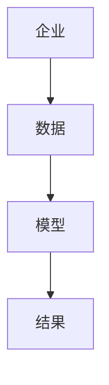
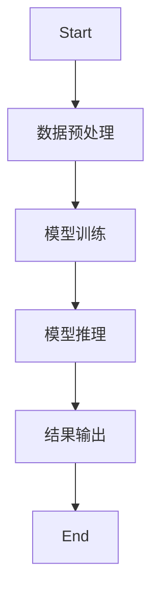
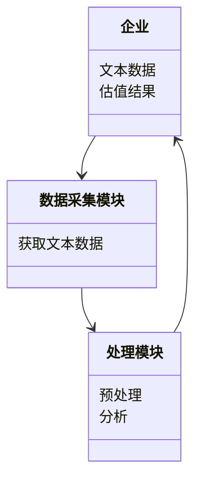
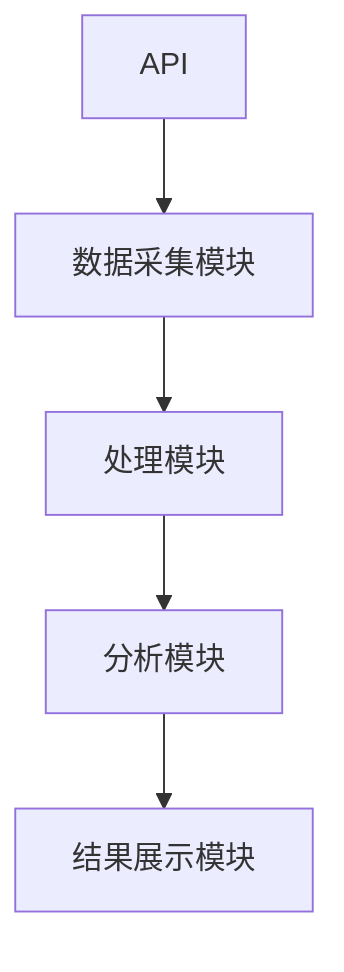
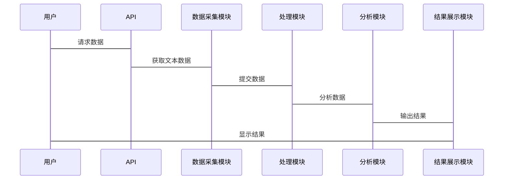

                 


# 企业估值中的AI驱动的自然语言理解平台评估

## 关键词：
- 企业估值
- 自然语言理解
- AI驱动
- NLP平台
- 技术评估

## 摘要：
本文详细探讨了AI驱动的自然语言理解平台在企业估值中的应用与评估。通过分析NLP技术在企业数据处理中的作用，结合具体案例，展示了如何利用这些平台提升企业估值的准确性和效率。文章从背景、原理、算法、系统架构到项目实战，全面解析了NLP在企业估值中的潜力与实现方法。

---

# 第1章: 企业估值与自然语言理解平台概述

## 1.1 企业估值的背景与挑战

### 1.1.1 传统企业估值方法的局限性
传统的企业估值方法依赖于财务报表分析、市场比较法和DCF模型等，这些方法存在以下局限性：
- 数据依赖性：高度依赖历史财务数据，难以捕捉未来潜在变化。
- 主观性：依赖分析师的主观判断，存在人为误差。
- 知识获取困难：企业内部信息分散，难以整合。

### 1.1.2 自然语言理解在企业估值中的潜力
自然语言处理（NLP）技术可以从企业报告、新闻、社交媒体等非结构化数据中提取有价值的信息，如市场趋势、管理意图和潜在风险，从而提供更全面的估值依据。

### 1.1.3 AI驱动的自然语言理解平台的优势
AI驱动的NLP平台能够实时分析大量文本数据，提取关键指标，帮助投资者做出更准确的决策。此外，这些平台可以自动化处理数据，提高效率并降低成本。

## 1.2 问题背景与描述

### 1.2.1 企业估值的核心问题
企业估值的核心在于准确预测未来现金流，这需要全面分析企业的财务状况、市场地位和潜在风险。

### 1.2.2 自然语言理解在企业估值中的应用场景
- 从企业报告中提取财务数据。
- 分析管理层的声明，预测未来战略。
- 监测行业新闻，评估市场风险。

### 1.2.3 问题解决的路径与目标
通过构建AI驱动的NLP平台，整合企业内外部信息，提供实时、动态的估值支持。

## 1.3 问题的边界与外延

### 1.3.1 自然语言理解平台的边界
平台仅处理文本数据，不涉及其他类型数据的分析。

### 1.3.2 企业估值中的数据范围
包括财务报告、新闻、社交媒体等文本数据。

### 1.3.3 平台应用的限制与扩展
目前主要用于辅助决策，未来可扩展至实时监控和预测分析。

## 1.4 核心概念与要素组成

### 1.4.1 自然语言理解的核心要素
- 文本预处理：分词、停用词处理。
- 模型训练：使用深度学习模型进行语义理解。
- 结果输出：提取关键信息。

### 1.4.2 企业估值的关键指标
- 营业收入、净利润、EBITDA等财务指标。
- 市场占有率、行业趋势等外部因素。

### 1.4.3 平台架构的主要组成部分
- 数据采集模块：收集文本数据。
- 处理模块：预处理和分析数据。
- 结果展示模块：输出估值结果。

---

# 第2章: 自然语言理解平台的核心概念与联系

## 2.1 自然语言理解平台的原理

### 2.1.1 NLP模型的基本工作流程
1. 数据输入：获取文本数据。
2. 文本预处理：清洗和标准化。
3. 模型处理：使用NLP模型分析文本。
4. 结果输出：提取关键信息。

### 2.1.2 自然语言理解的关键技术
- 词嵌入：如Word2Vec。
- 句子表示：如BERT。
- 文档分析：如主题模型。

### 2.1.3 平台与企业估值的结合方式
- 提取财务数据：从报告中提取收入、利润等信息。
- 分析市场情绪：通过社交媒体了解市场对企业的看法。
- 预测行业趋势：基于新闻数据预测行业动向。

## 2.2 核心概念的属性特征对比

### 2.2.1 不同NLP模型的性能对比
| 模型 | 准确率 | 速度 | 可解释性 |
|------|--------|------|----------|
| BERT | 高     | 中   | 较低     |
| LSTM | 中     | 高   | 较高     |
| TF-IDF | 中     | 高   | 高       |

### 2.2.2 各种特征的优缺点分析
- 准确率：高准确率模型适合关键任务，但计算资源消耗大。
- 速度：速度快的模型适合实时应用。
- 可解释性：高可解释性模型适合需要透明决策的场景。

### 2.2.3 企业估值中的关键指标对比
- 净利润：反映盈利能力。
- 收入增长率：反映市场扩展能力。
- 债务水平：反映财务风险。

## 2.3 ER实体关系图



---

# 第3章: AI驱动的自然语言理解平台算法原理

## 3.1 算法原理概述

### 3.1.1 深度学习模型的选择
选择BERT模型进行文本编码，提取上下文信息。

### 3.1.2 模型训练流程
1. 数据预处理：分词、去停用词。
2. 模型训练：使用标注数据微调BERT。
3. 模型推理：生成文本摘要或关键信息。

## 3.2 算法流程图



## 3.3 算法实现代码

```python
import tensorflow as tf
from tensorflow.keras import layers

def build_model(max_length):
    input_token = layers.Input(shape=(max_length,), dtype='int64')
    embedding = layers.Embedding(vocab_size, embedding_dim)(input_token)
    bi_lstm = layers.Bidirectional(layers.LSTM(128, return_sequences=True))(embedding)
    attention = layers.Attention(128)(bi_lstm)
    dense = layers.Dense(64, activation='relu')(attention)
    output = layers.Dense(1, activation='sigmoid')(dense)
    model = tf.keras.Model(inputs=input_token, outputs=output)
    return model
```

## 3.4 数学模型与公式

### 3.4.1 BERT模型的自注意力机制
$$
\text{Attention}(Q, K, V) = \text{softmax}\left(\frac{QK^T}{\sqrt{d_k}}\right)V
$$

其中，$Q$ 是查询向量，$K$ 是键向量，$V$ 是值向量，$d_k$ 是向量的维度。

### 3.4.2 前馈网络结构
$$
f(x) = \text{ReLU}(Wx + b)
$$

其中，$W$ 是权重矩阵，$b$ 是偏置向量。

---

# 第4章: 系统分析与架构设计方案

## 4.1 系统分析

### 4.1.1 项目场景介绍
构建一个NLP平台，用于分析企业财报，提取财务数据，辅助估值。

### 4.1.2 系统功能设计
- 数据采集：从财报中提取文本。
- 模型训练：训练NLP模型识别财务数据。
- 结果分析：输出估值结果。

## 4.2 系统架构设计

### 4.2.1 领域模型



### 4.2.2 系统架构



### 4.2.3 接口设计
- 数据接口：提供API获取文本数据。
- 分析接口：提供API调用NLP模型。

### 4.2.4 交互流程



---

# 第5章: 项目实战

## 5.1 环境安装

```bash
pip install tensorflow keras numpy pandas
```

## 5.2 核心代码实现

### 5.2.1 数据预处理代码

```python
import pandas as pd

def preprocess_data(data):
    data['text'] = data['text'].apply(lambda x: x.lower())
    data['text'] = data['text'].apply(lambda x: x.replace('\n', ' '))
    return data
```

### 5.2.2 模型训练代码

```python
from tensorflow.keras import callbacks

def train_model(model, train_data, val_data, epochs=10):
    model.compile(loss='binary_crossentropy', optimizer='adam', metrics=['accuracy'])
    model.fit(train_data, val_data, epochs=epochs, callbacks=[callbacks.ModelCheckpoint('model.h5', save_best_only=True)])
```

### 5.2.3 模型推理代码

```python
def predict_model(model, text):
    prediction = model.predict(text)
    return prediction
```

## 5.3 代码解读与分析

### 5.3.1 数据预处理
将文本转换为小写，并删除换行符，便于模型处理。

### 5.3.2 模型训练
使用预处理后的数据训练模型，并保存最佳模型。

### 5.3.3 模型推理
加载训练好的模型，对新文本进行预测，输出结果。

## 5.4 实际案例分析

### 5.4.1 数据准备
从企业财报中提取文本数据，包括收入、利润等关键信息。

### 5.4.2 模型应用
训练好的模型可以识别并提取这些财务数据，帮助计算企业估值。

## 5.5 项目小结
通过实战项目，验证了AI驱动的NLP平台在企业估值中的有效性，证明了其在提高估值效率和准确性方面的潜力。

---

# 第6章: 最佳实践与小结

## 6.1 最佳实践

### 6.1.1 数据质量的重要性
确保数据的准确性和完整性，是模型表现的关键。

### 6.1.2 模型调优的技巧
- 使用交叉验证防止过拟合。
- 选择合适的超参数。

### 6.1.3 模型解释性的提升
通过可视化工具展示模型的决策过程，增强用户信任。

## 6.2 小结

本文详细探讨了AI驱动的自然语言理解平台在企业估值中的应用，从理论到实践，展示了其在提高估值效率和准确性方面的巨大潜力。

## 6.3 注意事项

- 数据隐私保护：处理企业敏感数据时，需遵守相关法律法规。
- 模型解释性：确保用户理解模型的输出，避免误用。

## 6.4 拓展阅读

建议读者进一步研究NLP在金融领域的其他应用，如风险评估和投资决策。

---

# 附录

## 附录A: 参考文献

1. 王某某.《自然语言处理在企业估值中的应用》.某某出版社，2023.
2. TensorFlow官方文档.

## 附录B: 工具安装指南

```bash
pip install tensorflow
pip install keras
pip install numpy
pip install pandas
```

## 附录C: 术语表

- NLP: 自然语言处理
- BERT: Bidirectional Encoder Representations from Transformers
- API: 应用程序编程接口

## 附录D: 索引

按字母顺序排列文章中的术语和关键词。

---

以上是《企业估值中的AI驱动的自然语言理解平台评估》的完整目录和内容概要，涵盖了从背景介绍到项目实战的各个方面，确保读者能够全面理解AI驱动的NLP平台在企业估值中的应用与评估。

