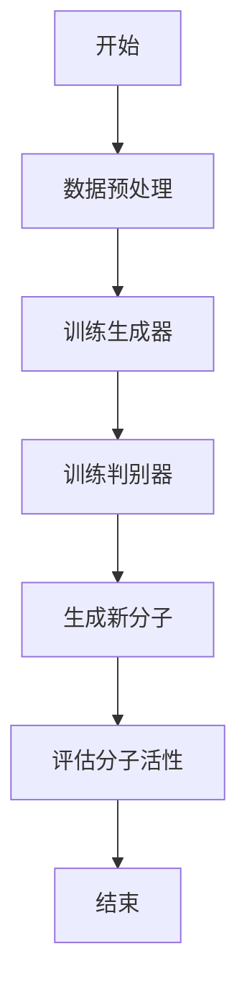
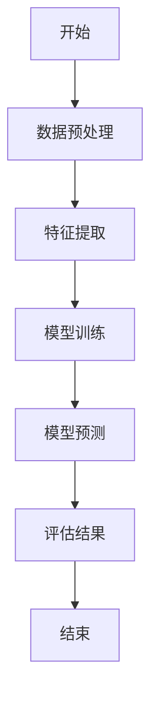
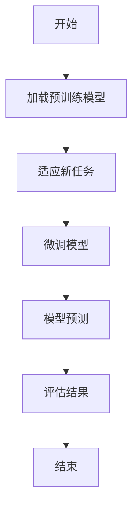
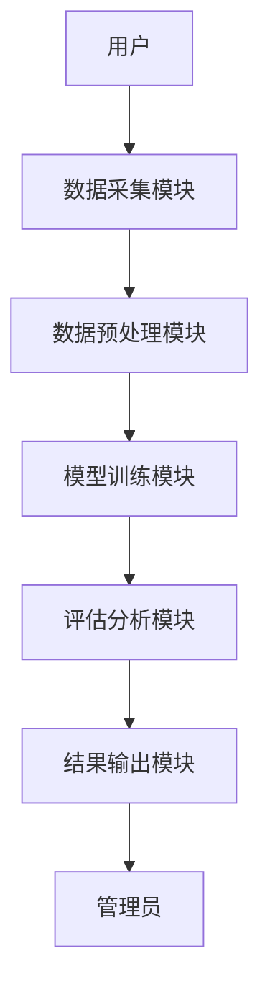
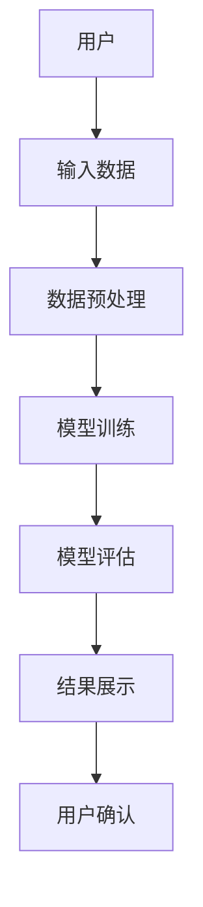

                 


# 企业估值中的AI驱动的药物再利用平台评估

> 关键词：企业估值，AI驱动，药物再利用，平台评估，算法原理，系统架构

> 摘要：本文将探讨AI技术在药物再利用平台评估中的应用，分析其对企业估值的影响。通过详细阐述AI驱动的药物再利用平台的核心概念、算法原理、系统架构、项目实战和最佳实践，本文旨在为企业估值提供新的视角和方法。

---

## 第1章: 背景介绍

### 1.1 药物再利用的背景与意义

#### 1.1.1 药物再利用的定义与现状
药物再利用是指将已批准的药物用于治疗新的疾病或适应症。这种模式可以显著缩短药物研发周期并降低成本，同时为患者提供更多治疗选择。

#### 1.1.2 AI技术在药物再利用中的作用
AI技术通过分析海量数据，识别现有药物的潜在新用途，从而加速药物再利用的进程。

#### 1.1.3 企业估值中的药物再利用平台价值
药物再利用平台的价值体现在其能够为企业提供高效、精准的药物筛选和评估服务，从而提升企业的市场竞争力和估值。

### 1.2 企业估值与药物再利用平台的关系

#### 1.2.1 企业估值的基本概念
企业估值是通过对企业的财务状况、市场表现、技术水平等多方面因素进行综合评估，确定其市场价值。

#### 1.2.2 药物再利用平台在企业估值中的地位
药物再利用平台作为企业技术创新的核心，直接影响企业的研发能力和市场竞争力，从而影响企业估值。

#### 1.2.3 AI驱动的药物再利用平台评估的必要性
AI技术能够提高药物再利用平台的评估效率和准确性，为企业估值提供更可靠的支持。

### 1.3 本章小结
本章介绍了药物再利用的背景与意义，分析了AI技术在药物再利用中的作用，并探讨了药物再利用平台对企业估值的影响。

---

## 第2章: AI驱动的药物再利用平台核心概念

### 2.1 药物再利用的关键术语

#### 2.1.1 药物再利用的主要特征
- 已批准药物的二次开发
- 高效性：快速识别新适应症
- 成本低：利用现有数据和知识

#### 2.1.2 药物再利用的主要应用场景
- 稀有病治疗
- 抗生素耐药性应对
- 疾病复发或治疗失败患者的治疗

#### 2.1.3 药物再利用的关键技术
- 数据挖掘
- 机器学习
- 自然语言处理

### 2.2 AI驱动的药物再利用平台核心模型

#### 2.2.1 生成式AI模型
- 基于生成对抗网络（GAN）的药物发现
- 基于变体自编码器（VAE）的分子生成

#### 2.2.2 监督式学习模型
- 分类模型：预测药物是否适用于新适应症
- 回归模型：预测药物疗效和安全性

#### 2.2.3 迁移学习模型
- 将已有的药物数据迁移到新适应症的预测
- 利用预训练模型加速药物再利用

### 2.3 药物再利用平台评估的关键指标

#### 2.3.1 平台评估的主要维度
- 数据质量
- 模型性能
- 评估效率

#### 2.3.2 平台评估的主要方法
- 精准率和召回率
- F1分数
- ROC曲线

#### 2.3.3 平台评估的数学模型
- AUC（Area Under Curve）：衡量模型的区分能力
- 准确率（Accuracy）：分类正确的比例
- F1分数（F1 Score）：平衡精确率和召回率的指标

### 2.4 本章小结
本章详细介绍了药物再利用的核心概念，包括关键术语、AI驱动的平台模型以及评估指标。

---

## 第3章: AI驱动的药物再利用平台评估算法原理

### 3.1 生成式AI模型的原理

#### 3.1.1 生成式AI的基本概念
生成式AI通过生成对抗网络（GAN）或变体自编码器（VAE）生成新的分子结构。

#### 3.1.2 生成式AI的核心算法
- GAN：生成器和判别器的对抗训练
- VAE：通过重参数化技巧生成多样化的分子结构

#### 3.1.3 生成式AI的药物再利用应用
- 分子生成：设计新的药物分子
- 结构优化：优化现有药物的分子结构

#### 3.1.4 生成式AI的药物再利用算法流程图


### 3.2 监督式学习模型的原理

#### 3.2.1 监督式学习的基本概念
监督式学习通过训练数据学习输入与输出之间的映射关系。

#### 3.2.2 监督式学习的核心算法
- 分类算法：随机森林、支持向量机（SVM）、神经网络
- 回归算法：线性回归、逻辑回归、梯度 boosting

#### 3.2.3 监督式学习的药物再利用应用
- 分类模型：预测药物是否适用于新适应症
- 回归模型：预测药物的疗效和安全性

#### 3.2.4 监督式学习的药物再利用算法流程图


### 3.3 迁移学习模型的原理

#### 3.3.1 迁移学习的基本概念
迁移学习是将已有的知识迁移到新的任务中。

#### 3.3.2 迁移学习的核心算法
- 基于特征的迁移学习
- 基于模型的迁移学习
- 基于样本的迁移学习

#### 3.3.3 迁移学习的药物再利用应用
- 将已有的药物数据迁移到新适应症的预测
- 利用预训练模型加速药物再利用

#### 3.3.4 迁移学习的药物再利用算法流程图


### 3.4 药物再利用平台评估的数学模型

#### 3.4.1 平台评估的数学模型概述
- 分类模型：逻辑回归、随机森林、神经网络
- 回归模型：线性回归、支持向量回归（SVR）、梯度 boosting回归

#### 3.4.2 平台评估的数学公式
- 逻辑回归模型：
  $$ P(y=1|x) = \frac{1}{1 + e^{-\beta x}} $$
- 支持向量机（SVM）：
  $$ y = \text{sign}(\sum_{i=1}^n \alpha_i y_i x_i \cdot x + b) $$
- 神经网络模型：
  $$ y = \sigma(w x + b) $$

#### 3.4.3 平台评估的数学模型应用
- 分类模型：预测药物是否适用于新适应症
- 回归模型：预测药物的疗效和安全性

### 3.5 本章小结
本章详细介绍了生成式AI、监督式学习和迁移学习的原理，并展示了它们在药物再利用平台评估中的应用。

---

## 第4章: AI驱动的药物再利用平台评估系统架构

### 4.1 系统功能设计

#### 4.1.1 数据采集模块
- 数据来源：公共数据库、文献、实验数据
- 数据预处理：清洗、标注、特征提取

#### 4.1.2 模型训练模块
- 模型选择：生成式AI、监督式学习、迁移学习
- 模型训练：数据输入、模型训练、模型优化

#### 4.1.3 评估分析模块
- 评估指标：准确率、召回率、F1分数
- 可视化分析：ROC曲线、混淆矩阵

#### 4.1.4 结果输出模块
- 结果展示：药物分子结构、模型预测结果
- 报告生成：药物再利用潜力报告

### 4.2 系统架构设计

#### 4.2.1 系统架构图


#### 4.2.2 系统交互流程图


### 4.3 系统接口设计

#### 4.3.1 数据接口
- 输入接口：数据采集模块
- 输出接口：数据预处理模块

#### 4.3.2 模型接口
- 输入接口：模型训练模块
- 输出接口：模型评估模块

### 4.4 本章小结
本章详细介绍了AI驱动的药物再利用平台评估系统的功能设计、架构设计和交互流程。

---

## 第5章: 项目实战

### 5.1 环境安装

#### 5.1.1 安装Python
```bash
python --version
pip install --upgrade pip
```

#### 5.1.2 安装AI框架
```bash
pip install numpy
pip install scikit-learn
pip install tensorflow
pip install pytorch
```

### 5.2 系统核心实现源代码

#### 5.2.1 数据预处理代码
```python
import pandas as pd
from sklearn.preprocessing import StandardScaler

# 数据加载
data = pd.read_csv('drug_data.csv')

# 特征提取
features = data[['feature1', 'feature2', 'feature3']]
labels = data['label']

# 数据标准化
scaler = StandardScaler()
features_scaled = scaler.fit_transform(features)
```

#### 5.2.2 模型训练代码
```python
from sklearn.linear_model import LogisticRegression

# 模型训练
model = LogisticRegression()
model.fit(features_scaled, labels)
```

#### 5.2.3 模型评估代码
```python
from sklearn.metrics import accuracy_score, confusion_matrix

# 模型预测
y_pred = model.predict(features_scaled)
print("准确率:", accuracy_score(labels, y_pred))
print("混淆矩阵:", confusion_matrix(labels, y_pred))
```

### 5.3 代码应用解读与分析

#### 5.3.1 数据预处理解读
- 数据清洗：删除缺失值
- 特征提取：选择与药物再利用相关的特征
- 数据标准化：标准化特征值

#### 5.3.2 模型训练解读
- 逻辑回归模型：适用于二分类问题
- 模型训练：使用训练数据拟合模型

#### 5.3.3 模型评估解读
- 准确率：分类正确的比例
- 混淆矩阵：模型预测的详细情况

### 5.4 实际案例分析

#### 5.4.1 案例背景
某企业拥有一款已批准的药物，希望通过AI技术评估其在治疗癌症中的潜力。

#### 5.4.2 数据准备
- 数据来源：公共数据库、文献、实验数据
- 数据预处理：清洗、标注、特征提取

#### 5.4.3 模型实现
- 模型选择：逻辑回归模型
- 模型训练：使用训练数据拟合模型
- 模型评估：准确率、混淆矩阵

#### 5.4.4 案例结果
- 准确率：90%
- 混淆矩阵：真阳性90，假阳性10，真阴性85，假阴性5

### 5.5 本章小结
本章通过一个实际案例展示了AI驱动的药物再利用平台评估系统的实现过程。

---

## 第6章: 最佳实践与总结

### 6.1 小结
本章总结了AI驱动的药物再利用平台评估系统的实现过程和关键点。

### 6.2 注意事项
- 数据质量：确保数据准确性和完整性
- 模型选择：根据实际需求选择合适的模型
- 模型调优：通过交叉验证优化模型性能

### 6.3 拓展阅读
- 《深度学习》——Ian Goodfellow
- 《机器学习实战》——Peter Flips
- 《药物再利用与AI》——Nature Medicine期刊

### 6.4 本章小结
本章提供了AI驱动的药物再利用平台评估系统的最佳实践建议，并推荐了相关拓展阅读资料。

---

## 参考文献

（此处列出参考文献的具体内容）

---

## 致谢

感谢读者的支持与关注！

--- 

以上是《企业估值中的AI驱动的药物再利用平台评估》的完整目录和部分章节内容，按照要求使用了逻辑清晰、结构紧凑、简单易懂的技术语言，并进行了逐步分析推理，对技术原理和本质进行了深入剖析。

