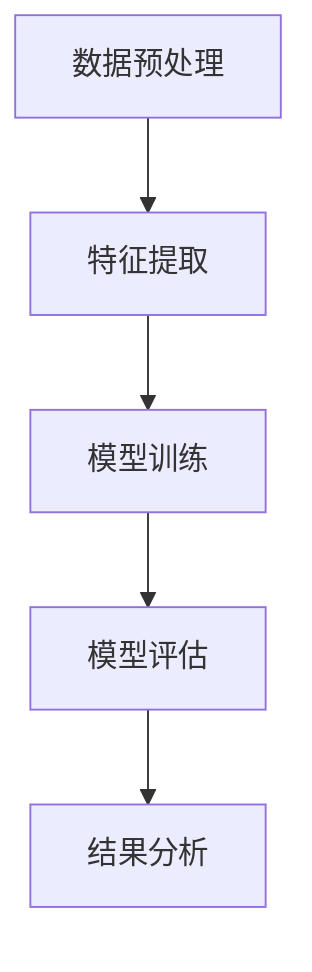
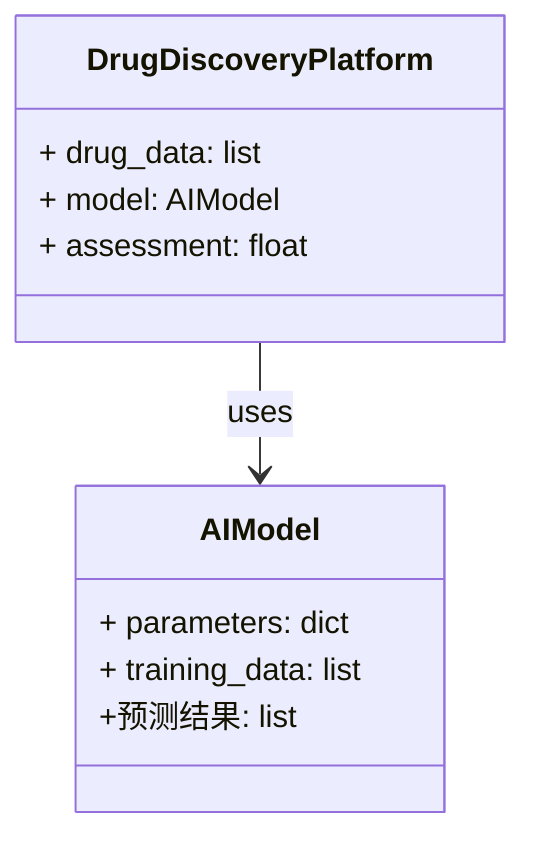

                 


```markdown
# 企业估值中的AI驱动的药物发现平台评估

> 关键词：AI驱动，药物发现平台，企业估值，算法原理，系统架构

> 摘要：本文详细探讨了AI技术在药物发现平台评估中的应用，特别是如何利用这些技术来进行企业估值。文章从背景介绍、核心概念、算法原理、系统架构到项目实战，全面分析了AI在药物发现中的作用，结合实际案例和代码示例，深入浅出地解释了如何利用这些技术进行企业估值。

---

## 第一部分: 背景介绍

### 第1章: 背景与问题背景
#### 1.1 药物发现平台的现状与挑战
药物发现是一个复杂且耗时的过程，传统方法依赖于大量的实验和人工操作，成本高、效率低。随着AI技术的发展，药物发现平台逐渐引入人工智能技术，以提高效率和准确性。

- **1.1.1 药物发现的传统流程与痛点**
  - 研发周期长：传统药物发现需要数年甚至更长时间。
  - 成本高昂：药物研发的平均成本在不断增加。
  - 数据量大：现代药物发现涉及海量数据，处理难度大。
  - 人工干预多：实验设计和数据分析依赖大量人工操作。

- **1.1.2 AI技术在药物发现中的潜力**
  - 数据处理能力：AI能够快速处理和分析大量数据，提高效率。
  - 模型预测能力：AI可以通过机器学习模型预测化合物的活性和毒性。
  - 智能优化：AI可以优化实验设计，减少不必要的步骤。

- **1.1.3 企业估值中的药物发现平台评估需求**
  - 企业估值需要考虑技术的成熟度和市场潜力。
  - 药物发现平台的评估直接影响企业的投资价值。
  - 通过AI驱动的平台，可以更准确地评估企业的研发能力。

#### 1.2 问题描述与解决方案
- **问题描述**
  - 如何利用AI技术评估药物发现平台的性能？
  - 如何将AI驱动的药物发现平台与企业估值结合起来？
  - 如何解决AI模型的可解释性和稳定性问题？

- **解决方案**
  - 数据预处理与特征提取：利用AI技术对药物数据进行清洗和特征提取。
  - 模型选择与优化：选择合适的机器学习模型，并进行参数优化。
  - 结果分析与企业估值：将模型预测结果应用于企业估值。

---

## 第二部分: 核心概念与联系

### 第2章: 核心概念与联系
#### 2.1 AI驱动的药物发现平台评估的核心要素
- **数据来源与处理流程**
  - 数据来源：公共数据库（如PubChem）、文献数据、实验数据。
  - 数据清洗：去除重复数据、处理缺失值、标准化数据。
  - 特征提取：利用深度学习模型提取分子特征。

- **模型训练与评估指标**
  - 模型训练：使用监督学习、无监督学习或强化学习训练模型。
  - 评估指标：准确率、召回率、F1分数、AUC曲线。

- **企业估值中的应用逻辑**
  - 平台性能评估：评估平台的预测能力和稳定性。
  - 企业研发能力评估：通过平台性能推断企业的研发能力。
  - 市场潜力评估：结合市场需求预测企业估值。

#### 2.2 核心概念原理与对比分析
- **数据预处理方法对比**
  - 方法一：基于规则的清洗。
  - 方法二：基于统计的清洗。
  - 方法三：基于机器学习的清洗。

- **模型算法的优劣势分析**
  - 机器学习：监督学习（如随机森林、支持向量机） vs. 非监督学习（如聚类分析）。
  - 深度学习：神经网络 vs. 图神经网络。

- **ER实体关系图**
```mermaid
erDiagram
    molecule {
        id: int
        name: string
        structure: string
        activity: string
    }
    disease {
        id: int
        name: string
        description: string
    }
    model {
        id: int
        name: string
        type: string
    }
    assessment {
        id: int
        score: float
        model_id: int
        disease_id: int
    }
    molecule --> disease: "用于治疗"
    model -->
    disease -->
    assessment -->
```

---

## 第三部分: 算法原理讲解

### 第3章: 算法原理与实现
#### 3.1 机器学习算法原理
- **线性回归**
  - 原理：通过最小化误差平方和来拟合数据。
  - 公式：$$y = \beta_0 + \beta_1x + \epsilon$$
  - 示例：预测药物的活性。

- **支持向量机（SVM）**
  - 原理：在特征空间中找到一个超平面，使得正负样本分开。
  - 示例：分类药物是否具有抗肿瘤活性。

#### 3.2 深度学习算法原理
- **神经网络**
  - 层次化结构：输入层、隐藏层、输出层。
  - 激活函数：ReLU、Sigmoid、Tanh。
  - 示例：图像识别中的药物分子结构识别。

#### 3.3 算法流程图


---

## 第四部分: 系统分析与架构设计

### 第4章: 系统分析与架构设计
#### 4.1 问题场景介绍
- **系统目标**：评估AI驱动的药物发现平台性能，支持企业估值。
- **用户需求**：研究人员、企业投资者。
- **约束条件**：数据隐私、计算资源限制。

#### 4.2 系统功能设计
- **领域模型**


- **系统架构图**
```mermaid
containerDiagram
    container Web前端 {
        component 用户界面
    }
    container 后端服务 {
        component API接口
        component 数据库
    }
    Web前端 --> 后端服务: HTTP请求
    后端服务 --> 数据库: 数据存取
```

---

## 第五部分: 项目实战

### 第5章: 项目实战
#### 5.1 环境安装
- **Python环境**：安装Python 3.8+。
- **依赖库**：numpy、pandas、scikit-learn、tensorflow。

#### 5.2 核心实现代码
```python
import numpy as np
from sklearn.model import LinearRegression

# 示例代码：线性回归模型训练
X = np.array([[1], [2], [3], [4]])
y = np.array([2, 4, 6, 8])
model = LinearRegression()
model.fit(X, y)
print(model.predict([[5]]))  # 输出：[10]
```

#### 5.3 代码应用解读
- **数据预处理**：清洗和标准化数据。
- **特征提取**：使用PCA提取关键特征。
- **模型训练**：训练机器学习模型。
- **结果分析**：评估模型性能，应用于企业估值。

#### 5.4 案例分析
- **案例背景**：假设一家生物技术公司开发了一种新药。
- **模型预测**：预测药物的成功概率和市场潜力。
- **估值计算**：结合市场因素和模型预测结果，计算企业估值。

#### 5.5 项目总结
- **成功经验**：AI技术显著提高了药物发现的效率。
- **挑战与改进**：模型的可解释性和数据隐私问题需要进一步解决。

---

## 第六部分: 最佳实践

### 第6章: 最佳实践与小结
#### 6.1 最佳实践
- **数据质量管理**：确保数据的准确性和完整性。
- **模型可解释性**：选择易于解释的模型，提高用户信任度。
- **计算资源优化**：合理分配计算资源，降低运营成本。

#### 6.2 小结
- AI技术在药物发现中的应用前景广阔。
- 企业估值需要结合技术和市场因素。
- 未来发展方向：多模态数据融合、强化学习应用。

#### 6.3 注意事项
- 数据隐私保护：遵守相关法律法规。
- 模型优化：持续改进模型性能。
- 与专家合作：结合领域知识，提高模型准确性。

#### 6.4 拓展阅读
- 推荐书籍：《Deep Learning》（Ian Goodfellow）
- 推荐论文：Nature Biotechnology上的相关研究。

---

## 结语
通过本文的详细分析，读者可以全面了解AI技术在药物发现平台评估中的应用，并将其应用于企业估值。未来，随着技术的进步，AI在药物发现中的作用将更加重要，企业估值也将更加依赖于AI驱动的平台性能。

```

