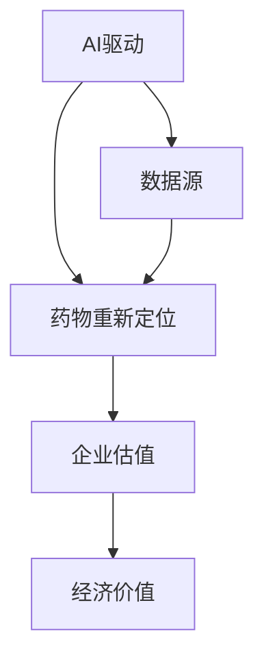
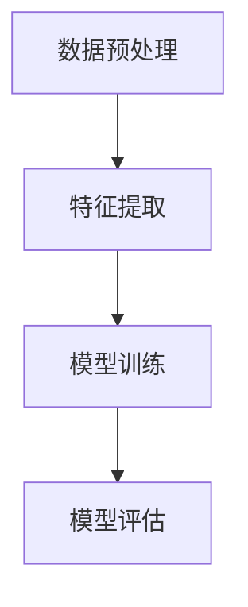
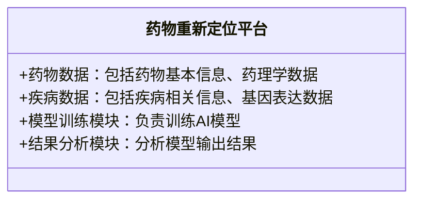
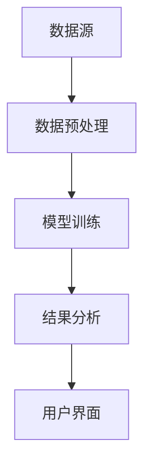
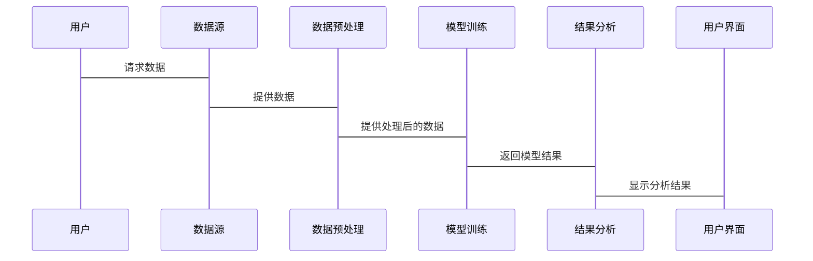

                 


# 企业估值中的AI驱动的药物重新定位平台评估

## 关键词：企业估值、AI驱动、药物重新定位、平台评估、机器学习、药物研发

## 摘要：本文探讨了AI技术在药物重新定位中的应用，重点分析了AI驱动的药物重新定位平台如何通过企业估值提升药物研发效率和经济价值。文章详细介绍了平台的核心概念、算法原理、系统架构及项目案例，为企业在药物研发中的决策提供深度洞察。

---

# 第1章: 背景介绍

## 1.1 药物重新定位的定义与背景

### 1.1.1 药物重新定位的定义
药物重新定位（Drug Repositioning）是指将已批准的药物用于治疗新的疾病或适应症的过程。这种方法可以显著缩短新药研发周期，降低成本。

### 1.1.2 药物重新定位的背景与意义
- **研发成本高昂**：传统药物研发周期长、成本高，AI技术的引入可以提高效率。
- **未满足的医疗需求**：许多疾病缺乏有效的治疗手段，AI驱动的药物重新定位为解决这一问题提供了新思路。

### 1.1.3 企业估值中的药物重新定位需求
企业通过药物重新定位可以快速进入新市场，提升产品线价值，从而影响企业估值。

## 1.2 AI在药物重新定位中的作用

### 1.2.1 AI技术在药物研发中的应用
AI技术可以用于数据分析、分子模拟、靶点识别等多个环节。

### 1.2.2 AI驱动药物重新定位的优势
- **数据驱动**：利用大量已有的药物数据，AI可以快速识别潜在的新适应症。
- **高效性**：AI算法可以快速筛选大量数据，缩短研发时间。

### 1.2.3 企业估值与药物重新定位的结合
AI驱动的药物重新定位可以帮助企业在短时间内找到高潜力的药物适应症，提升企业估值。

## 1.3 问题背景与目标

### 1.3.1 问题背景分析
传统药物研发周期长、成本高，企业需要寻找更高效的方法来提升研发效率。

### 1.3.2 问题描述与目标
目标是通过AI技术构建一个药物重新定位平台，评估其对企业估值的影响。

### 1.3.3 问题解决的路径
利用AI技术分析现有药物数据，识别潜在的新适应症，评估其市场价值。

## 1.4 药物重新定位平台的边界与外延

### 1.4.1 平台的边界定义
平台仅限于药物重新定位，不涉及药物的实际临床试验阶段。

### 1.4.2 平台的外延特征
平台可以与其他药物研发工具集成，扩展其应用范围。

### 1.4.3 平台与相关领域的联系
- **数据来源**：整合基因组学、蛋白质组学等多组学数据。
- **市场分析**：结合市场趋势和患者需求，评估药物的商业潜力。

## 1.5 核心概念与联系

### 1.5.1 核心概念的原理
AI驱动的药物重新定位平台通过分析海量数据，识别潜在的药物与疾病关联性。

### 1.5.2 核心概念的属性特征对比表
| 概念       | 属性       | 特征描述                     |
|------------|------------|------------------------------|
| AI驱动     | 数据驱动   | 利用机器学习算法进行预测     |
| 药物重新定位 | 疾病关联性 | 找到药物的新适应症           |
| 企业估值   | 经济价值   | 通过市场潜力提升企业价值     |

### 1.5.3 ER实体关系图


## 1.6 本章小结

---

# 第2章: AI驱动的药物重新定位平台评估的核心概念

## 2.1 药物重新定位的评估指标

### 2.1.1 评估指标的定义
评估指标包括预测准确性、计算效率、经济价值等多个维度。

### 2.1.2 评估指标的分类
- **技术指标**：如预测准确率、计算速度。
- **经济指标**：如市场潜力、投资回报率。

### 2.1.3 评估指标的计算方法
预测准确率 = 正确预测数 / 总预测数。

## 2.2 AI模型在药物重新定位中的应用

### 2.2.1 常见AI模型介绍
- **监督学习**：用于分类任务，如预测药物是否适用于特定疾病。
- **无监督学习**：用于聚类分析，发现药物与疾病之间的潜在关联。

### 2.2.2 模型选择的原则
根据数据类型和任务需求选择合适的模型。

### 2.2.3 模型评估的流程
1. 数据预处理：清洗和特征提取。
2. 模型训练：选择合适的算法进行训练。
3. 模型评估：使用验证集评估模型性能。

## 2.3 企业估值与

---

# 第3章: 算法原理

## 3.1 算法原理概述

### 3.1.1 机器学习算法在药物重新定位中的应用
- **监督学习**：用于分类任务，如预测药物是否适用于特定疾病。
- **无监督学习**：用于聚类分析，发现药物与疾病之间的潜在关联。

### 3.1.2 特征工程的重要性
特征工程是影响模型性能的关键因素，包括分子结构、疾病相关基因表达等。

## 3.2 机器学习算法的实现流程

### 3.2.1 数据预处理
```python
import pandas as pd
data = pd.read_csv('drug_data.csv')
data = data.dropna()
```

### 3.2.2 特征提取
```python
from sklearn.feature_selection import SelectKBest
selector = SelectKBest(k=10)
selected_features = selector.fit_transform(data, targets)
```

### 3.2.3 模型训练
```python
from sklearn.ensemble import RandomForestClassifier
model = RandomForestClassifier(n_estimators=100)
model.fit(selected_features, targets)
```

### 3.2.4 模型评估
```python
from sklearn.metrics import accuracy_score
预测结果 = model.predict(selected_features)
准确率 = accuracy_score(预测结果, targets)
print(准确率)
```

## 3.3 数学模型与公式

### 3.3.1 随机森林模型
随机森林是一种集成学习方法，通过组合多个决策树的结果来提高预测准确性。

### 3.3.2 支持向量机模型
支持向量机通过寻找数据的高维空间中的最大分割平面来进行分类。

## 3.4 机器学习算法的流程图


## 3.5 本章小结

---

# 第4章: 系统分析与架构设计方案

## 4.1 问题场景介绍
药物重新定位平台需要处理海量数据，包括药物信息、疾病数据、基因组数据等。

## 4.2 项目介绍
介绍AI驱动的药物重新定位平台的功能模块和目标。

## 4.3 系统功能设计

### 4.3.1 领域模型


### 4.3.2 系统架构设计


### 4.3.3 系统交互设计


## 4.4 本章小结

---

# 第5章: 项目实战

## 5.1 环境安装

### 5.1.1 安装Python和相关库
```bash
pip install numpy pandas scikit-learn
```

### 5.1.2 数据集获取
从公开数据库下载药物和疾病相关数据。

## 5.2 系统核心实现源代码

### 5.2.1 数据预处理
```python
import pandas as pd
data = pd.read_csv('drug_data.csv')
data = data.dropna()
```

### 5.2.2 模型训练
```python
from sklearn.ensemble import RandomForestClassifier
model = RandomForestClassifier(n_estimators=100)
model.fit(X_train, y_train)
```

### 5.2.3 结果分析
```python
from sklearn.metrics import accuracy_score
预测结果 = model.predict(X_test)
准确率 = accuracy_score(预测结果, y_test)
print(准确率)
```

## 5.3 代码应用解读与分析
详细解读代码的功能和实现过程。

## 5.4 实际案例分析
通过具体案例展示药物重新定位平台的实际应用效果。

## 5.5 本章小结

---

# 第6章: 最佳实践

## 6.1 小结
总结AI驱动的药物重新定位平台的核心价值和实际应用效果。

## 6.2 注意事项
- 数据质量的重要性
- 模型调优的技巧
- 结果解读的注意事项

## 6.3 拓展阅读
推荐相关的书籍和论文，供读者深入学习。

## 6.4 本章小结

---

# 第7章: 结论与展望

## 7.1 本研究的主要结论
总结本文的核心发现和研究成果。

## 7.2 对未来研究的展望
提出未来在AI驱动的药物重新定位平台评估方面的研究方向和挑战。

## 7.3 本章小结

---

# 参考文献

（此处列出相关的参考文献）

---

# 附录

## 附录A: 代码实现细节

## 附录B: 数据预处理步骤

## 附录C: 模型评估指标

---

通过以上章节的详细阐述，本文系统地介绍了AI驱动的药物重新定位平台评估的核心概念、算法原理、系统设计和实际应用，为企业估值提供了新的视角和方法。

