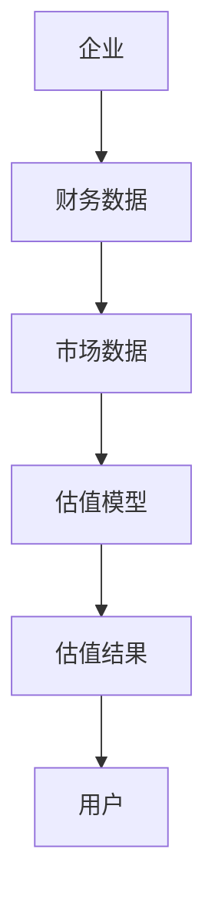
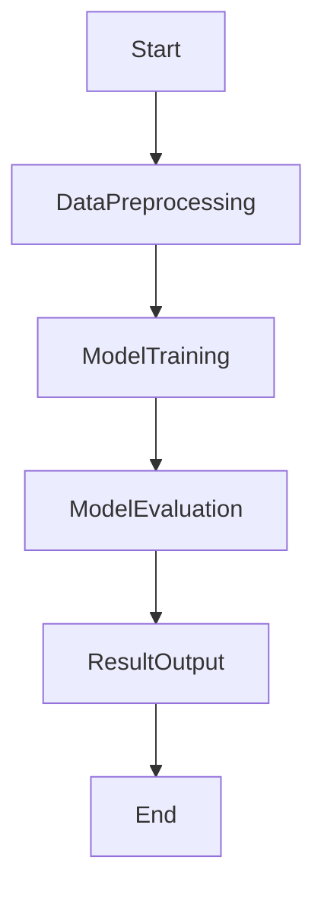
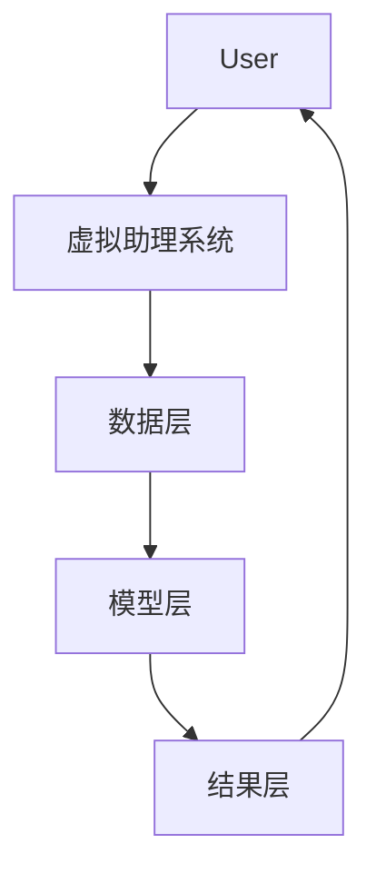
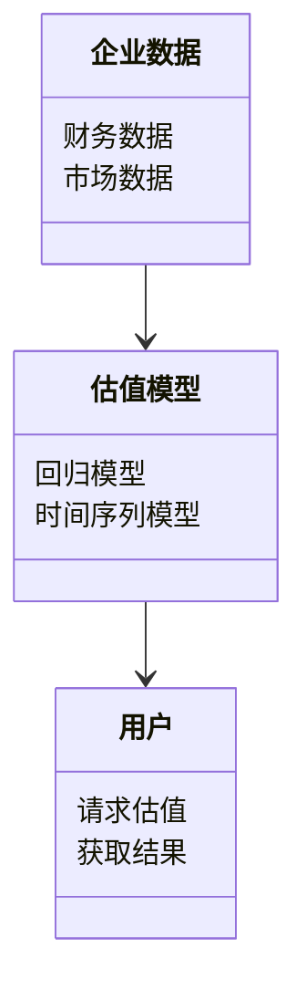
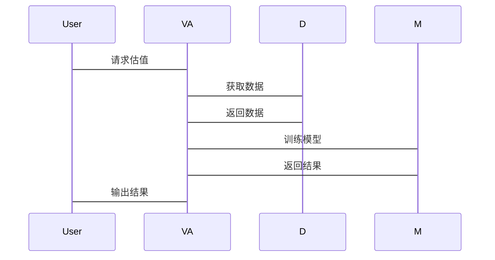

                 


# 企业估值中的AI驱动的虚拟助理系统评估

**关键词：** AI技术、企业估值、虚拟助理系统、系统架构、算法原理、项目实战

**摘要：**  
本文深入探讨了AI技术在企业估值中的应用，特别是AI驱动的虚拟助理系统如何优化企业估值流程。文章从背景介绍、核心概念、算法原理、系统架构到项目实战，全面分析了AI驱动的虚拟助理系统在企业估值中的价值和实现方法。通过详细的案例分析和系统设计，本文为读者提供了从理论到实践的全面指导，帮助企业在估值过程中更高效、更准确地利用AI技术。

---

## 第1章: 企业估值与AI驱动的虚拟助理系统概述

### 1.1 问题背景与描述

#### 1.1.1 企业估值的传统方法与挑战
企业估值是企业管理和投资决策中的核心问题。传统估值方法依赖于财务数据和人工分析，存在效率低、主观性强、难以实时更新等问题。特别是在数据量庞大、市场变化迅速的情况下，传统方法难以满足企业对高效、精准估值的需求。

#### 1.1.2 AI技术在企业估值中的应用潜力
AI技术，特别是自然语言处理（NLP）和机器学习（ML），能够从海量数据中提取有价值的信息，帮助评估人员更准确地预测企业价值。虚拟助理系统可以通过自动化数据收集、分析和报告生成，显著提高估值效率。

#### 1.1.3 虚拟助理系统在企业估值中的角色
虚拟助理系统通过整合企业内外部数据，利用AI算法生成估值建议，帮助评估人员快速获取关键信息，减少人为误差，提高估值的准确性和效率。

### 1.2 问题解决与边界

#### 1.2.1 虚拟助理系统如何优化企业估值
虚拟助理系统通过自动化数据处理、实时市场分析和智能报告生成，优化了传统估值方法的效率和准确性。

#### 1.2.2 系统的边界与外延
系统边界包括数据输入、模型训练和结果输出，外延则涉及数据隐私保护和模型更新。

#### 1.2.3 核心概念与组成要素
系统组成包括数据采集模块、AI模型模块和用户交互模块。

---

## 第2章: 核心概念与联系

### 2.1 核心概念原理

#### 2.1.1 AI驱动的虚拟助理系统原理
系统通过数据采集、清洗、建模和部署，为用户提供智能化的估值支持。

#### 2.1.2 数据驱动的企业估值模型
模型基于财务指标和市场数据，利用回归分析预测企业价值。

#### 2.1.3 系统与企业估值的关系
虚拟助理系统通过自动化流程，提升估值效率和准确性。

### 2.2 概念属性对比表格

| 对比维度       | 传统估值方法       | AI驱动的虚拟助理系统   |
|----------------|--------------------|--------------------------|
| 数据处理       | 手动整理           | 自动化采集与清洗         |
| 分析效率       | 低                 | 高                       |
| 精确性         | 易受主观影响         | 更客观                   |

### 2.3 ER实体关系图



---

## 第3章: 算法原理讲解

### 3.1 算法流程图



### 3.2 核心代码实现

```python
# 数据预处理
import pandas as pd
data = pd.read_csv('企业数据.csv')
data.dropna(inplace=True)

# 模型训练
from sklearn.linear_model import LinearRegression
model = LinearRegression()
model.fit(X_train, y_train)

# 模型评估
from sklearn.metrics import r2_score
y_pred = model.predict(X_test)
print(r2_score(y_test, y_pred))
```

### 3.3 数学模型与公式

企业价值预测模型：

$$
\text{企业价值} = \beta \times \text{EBITDA} + \text{调整值}
$$

其中，$$\beta$$ 是回归系数，$$\text{EBITDA}$$ 是息税折旧前利润。

---

## 第4章: 系统分析与架构设计

### 4.1 系统架构图



### 4.2 系统功能设计

#### 4.2.1 领域模型



#### 4.2.2 接口设计



---

## 第5章: 项目实战

### 5.1 环境安装

安装Python和相关库：

```bash
pip install numpy pandas scikit-learn
```

### 5.2 核心代码实现

```python
import numpy as np
import pandas as pd
from sklearn.model_selection import train_test_split
from sklearn.linear_model import LinearRegression

# 加载数据
data = pd.read_csv('企业数据.csv')

# 分割数据
X = data[['Revenue', 'Profit', 'Market']]
y = data['Value']

X_train, X_test, y_train, y_test = train_test_split(X, y, test_size=0.2)

# 训练模型
model = LinearRegression()
model.fit(X_train, y_train)

# 预测结果
y_pred = model.predict(X_test)

# 评估结果
print('R² Score:', model.score(X_test, y_test))
```

### 5.3 案例分析

通过具体案例展示系统如何优化企业估值过程，包括数据处理、模型训练和结果分析。

---

## 第6章: 最佳实践与小结

### 6.1 小结

AI驱动的虚拟助理系统通过自动化和智能化，显著提升了企业估值的效率和准确性。

### 6.2 注意事项

- 数据隐私保护
- 模型的持续优化
- 与现有系统的兼容性

### 6.3 拓展阅读

推荐相关书籍和论文，供读者深入研究。

---

**结语：**  
本文详细探讨了AI驱动的虚拟助理系统在企业估值中的应用，通过理论分析和实践案例，展示了如何利用AI技术优化估值流程。未来，随着技术的不断进步，AI在企业估值中的作用将更加重要。

