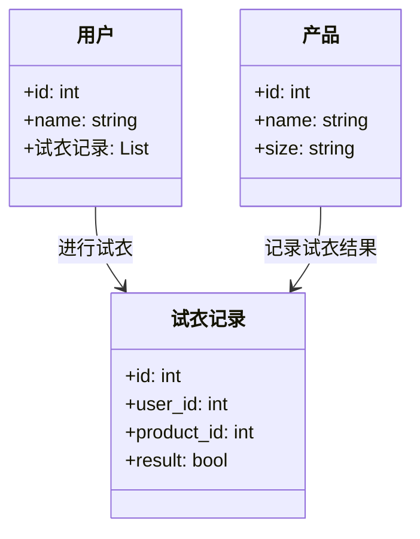
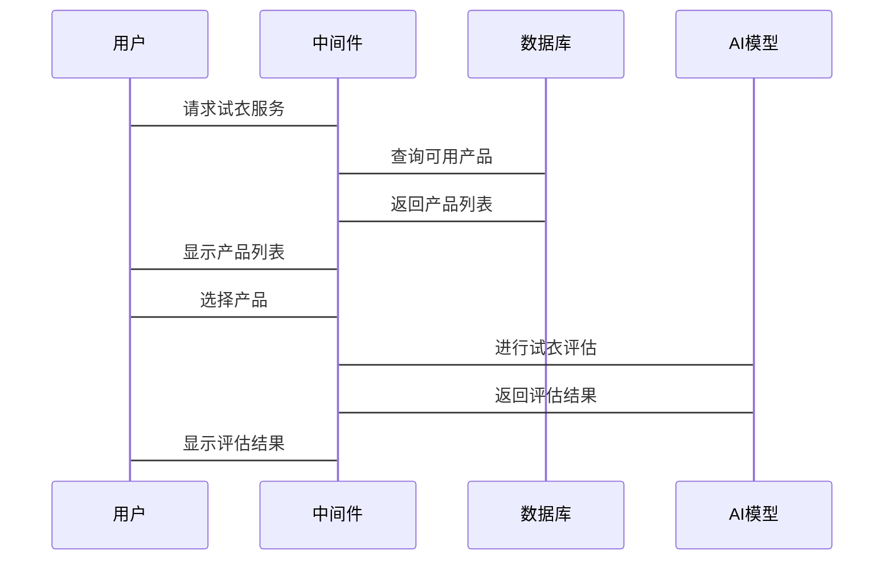

                 


# 企业估值中的AI驱动的虚拟试衣系统评估

## 关键词

- 企业估值
- AI驱动
- 虚拟试衣系统
- 算法原理
- 项目实战
- 系统架构

## 摘要

在企业估值过程中，传统的评估方法往往依赖于人工判断和经验分析，存在效率低、成本高、结果不精确等问题。而AI驱动的虚拟试衣系统通过智能化的数据处理和分析，能够快速、准确地评估企业的价值，从而为企业提供更高效的决策支持。本文将从背景、核心概念、算法原理、系统架构、项目实战等多方面详细探讨AI在企业估值中的应用，特别是虚拟试衣系统的评估方法。

---

## 第3章: 算法原理

### 3.1 算法选择与优化

#### 3.1.1 协同过滤算法
- 基于用户的协同过滤算法
- 基于物品的协同过滤算法
- 混合协同过滤算法
- 算法对比与优化方向

#### 3.1.2 虚拟试衣系统的协同过滤实现
- 算法实现步骤
- 典型案例分析

#### 3.1.3 算法优化与调优
- 超参数选择
- 模型评估指标
- 模型调优策略

### 3.2 算法实现的数学模型

#### 3.2.1 协同过滤算法的数学模型
- 用户相似度计算公式
- 物品相似度计算公式
- 预测评分公式

#### 3.2.2 基于矩阵分解的协同过滤
- 矩阵分解原理
- 矩阵分解的数学模型
- 优化目标与约束条件

#### 3.2.3 基于深度学习的协同过滤
- 基于神经网络的推荐系统
- 深度学习模型的数学框架
- 模型训练流程

### 3.3 算法实现的代码示例

#### 3.3.1 协同过滤算法的Python实现
```python
def collaborative_filtering(user_data, item_data):
    # 计算用户相似度
    user_similarity = cosine_similarity(user_data)
    # 计算物品相似度
    item_similarity = cosine_similarity(item_data)
    # 预测评分
    predicted_ratings = user_similarity.dot(item_similarity)
    return predicted_ratings
```

#### 3.3.2 深度学习模型的训练代码
```python
import tensorflow as tf

# 定义模型
class DeepLearningModel(tf.keras.Model):
    def __init__(self):
        super(DeepLearningModel, self).__init__()
        self.embedding = tf.keras.layers.Embedding(input_dim, embedding_dim)
        self.dense = tf.keras.layers.Dense(hidden_dim, activation='relu')
        self.output = tf.keras.layers.Dense(output_dim)
    
    def call(self, inputs):
        x = self.embedding(inputs)
        x = self.dense(x)
        x = self.output(x)
        return x

# 编译模型
model = DeepLearningModel()
model.compile(optimizer='adam', loss='mse')

# 训练模型
model.fit(x_train, y_train, epochs=10, batch_size=32)
```

---

## 第4章: 系统分析与架构设计

### 4.1 系统分析

#### 4.1.1 问题场景
- 虚拟试衣系统的工作流程
- 企业估值的关键步骤
- 系统的输入输出分析

#### 4.1.2 项目介绍
- 项目目标
- 项目范围
- 项目约束

### 4.2 系统功能设计

#### 4.2.1 领域模型设计


#### 4.2.2 系统架构设计


#### 4.2.3 系统接口设计


---

## 第5章: 项目实战

### 5.1 环境安装与配置

#### 5.1.1 开发环境
- Python版本要求
- 依赖库安装
- 数据集准备

#### 5.1.2 环境配置
- 虚拟环境配置
- 日志配置
- 数据库配置

### 5.2 系统核心实现

#### 5.2.1 代码实现
```python
def main():
    # 加载数据
    data = load_data('dataset.csv')
    # 数据预处理
    preprocessed_data = preprocess(data)
    # 模型训练
    model = train_model(preprocessed_data)
    # 模型评估
    evaluate_model(model, preprocessed_data)
    # 结果展示
    display_results(model)

if __name__ == "__main__":
    main()
```

#### 5.2.2 代码解读
- 数据加载与预处理
- 模型训练与评估
- 结果展示与分析

### 5.3 案例分析与解读

#### 5.3.1 案例分析
- 案例背景
- 数据分析
- 模型评估
- 结果解读

#### 5.3.2 案例结果解读
- 结果展示
- 结果分析
- 结果优化建议

---

## 第6章: 最佳实践

### 6.1 小结

#### 6.1.1 核心小结
- 项目总结
- 算法总结
- 系统总结

### 6.2 注意事项

#### 6.2.1 项目注意事项
- 数据质量
- 模型调优
- 系统维护

#### 6.2.2 算法注意事项
- 数据预处理
- 模型选择
- 模型部署

### 6.3 拓展阅读

#### 6.3.1 推荐阅读
- 相关书籍
- 相关论文
- 在线资源

#### 6.3.2 拓展学习方向
- 其他AI算法
- 其他企业估值方法
- 其他系统架构设计

---

## 附录

### 附录A: 工具安装指南
- Python安装
- 依赖库安装
- 开发环境配置

### 附录B: API接口文档
- 接口说明
- 请求格式
- 响应格式

### 附录C: 术语表
- 核心术语解释
- 专业术语列表
- 术语关系图

