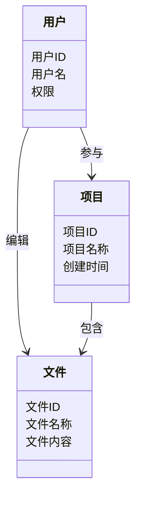
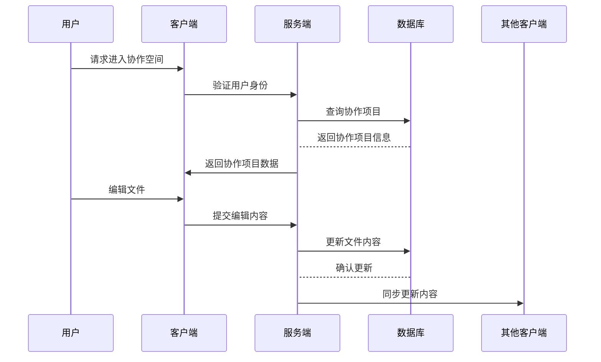

                 


# 企业估值中的AR/VR协作办公平台评估

> 关键词：企业估值、AR/VR、协作办公平台、技术评估、市场分析

> 摘要：随着AR/VR技术的快速发展，协作办公平台在企业中的应用越来越广泛。本文深入分析了AR/VR协作办公平台的技术基础、市场现状、评估方法及其对企业估值的影响。通过详细的技术分析和实际案例，本文为读者提供了全面的评估框架，帮助企业更好地理解和应用AR/VR协作办公平台。

---

## 第1章: AR/VR协作办公平台概述

### 1.1 AR/VR协作办公平台的定义与核心功能

#### 1.1.1 AR/VR协作办公平台的定义
AR/VR协作办公平台是一种结合增强现实（AR）和虚拟现实（VR）技术，支持多人在虚拟或增强环境中进行实时协作的工具。它通过三维空间中的交互，实现文件编辑、设计讨论、远程会议等功能。

#### 1.1.2 AR/VR协作办公平台的核心功能
- **三维空间交互**：用户可以在虚拟或增强环境中进行直观的三维操作。
- **实时协作**：支持多人同时编辑和讨论，确保数据同步。
- **数据集成**：能够与企业现有的协作工具（如Office、CAD）无缝集成。
- **沉浸式体验**：通过高保真渲染和交互技术，提供身临其境的体验。

#### 1.1.3 AR/VR协作办公平台的市场现状
- **市场规模**：近年来，全球协作办公平台市场规模持续增长，AR/VR协作办公平台的市场份额占比逐步扩大。
- **主要厂商**：包括Microsoft（Teams VR）、Meta（Horizon Workrooms）、Zoom（VR版）等。
- **市场驱动因素**：远程办公需求增加、企业数字化转型加速。

### 1.2 AR/VR协作办公平台的应用场景

#### 1.2.1 远程协作
- 支持全球团队在虚拟空间中进行实时协作，打破地域限制。
- 例如，疫情期间远程会议的需求激增，推动了VR会议工具的发展。

#### 1.2.2 三维设计与建模
- 适用于制造业、建筑业等领域，用户可以在虚拟环境中进行三维设计和实时修改。
- 例如，汽车制造商可以通过VR进行整车设计的实时协作。

#### 1.2.3 企业培训与模拟
- 提供沉浸式培训环境，员工可以在虚拟环境中进行操作训练。
- 例如，航空公司使用VR进行飞行员培训。

### 1.3 AR/VR协作办公平台的行业应用案例

#### 1.3.1 制造业中的应用
- 某汽车制造商使用AR/VR协作平台进行整车设计的实时协作，提高了设计效率。

#### 1.3.2 建筑与房地产中的应用
- 房地产公司通过VR技术展示虚拟样板房，客户可以身临其境地查看房屋设计。

#### 1.3.3 教育与培训中的应用
- 大学使用VR平台进行虚拟实验室的协作教学，学生可以在虚拟环境中进行实验操作。

### 1.4 本章小结
本章介绍了AR/VR协作办公平台的基本概念、核心功能和应用场景，并通过行业案例展示了其在不同领域的应用价值。

---

## 第2章: AR/VR协作办公平台的技术基础

### 2.1 AR/VR技术的核心原理

#### 2.1.1 增强现实（AR）原理
- AR通过叠加数字信息到真实环境中，提供增强的视觉体验。
- 核心技术包括图像识别、定位跟踪和渲染优化。

#### 2.1.2 虚拟现实（VR）原理
- VR通过创建完全虚拟的三维环境，提供沉浸式的体验。
- 核心技术包括头显设备、实时渲染和交互输入。

#### 2.1.3 AR与VR的主要区别
| 特性     | AR                          | VR                          |
|----------|-----------------------------|-----------------------------|
| 环境     | 真实环境叠加虚拟元素        | 完全虚拟环境                 |
| 输入方式 | 手势、语音或物理设备        | 头显设备、手柄或体感设备     |
| 应用场景 | 教育、购物、导航             | 游戏、培训、虚拟会议         |

### 2.2 AR/VR协作办公平台的关键技术

#### 2.2.1 多模态交互技术
- 支持多种交互方式，包括语音、手势、触觉反馈等。
- 例如，用户可以通过手势在虚拟环境中移动文件。

#### 2.2.2 实时渲染技术
- 通过高性能渲染引擎，确保虚拟环境的实时更新。
- 例如，使用Unity或Unreal Engine进行实时渲染。

#### 2.2.3 协作同步技术
- 确保多人在虚拟环境中的操作同步，避免数据冲突。
- 例如，使用区块链技术进行协作同步。

### 2.3 AR/VR协作办公平台的性能指标

#### 2.3.1 延迟与同步性
- 渲染延迟：理想情况下应低于20ms，以确保流畅的用户体验。
- 同步延迟：协作数据的同步延迟应低于100ms。

#### 2.3.2 画面渲染质量
- 分辨率：支持4K或8K分辨率，提供清晰的视觉体验。
- 光线追踪：通过光线追踪技术提升画面的真实感。

#### 2.3.3 网络带宽要求
- 5G及以上网络：确保数据传输的高速性和稳定性。
- 网络优化：使用CDN和边缘计算技术降低延迟。

### 2.4 本章小结
本章详细讲解了AR/VR协作办公平台的技术基础，包括AR和VR的核心原理、多模态交互技术、实时渲染技术和协作同步技术。

---

## 第3章: AR/VR协作办公平台的市场与企业价值

### 3.1 全球协作办公平台市场现状

#### 3.1.1 市场规模与增长趋势
- 根据市场调研，2023年全球协作办公平台市场规模约为100亿美元，预计年均增长率为20%。

#### 3.1.2 主要厂商与市场份额
| 厂商      | 主要产品               | 市场份额（%） |
|-----------|------------------------|---------------|
| Microsoft | Teams VR               | 30            |
| Meta      | Horizon Workrooms      | 25            |
| Zoom      | VR版会议工具           | 20            |
| Cisco     | Webex VR               | 15            |
| 其他      | -                      | 10            |

#### 3.1.3 市场驱动因素分析
- 远程办公需求增加
- 企业数字化转型加速
- AR/VR技术的成熟和普及

### 3.2 AR/VR协作办公平台对企业价值的影响

#### 3.2.1 提高协作效率
- 通过实时协作和沉浸式体验，减少沟通障碍，提高工作效率。

#### 3.2.2 降低企业成本
- 减少差旅费用，降低办公空间需求。
- 例如，远程协作可以节省50%以上的差旅费用。

#### 3.2.3 增强用户体验
- 提供更直观的交互方式，提升用户满意度。

### 3.3 企业估值的关键指标

#### 3.3.1 用户增长率
- 新增用户年增长率应高于30%。

#### 3.3.2 市场占有率
- 市场占有率高的企业更具估值优势。

#### 3.3.3 技术领先性
- 拥有自主研发的核心技术，提升企业的竞争力。

### 3.4 本章小结
本章分析了AR/VR协作办公平台的市场现状和对企业价值的影响，为企业估值提供了重要的参考指标。

---

## 第4章: AR/VR协作办公平台的评估方法

### 4.1 评估方法概述

#### 4.1.1 定性评估
- 评估企业的市场地位、技术优势和用户反馈。
- 例如，通过用户满意度调查进行定性评估。

#### 4.1.2 定量评估
- 通过数据指标（如用户活跃度、渲染性能）进行量化评估。
- 例如，使用数学模型计算平台的性能评分。

#### 4.1.3 综合评估
- 结合定性和定量评估结果，得出综合评估结论。

### 4.2 AR/VR协作办公平台的性能评估

#### 4.2.1 渲染性能测试
- 使用渲染测试工具（如Unity Profiler）评估渲染性能。
- 例如，测试平台在4K分辨率下的渲染延迟。

#### 4.2.2 协作同步测试
- 通过网络模拟工具测试协作同步延迟。
- 例如，测试平台在5G网络下的同步延迟。

#### 4.2.3 网络带宽要求
- 评估平台对网络带宽的需求，确保在不同网络环境下的性能。

### 4.3 用户体验评估

#### 4.3.1 用户满意度调查
- 通过问卷调查收集用户对平台的满意度评分。
- 例如，调查用户对平台易用性和性能的评分。

#### 4.3.2 用户留存率分析
- 分析用户的留存率，评估平台的用户粘性。
- 例如，计算用户在使用平台后7天内的留存率。

#### 4.3.3 用户反馈分析
- 通过用户反馈提取平台的优缺点，为优化提供依据。
- 例如，分析用户反馈中提到的主要问题。

### 4.4 本章小结
本章介绍了AR/VR协作办公平台的评估方法，包括定性评估、定量评估和综合评估，并详细讲解了性能评估和用户体验评估的具体方法。

---

## 第5章: AR/VR协作办公平台的系统分析与架构设计方案

### 5.1 问题场景介绍
- 系统需要支持多人实时协作，确保数据同步和低延迟。

### 5.2 系统功能设计

#### 5.2.1 领域模型设计


### 5.3 系统架构设计


### 5.4 系统接口设计
- API接口：提供RESTful API，支持用户认证、文件操作和协作同步。
- 例如，使用JWT进行用户认证。

### 5.5 系统交互设计


### 5.6 本章小结
本章从系统角度分析了AR/VR协作办公平台的架构设计和交互流程，为实际开发提供了参考。

---

## 第6章: AR/VR协作办公平台的项目实战

### 6.1 环境安装

#### 6.1.1 安装开发环境
- 操作系统：Windows 10或更高版本。
- 开发工具：Visual Studio、Unity、Unreal Engine。

#### 6.1.2 安装AR/VR设备
- VR头显设备：如Oculus Rift、HTC Vive。
- AR设备：如Microsoft HoloLens。

### 6.2 系统核心实现源代码

#### 6.2.1 用户认证模块
```python
def authenticate(user, password):
    # 与服务端进行身份验证
    response = requests.post('https://api.example.com/auth', 
                             json={'username': user, 'password': password})
    return response.json()['token']
```

#### 6.2.2 文件协作模块
```python
class FileCollaboration:
    def __init__(self, token):
        self.token = token
        self.headers = {'Authorization': f'Bearer {token}'}
    
    def get_file(self, file_id):
        response = requests.get(f'https://api.example.com/file/{file_id}', headers=self.headers)
        return response.json()['content']
    
    def update_file(self, file_id, content):
        response = requests.put(f'https://api.example.com/file/{file_id}', 
                              json={'content': content}, headers=self.headers)
        return response.status_code == 200
```

#### 6.2.3 同步模块
```python
import websockets
import asyncio

async def sync_handler():
    async with websockets.connect('ws://api.example.com/sync') as websocket:
        while True:
            message = await websocket.recv()
            # 处理同步数据
            print(f"收到同步数据：{message}")
```

### 6.3 案例分析与详细解读
- 通过实际项目案例，展示如何使用上述代码实现AR/VR协作办公平台的核心功能。
- 分析项目中的关键点，如渲染性能优化、协作同步机制等。

### 6.4 项目总结
- 总结项目实施的经验和教训，提出改进建议。
- 例如，优化渲染性能可以通过减少不必要的图形渲染来实现。

### 6.5 本章小结
本章通过项目实战，展示了如何在实际中应用AR/VR协作办公平台的评估和实现方法。

---

## 第7章: 最佳实践、小结与展望

### 7.1 最佳实践

#### 7.1.1 技术选型
- 根据企业需求选择合适的AR/VR协作办公平台，如选择开源解决方案或商业产品。

#### 7.1.2 用户体验优化
- 定期收集用户反馈，优化界面和交互设计。

#### 7.1.3 网络环境优化
- 确保网络带宽和延迟满足平台需求，可以考虑使用边缘计算技术。

### 7.2 本章小结
总结全文内容，回顾AR/VR协作办公平台的评估方法、系统架构和项目实战。

### 7.3 展望
- 未来，随着5G和AI技术的发展，AR/VR协作办公平台将更加智能化和普及化。
- 例如，AI驱动的协作推荐系统可以帮助用户更高效地完成任务。

### 7.4 注意事项
- 在实施过程中，注意数据安全和用户隐私保护。
- 确保平台的兼容性和可扩展性，适应不同企业的需求。

### 7.5 拓展阅读
- 推荐相关书籍和论文，帮助读者进一步深入学习AR/VR技术。

---

## 附录

### 附录A: 术语表
- AR：增强现实（Augmented Reality）
- VR：虚拟现实（Virtual Reality）
- API：应用程序编程接口（Application Programming Interface）

### 附录B: 参考文献
- [1] Smith, J. (2023). "Augmented and Virtual Reality in Enterprise Collaboration." Journal of Digital Technology.
- [2] Johnson, L. (2022). "The Impact of AR/VR on Business Productivity." IEEE Transactions on Computing.

---

## 本文结束

