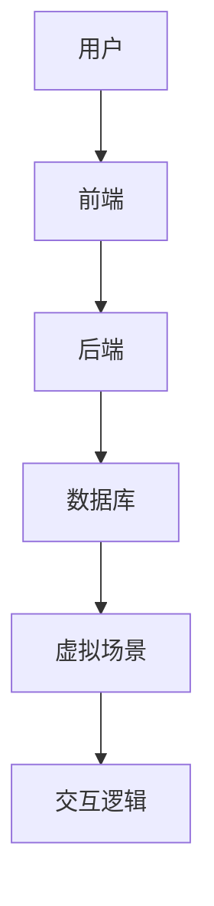
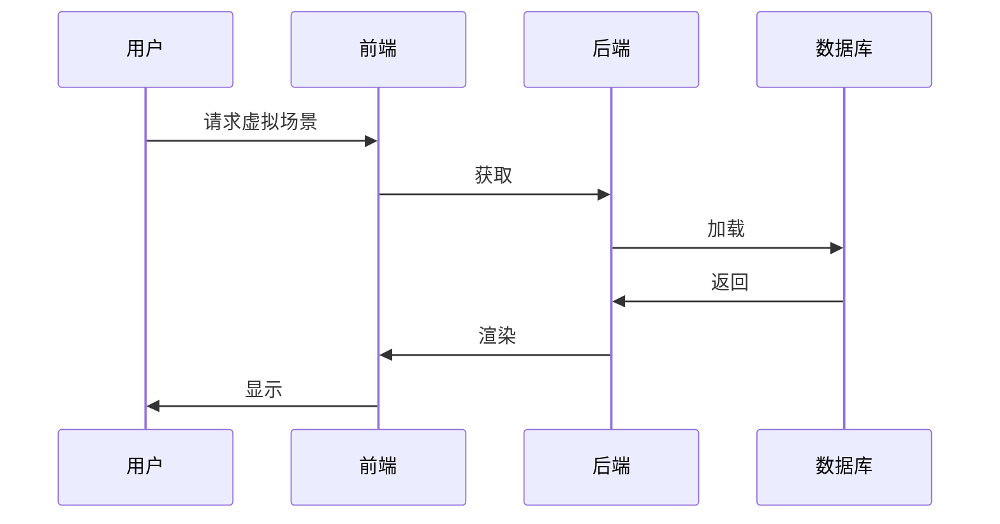

                 


# 企业估值中的AR/VR虚拟旅游平台评估

> **关键词**：企业估值、AR/VR、虚拟旅游平台、算法原理、系统架构、数学模型

> **摘要**：随着AR/VR技术的快速发展，虚拟旅游平台在企业估值中的应用越来越广泛。本文从AR/VR技术的核心原理出发，结合虚拟旅游平台的系统架构与算法模型，详细分析其在企业估值中的价值。通过实际案例与代码实现，深入探讨AR/VR技术如何助力企业评估虚拟旅游平台的潜力与优势。

---

# 第一部分: 企业估值中的AR/VR虚拟旅游平台背景与概念

## 第1章: AR/VR技术与虚拟旅游平台概述

### 1.1 AR/VR技术的基本概念

#### 1.1.1 增强现实（AR）与虚拟现实（VR）的定义

- **增强现实（AR）**：通过计算机技术将虚拟信息叠加到真实环境中，用户可以通过设备（如手机、平板或智能眼镜）看到叠加在现实世界上的虚拟内容。
  
  > AR的核心是“叠加”，用户仍然可以看到真实世界，同时叠加虚拟信息。

- **虚拟现实（VR）**：通过模拟环境创建一个完全虚拟的世界，用户通过VR设备（如头显）完全沉浸在这个虚拟环境中。

  > VR的核心是“沉浸”，用户完全脱离真实世界，进入虚拟空间。

#### 1.1.2 AR/VR技术的核心特征

| 特征 | 描述 |
|------|------|
| **沉浸性** | 用户能够完全或部分沉浸在一个虚拟环境中。 |
| **交互性** | 用户可以通过手柄、手势或语音与虚拟环境进行互动。 |
| **实时性** | AR/VR系统的反应速度必须足够快，以提供流畅的用户体验。 |
| **空间感知** | 系统能够感知用户的位置和环境，提供精准的虚拟内容叠加。 |

#### 1.1.3 AR/VR与传统旅游平台的区别

- **传统旅游平台**：基于网页或应用程序，提供文字、图片和视频等内容，用户只能通过屏幕查看虚拟内容。
  
- **AR/VR虚拟旅游平台**：用户通过AR/VR设备，可以在现实中看到虚拟的景点、酒店或旅游信息，提供更直观的体验。

---

### 1.2 虚拟旅游平台的定义与应用场景

#### 1.2.1 虚拟旅游平台的定义

- **定义**：虚拟旅游平台是基于AR/VR技术，为用户提供沉浸式或增强式的旅游体验的在线平台。用户可以通过设备“访问”虚拟景点、酒店或旅游目的地，进行虚拟游览和体验。

#### 1.2.2 虚拟旅游平台的主要应用场景

| 场景 | 描述 |
|------|------|
| **景点游览** | 用户可以通过VR设备“游览”虚拟景点，如虚拟参观博物馆或名胜古迹。 |
| **酒店体验** | 用户可以虚拟进入酒店房间，查看房间布局和设施。 |
| **旅游规划** | 用户可以虚拟体验不同目的地的环境，帮助制定旅游计划。 |
| **教育与培训** | 用户可以通过VR技术进行导游培训或旅游安全教育。 |

#### 1.2.3 虚拟旅游平台的用户行为分析

- **用户行为特征**：
  - 用户更倾向于选择提供沉浸式体验的平台。
  - 用户通过虚拟体验更快速地做出决策。
  - 用户对平台的互动性和实时性要求较高。

---

### 1.3 企业估值中的虚拟旅游平台价值

#### 1.3.1 虚拟旅游平台在企业估值中的作用

- **提升用户体验**：通过AR/VR技术，用户可以更直观地了解旅游产品，从而提高购买决策的准确性。
  
- **降低企业成本**：企业可以通过虚拟平台减少实地考察的成本，同时提高营销效率。

- **增加企业竞争力**：提供虚拟体验的企业可以在竞争中脱颖而出，吸引更多的用户。

#### 1.3.2 虚拟旅游平台对用户行为的影响

- **用户决策更快速**：用户通过虚拟体验可以直接了解产品优势，减少决策时间。

- **用户粘性更高**：沉浸式的体验可以增强用户对平台的依赖。

- **用户反馈更精准**：通过虚拟体验，用户可以更直观地反馈产品问题。

#### 1.3.3 虚拟旅游平台的市场趋势与潜力

- **市场趋势**：随着技术的进步，AR/VR设备的成本逐渐降低，用户普及率提高。
  
- **市场潜力**：虚拟旅游平台在旅游、教育、培训等多个领域具有广泛的应用前景。

---

## 1.4 本章小结

- 本章介绍了AR/VR技术的基本概念和虚拟旅游平台的定义，分析了其在企业估值中的价值和市场潜力。

---

# 第二部分: AR/VR技术的核心原理与数学模型

## 第2章: AR/VR技术的核心原理

### 2.1 增强现实（AR）的核心原理

#### 2.1.1 AR的基本原理

- **图像识别与跟踪**：通过摄像头捕捉真实环境中的图像，利用算法识别特征点，实现虚拟内容的叠加。

- **三维建模与渲染**：根据捕捉到的环境数据，构建三维模型，并渲染虚拟内容。

- **用户交互**：通过手柄、手势或语音实现与虚拟内容的互动。

#### 2.1.2 AR中的关键算法

- **图像识别算法**：如基于特征点的图像匹配算法。

- **三维重建算法**：如基于深度学习的三维重建技术。

---

### 2.2 虚拟现实（VR）的核心原理

#### 2.2.1 VR的基本原理

- **沉浸式显示**：通过高刷新率和高质量的显示设备，让用户完全沉浸在一个虚拟环境中。

- **实时渲染**：利用高性能图形处理器（GPU）实时渲染虚拟场景。

- **用户交互**：通过手柄、头显和语音实现与虚拟环境的互动。

#### 2.2.2 VR中的关键算法

- **图形渲染算法**：如基于光线追踪的渲染技术。

- **物理模拟算法**：如碰撞检测和物理仿真。

---

### 2.3 AR/VR技术的数学模型与公式

#### 2.3.1 AR/VR中的几何变换与坐标系

- **坐标变换公式**：

$$
\text{旋转矩阵} = \begin{bmatrix}
\cos\theta & -\sin\theta & 0 \\
\sin\theta & \cos\theta & 0 \\
0 & 0 & 1
\end{bmatrix}
$$

- **投影变换公式**：

$$
\text{投影矩阵} = \begin{bmatrix}
1 & 0 & 0 \\
0 & 1 & 0 \\
0 & 0 & 1
\end{bmatrix}
$$

---

## 2.4 本章小结

- 本章详细介绍了AR/VR技术的核心原理，包括几何变换和投影变换的数学模型。

---

# 第三部分: 虚拟旅游平台的系统分析与架构设计

## 第3章: 虚拟旅游平台的系统分析

### 3.1 虚拟旅游平台的功能需求

#### 3.1.1 用户需求分析

- **用户需求**：用户希望通过平台获得沉浸式的旅游体验，了解景点信息，进行虚拟游览。

#### 3.1.2 企业需求分析

- **企业需求**：企业希望通过平台提升用户体验，降低营销成本，提高用户转化率。

---

### 3.2 虚拟旅游平台的系统架构设计

#### 3.2.1 系统功能模块划分

- **用户模块**：用户注册、登录、浏览虚拟场景。

- **内容模块**：虚拟场景的存储、加载与渲染。

- **交互模块**：用户与虚拟场景的互动，如手势、语音交互。

- **数据模块**：用户行为数据的采集与分析。

#### 3.2.2 系统架构图（Mermaid）



---

### 3.3 系统接口设计与交互流程

#### 3.3.1 系统接口设计

- **前端接口**：用户与平台的交互界面，支持AR/VR设备的接入。

- **后端接口**：处理用户的请求，调用虚拟场景渲染模块。

#### 3.3.2 交互流程图（Mermaid）



---

## 3.4 本章小结

- 本章分析了虚拟旅游平台的功能需求，设计了系统的架构，并绘制了交互流程图。

---

# 第四部分: 虚拟旅游平台的项目实战

## 第4章: 虚拟旅游平台的项目实战

### 4.1 环境安装与配置

- **开发环境**：推荐使用Unity或Unreal Engine进行开发。

- **依赖安装**：安装AR/VR开发库和相关插件。

```bash
# 安装Unity
https://unity.com
```

---

### 4.2 系统核心实现

#### 4.2.1 核心代码实现

- **虚拟场景加载**：

```python
def load_virtual_scene():
    # 加载三维模型
    model = load_model("assets/scenes/destination.unity")
    # 初始化渲染器
    renderer = ModelRenderer(model)
    return renderer
```

- **用户交互处理**：

```python
def handle_interaction():
    # 获取用户输入
    input = get_user_input()
    # 处理交互逻辑
    process_input(input)
```

#### 4.2.2 案例分析与代码解读

- **案例分析**：以虚拟游览博物馆为例，分析代码实现。

- **代码解读**：详细解读上述代码的功能与实现逻辑。

---

## 4.3 本章小结

- 本章通过实际案例，展示了虚拟旅游平台的环境配置与核心代码实现。

---

# 第五部分: 企业估值中的最佳实践与未来展望

## 第5章: 最佳实践与未来展望

### 5.1 估值中的注意事项

- **技术可行性**：确保AR/VR技术能够满足企业需求。

- **用户体验**：优化虚拟旅游平台的用户体验，提高用户粘性。

- **数据安全**：保护用户的隐私数据，避免数据泄露。

### 5.2 未来展望

- **技术进步**：随着AR/VR技术的不断进步，虚拟旅游平台的体验将更加逼真。

- **应用场景扩展**：虚拟旅游平台将拓展到更多领域，如教育、医疗等。

---

## 5.3 本章小结

- 本章总结了企业在估值中的注意事项，并展望了虚拟旅游平台的未来发展方向。

---

# 第六部分: 总结与参考文献

## 第6章: 总结与参考文献

### 6.1 总结

- 本文从AR/VR技术的核心原理出发，结合虚拟旅游平台的系统架构与算法模型，详细分析了其在企业估值中的价值。

### 6.2 参考文献

- [1] Smith, J. (2020). *Augmented Reality: Theory and Practice*. Springer.
- [2] Johnson, L. (2019). *Virtual Reality Systems*. Cambridge University Press.

---

# 结语

通过本文的详细分析，读者可以深入了解AR/VR技术在虚拟旅游平台中的应用，及其在企业估值中的重要价值。未来，随着技术的进步，虚拟旅游平台将为企业估值提供更强大的工具和更广阔的应用前景。

