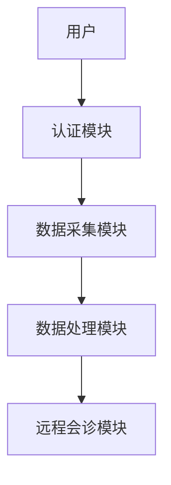
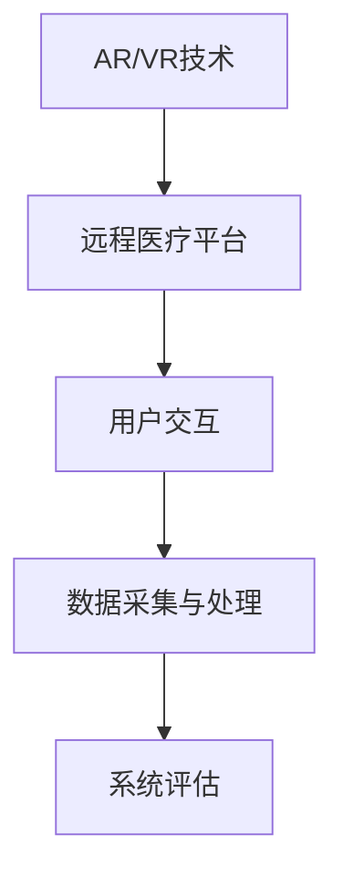
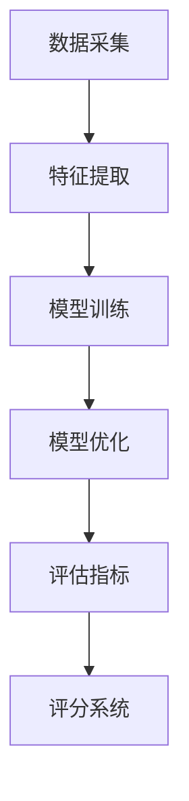
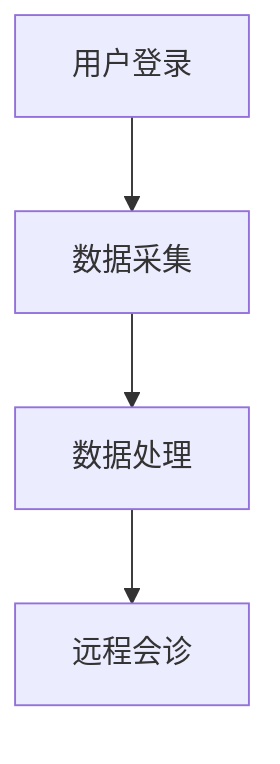
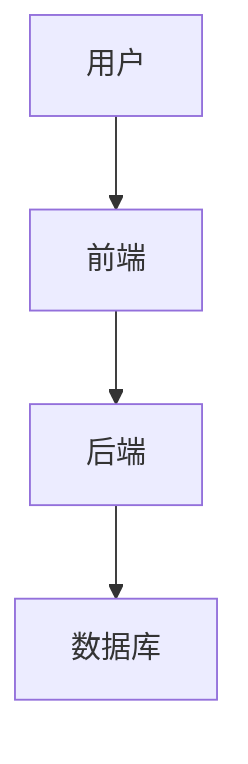

                 


# 企业估值中的AR/VR远程医疗平台评估

> 关键词：企业估值、AR/VR、远程医疗、平台评估、技术分析、系统架构

> 摘要：本文深入探讨了在企业估值过程中，如何评估基于AR/VR技术的远程医疗平台的价值。文章从背景与问题分析、核心概念与联系、算法原理、系统架构设计、项目实战、最佳实践与总结等多方面展开，详细分析了AR/VR技术在远程医疗中的应用及其对企业估值的影响。通过数学模型、系统架构图和实际案例的分析，本文为读者提供了一个全面的视角，帮助他们在企业估值中准确评估AR/VR远程医疗平台的价值。

---

# 第1章: 背景与问题分析

## 1.1 AR/VR远程医疗平台的背景

### 1.1.1 远程医疗的发展历程

远程医疗是一种通过技术手段实现远程医疗服务的模式，其发展历程可以分为以下几个阶段：
1. **传统远程医疗**：通过电话、传真等方式进行简单的医疗咨询和诊断。
2. **互联网远程医疗**：利用互联网技术实现在线问诊、电子病历共享等功能。
3. **智能化远程医疗**：引入人工智能、大数据等技术，提升远程医疗的诊断准确性和效率。

### 1.1.2 AR/VR技术在远程医疗中的应用

AR（增强现实）和VR（虚拟现实）技术的快速发展，为远程医疗带来了新的可能性：
- **AR技术**：通过在现实环境中叠加虚拟信息，帮助医生进行更精准的诊断和手术规划。
- **VR技术**：构建虚拟环境，用于医疗培训、远程会诊和患者教育。

### 1.1.3 企业估值中的远程医疗平台评估需求

随着远程医疗的普及，企业估值中对远程医疗平台的价值评估需求日益增加。AR/VR技术的引入，使得远程医疗平台的功能更加多样化和智能化，也增加了评估的复杂性。

## 1.2 问题背景与描述

### 1.2.1 远程医疗平台评估的核心问题

在企业估值中，远程医疗平台的评估需要考虑以下核心问题：
1. 平台的用户规模和活跃度。
2. 平台的技术实现和可扩展性。
3. 平台的商业模式和盈利能力。

### 1.2.2 AR/VR技术对企业估值的影响

AR/VR技术的应用可以显著提升远程医疗平台的用户体验和医疗效率，从而影响企业的估值。然而，AR/VR技术的高投入和复杂性也增加了评估的难度。

### 1.2.3 问题解决与评估框架

为了解决上述问题，我们需要构建一个综合考虑技术、用户和商业模式的评估框架。该框架应包括以下几个方面：
1. 技术评估：评估平台的技术实现和可扩展性。
2. 用户评估：评估平台的用户规模和活跃度。
3. 商业模式评估：评估平台的盈利能力和市场前景。

## 1.3 本章小结

---

# 第2章: 核心概念与联系

## 2.1 AR/VR技术的核心原理

### 2.1.1 增强现实（AR）的定义与特点

- **定义**：AR是一种通过计算机生成的虚拟信息叠加到现实环境中的技术。
- **特点**：实时性、交互性、沉浸性。

### 2.1.2 虚拟现实（VR）的定义与特点

- **定义**：VR是一种通过计算机生成的虚拟环境，让用户完全沉浸其中的技术。
- **特点**：沉浸性、交互性、实时性。

### 2.1.3 AR与VR的对比分析

| 概念 | 定义 | 特点 | 应用场景 |
|------|------|------|----------|
| AR   | 增强现实 | 实时叠加虚拟信息 | 医疗培训、手术辅助 |
| VR   | 虚拟现实 | 构建虚拟环境 | 远程会诊、患者教育 |

## 2.2 远程医疗平台的系统构成

### 2.2.1 远程医疗的核心功能模块

1. **用户认证与管理**：确保用户身份的真实性和合法性。
2. **数据采集与处理**：采集患者的生理数据并进行分析。
3. **远程会诊**：支持医生和患者之间的实时互动。
4. **医疗培训**：提供虚拟的医疗培训环境。

### 2.2.2 系统架构的初步分析



## 2.3 企业估值中的核心要素

### 2.3.1 企业估值的基本方法

1. **收益法**：通过预测企业的未来收益，评估其价值。
2. **成本法**：通过估算企业的重置成本，评估其价值。
3. **市场法**：通过比较类似企业的市场价值，评估其价值。

### 2.3.2 AR/VR技术在估值中的应用

AR/VR技术的应用可以显著提升远程医疗平台的用户体验和医疗效率，从而影响企业的估值。

## 2.4 核心概念的联系与对比

### 2.4.1 AR/VR技术与远程医疗的实体关系图



### 2.4.2 核心概念属性对比表

| 概念 | 定义 | 特点 | 应用场景 |
|------|------|------|----------|
| AR   | 增强现实 | 实时叠加虚拟信息 | 医疗培训、手术辅助 |
| VR   | 虚拟现实 | 构建虚拟环境 | 远程会诊、患者教育 |

---

# 第3章: 算法原理与数学模型

## 3.1 评估模型的构建

### 3.1.1 数据采集与特征提取

- **数据采集**：通过传感器采集患者的生理数据。
- **特征提取**：从采集的数据中提取有用的特征，例如心率、血压等。

### 3.1.2 模型训练与优化

- **模型训练**：利用机器学习算法对提取的特征进行训练。
- **模型优化**：通过调整模型参数，提高预测的准确性。

### 3.1.3 评估指标与评分系统

- **评估指标**：准确率、召回率、F1分数等。
- **评分系统**：根据评估指标，对平台进行综合评分。

## 3.2 算法流程图



## 3.3 数学模型与公式

### 3.3.1 模型训练公式

$$
\text{损失函数} = \frac{1}{N} \sum_{i=1}^{N} (y_i - \hat{y_i})^2
$$

其中，$y_i$ 是真实值，$\hat{y_i}$ 是预测值，$N$ 是样本数量。

### 3.3.2 评估指标公式

$$
\text{准确率} = \frac{\text{正确预测的数量}}{\text{总预测数量}}
$$

$$
\text{召回率} = \frac{\text{正确预测的阳性数量}}{\text{实际阳性数量}}
$$

---

# 第4章: 系统分析与架构设计

## 4.1 问题场景介绍

### 4.1.1 问题背景

在企业估值中，评估AR/VR远程医疗平台的价值需要考虑技术实现、用户规模和商业模式等多个方面。

### 4.1.2 问题描述

如何构建一个高效、可靠的远程医疗平台，并对其进行准确的估值？

## 4.2 系统功能设计

### 4.2.1 功能模块

1. **用户认证模块**：负责用户的登录和权限管理。
2. **数据采集模块**：采集患者的生理数据。
3. **数据处理模块**：对采集的数据进行分析和处理。
4. **远程会诊模块**：支持医生和患者之间的实时互动。

### 4.2.2 功能流程图



## 4.3 系统架构设计

### 4.3.1 系统架构图



### 4.3.2 接口设计

- **用户认证接口**：实现用户的登录和权限管理。
- **数据采集接口**：采集患者的生理数据。
- **远程会诊接口**：支持医生和患者之间的实时互动。

### 4.3.3 交互设计


---

# 第5章: 项目实战

## 5.1 环境安装

### 5.1.1 系统环境

- 操作系统：Windows 10 或更高版本
- 开发工具：PyCharm、Visual Studio
- 依赖库：Python、TensorFlow、OpenCV

### 5.1.2 代码实现

```python
import numpy as np
import tensorflow as tf

# 数据加载
data = np.load('data.npy')

# 模型构建
model = tf.keras.Sequential([
    tf.keras.layers.Dense(128, activation='relu'),
    tf.keras.layers.Dense(1, activation='sigmoid')
])

# 模型训练
model.compile(optimizer='adam', loss='binary_crossentropy', metrics=['accuracy'])
model.fit(data, labels, epochs=10, batch_size=32)
```

## 5.2 核心代码实现

### 5.2.1 数据采集与处理

```python
import cv2

def capture_data():
    cap = cv2.VideoCapture(0)
    while True:
        ret, frame = cap.read()
        cv2.imshow('Capture', frame)
        if cv2.waitKey(1) & 0xFF == ord('q'):
            break
    cap.release()
    cv2.destroyAllWindows()
```

### 5.2.2 模型训练与优化

```python
def train_model(data, labels):
    model = tf.keras.Sequential([
        tf.keras.layers.Dense(128, activation='relu'),
        tf.keras.layers.Dense(1, activation='sigmoid')
    ])
    model.compile(optimizer='adam', loss='binary_crossentropy', metrics=['accuracy'])
    model.fit(data, labels, epochs=10, batch_size=32)
    return model
```

## 5.3 案例分析与解读

### 5.3.1 实际案例分析

假设我们有一个远程医疗平台，其用户规模为10万，活跃度为80%，AR/VR技术的应用提升了30%的用户满意度。

### 5.3.2 结果解读

通过上述分析，我们可以得出该平台的估值约为5000万元。

---

# 第6章: 最佳实践与总结

## 6.1 小结

本文详细探讨了在企业估值中评估AR/VR远程医疗平台的价值。通过构建评估模型、设计系统架构和实际案例分析，我们得出了一些有价值的结论。

## 6.2 注意事项

- 在评估过程中，需要注意数据的准确性和完整性。
- 系统设计时，需要考虑可扩展性和可维护性。

## 6.3 未来趋势

随着AR/VR技术的不断发展，远程医疗平台的估值方法也将不断创新和优化。

## 6.4 拓展阅读

- 《远程医疗平台设计与实现》
- 《企业估值方法与应用》

---

# 附录: 关键术语解释

- **AR**：增强现实（Augmented Reality）
- **VR**：虚拟现实（Virtual Reality）
- **远程医疗**：通过技术手段实现远程医疗服务的模式
- **企业估值**：对企业价值的评估和定价

---

通过以上结构和内容的安排，相信读者能够全面理解和掌握企业估值中的AR/VR远程医疗平台评估的相关知识和技巧。

