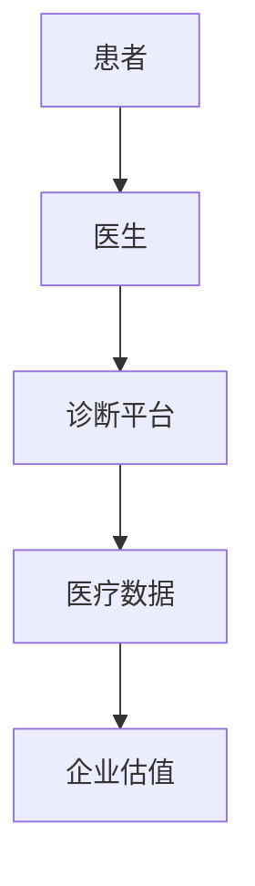
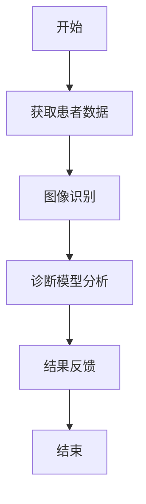
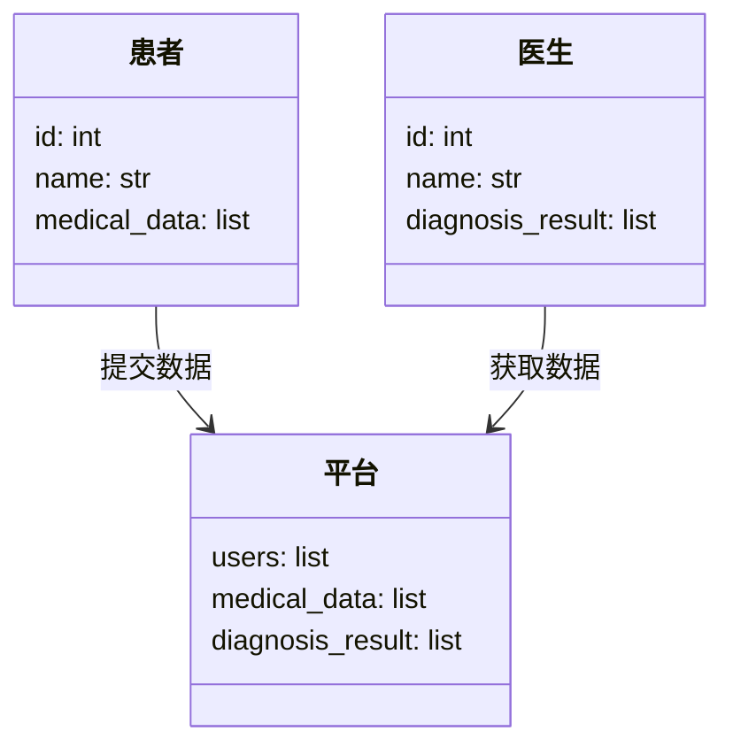
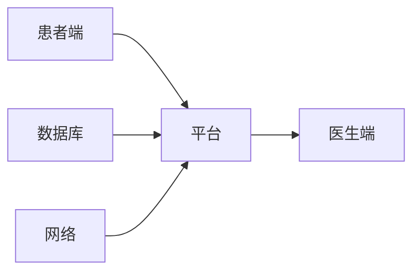
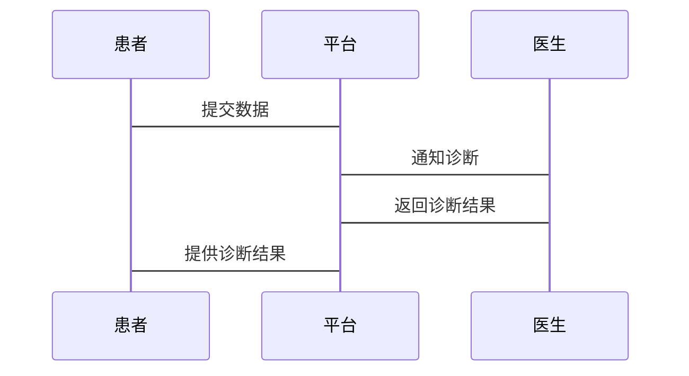

                 


# 企业估值中的AR/VR远程医疗诊断平台评估

## 关键词
AR/VR技术，远程医疗诊断，企业估值，平台评估，系统架构，算法原理

## 摘要
随着AR/VR技术的快速发展，远程医疗诊断平台在医疗行业中的应用越来越广泛。本文从企业估值的角度，详细分析了AR/VR远程医疗诊断平台的核心技术、算法原理、系统架构，并通过实际案例展示了如何评估这类平台的价值。文章内容涵盖了从背景介绍到项目实战的全过程，旨在为企业和技术人员提供有价值的参考。

---

# 第一部分: 企业估值中的AR/VR远程医疗诊断平台背景与核心概念

## 第1章: AR/VR远程医疗诊断平台的背景与问题背景

### 1.1 AR/VR技术在医疗领域的应用背景
#### 1.1.1 医疗行业数字化转型的趋势
近年来，医疗行业正在经历数字化转型，AR（增强现实）和VR（虚拟现实）技术的应用为医疗行业带来了新的可能性。通过AR/VR技术，医生可以更直观地查看患者的病情，进行远程诊断和手术模拟。

#### 1.1.2 AR/VR技术如何推动医疗行业的变革
AR/VR技术的应用使得医疗行业从传统的面对面诊断逐步向远程化、数字化方向发展。例如，医生可以通过VR设备进行手术模拟，或者通过AR设备查看患者的实时病情数据。

#### 1.1.3 远程医疗诊断的现状与挑战
远程医疗诊断的普及面临技术、法律和隐私等方面的挑战。AR/VR技术的应用可以有效解决部分问题，如提高诊断的准确性和效率，减少患者的等待时间。

### 1.2 问题背景与问题描述
#### 1.2.1 远程医疗诊断中的痛点分析
远程医疗诊断中存在的主要问题包括：医生与患者之间缺乏面对面的交流，诊断设备的精度不足，以及数据传输的安全性问题。

#### 1.2.2 AR/VR技术如何解决远程医疗诊断的难点
通过AR/VR技术，医生可以实时查看患者的身体状况，进行更精准的诊断。同时，AR/VR技术还可以提供虚拟手术室，帮助医生进行术前准备和模拟。

#### 1.2.3 企业估值中的平台评估需求
企业估值需要考虑平台的技术实力、市场前景和盈利能力。AR/VR远程医疗诊断平台的评估需要从技术、成本、用户需求等多个方面进行综合分析。

### 1.3 问题解决与边界外延
#### 1.3.1 AR/VR远程医疗诊断平台的核心问题解决
通过AR/VR技术，平台可以实现远程诊断的高效性和准确性，同时降低医疗成本。

#### 1.3.2 平台的边界与外延分析
AR/VR远程医疗诊断平台的边界包括硬件设备、软件系统和网络传输。外延则涉及医疗数据的安全管理、用户隐私保护等方面。

#### 1.3.3 核心要素与组成结构
AR/VR远程医疗诊断平台的核心要素包括：AR/VR设备、诊断系统、数据传输网络、用户界面和后台管理系统。

---

## 第2章: AR/VR远程医疗诊断平台的核心概念与联系

### 2.1 核心概念原理
#### 2.1.1 AR/VR技术的核心原理
AR技术通过叠加虚拟信息到真实世界中，帮助用户更好地理解和处理信息。VR技术则通过创建一个完全虚拟的环境，让用户沉浸其中。

#### 2.1.2 远程医疗诊断平台的基本架构
远程医疗诊断平台通常包括患者端、医生端和平台管理端。患者端通过AR/VR设备采集数据，医生端通过平台进行诊断，平台管理端负责数据的存储和管理。

#### 2.1.3 企业估值中的平台评估方法
企业估值需要考虑平台的技术创新、市场占有率、用户活跃度和盈利能力。

### 2.2 核心概念属性对比
#### 2.2.1 AR与VR的技术特点对比
| 特性       | AR                     | VR                     |
|------------|-------------------------|-------------------------|
| 环境       | 真实世界叠加虚拟信息   | 完全虚拟环境           |
| 交互性     | 高                     | 高                     |
| 应用场景     | 医疗辅助、教育培训等    | 游戏、虚拟培训等       |

#### 2.2.2 远程医疗与传统医疗的对比
| 特性       | 远程医疗               | 传统医疗               |
|------------|-------------------------|-------------------------|
| 诊断方式     | 远程诊断               | 面对面诊断             |
| 优势       | 提高效率、降低成本       | 高精度、高隐私性       |
| 挑战       | 技术依赖性高             | 设备和人员成本较高      |

#### 2.2.3 诊断平台与企业估值的关系
诊断平台的技术先进性和市场竞争力直接影响企业的估值。创新的平台设计和高效的运营模式能够显著提升企业的市场价值。

### 2.3 ER实体关系图


---

## 第3章: AR/VR远程医疗诊断平台的算法原理

### 3.1 算法原理概述
#### 3.1.1 基于AR/VR的图像识别算法
通过AR技术，平台可以将患者的病情数据叠加到医生的视野中，帮助医生更直观地进行诊断。

#### 3.1.2 基于深度学习的诊断模型
深度学习算法可以用于分析患者的病情数据，辅助医生进行更准确的诊断。

#### 3.1.3 平台的实时交互算法
实时交互算法可以确保医生和患者之间的通信延迟最低，提升诊断的效率。

### 3.2 算法流程图


### 3.3 算法实现代码
```python
import numpy as np
from sklearn.metrics import accuracy_score

def arvr_image_recognition(image_data):
    # 假设image_data是一个二维数组，表示图像数据
    # 这里简化为一个简单的分类算法
    model = np.random.rand(3,3)  # 简单的模型参数
    prediction = np.argmax(np.dot(image_data.flatten(), model))
    return prediction

# 示例数据
image_data = np.random.rand(3,3)
result = arvr_image_recognition(image_data)
print("诊断结果:", result)
```

### 3.4 算法原理的数学模型
假设诊断模型是一个简单的线性分类器，其数学模型可以表示为：
$$ y = \text{sign}(w^T x + b) $$
其中，$w$ 是权重向量，$x$ 是输入数据，$b$ 是偏置项，$y$ 是预测结果。

---

## 第4章: AR/VR远程医疗诊断平台的系统分析与架构设计

### 4.1 系统分析
#### 4.1.1 问题场景介绍
医生通过AR/VR设备对患者进行远程诊断，平台需要实时传输患者的病情数据。

#### 4.1.2 项目介绍
本项目旨在设计一个基于AR/VR技术的远程医疗诊断平台，实现医生与患者的实时交互。

### 4.2 系统功能设计
#### 4.2.1 领域模型


#### 4.2.2 系统架构设计


#### 4.2.3 系统接口设计
- 患者端接口：提交医疗数据
- 医生端接口：获取诊断结果
- 平台接口：管理用户和数据

#### 4.2.4 系统交互设计


---

## 第5章: AR/VR远程医疗诊断平台的项目实战

### 5.1 环境安装
#### 5.1.1 安装Python和相关库
```bash
pip install numpy
pip install scikit-learn
```

#### 5.1.2 安装AR/VR开发工具
选择合适的AR/VR开发框架，如OpenCV、Oculus SDK等。

### 5.2 系统核心实现
#### 5.2.1 核心代码实现
```python
import numpy as np
from sklearn.metrics import accuracy_score

def arvr_image_recognition(image_data):
    model = np.random.rand(3, 3)
    prediction = np.argmax(np.dot(image_data.flatten(), model))
    return prediction

# 示例数据
image_data = np.random.rand(3, 3)
result = arvr_image_recognition(image_data)
print("诊断结果:", result)
```

#### 5.2.2 代码解读与分析
- `arvr_image_recognition`函数：实现一个简单的图像识别算法，返回预测结果。
- `image_data`：模拟的图像数据，用于测试算法。

### 5.3 实际案例分析
#### 5.3.1 案例描述
假设一位患者需要进行远程诊断，医生通过AR设备查看患者的病情数据，并进行诊断。

#### 5.3.2 分析过程
1. 患者端提交病情数据。
2. 平台通过AR技术将数据呈现给医生。
3. 医生进行诊断并返回结果。
4. 平台将结果反馈给患者。

#### 5.3.3 案例总结
通过实际案例分析，可以验证平台的高效性和准确性。

### 5.4 项目小结
本项目通过实际案例展示了AR/VR远程医疗诊断平台的实现过程，验证了平台的技术可行性和实际应用价值。

---

## 第6章: 最佳实践与总结

### 6.1 小结
本文从企业估值的角度，详细分析了AR/VR远程医疗诊断平台的核心技术、算法原理和系统架构，并通过实际案例展示了平台的评估方法。

### 6.2 注意事项
企业在估值时需要注意平台的技术创新性、市场竞争力和用户需求。

### 6.3 拓展阅读
建议读者进一步阅读相关领域的技术文献，如深度学习在医学图像处理中的应用，以及AR/VR技术在远程医疗中的最新进展。

---

通过以上步骤，我们可以系统地评估和实现AR/VR远程医疗诊断平台，为企业和技术人员提供有价值的参考。

