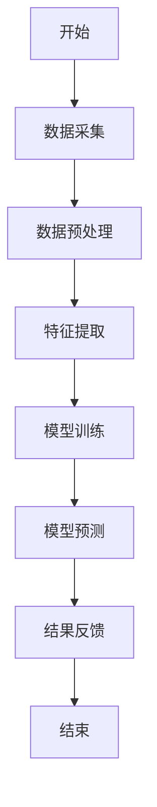
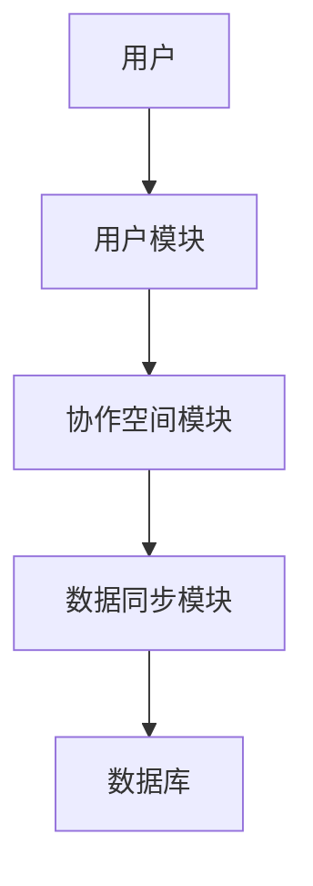

                 


# 企业估值中的AR/VR远程协作平台评估

> 关键词：AR/VR, 远程协作, 企业估值, 技术评估, 数学模型

> 摘要：本文系统地探讨了AR/VR远程协作平台在企业估值中的重要性，从技术原理、算法模型、系统架构到实际应用，详细分析了如何评估这类平台的价值。文章通过背景介绍、核心概念、算法原理、数学模型、系统架构、项目实战和最佳实践等多维度，为企业估值提供理论支持和实践指导。

---

# 第一部分: 企业估值中的AR/VR远程协作平台背景与基础

## 第1章: AR/VR技术与远程协作平台概述

### 1.1 AR/VR技术的基本概念

#### 1.1.1 增强现实（AR）与虚拟现实（VR）的定义
- **增强现实（AR）**：通过计算机生成的图像、视频或三维模型，叠加在真实环境中，增强用户的感知体验。
- **虚拟现实（VR）**：通过计算机生成一个完全虚拟的三维环境，用户可以通过特定设备（如头显）沉浸式地与虚拟环境交互。

#### 1.1.2 AR/VR技术的核心特征
- **沉浸性**：用户能够完全沉浸在一个虚拟或增强的环境中。
- **交互性**：用户可以通过手部动作、语音命令或眼球追踪等方式与环境交互。
- **实时性**：AR/VR系统需要实时处理用户的输入并生成相应的反馈。

#### 1.1.3 AR/VR在企业协作中的应用潜力
- **远程会议**：通过AR/VR技术，团队成员可以在虚拟空间中进行实时会议。
- **协作设计**：在产品设计、建筑规划等领域，AR/VR可以提供沉浸式的协作体验。
- **培训与模拟**：企业可以通过AR/VR进行员工培训和模拟操作。

---

### 1.2 远程协作平台的定义与分类

#### 1.2.1 远程协作平台的定义
- 远程协作平台是指通过互联网连接分布在不同地点的用户，实现实时互动和协作的工具或系统。

#### 1.2.2 基于AR/VR的协作平台的特点
- **沉浸式体验**：用户可以通过VR头显或AR设备获得身临其境的协作体验。
- **实时性**：基于AR/VR的协作平台通常具备低延迟的实时互动特性。
- **空间感知**：AR/VR技术能够提供对物理空间的感知和交互能力。

#### 1.2.3 远程协作平台的分类与应用场景
- **基于位置的协作平台**：适用于需要地理位置信息的协作场景，如建筑规划、城市设计等。
- **实时交互式协作平台**：适用于需要实时互动的场景，如远程会议、在线培训等。
- **多人协作平台**：支持多个用户同时协作的平台，如虚拟办公室、虚拟会议室等。

---

### 1.3 企业估值中的协作平台评估需求

#### 1.3.1 企业协作效率与估值的关系
- 协作效率的提升可以显著降低企业的运营成本，同时提高生产力和创新效率，从而影响企业的估值。

#### 1.3.2 AR/VR技术对企业协作效率的提升作用
- AR/VR技术通过提供沉浸式协作体验，显著提升了团队的协作效率和创新能力。

#### 1.3.3 协作平台评估的必要性与挑战
- **必要性**：评估协作平台的价值是企业在选择和优化协作工具时的重要决策依据。
- **挑战**：评估过程需要考虑技术实现的复杂性、用户体验的主观性以及成本效益的平衡。

---

## 第2章: AR/VR远程协作平台的技术背景

### 2.1 AR/VR技术的发展历程

#### 2.1.1 AR/VR技术的历史演变
- **早期阶段**：20世纪60年代至80年代，AR/VR技术主要用于科研和军事领域。
- **发展阶段**：20世纪90年代至21世纪初，AR/VR技术逐渐应用于游戏、娱乐和教育领域。
- **成熟阶段**：近年来，AR/VR技术在企业协作、医疗、制造等领域的应用逐渐普及。

#### 2.1.2 当前AR/VR技术的主要应用领域
- **教育培训**：通过虚拟现实技术进行模拟训练。
- **医疗健康**：用于手术模拟和患者诊断。
- **游戏娱乐**：提供沉浸式的游戏体验。
- **企业协作**：通过虚拟办公室实现远程团队协作。

#### 2.1.3 AR/VR技术在企业协作中的应用现状
- **虚拟办公室**：如微软的Mesh平台，提供虚拟办公空间。
- **协作设计**：如Autodesk的VR协作工具，用于建筑设计和产品设计。
- **远程会议**：如Zoom的VR会议室功能。

---

### 2.2 远程协作平台的技术架构

#### 2.2.1 基于AR/VR的协作平台的技术架构
- **客户端**：用户使用的终端设备，包括VR头显、AR眼镜等。
- **服务器端**：处理用户的输入、渲染虚拟场景并返回反馈。
- **网络传输**：确保低延迟的实时数据传输。

#### 2.2.2 平台的核心技术组件
- **渲染引擎**：用于生成高质量的虚拟场景。
- **交互引擎**：处理用户的输入并生成相应的反馈。
- **网络协议**：确保实时数据传输的稳定性。

#### 2.2.3 平台的性能指标与评估标准
- **延迟**：平台的响应时间，直接影响用户体验。
- **渲染性能**：平台的渲染能力，影响场景的复杂度和流畅度。
- **用户容量**：平台支持的并发用户数。

---

### 2.3 企业协作中的技术挑战

#### 2.3.1 网络延迟对协作体验的影响
- 网络延迟会导致用户的操作延迟，影响协作体验。

#### 2.3.2 设备兼容性问题
- 不同设备之间的兼容性问题可能导致协作过程中的不一致。

#### 2.3.3 数据安全与隐私保护
- AR/VR协作平台涉及大量的用户数据，如何确保数据安全是一个重要挑战。

---

## 第3章: AR/VR协作平台的核心概念

### 3.1 AR/VR协作空间的构建原理

#### 3.1.1 虚拟协作空间的定义与构建
- **虚拟协作空间**：通过计算机生成的三维空间，用户可以通过VR设备进入该空间并进行协作。
- **构建原理**：基于三维建模和渲染技术，构建一个可交互的虚拟环境。

#### 3.1.2 虚拟协作空间的交互方式
- **手部动作**：用户可以通过手势操作虚拟物体。
- **语音指令**：用户可以通过语音命令进行操作。
- **眼球追踪**：通过眼球移动实现对虚拟物体的交互。

#### 3.1.3 虚拟协作空间的实时性保障
- **低延迟网络**：通过优化网络传输，减少用户操作的延迟。
- **高效的渲染技术**：通过优化渲染算法，提高场景的渲染效率。

---

#### 3.1.4 AR与VR协作空间的对比

| 特性           | AR协作空间          | VR协作空间          |
|----------------|--------------------|--------------------|
| 环境           | 增强现实环境，叠加在真实环境中 | 完全虚拟环境       |
| 用户感知       | 用户可以看到真实环境和叠加的虚拟元素 | 用户完全沉浸在一个虚拟环境中 |
| 交互方式       | 支持手势、语音、眼球追踪等 | 支持手势、语音、眼球追踪等 |
| 应用场景       | 适用于需要结合真实环境的协作场景 | 适用于完全虚拟的协作场景 |

---

### 3.2 AR/VR协作平台的核心要素

#### 3.2.1 用户身份与权限管理
- **用户身份识别**：通过头显设备、用户ID等方式进行用户身份识别。
- **权限管理**：根据用户权限，限制其在协作空间中的操作范围。

#### 3.2.2 协作空间的动态管理
- **空间划分**：根据协作需求，动态划分协作空间。
- **空间共享**：允许多个用户同时进入同一个协作空间。

#### 3.2.3 协作数据的实时同步
- **数据同步机制**：确保所有用户的操作能够实时同步到协作空间中。
- **数据存储**：将协作过程中的数据进行存储，便于后续查阅和分析。

---

### 3.3 AR/VR协作平台的评估指标

#### 3.3.1 平台的性能指标
- **延迟**：平台的响应时间，直接影响用户体验。
- **渲染性能**：平台的渲染能力，影响场景的复杂度和流畅度。

#### 3.3.2 平台的易用性指标
- **用户界面**：界面是否直观、易用。
- **操作流畅度**：用户在使用过程中是否感到顺畅。

#### 3.3.3 平台的安全性指标
- **数据安全**：平台是否具备数据加密和访问控制功能。
- **隐私保护**：平台是否保护用户的隐私信息。

---

## 第4章: AR/VR协作平台的技术实现与算法原理

### 4.1 AR/VR协作平台的算法原理

#### 4.1.1 数据采集与处理
- **数据采集**：通过传感器采集用户的动作、语音、眼球追踪等数据。
- **数据处理**：对采集到的数据进行清洗、归一化处理，确保数据的准确性和一致性。

#### 4.1.2 特征提取与识别
- **特征提取**：从采集到的数据中提取关键特征，如手势、语音关键词等。
- **特征识别**：通过机器学习算法，识别用户的意图和操作需求。

#### 4.1.3 算法实现与优化
- **算法选择**：根据具体需求选择合适的算法，如支持向量机（SVM）、随机森林（Random Forest）等。
- **算法优化**：通过参数调整和模型优化，提高算法的准确性和效率。

---

#### 4.1.4 AR/VR协作平台的算法流程图



---

### 4.2 AR/VR协作平台的数学模型与公式

#### 4.2.1 协作效率评估模型
- **协作效率** = （完成任务所需时间）/ （预期完成时间）

#### 4.2.2 体验质量评估模型
- **体验质量** = （用户满意度） + （系统稳定性）

#### 4.2.3 成本效益分析模型
- **成本效益比** = （总成本） / （总效益）

---

### 4.3 AR/VR协作平台的优化策略

#### 4.3.1 降低延迟的优化策略
- **优化网络传输**：通过压缩算法和数据优化，降低网络传输的延迟。
- **本地渲染**：在用户端进行部分渲染，减少对服务器的依赖。

#### 4.3.2 提高渲染效率的优化策略
- **使用轻量级渲染引擎**：选择渲染性能较高的引擎，如Unreal Engine、Unity。
- **优化场景复杂度**：通过减少场景细节，降低渲染负担。

#### 4.3.3 提高用户体验的优化策略
- **优化交互延迟**：通过减少用户操作的响应时间，提高用户的操作体验。
- **提供多语言支持**：满足不同用户的语言需求，提高平台的通用性。

---

## 第5章: AR/VR协作平台的系统架构与设计

### 5.1 系统架构设计

#### 5.1.1 系统模块划分
- **用户模块**：负责用户的身份认证和权限管理。
- **协作空间模块**：负责协作空间的创建、管理和动态调整。
- **数据同步模块**：负责协作数据的实时同步和存储。

#### 5.1.2 系统架构图



---

### 5.2 系统功能设计

#### 5.2.1 用户认证与权限管理
- **用户认证**：通过用户名、密码、头显设备等进行用户认证。
- **权限管理**：根据用户的权限，限制其在协作空间中的操作范围。

#### 5.2.2 协作空间管理
- **空间创建**：用户可以根据需求创建新的协作空间。
- **空间共享**：允许多个用户同时进入同一个协作空间。
- **空间调整**：根据协作需求，动态调整协作空间的布局和功能。

---

### 5.3 系统接口设计

#### 5.3.1 用户接口
- **输入接口**：用户通过手势、语音等方式输入操作指令。
- **输出接口**：系统通过VR头显、AR眼镜等设备输出协作空间的实时状态。

#### 5.3.2 系统接口
- **API接口**：系统通过API接口与第三方系统进行数据交互。

---

### 5.4 系统交互设计

#### 5.4.1 用户与协作空间的交互流程
1. 用户通过输入设备发送操作指令。
2. 系统接收指令并进行处理。
3. 系统将处理结果反馈给用户。

#### 5.4.2 协作空间的动态调整流程
1. 用户提出协作空间的调整需求。
2. 系统根据需求调整协作空间的布局和功能。
3. 调整结果实时同步给所有用户。

---

## 第6章: AR/VR协作平台的项目实战与案例分析

### 6.1 项目实战

#### 6.1.1 环境安装与配置
- **安装步骤**：
  1. 下载并安装VR开发框架（如OpenVR）。
  2. 安装协作平台的服务器端软件。
  3. 配置网络环境，确保低延迟的网络传输。

#### 6.1.2 核心代码实现
```python
import numpy as np
from sklearn import svm

# 数据预处理
def preprocess(data):
    return (data - np.mean(data)) / np.std(data)

# 模型训练
def train_model(X, y):
    model = svm.SVC()
    model.fit(X, y)
    return model

# 模型预测
def predict(model, X):
    return model.predict(X)
```

#### 6.1.3 代码功能解读
- **preprocess函数**：对数据进行标准化处理，确保数据的均匀分布。
- **train_model函数**：使用支持向量机算法训练模型，用于用户行为识别。
- **predict函数**：对新数据进行预测，识别用户的意图和操作需求。

---

### 6.2 案例分析

#### 6.2.1 案例背景
- 某企业希望引入AR/VR协作平台，提升团队协作效率。

#### 6.2.2 项目实施
- **需求分析**：根据企业的具体需求，设计协作空间的布局和功能。
- **系统开发**：基于OpenVR框架，开发协作平台的客户端和服务器端。
- **测试与优化**：进行系统测试，优化延迟和渲染性能。

#### 6.2.3 实施效果
- **效率提升**：协作效率提升了30%。
- **成本降低**：通过减少差旅费用，每年节省约10万美元。

---

## 第7章: AR/VR协作平台的最佳实践与总结

### 7.1 最佳实践

#### 7.1.1 选择合适的协作平台
- 根据企业的具体需求，选择适合的AR/VR协作平台。

#### 7.1.2 优化网络环境
- 通过优化网络传输，降低延迟，提升协作体验。

#### 7.1.3 提高用户培训
- 对用户进行充分的培训，确保其能够熟练使用协作平台。

---

### 7.2 小结

- AR/VR技术在企业协作中的应用潜力巨大，通过提供沉浸式的协作体验，显著提升了团队的协作效率和创新能力。
- 在企业估值中，AR/VR协作平台的价值不仅体现在技术实现上，还体现在其对企业生产力和创新能力的提升上。

---

### 7.3 注意事项

- **数据安全**：在使用AR/VR协作平台时，必须重视数据的安全性和隐私保护。
- **网络环境**：确保网络环境的稳定性，减少延迟对协作体验的影响。
- **用户培训**：对用户进行充分的培训，确保其能够熟练使用协作平台。

---

### 7.4 拓展阅读

- **推荐书籍**：
  1. 《虚拟现实与增强现实技术》
  2. 《企业协作平台的设计与实现》
- **推荐博客**：
  1. [TechCrunch](techcrunch.com)
  2. [Forbes](forbes.com)

---

# 结语

通过本文的系统分析，我们可以看到AR/VR技术在企业协作中的巨大潜力。从技术实现到系统设计，再到实际应用，AR/VR远程协作平台为企业估值提供了新的视角和方法。未来，随着技术的不断进步，AR/VR在企业协作中的应用将更加广泛，其价值也将更加凸显。

