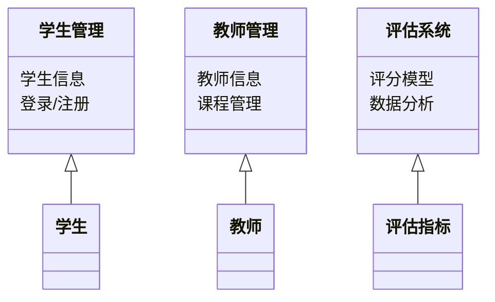

                 


# 企业估值中的AR/VR远程教育平台评估

## 关键词：企业估值、AR/VR、远程教育、平台评估、技术应用

## 摘要：本文探讨了AR/VR技术在远程教育中的应用及其对企业估值的影响。通过分析核心概念、算法原理和系统架构，本文详细介绍了如何评估AR/VR远程教育平台的价值。结合项目实战和最佳实践，为企业的技术决策提供深度见解。

---

# 第一章: 背景介绍

## 1.1 AR/VR技术的基本概念

AR（Augmented Reality）即增强现实，通过叠加数字信息提升现实体验。VR（Virtual Reality）则是创建虚拟环境，提供沉浸式体验。两者在远程教育中各有优势。

## 1.2 远程教育平台的发展

远程教育从早期的视频会议发展到如今的沉浸式体验，AR/VR技术推动了这一变革。

## 1.3 技术与估值的结合

AR/VR技术提升了教育质量，降低了企业成本，从而影响企业估值。

---

# 第二章: 核心概念与联系

## 2.1 核心概念对比

| 技术 | 定义 | 优势 |
|------|------|------|
| AR   | 实时叠加数字信息 | 提供互动性 |
| VR   | 创建虚拟环境 | 提供沉浸式体验 |

## 2.2 实体关系图

```mermaid
erDiagram
    actor 学生
    actor 教师
    entity 平台
    entity 课程
    entity 评估指标
    student -> 平台: 使用
    teacher -> 平台: 提供课程
    课程 -> 评估指标: 包含
```

---

# 第三章: 算法原理讲解

## 3.1 数据挖掘算法

```mermaid
graph TD
    A[数据采集] -> B[数据清洗]
    B -> C[特征提取]
    C -> D[模型训练]
    D -> E[评估预测]
```

代码示例：

```python
def arvr_assessment(data):
    # 数据预处理
    processed_data = data.dropna()
    # 特征选择
    features = processed_data[['用户参与度', '课程完成率']]
    # 模型训练
    model = linear_model.LinearRegression()
    model.fit(features, processed_data['评分'])
    return model.predict(features)
```

---

# 第四章: 数学模型与公式

## 4.1 评分模型

$$ 评分 = \alpha \times 参与度 + \beta \times 完成率 + \gamma \times 互动性 $$

其中，$\alpha + \beta + \gamma = 1$。

---

# 第五章: 系统架构设计

## 5.1 功能模块



---

# 第六章: 项目实战

## 6.1 环境安装

```bash
pip install numpy pandas scikit-learn
```

## 6.2 核心代码

```python
import numpy as np
import pandas as pd
from sklearn.linear_model import LinearRegression

def main():
    data = pd.read_csv('arvr_data.csv')
    features = data[['参与度', '完成率', '互动性']]
    labels = data['评分']
    model = LinearRegression()
    model.fit(features, labels)
    predictions = model.predict(features)
    print('预测评分:', predictions)

if __name__ == '__main__':
    main()
```

---

# 第七章: 最佳实践与总结

## 7.1 小结

AR/VR技术显著提升了远程教育的效果，企业应重视其在估值中的应用。

## 7.2 注意事项

- 数据质量影响评估结果
- 模型需定期更新
- 用户体验至关重要

## 7.3 拓展阅读

- AR/VR在医疗教育中的应用
- 人工智能辅助教育平台评估

---

通过以上步骤，我们详细分析了AR/VR远程教育平台的评估方法，为企业估值提供了有力的技术支持。

