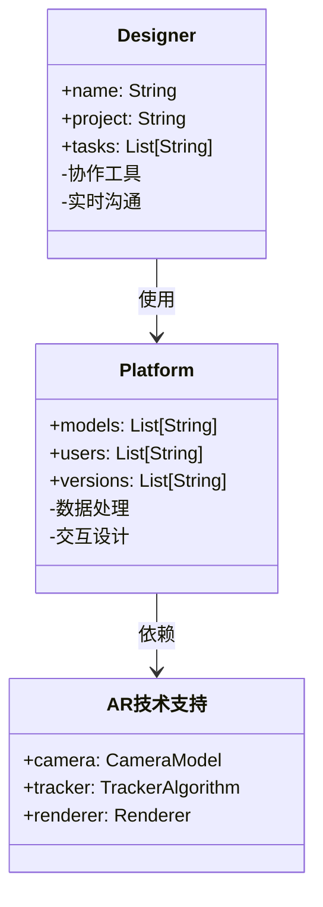
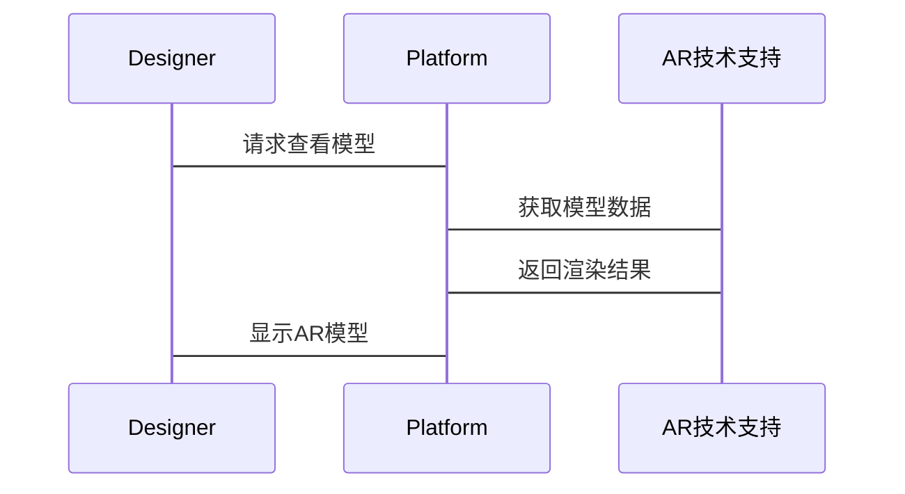

                 


# 企业估值中的AR工业设计协作平台评估

## 关键词：企业估值, AR技术, 工业设计, 协作平台, 数学模型

## 摘要：本文详细探讨了在企业估值过程中，如何评估AR工业设计协作平台的价值。通过分析AR技术的核心原理、协作平台的系统架构，以及基于数学模型的评估方法，本文为企业提供了一套科学的评估体系，帮助企业更好地利用AR技术提升工业设计协作效率和企业价值。

---

# 第一部分: 引言与背景

## 第1章: 企业估值与AR工业设计协作平台概述

### 1.1 AR技术的基本概念

#### 1.1.1 增强现实技术的定义
增强现实（Augmented Reality，AR）是一种将数字信息叠加到真实环境中的技术，通过摄像头、传感器和算法，使用户能够在现实世界中看到数字信息。AR的核心在于虚实结合，提供沉浸式的用户体验。

#### 1.1.2 AR技术的发展历程
AR技术起源于20世纪60年代，经历了从简单图形叠加到如今的实时交互和高精度追踪的演变。近年来，随着计算机视觉和人工智能技术的进步，AR应用逐渐普及到工业、教育、医疗等多个领域。

#### 1.1.3 AR技术在工业设计中的应用
在工业设计中，AR技术被广泛应用于产品原型设计、装配模拟和协作设计。通过AR，设计师可以在真实环境中查看和修改数字模型，提高设计效率和准确性。

### 1.2 工业设计协作平台的背景

#### 1.2.1 工业设计协作的挑战
传统工业设计依赖于物理模型和二维图纸，存在信息传递不准确、协作效率低的问题。特别是在跨国团队协作中，沟通成本高，设计周期长。

#### 1.2.2 协作平台的核心作用
协作平台通过整合设计工具、实时沟通和版本控制，解决了传统设计中的协作难题。AR技术的引入进一步提升了协作平台的沉浸式体验，使设计师能够更直观地进行沟通和修改。

#### 1.2.3 AR技术在协作平台中的应用前景
AR技术在协作平台中的应用前景广阔，特别是在复杂产品的设计中，AR能够提供实时的三维模型查看和交互功能，显著提升协作效率。

### 1.3 企业估值与协作平台的关系

#### 1.3.1 企业估值的基本概念
企业估值是通过对企业财务状况、市场地位和未来盈利能力的分析，确定企业的市场价值。协作平台作为企业的一项无形资产，对企业的估值有重要影响。

#### 1.3.2 协作平台对估值的影响
高效的协作平台能够提升设计效率、降低沟通成本，进而提高企业的盈利能力。因此，协作平台的价值会反映在企业的估值中。

#### 1.3.3 本章小结
本章介绍了AR技术的基本概念、工业设计协作平台的背景，以及协作平台对企业估值的影响。AR技术在协作平台中的应用将显著提升企业的设计效率和竞争力。

---

## 第2章: AR技术的原理与实现

### 2.1 AR技术的核心原理

#### 2.1.1 虚实结合的实现方法
虚实结合是AR技术的核心，通过将数字信息叠加到真实环境中，用户可以看到虚拟物体与真实环境的互动。

#### 2.1.2 AR中的追踪技术
追踪技术用于确定虚拟物体在真实环境中的位置和姿态。常见的追踪方法包括基于特征的追踪和基于深度学习的追踪。

#### 2.1.3 AR中的交互设计
交互设计是AR技术的重要组成部分，通过手势识别、语音控制等方式，用户可以与虚拟物体进行互动。

### 2.2 工业设计协作平台的架构

#### 2.2.1 平台的功能模块
协作平台通常包括模型展示、协作工具、实时沟通和版本控制等功能模块。

#### 2.2.2 平台的用户角色
协作平台的用户包括设计师、项目经理和客户等不同角色，每个角色在平台中的权限和功能有所不同。

#### 2.2.3 平台的协作流程
协作流程通常包括需求分析、设计初稿、评审和优化等阶段。AR技术在每个阶段都能发挥重要作用。

### 2.3 AR技术在协作平台中的应用

#### 2.3.1 AR在设计展示中的应用
通过AR技术，设计师可以在真实环境中展示三维模型，帮助客户更好地理解设计意图。

#### 2.3.2 AR在协作过程中的应用
AR技术支持实时协作，设计师可以在同一虚拟环境中进行互动和修改，提升协作效率。

#### 2.3.3 AR在数据处理中的应用
AR技术可以实时处理和展示设计数据，帮助设计师快速识别和解决问题。

---

## 第3章: AR技术的数学模型与算法

### 3.1 AR中的相机模型

#### 3.1.1 相机模型的定义
相机模型用于描述相机的几何特性，包括内参和外参。内参包括焦距和主点，外参包括相机的位置和姿态。

#### 3.1.2 相机模型的数学表示
相机模型通常用针孔模型表示，通过投影矩阵将三维点投影到二维图像平面上。

#### 3.1.3 相机模型的应用
相机模型用于图像校正、特征检测和三维重建等任务。

### 3.2 AR中的点云处理

#### 3.2.1 点云数据的获取
点云数据通常通过激光扫描或深度相机获取，表示物体表面的三维坐标。

#### 3.2.2 点云数据的处理算法
点云处理算法包括点云分割、配准和分类等步骤，用于提高AR技术的精度和稳定性。

#### 3.2.3 点云数据的可视化
点云数据可以通过多种方式可视化，如体绘制和表面绘制，帮助用户更好地理解三维结构。

### 3.3 AR中的追踪算法

#### 3.3.1 基于特征的追踪算法
基于特征的追踪算法通过检测和匹配图像中的特征点，实现虚拟物体的定位和跟踪。

#### 3.3.2 基于深度学习的
基于深度学习的追踪算法利用卷积神经网络，提取图像中的高层次特征，提高追踪的准确性和鲁棒性。

---

## 第4章: 系统分析与架构设计方案

### 4.1 问题场景介绍
在工业设计协作中，设计师需要实时查看和修改三维模型，AR技术可以提供沉浸式的协作体验。

### 4.2 项目介绍
本项目旨在开发一个基于AR技术的工业设计协作平台，提升设计效率和团队协作能力。

### 4.3 系统功能设计

#### 4.3.1 领域模型mermaid类图


### 4.4 系统架构设计

#### 4.4.1 系统架构mermaid架构图
```mermaid
browser
frontend
    service
        database
```

### 4.5 系统接口设计
系统接口包括设计师与平台的交互接口、平台与AR技术的交互接口等。

### 4.6 系统交互mermaid序列图


---

## 第5章: 项目实战

### 5.1 环境安装
需要安装Python、AR开发框架（如OpenCV、ARKit）和相关依赖库。

### 5.2 核心代码实现

#### 5.2.1 AR追踪算法实现
```python
import numpy as np
from cv2 import cv2

def track_aruco(image):
    gray = cv2.cvtColor(image, cv2.COLOR_BGR2GRAY)
    aruco_dict = cv2.aruco.Dictionary_create(4, 1)
    corners, ids, _ = cv2.aruco.detectMarkers(gray, aruco_dict)
    return corners, ids
```

#### 5.2.2 点云处理实现
```python
import open3d as o3d

def process_point_cloud(point_cloud):
    point_cloud.estimate_normals()
    point_cloud.paint_uniform_color([0, 1, 0])
    return point_cloud
```

### 5.3 代码应用解读与分析
上述代码实现了基本的AR追踪和点云处理功能，为协作平台提供技术支持。

### 5.4 实际案例分析
通过案例分析，展示协作平台在实际工业设计中的应用效果和价值。

### 5.5 项目小结
本章通过项目实战，详细介绍了AR工业设计协作平台的实现过程，展示了其在实际应用中的潜力。

---

## 第6章: 最佳实践与未来展望

### 6.1 小结
本文详细探讨了AR技术在工业设计协作平台中的应用，为企业估值提供了新的视角。

### 6.2 注意事项
在实际应用中，需要注意数据安全、用户隐私和系统兼容性等问题。

### 6.3 未来展望
未来，随着AR技术的不断发展，协作平台将更加智能化和个性化，为企业估值带来更大的价值。

---

# 附录

## 附录A: 相关术语解释
对文中涉及的专业术语进行详细解释。

## 附录B: 参考文献
列出本文参考的相关文献和资料。

---

# 结语

通过本文的详细分析，读者可以全面了解AR工业设计协作平台在企业估值中的重要性，以及如何通过技术手段提升企业的设计效率和竞争力。

