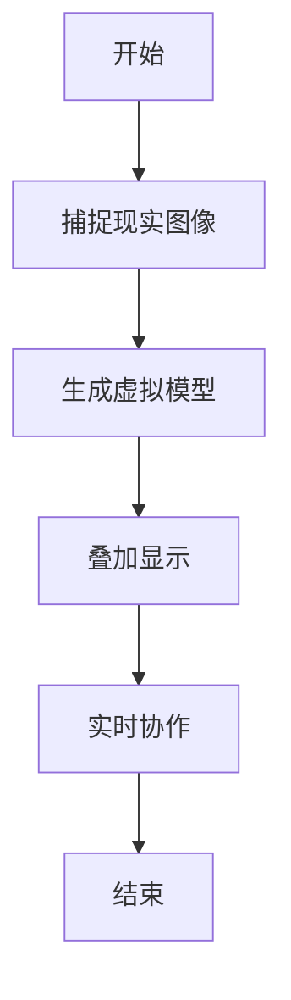
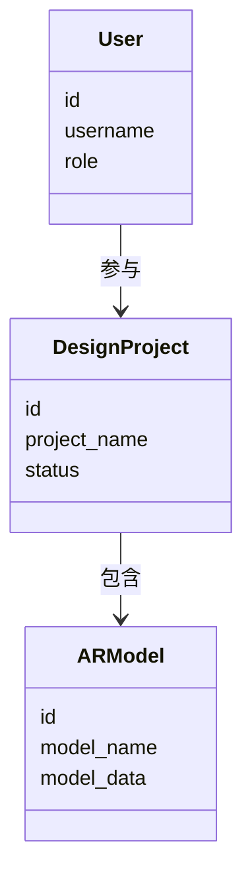

                 


# 企业估值中的AR工业设计协作系统评估

## 关键词：企业估值，AR技术，工业设计协作，系统评估，增强现实

## 摘要：本文深入探讨了在企业估值过程中，AR（增强现实）技术如何应用于工业设计协作系统。通过分析系统的核心概念、算法原理、系统架构及实际案例，本文旨在揭示AR技术如何提升企业设计协作效率和准确性，进而优化企业估值过程。文章还提供了系统的最佳实践和未来发展方向的见解。

---

### 第一部分: 企业估值中的AR工业设计协作系统背景介绍

#### 第1章: 问题背景与问题描述

##### 1.1 问题背景
- **企业估值的传统方法与挑战**：传统的企业估值方法依赖于财务数据和市场分析，但在工业设计协作方面存在效率低下和信息不对称的问题。  
- **AR技术在工业设计协作中的应用潜力**：AR技术能够将虚拟设计元素与现实环境无缝结合，提供实时协作和沉浸式体验，从而提高设计效率和质量。  
- **当前企业估值中的协作系统问题**：现有协作系统缺乏实时性、可视化和跨团队协作能力，难以满足复杂工业设计的需求。

##### 1.2 问题描述
- **工业设计协作中的信息不对称问题**：不同团队之间的信息传递不及时，导致设计迭代周期长，错误率高。  
- **AR技术在协作系统中的应用现状**：AR技术在工业设计中的应用还处于起步阶段，尚未形成标准化的协作系统。  
- **企业估值中的协作系统评估需求**：企业需要一套能够量化AR协作系统对估值影响的评估标准和方法。

---

### 第二部分: AR工业设计协作系统的核心概念与联系

#### 第2章: 核心概念原理

##### 2.1 AR技术的原理
- **AR的基本实现原理**：通过摄像头捕捉现实环境，利用计算机生成虚拟物体，将两者叠加显示在用户视角中。  
- **AR在工业设计中的应用案例**：例如，在汽车设计中，AR技术用于实时查看和调整三维模型。  
- **AR技术的核心优势**：提高设计可视化能力，支持实时协作和快速迭代。

##### 2.2 工业设计协作系统的原理
- **协作系统的基本原理**：通过网络连接多个用户，提供共享的设计界面和协作工具。  
- **系统中的角色与权限分配**：设计师、项目经理、客户等不同角色具有不同的权限和功能。  
- **系统的实时协作机制**：支持多人同时编辑、实时反馈和版本控制。

#### 第3章: 核心概念属性对比

##### 3.1 概念属性对比表
| 概念         | 属性           | 描述                                   |
|--------------|----------------|--------------------------------------|
| AR技术       | 可视化能力     | 提供实时的虚拟与现实结合的可视化体验 |
| 工业设计协作系统 | 协作效率     | 支持多人实时协作，提高设计效率       |
| 企业估值     | 依赖性         | 依赖于设计协作系统的效率和准确性       |

##### 3.2 ER实体关系图
```mermaid
er
    actor(User) {
        id
        username
        role
    }
    entity(DesignProject) {
        id
        project_name
        status
    }
    entity(ARModel) {
        id
        model_name
        model_data
    }
    actor(User) -> entity(DesignProject): 参与
    entity(DesignProject) -> entity(ARModel): 包含
```

---

### 第三部分: AR工业设计协作系统的算法原理

#### 第4章: 算法原理讲解

##### 4.1 算法实现步骤
1. **捕捉现实环境**：使用摄像头获取现实环境的图像。  
2. **生成虚拟模型**：基于设计数据生成虚拟物体的三维模型。  
3. **叠加显示**：将虚拟模型叠加到现实环境中，供用户查看。  
4. **实时协作**：支持多个用户同时编辑和查看模型，确保数据同步。

##### 4.2 算法流程图


##### 4.3 数学公式
- **相似度计算公式**：$similarity = \frac{\sum_{i=1}^{n} w_i \cdot x_i}{\sqrt{\sum_{i=1}^{n} w_i^2} \cdot \sqrt{\sum_{i=1}^{n} x_i^2}}$  
  其中，$w_i$ 是权重，$x_i$ 是设计元素的特征值。

---

### 第四部分: 系统分析与架构设计

#### 第5章: 系统架构设计

##### 5.1 领域模型类图


##### 5.2 系统架构图
```mermaid
archi
    client --> server: 发送设计请求
    server --> client: 返回AR模型
    server --> database: 存储项目数据
    database --> server: 提供模型数据
    server --> client: 更新协作界面
```

##### 5.3 接口设计与交互
```mermaid
sequence
    用户 -> 系统: 请求设计协作
    系统 -> 数据库: 获取项目数据
    数据库 -> 系统: 返回数据
    系统 -> 用户: 显示AR模型
    用户 -> 系统: 进行设计调整
    系统 -> 数据库: 更新项目数据
```

---

### 第五部分: 项目实战

#### 第6章: 项目环境与核心代码实现

##### 6.1 环境安装
- 安装AR开发框架（如Unity ARKit）  
- 安装协作平台（如Slack或Microsoft Teams）  
- 配置本地开发环境（如macOS或Windows）

##### 6.2 核心代码实现
```python
def capture_real_time():
    # 使用摄像头捕捉图像
    cap = cv2.VideoCapture(0)
    while True:
        ret, frame = cap.read()
        if not ret:
            break
        # 处理图像并返回
        yield frame
```

##### 6.3 代码应用解读
- **捕捉图像**：使用OpenCV库捕获实时图像。  
- **生成模型**：利用3D建模库（如Blender）生成虚拟模型。  
- **叠加显示**：将模型叠加到图像上，并显示在用户界面中。

---

### 第六部分: 最佳实践与小结

#### 第7章: 最佳实践

##### 7.1 小结
- AR技术能够显著提升工业设计协作的效率和准确性。  
- 通过实时协作和可视化设计，AR系统能够优化企业估值过程。

##### 7.2 注意事项
- 确保系统的数据安全性和用户隐私。  
- 定期更新系统以支持最新的AR技术和协作需求。

##### 7.3 拓展阅读
- 探索更多AR技术在工业设计中的应用场景。  
- 研究其他企业估值方法与技术的结合。

---

### 第七部分: 总结

AR工业设计协作系统在企业估值中的应用前景广阔。通过提升设计协作效率和准确性，企业能够更快速、更精准地进行产品设计和优化，从而提升整体估值。未来，随着AR技术的不断发展和系统架构的优化，这种协作模式将为企业估值提供更强大的支持。

