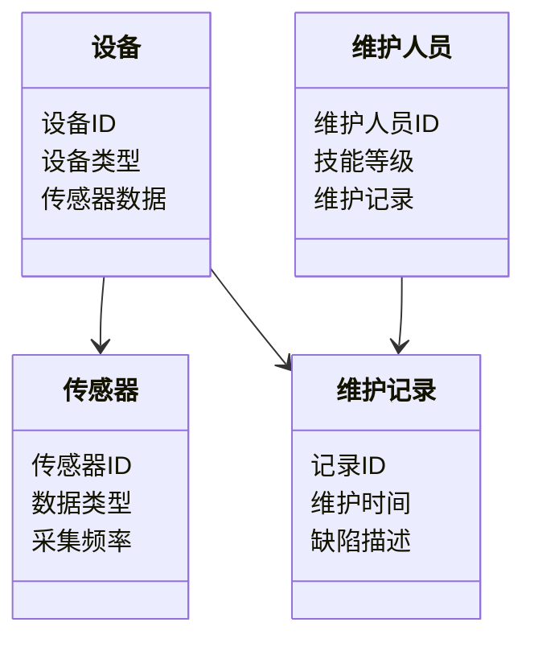

                 

# 企业估值中的AR工业远程维护系统评估

## 关键词：AR技术，工业维护，企业估值，系统架构，算法原理，远程维护，经济效益

## 摘要：  
本文深入探讨了AR（增强现实）技术在工业远程维护系统中的应用及其对企业估值的影响。通过分析AR技术的核心原理、系统架构设计、算法实现及实际应用场景，本文揭示了AR工业远程维护系统如何通过提高维护效率、降低成本和增强企业竞争力来提升企业估值。文章结合具体案例和系统设计，为企业技术负责人和管理层提供了理论依据和实践指导，帮助其在数字化转型中把握机遇，提升企业核心竞争力。

---

## 第一部分：企业估值与AR工业远程维护系统背景

### 第1章：AR技术在工业远程维护中的应用背景

#### 1.1 工业远程维护的定义与现状
工业远程维护是指通过远程技术手段对工业设备进行监控、诊断和维护，以减少停机时间、降低维护成本并提高设备利用率。传统工业维护依赖人工现场操作，效率低、成本高且存在安全隐患。随着工业4.0和数字化转型的推进，远程维护已成为工业企业提升效率和竞争力的重要手段。

#### 1.2 AR技术如何赋能工业远程维护
AR技术通过将虚拟信息叠加到真实环境中，为工业远程维护提供了全新的解决方案。例如，AR可以通过叠加设备的三维模型帮助技术人员快速理解设备结构；通过实时标注缺陷位置，指导维护人员进行精准操作；还可以通过叠加历史数据和实时传感器信息，提供全面的设备状态分析。

#### 1.3 企业估值与工业维护效率的关系
工业维护效率直接影响企业的生产能力和运营成本。高效的远程维护可以显著降低设备停机时间，减少维护人员的工作强度，从而提高企业的生产效率和利润率。这些因素都会直接或间接地提升企业的估值。

---

## 第二部分：AR工业远程维护系统的核心概念与联系

### 第2章：AR工业远程维护系统的原理

#### 2.1 AR技术的基本原理
AR技术通过将计算机生成的虚拟信息（如图像、文字、三维模型）与真实环境实时叠加，为用户提供增强的视觉体验。其核心包括实时定位与跟踪、三维渲染、用户交互等技术。

#### 2.2 工业远程维护的核心流程
工业远程维护的核心流程包括设备监测、故障诊断、维护操作和效果评估。AR技术通过实时渲染和交互功能，将设备的三维模型和传感器数据直观呈现，帮助维护人员快速定位和解决问题。

#### 2.3 AR与工业远程维护的结合点
AR技术在工业远程维护中的结合点主要体现在设备的可视化、操作的智能化和数据的实时化。例如，AR可以将设备的内部结构叠加到真实设备上，帮助维护人员直观了解设备状态。

---

## 第三部分：AR工业远程维护系统的算法原理

### 第3章：算法原理概述

#### 3.1 点云匹配算法
点云匹配算法用于将设备的三维模型与实际设备进行匹配，确保AR渲染的准确性。其核心步骤包括点云分割、特征提取和匹配优化。

#### 3.2 增量定位与映射（SLAM）
SLAM技术用于在动态环境中实时定位和构建地图，是AR系统实现精准定位的关键算法。其核心包括特征提取、定位和地图更新。

#### 3.3 实时渲染与交互算法
实时渲染与交互算法通过优化渲染性能和交互逻辑，确保AR系统的流畅运行。其核心包括渲染优化和交互反馈机制。

---

## 第四部分：AR工业远程维护系统的系统分析与架构设计

### 第4章：系统功能设计

#### 4.1 领域模型设计
领域模型描述了系统的核心实体及其关系。例如，设备、传感器、维护人员和维护记录等。

#### 4.2 系统功能模块划分
系统功能模块包括设备监测、故障诊断、维护操作和数据管理等模块。

#### 4.3 Mermaid领域模型图展示

---

## 第五部分：AR工业远程维护系统的项目实战

### 第5章：环境搭建与系统安装

#### 5.1 开发环境配置
开发环境包括操作系统（如Linux）、开发工具（如Unity或Unreal Engine）和相关库（如OpenCV、OpenGL）。

#### 5.2 依赖库安装
主要依赖库包括AR引擎（如Vuforia）、SLAM库（如ORB-SLAM）和三维建模库（如Blender）。

#### 5.3 系统核心模块实现
系统核心模块包括AR渲染引擎、数据采集模块和交互逻辑模块。

---

## 第六部分：最佳实践与总结

### 第6章：系统优化与注意事项

#### 6.1 系统优化建议
系统优化包括渲染性能优化、算法参数调优和系统架构优化。

#### 6.2 注意事项
在实际应用中，需要注意设备兼容性、数据安全性和用户体验优化。

#### 6.3 未来趋势
随着人工智能和5G技术的发展，AR工业远程维护系统将更加智能化和高效化。

---

## 第七部分：附录与参考文献

### 7.1 附录
包括系统设计图、算法流程图和关键代码示例。

### 7.2 参考文献
列出本文引用的主要文献和资料。

---

通过以上内容，本文系统地分析了AR工业远程维护系统的核心原理、架构设计和实际应用，并结合企业估值的视角，为企业技术负责人和管理层提供了理论依据和实践指导。

