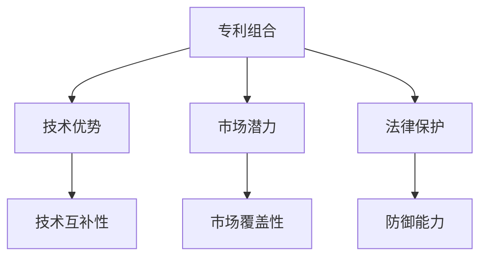
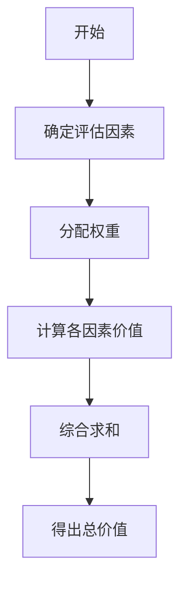
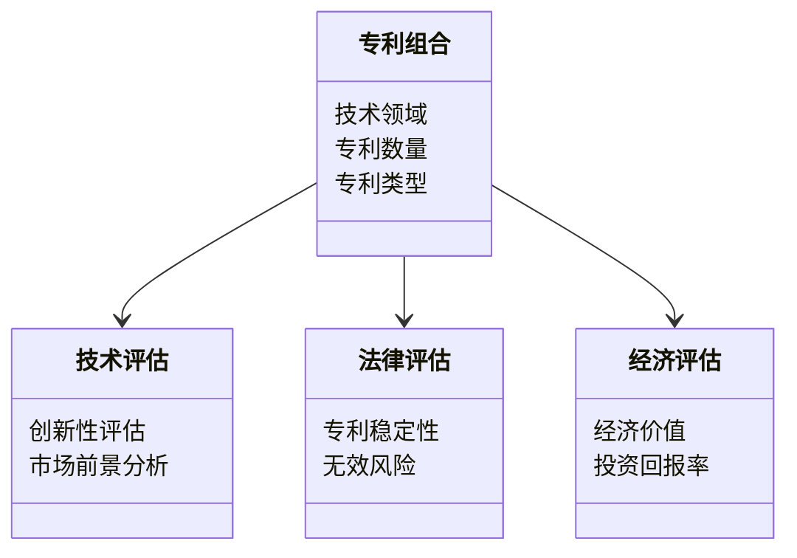
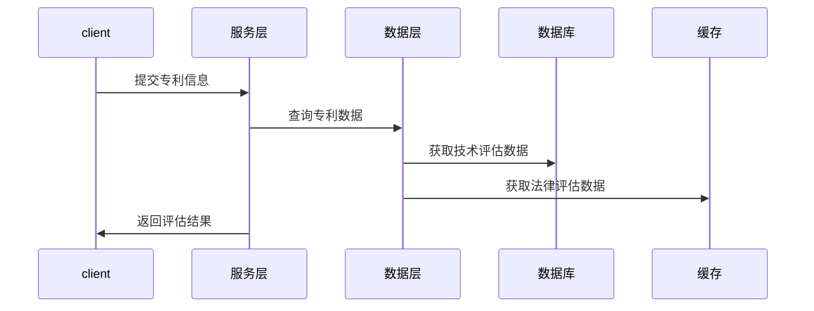

                 


# 《企业估值中的专利组合价值评估》

> 关键词：企业估值、专利组合、知识产权评估、技术经济分析、知识产权战略

> 摘要：  
> 本文深入探讨了专利组合在企业估值中的重要性，分析了专利组合的评估方法、模型和实际应用。通过结合定性和定量分析，本文提出了一个综合评估框架，并通过实际案例展示了如何将专利组合的价值评估转化为企业的核心竞争力。本文还讨论了专利组合评估中的法律风险、技术前景和经济价值，为企业制定知识产权战略提供了有力支持。

---

# 第1章: 专利与企业估值概述

## 1.1 专利的基本概念与特点

### 1.1.1 专利的定义与分类  
专利是法律授予发明者对其发明的独占权利，通常分为发明专利、实用新型专利和外观设计专利。专利的法律保护期限一般为20年（发明专利）或10年（实用新型专利和外观设计专利）。

### 1.1.2 专利的法律保护与经济价值  
专利的经济价值体现在其市场竞争力和防御能力上。拥有专利的企业可以通过许可、转让或侵权诉讼等方式获得经济收益。专利还可以作为企业技术优势的象征，增强投资者信心。

### 1.1.3 专利在企业中的作用与意义  
专利不仅是企业技术实力的体现，还是企业市场竞争的重要武器。通过专利组合，企业可以构建技术壁垒，防御竞争对手，同时提升自身的市场地位和估值。

---

## 1.2 企业估值的基本概念

### 1.2.1 企业估值的定义与方法  
企业估值是通过对企业的财务状况、市场表现、技术实力、管理团队等多方面因素的综合评估，确定企业的市场价值。常见的估值方法包括市盈率法、现金流折现法和资产重估法。

### 1.2.2 专利组合在企业估值中的重要性  
专利组合是企业技术创新的核心体现，其价值直接关系到企业的市场竞争力和长期发展潜力。在企业估值中，专利组合的价值评估是不可或缺的一部分。

### 1.2.3 专利组合价值评估的背景与挑战  
随着技术竞争的加剧，专利组合的价值越来越受到重视。然而，专利组合的价值评估涉及技术、法律和经济等多个维度，具有较高的复杂性。

---

## 1.3 本章小结  
本章从专利的基本概念和企业估值的定义入手，分析了专利组合在企业估值中的重要性，并提出了专利组合价值评估的背景与挑战。

---

# 第2章: 专利组合评估的理论基础

## 2.1 专利组合的定义与特征

### 2.1.1 专利组合的概念  
专利组合是指一组具有技术关联性或商业协同性的专利的集合。专利组合可以通过协同效应提升企业的市场竞争力。

### 2.1.2 专利组合的特征分析  
专利组合具有技术关联性、市场互补性、法律协同性和经济价值多样性等特征。

### 2.1.3 专利组合与单一专利的区别  
专利组合不仅包括单一专利的个体价值，还强调专利之间的协同效应和整体价值。

---

## 2.2 专利组合价值评估的原理

### 2.2.1 专利组合价值的来源  
专利组合的价值来源于其技术优势、市场潜力和法律保护。技术优势决定了专利的创新性，市场潜力决定了其商业价值，法律保护决定了其安全性。

### 2.2.2 专利组合的协同效应  
专利组合的协同效应体现在技术互补性、市场覆盖性和防御能力上。协同效应可以显著提升专利组合的整体价值。

### 2.2.3 专利组合的风险与收益平衡  
专利组合的价值评估需要考虑技术风险、法律风险和市场风险。通过风险评估，可以实现收益与风险的平衡。

---

## 2.3 核心概念关系图（Mermaid流程图）



---

## 2.4 本章小结  
本章从专利组合的定义和特征出发，分析了专利组合价值的来源和协同效应，并通过流程图展示了核心概念之间的关系。

---

# 第3章: 专利组合价值评估的主要方法

## 3.1 定性评估方法

### 3.1.1 专利技术的创新性评估  
创新性评估主要通过专利的技术领域、技术复杂性和技术新颖性来衡量。例如，可以通过专利引用次数、专利申请人的技术声誉等指标进行评估。

### 3.1.2 专利技术的市场前景分析  
市场前景分析需要考虑专利的技术应用领域、市场需求和市场竞争力。例如，可以通过市场规模、市场增长率和竞争格局等指标进行分析。

### 3.1.3 专利组合的法律风险评估  
法律风险评估包括专利的稳定性、侵权风险和无效风险。例如，可以通过专利审查历史、专利诉讼记录等指标进行评估。

---

## 3.2 定量评估方法

### 3.2.1 加权平均法  
加权平均法是一种简单有效的定量评估方法。例如，可以将专利的技术价值、市场价值和法律价值分别赋予不同的权重，然后进行加权求和。

### 3.2.2 层次分析法  
层次分析法是一种基于层次结构的定量评估方法。例如，可以通过构建层次模型，将专利组合的价值分解为技术、市场和法律等多个因素，并进行权重分配和综合评估。

### 3.2.3 贴现现金流法  
贴现现金流法是一种基于未来现金流的评估方法。例如，可以通过预测专利组合的未来现金流，并将其折现为现值，从而计算其整体价值。

---

## 3.3 综合评估模型

### 3.3.1 模型构建的基本思路  
综合评估模型通常结合定性和定量分析，通过多因素分析和权重分配，实现对专利组合价值的全面评估。

### 3.3.2 模型的数学表达式  
综合评估模型的数学表达式可以表示为：

$$
V = \sum_{i=1}^{n} w_i \times v_i
$$

其中，$V$ 表示专利组合的总价值，$w_i$ 表示第 $i$ 个因素的权重，$v_i$ 表示第 $i$ 个因素的价值。

### 3.3.3 模型的应用步骤  
综合评估模型的应用步骤包括：确定评估因素、分配权重、计算各因素的价值、综合求和并得出总价值。

---

## 3.4 算法原理讲解（Mermaid流程图）



---

## 3.5 本章小结  
本章介绍了专利组合价值评估的主要方法，包括定性评估方法和定量评估方法，并提出了综合评估模型及其应用步骤。

---

# 第4章: 系统分析与架构设计方案

## 4.1 问题场景介绍  
专利组合价值评估是一个复杂的系统工程，需要结合技术、法律和经济等多个维度进行分析。

## 4.2 项目介绍  
本项目旨在构建一个专利组合价值评估系统，通过系统化的方法实现对专利组合的全面评估。

## 4.3 系统功能设计

### 4.3.1 领域模型（Mermaid类图）



## 4.4 系统架构设计

### 4.4.1 系统架构（Mermaid架构图）

```mermaid
archiecture
    client -- http --> 服务层
    服务层 -- rabbitmq --> 数据层
    数据层 -- mysql --> 数据库
    数据层 -- redis --> 缓存
```

## 4.5 系统接口设计  
系统接口设计包括前端界面和后端API的设计。例如，前端可以通过表单提交专利信息，后端通过API调用评估模型进行计算。

## 4.6 系统交互设计（Mermaid序列图）



---

## 4.7 本章小结  
本章从系统分析的角度，提出了专利组合价值评估的系统架构和功能设计，并通过类图和序列图展示了系统的交互流程。

---

# 第5章: 项目实战——专利组合价值评估案例分析

## 5.1 环境安装与配置  
本项目需要安装Python、Jupyter Notebook和相关库（如numpy、pandas、scikit-learn）。

## 5.2 核心代码实现

### 5.2.1 数据预处理  
```python
import pandas as pd
import numpy as np

# 读取专利数据
data = pd.read_csv('patent.csv')

# 数据清洗
data = data.dropna()
data = data.drop_duplicates()
```

### 5.2.2 技术评估模型  
```python
from sklearn.metrics import pairwise_distances

# 计算专利的创新性评分
def calculate_innovation_score(data):
    # 假设data包含专利的技术领域和申请时间
    # 计算每个专利的技术领域创新性评分
    innovation_score = []
    for tech in data['技术领域']:
        # 假设技术领域的创新性评分基于专利数量的倒数
        score = 1 / len(tech.split(','))
        innovation_score.append(score)
    return innovation_score

# 应用模型
data['创新性评分'] = calculate_innovation_score(data)
```

### 5.2.3 经济价值评估  
```python
import numpy as np

# 计算专利的经济价值
def calculate_economic_value(data):
    # 假设data包含专利的市场规模和投资回报率
    # 计算经济价值
    economic_value = data['市场规模'] * data['投资回报率']
    return economic_value

# 应用模型
data['经济价值'] = calculate_economic_value(data)
```

## 5.3 案例分析与结果解读  
以某科技企业的专利组合为例，分析其技术评估、法律评估和经济评估的结果，并解读专利组合的整体价值。

---

## 5.4 本章小结  
本章通过一个实际案例展示了专利组合价值评估的实现过程，并通过代码和数据分析验证了评估模型的有效性。

---

# 第6章: 最佳实践与总结

## 6.1 最佳实践 tips  
- 在专利组合价值评估中，应结合定性和定量分析，全面考虑技术、法律和经济因素。
- 定期更新专利组合的评估结果，以应对技术变化和市场波动。

## 6.2 小结  
专利组合价值评估是企业估值中的重要部分，其价值不仅体现在技术优势上，还体现在市场潜力和法律保护上。

## 6.3 注意事项  
- 专利组合价值评估需要专业的技术支持，建议企业与知识产权专家合作。
- 在实际应用中，应结合企业的具体需求和市场环境，灵活调整评估方法。

## 6.4 拓展阅读  
- 推荐阅读《专利战略管理》和《企业知识产权管理》等相关书籍，以深入理解专利组合的价值管理。

---

# 《结语》  
专利组合价值评估是企业技术创新和市场竞争的重要工具。通过科学的评估方法和系统的架构设计，企业可以更好地管理和利用专利组合，提升自身的市场竞争力和估值能力。未来，随着技术的不断发展，专利组合价值评估将更加重要，企业需要持续关注这一领域的发展动态，优化自身的知识产权战略。

--- 

# 《THE END》

