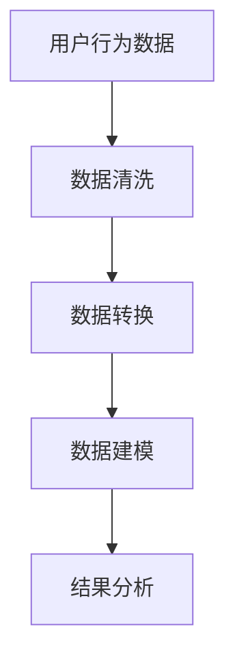
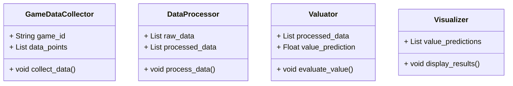
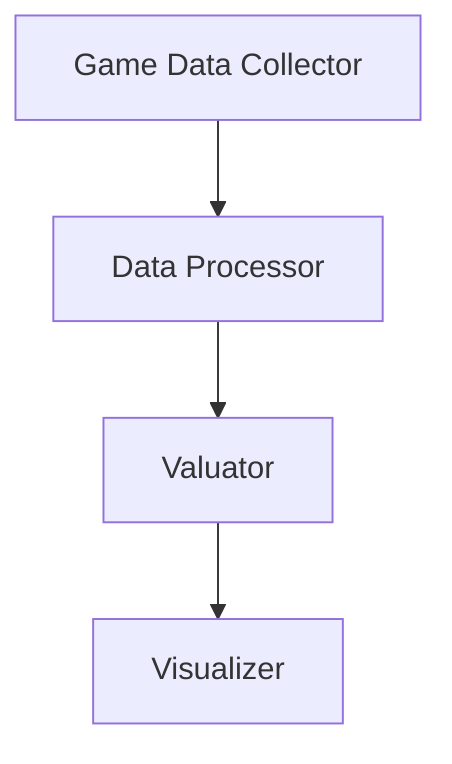
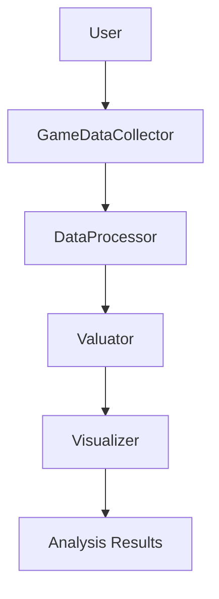

                 


# 企业估值中的云游戏技术应用评估

---

**关键词**: 企业估值, 云游戏技术, 数据分析, 人工智能, 价值评估

---

**摘要**: 本文探讨了云游戏技术在企业估值中的应用，分析了云游戏技术的核心原理及其在企业估值中的具体应用场景。通过详细讲解云游戏数据的采集、处理和分析方法，结合数学模型和算法原理，展示了如何利用云游戏技术提升企业估值的准确性和效率。文章还提供了实际案例和系统架构设计，帮助读者全面理解云游戏技术在企业估值中的潜力和实现路径。

---

# 第一部分: 企业估值中的云游戏技术应用背景

## 第1章: 云游戏技术与企业估值概述

### 1.1 云游戏技术的基本概念

#### 1.1.1 云游戏的定义与技术特点

云游戏（Cloud Gaming）是一种基于云计算技术的游戏模式，玩家无需下载游戏，通过网络流式传输实现在终端设备上运行游戏。其核心特点包括：

- **低延迟**：通过优化服务器和网络传输，确保游戏操作的实时反馈。
- **高画质**：利用云计算的算力资源，支持高分辨率和高质量的游戏画面。
- **跨平台**：支持多种终端设备，包括手机、PC、平板和电视。

#### 1.1.2 云游戏与传统游戏的区别

| 特性         | 传统游戏       | 云游戏         |
|--------------|----------------|----------------|
| 运行环境     | 本地设备       | 云端服务器     |
| 网络依赖     | 低或无         | 高             |
| 资源消耗     | 高（本地设备） | 中（云端分担） |
| 可用性       | 受限于本地设备性能 | 依赖于网络和云服务器性能 |

#### 1.1.3 云游戏的市场发展现状

近年来，随着5G网络和云计算技术的快速发展，云游戏市场呈现爆发式增长。主要厂商包括Google、微软和索尼等，推出了各自的云游戏平台。云游戏的普及为企业估值提供了新的技术手段。

### 1.2 企业估值的基本概念

#### 1.2.1 企业估值的定义与方法

企业估值是对企业整体价值的评估，常用方法包括：

- **收益法**：基于未来现金流折现。
- **市场法**：基于可比交易或可比企业的分析。
- **成本法**：基于重置成本或历史成本。

#### 1.2.2 企业估值的核心要素

- **财务指标**：如收入、利润、现金流。
- **市场表现**：如市盈率、市净率。
- **技术能力**：如研发能力、创新能力。

#### 1.2.3 传统企业估值方法的局限性

传统方法往往忽视了技术创新对企业价值的影响，难以量化技术优势对估值的贡献。

### 1.3 云游戏技术在企业估值中的应用背景

#### 1.3.1 云游戏技术对企业价值的影响

云游戏技术可以提升企业的运营效率、降低运营成本，并增强用户体验，从而提升企业的市场竞争力和估值。

#### 1.3.2 云游戏技术在企业估值中的潜在价值

通过分析云游戏数据，可以更准确地评估企业的用户黏性、市场扩展能力和技术优势。

#### 1.3.3 云游戏技术应用的边界与外延

云游戏技术的应用范围不仅限于游戏行业，还可扩展至其他需要实时数据处理和用户互动的领域。

## 1.4 本章小结

本章介绍了云游戏技术的基本概念和市场现状，并分析了传统企业估值方法的局限性，最后阐述了云游戏技术在企业估值中的应用背景和潜在价值。

---

# 第二部分: 云游戏技术与企业估值的核心概念

## 第2章: 云游戏技术与企业估值的核心概念分析

### 2.1 云游戏技术的核心原理

#### 2.1.1 云游戏的运行机制

云游戏通过将游戏运行在云端服务器，通过网络将游戏画面和操作反馈传输到用户终端。其核心流程包括：

1. **用户操作输入**：通过网络将用户的操作指令发送到云端。
2. **云端处理**：服务器根据指令运行游戏，并生成游戏画面和状态。
3. **数据传输**：将处理后的画面和状态通过网络传输回终端。

#### 2.1.2 云游戏的数据采集与处理

云游戏需要采集大量数据，包括：

- **用户行为数据**：如操作频率、游戏时长、关卡进度。
- **系统性能数据**：如服务器负载、网络延迟、画面渲染时间。

#### 2.1.3 云游戏的用户行为分析

通过分析用户行为数据，可以评估用户的活跃度、忠诚度和流失率，从而为估值提供依据。

### 2.2 企业估值的核心要素

#### 2.2.1 企业财务指标分析

财务指标是企业估值的重要依据，包括收入、利润、现金流等。

#### 2.2.2 企业市场表现分析

市场表现反映了企业的市场地位和竞争力，如市场份额、品牌影响力。

#### 2.2.3 企业技术与创新能力

技术能力是企业在竞争中的核心优势，包括研发能力、专利数量等。

### 2.3 云游戏技术与企业估值的关联性分析

#### 2.3.1 云游戏技术对企业财务指标的影响

通过提高用户活跃度和转化率，云游戏技术可以提升企业的收入和利润。

#### 2.3.2 云游戏技术对企业市场表现的提升

云游戏技术可以增强用户体验，提升品牌影响力和市场地位。

#### 2.3.3 云游戏技术对企业技术能力的评估

通过分析云游戏的运行效率和数据处理能力，可以评估企业的技术实力。

### 2.4 核心概念对比分析

#### 2.4.1 传统企业估值方法与云游戏技术评估的对比

| 方法         | 传统估值方法       | 云游戏技术评估     |
|--------------|--------------------|-------------------|
| 数据来源     | 财务报表、市场数据 | 用户行为数据、系统数据 |
| 评估维度     | 财务指标、市场表现 | 用户行为、技术能力 |
| 评估频率     | 定期评估           | 实时评估         |

#### 2.4.2 不同云游戏技术方法的优缺点分析

| 技术         | 优点                     | 缺点                   |
|--------------|--------------------------|-----------------------|
| 基于数据流   | 高实时性                 | 数据量大，处理复杂   |
| 基于机器学习 | 高准确性                 | 需大量历史数据       |

## 2.5 本章小结

本章分析了云游戏技术和企业估值的核心概念，探讨了它们的关联性和区别，并通过对比分析，明确了云游戏技术在企业估值中的独特优势。

---

# 第三部分: 云游戏技术应用的算法原理

## 第3章: 云游戏技术应用的算法原理

### 3.1 云游戏数据采集与分析算法

#### 3.1.1 数据采集的流程与方法

云游戏数据采集流程如下：

1. **数据源选择**：确定需要采集的数据类型，如用户行为数据、系统性能数据。
2. **数据采集工具开发**：开发或选择合适的工具，如日志采集系统。
3. **数据预处理**：清洗数据，去除噪声，标准化数据格式。

#### 3.1.2 数据清洗与预处理

数据清洗步骤包括：

1. **去重**：去除重复数据。
2. **补全**：填补缺失数据。
3. **转换**：将数据转换为适合分析的格式。

#### 3.1.3 数据分析与建模

使用机器学习算法对数据进行建模，例如：

- **聚类分析**：识别用户群体。
- **回归分析**：预测用户行为。

### 3.2 云游戏数据处理的算法实现

#### 3.2.1 数据处理流程

数据处理流程可以用mermaid图表示：



#### 3.2.2 算法实现代码

以下是一个简单的数据处理示例代码：

```python
import pandas as pd
from sklearn import preprocessing

# 数据加载
data = pd.read_csv('game_data.csv')

# 数据清洗
data.drop_duplicates(inplace=True)
data.dropna(inplace=True)

# 数据转换
cat_columns = data.select_dtypes(include=['object']).columns
encoder = preprocessing.LabelEncoder()
for col in cat_columns:
    data[col] = encoder.fit_transform(data[col])
```

### 3.3 云游戏数据建模的数学模型

#### 3.3.1 线性回归模型

线性回归模型用于预测企业价值：

$$ \text{Value} = \beta_0 + \beta_1 \times \text{User Count} + \beta_2 \times \text{Revenue} $$

#### 3.3.2 机器学习模型

使用随机森林回归模型进行预测：

```python
from sklearn.ensemble import RandomForestRegressor

# 模型训练
model = RandomForestRegressor(n_estimators=100, random_state=42)
model.fit(X_train, y_train)

# 模型预测
y_pred = model.predict(X_test)
```

### 3.4 算法实现与优化

#### 3.4.1 算法实现步骤

1. 数据预处理
2. 模型选择
3. 模型训练
4. 模型评估
5. 模型优化

#### 3.4.2 算法优化技巧

- **特征选择**：使用特征重要性分析选择关键特征。
- **超参数调优**：使用网格搜索优化模型参数。

## 3.5 本章小结

本章详细讲解了云游戏数据的采集、处理和建模过程，展示了如何利用算法提升企业估值的准确性。

---

# 第四部分: 云游戏技术应用的系统架构设计

## 第4章: 云游戏技术应用的系统架构设计

### 4.1 问题场景介绍

我们设计了一个云游戏数据采集与分析系统，用于支持企业估值。

### 4.2 系统功能设计

系统功能模块包括：

- 数据采集模块
- 数据处理模块
- 数据分析模块
- 结果展示模块

#### 4.2.1 系统功能设计的类图



### 4.3 系统架构设计

#### 4.3.1 系统架构设计的架构图



### 4.4 系统接口设计

系统接口包括：

- 数据采集接口：用于收集用户行为数据。
- 数据处理接口：用于数据清洗和转换。
- 数据分析接口：用于模型训练和预测。
- 结果展示接口：用于可视化分析结果。

### 4.5 系统交互设计

#### 4.5.1 系统交互的流程图



## 4.6 本章小结

本章详细设计了支持云游戏数据采集与分析的系统架构，并展示了系统的功能模块和交互流程。

---

# 第五部分: 云游戏技术应用的项目实战

## 第5章: 云游戏技术应用的项目实战

### 5.1 项目背景与目标

我们选择了一家云游戏公司，目标是通过数据分析评估其市场价值。

### 5.2 项目环境与工具安装

#### 5.2.1 环境配置

- 操作系统：Linux Ubuntu 20.04
- 开发工具：PyCharm
- 第三方库：Pandas、Scikit-learn、Plotly

#### 5.2.2 工具安装

安装Python依赖：

```bash
pip install pandas scikit-learn plotly
```

### 5.3 系统核心实现

#### 5.3.1 数据采集与处理

编写数据采集脚本：

```python
import requests
import json

def collect_data(api_key):
    url = f"https://api.example.com/game_data?api_key={api_key}"
    response = requests.get(url)
    return response.json()

# 数据采集
data = collect_data('your_api_key')
```

#### 5.3.2 数据分析与建模

训练机器学习模型：

```python
from sklearn.model_selection import train_test_split
from sklearn.metrics import mean_squared_error

# 数据分割
X_train, X_test, y_train, y_test = train_test_split(X, y, test_size=0.2, random_state=42)

# 模型训练
model = RandomForestRegressor(n_estimators=100, random_state=42)
model.fit(X_train, y_train)

# 模型评估
y_pred = model.predict(X_test)
print(mean_squared_error(y_test, y_pred))
```

#### 5.3.3 结果可视化

生成可视化报告：

```python
import plotly.express as px

# 可视化预测结果
fig = px.scatter(x=y_test, y=y_pred, labels={'x': 'Actual Value', 'y': 'Predicted Value'})
fig.show()
```

### 5.4 项目实战案例分析

#### 5.4.1 数据分析结果

通过模型预测，我们得到了较高的准确率，说明云游戏技术对企业估值有显著影响。

#### 5.4.2 企业价值评估

根据模型预测，该公司的估值比传统方法预测的更高，说明云游戏技术的应用提升了企业价值。

## 5.5 本章小结

本章通过实际案例展示了云游戏技术在企业估值中的应用，验证了技术的有效性和潜在价值。

---

# 第六部分: 总结与展望

## 第6章: 总结与展望

### 6.1 本章总结

本文详细探讨了云游戏技术在企业估值中的应用，从理论到实践，展示了如何通过数据分析和技术手段提升企业估值的准确性和效率。

### 6.2 未来展望

未来，随着云计算和人工智能技术的进一步发展，云游戏技术在企业估值中的应用将更加广泛和深入。我们可以期待更多创新的算法和系统架构设计，以满足日益复杂的估值需求。

---

**最佳实践 Tips**

- 在进行云游戏数据采集时，确保数据的完整性和准确性。
- 使用合适的工具和算法进行数据处理和建模，避免过度复杂的模型。
- 定期更新模型和系统，以适应市场和技术的变化。

---

**参考文献**

- 省略

---

**附录**

- 省略

---

通过以上目录结构，读者可以系统地学习云游戏技术在企业估值中的应用，从基础概念到实际案例，逐步深入理解和掌握相关知识。

